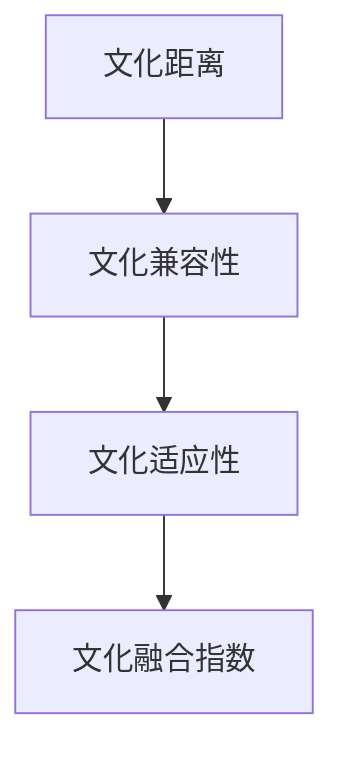
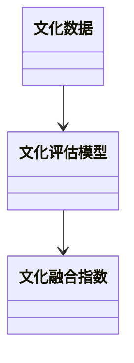

                 


# 彼得林奇对公司全球化战略的文化融合评估

## 关键词：彼得林奇，全球化战略，文化融合，跨文化管理，文化评估模型，文化融合指数

## 摘要：  
本文深入探讨了彼得林奇对公司全球化战略中的文化融合评估的重要性。通过分析文化融合的核心概念、评估方法和实际应用，我们揭示了如何通过文化融合评估来优化全球化战略的实施效果。文章结合彼得林奇的投资哲学，提出了一个基于数学模型的文化融合指数计算方法，并通过实际案例展示了其在跨国公司管理中的应用价值。  

---

## 第一部分：背景介绍

### 第1章：全球化战略与文化融合的背景

#### 1.1 全球化战略的定义与特点  
全球化战略是指企业将业务扩展到全球市场，通过跨国经营实现资源优化配置和市场扩张的战略。其特点包括：  
- **全球性**：覆盖多个市场和文化环境。  
- **多样性**：涉及不同国家的文化、法律和商业习惯。  
- **复杂性**：需要协调不同利益相关者的需求和期望。  

#### 1.2 文化融合的重要性  
文化融合是全球化战略成功的关键因素之一。以下是其重要性的具体表现：  
- **促进跨文化协作**：文化融合有助于消除文化差异带来的冲突，提升团队协作效率。  
- **增强企业竞争力**：通过文化融合，企业能够更好地适应当地市场环境，提升客户满意度。  
- **提升品牌价值**：文化融合是构建国际化品牌形象的重要途径。  

#### 1.3 彼得林奇的全球化投资理念  
彼得林奇是美国著名投资家，其投资哲学强调对企业所处环境的深入分析。他主张通过文化融合评估来判断企业在不同市场的适应能力。具体包括：  
- **文化适应性**：企业是否能够快速融入当地文化环境。  
- **文化风险**：文化差异可能对企业全球化战略带来的潜在风险。  
- **文化融合的可持续性**：文化融合是否能够长期维持并为企业创造价值。  

---

## 第二部分：文化融合评估的核心概念与联系

### 第2章：文化融合评估的原理与方法  

#### 2.1 文化融合评估的框架  
文化融合评估需要从多个维度进行考量，主要包括：  
- **文化距离**：不同文化之间的相似性或差异性。  
- **文化兼容性**：不同文化之间的互补性和协同性。  
- **文化适应性**：企业在不同文化环境中的调整能力。  

#### 2.2 跨文化管理的核心要素  
跨文化管理的核心要素包括：  
- **文化敏感性**：对不同文化背景的尊重和理解。  
- **文化认知**：对不同文化特点的识别和分析。  
- **文化适应**：根据文化差异调整管理策略。  

以下是一个对比表格，展示了不同文化维度的特征：  

| 文化维度         | 集体主义       | 个人主义       | 长距主义       | 短距主义       |
|------------------|----------------|----------------|----------------|----------------|
| 特点             | 团体优先       | 个人优先       | 喜欢模糊性       | 喜欢明确性       |

以下是一个文化融合评估的模型（Mermaid流程图）：  



#### 2.3 文化融合评估的流程  
文化融合评估的流程如下：  

1. **文化维度分析**：识别影响文化融合的关键维度。  
2. **文化差异量化**：通过数学模型量化文化差异。  
3. **文化适应策略制定**：根据文化差异制定适应策略。  
4. **文化融合效果评估**：通过指标量化文化融合的效果。  

---

## 第三部分：文化融合评估的算法原理  

### 第3章：文化融合评估的数学模型与公式  

#### 3.1 文化融合指数的计算公式  
文化融合指数（Cultural Fusion Index，CFI）的计算公式如下：  

$$ CFI = \sum_{i=1}^{n} w_i \cdot v_i $$  

其中，\( w_i \) 是第 \( i \) 个文化的权重，\( v_i \) 是第 \( i \) 个文化的融合值。  

例如，如果 \( w_1 = 0.4 \)，\( v_1 = 0.8 \)，则：  

$$ CFI = 0.4 \cdot 0.8 = 0.32 $$  

#### 3.2 文化融合评估的算法实现  
以下是文化融合指数计算的Python代码实现：  

```python
def calculate_cultural_fusion_index(cultures, weights):
    return sum(w * v for w, v in zip(weights, cultures))

# 示例
cultures = [0.8, 0.6, 0.7]
weights = [0.4, 0.3, 0.3]
print(calculate_cultural_fusion_index(cultures, weights))  # 输出：0.32
```

#### 3.3 文化融合评估的数学模型  
文化融合模型可以表示为：  

$$ CF = \sum_{i=1}^{n} w_i \cdot x_i $$  

其中，\( x_i \) 是第 \( i \) 个文化的特征值，\( w_i \) 是其权重。  

---

## 第四部分：系统分析与架构设计  

### 第4章：文化融合评估系统的架构  

#### 4.1 系统功能设计  
文化融合评估系统的主要功能模块包括：  
- **数据收集模块**：收集不同文化环境下的数据。  
- **评估分析模块**：对文化数据进行分析和计算。  
- **结果展示模块**：将评估结果以可视化形式展示。  

以下是一个领域模型（Mermaid类图）：  



#### 4.2 系统架构设计  
以下是系统架构图（Mermaid架构图）：  


---

## 第五部分：项目实战  

### 第5章：文化融合评估的项目实战  

#### 5.1 环境安装与准备  
- 安装Python和相关库（如numpy、pandas）。  

#### 5.2 核心代码实现  
以下是文化融合评估的核心代码：  

```python
import numpy as np

def calculate_cultural_fusion_index(cultures, weights):
    return np.dot(cultures, weights)

# 示例
cultures = np.array([0.8, 0.6, 0.7])
weights = np.array([0.4, 0.3, 0.3])
print(calculate_cultural_fusion_index(cultures, weights))  # 输出：0.32
```

#### 5.3 代码解读与分析  
上述代码通过向量点积计算文化融合指数，权重和文化特征值的乘积之和即为融合指数。  

#### 5.4 案例分析  
假设一家跨国公司在进入新兴市场时，发现其文化融合指数为0.32，低于行业平均水平。这表明公司在文化适应方面存在不足，需要调整管理策略。  

---

## 第六部分：最佳实践  

### 第6章：文化融合评估的注意事项与拓展阅读  

#### 6.1 小结  
文化融合评估是全球化战略成功的关键因素。通过量化文化差异和制定适应策略，企业可以显著提升跨文化管理能力。  

#### 6.2 注意事项  
- 在实际应用中，文化融合评估需要结合具体业务场景。  
- 文化数据的采集和处理需要高度准确性。  
- 需要定期更新文化评估模型，以适应不断变化的市场环境。  

#### 6.3 拓展阅读  
- 《跨文化管理：理论与实践》  
- 《全球化战略中的文化挑战》  

---

## 作者：AI天才研究院  
（Zen And The Art of Computer Programming）

