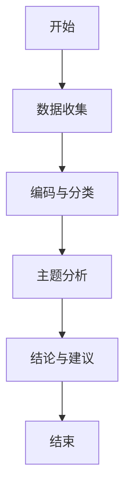
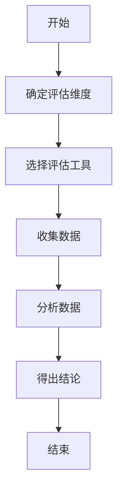

                 

# 彼得林奇对公司创新文化的定性分析

## 关键词：创新文化、彼得·林奇、定性分析、企业战略、领导力

## 摘要：本文通过对彼得·林奇的创新理念进行定性分析，探讨创新文化对企业战略和领导力的深远影响，结合实际案例，提出构建创新文化的系统方法和工具，为企业管理者提供实践指导。

---

## 第一部分：引言

### 第1章：引言

#### 1.1 研究背景与意义
创新文化是企业持续发展的核心驱动力，彼得·林奇作为投资界的传奇人物，其成功的背后离不开对创新文化的深刻理解与实践。本章将介绍创新文化的重要性，及其在现代企业中的战略地位。

#### 1.2 研究目标与方法
本文旨在通过定性分析，揭示彼得·林奇的创新文化管理策略，为企业提供可操作的指导。采用文献分析、案例研究和深度访谈等方法，构建系统的分析框架。

---

## 第二部分：创新文化理论基础

### 第2章：创新文化的核心概念

#### 2.1 创新文化的定义与特征
创新文化是指企业内部鼓励创新、容忍失败、重视知识共享的组织氛围。其核心特征包括开放性、包容性、激励性和可持续性。

**对比表格：创新文化与传统管理文化的对比**

| 特性          | 创新文化       | 传统管理文化    |
|---------------|----------------|----------------|
| 目标          | 追求突破与创新 | 追求稳定与效率 |
| 风险态度      | 容忍失败        | 避免失败        |
| 员工参与度    | 高度参与        | 低度参与        |
| 知识共享      | 鼓励共享        | 限制共享        |

#### 2.2 彼得·林奇的创新理念
林奇强调员工激励、团队协作和长期愿景的重要性。他的管理风格以开放、透明和信任为特点，营造了强大的创新文化氛围。

---

## 第三部分：定性分析方法

### 第3章：定性分析的理论与实践

#### 3.1 定性分析的基本原理
定性分析通过观察、访谈和文献分析，揭示事物的本质特征和内在规律。其核心步骤包括数据收集、分析和解释。

**mermaid流程图：定性分析步骤**

#### 3.2 定性分析在创新文化研究中的应用
定性分析可应用于文化氛围评估、领导风格分析和创新机制优化等方面。常用工具包括NVivo和ATLAS.ti。

---

## 第四部分：公司创新文化的评估与优化

### 第4章：创新文化的自我评估

#### 4.1 自我评估的步骤与工具
企业应从员工参与度、管理层支持度和创新机制完善度三个方面进行评估。常用工具包括问卷调查、深度访谈和文化审计。

**mermaid流程图：文化评估流程**

#### 4.2 创新文化的诊断分析
通过SWOT分析和鱼骨图分析，识别创新文化中的优势、劣势、机会和威胁，并制定优化策略。

**SWOT分析示例：**

- 优势：员工高度参与，管理层支持
- 劣势：创新机制不完善，风险容忍度低
- 机会：市场变化和技术进步
- 威胁：竞争压力和资源限制

---

## 第五部分：彼得·林奇的创新文化实践

### 第5章：彼得·林奇的创新文化案例

#### 5.1 林奇投资公司的创新文化
林奇的投资公司以开放的文化著称，员工被鼓励提出新想法，管理层注重团队协作和知识共享。

**案例分析：林奇如何培养创新文化**

1. **开放沟通**：定期举行开放会议，鼓励员工提出建议。
2. **奖励机制**：对创新贡献者给予奖励，增强员工积极性。
3. **实验文化**：允许失败，从失败中学习，优化创新机制。

---

## 第六部分：工具与方法

### 第6章：工具与方法

#### 6.1 定性分析的工具
- NVivo：用于数据编码和主题分析。
- ATLAS.ti：用于定性数据分析和可视化。

#### 6.2 创新文化评估的框架
- 团队协作框架：促进跨部门合作，提升创新效率。
- 风险管理框架：降低创新失败的风险，优化资源配置。

---

## 第七部分：挑战与解决方案

### 第7章：挑战与解决方案

#### 7.1 创新文化管理中的常见问题
- 员工阻力：部分员工不愿改变，缺乏创新意识。
- 领导力不足：管理者不重视创新，缺乏指导和支持。
- 资源限制：资金和时间不足，影响创新项目的实施。

#### 7.2 应对策略
- 提供培训：提升员工创新意识和技能。
- 强化领导力：培养具备创新思维的领导者。
- 优化资源配置：优先支持高潜力创新项目。

---

## 第八部分：总结

### 第8章：总结

#### 8.1 全文回顾
本文通过对彼得·林奇的创新理念进行定性分析，揭示了创新文化对企业战略和领导力的重要性。结合理论和实践，提出了系统的评估和优化方法。

#### 8.2 未来研究方向
未来研究可进一步探索创新文化在不同行业中的具体应用，以及新兴技术对企业创新文化的影响。

---

## 附录

### 附录A：术语表
- 定性分析：通过观察、访谈等方法研究现象本质。
- 创新文化：鼓励创新、知识共享和容忍失败的企业文化。

### 附录B：参考文献
- 彼得·林奇，《彼得·林奇的投资哲学》
- 克里斯·阿吉里斯，《组织文化与领导力》

### 附录C：扩展阅读
推荐书籍和文章，帮助读者深入理解创新文化。

---

## 作者：AI天才研究院 & 禅与计算机程序设计艺术

---

通过以上结构，本文系统地分析了彼得·林奇的创新文化管理策略，为企业构建创新文化提供了理论支持和实践指导。

