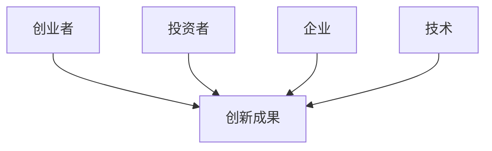
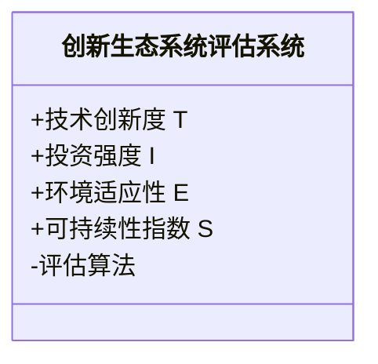
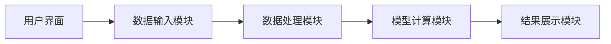
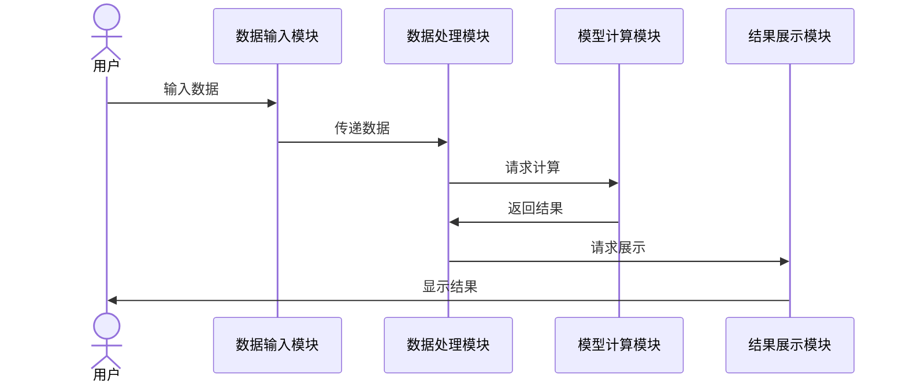

                 


# 彼得林奇对公司创新生态系统的可持续性评估

> 关键词：创新生态系统、可持续性评估、彼得林奇、投资理念、系统动力学模型

> 摘要：本文通过分析彼得林奇的投资理念，探讨如何将其应用于公司创新生态系统的可持续性评估。文章结合系统动力学模型和创新生态系统的核心要素，提出了一种数学模型和系统架构设计方案，以帮助企业更好地评估和优化创新生态系统。

---

# 第一部分: 创新生态系统与可持续性评估背景

## 第1章: 创新生态系统概述

### 1.1 创新生态系统的基本概念

创新生态系统是指由创业者、投资者、企业和技术等多个要素构成的系统，旨在推动创新成果的产生和应用。其核心要素包括：

- **创业者**：创新的发起者，推动新想法的实施。
- **投资者**：提供资金支持，促进创新项目的落地。
- **企业**：创新成果的应用和商业化主体。
- **技术**：创新的基础，推动产品的升级和改进。

创新生态系统具有以下特征：
- **动态性**：系统不断变化，适应市场和技术的发展。
- **协作性**：各要素之间需要紧密合作，共同推动创新。
- **多样性**：涵盖不同类型的参与者和技术领域。

---

### 1.2 可持续性评估的背景与意义

可持续性评估是衡量创新生态系统长期发展潜力的关键指标。随着市场竞争加剧，企业需要评估自身的创新生态系统是否能够持续产生有价值的创新成果。

可持续性评估的重要性体现在以下几个方面：
- **长期价值**：帮助投资者识别具有长期增长潜力的公司。
- **风险控制**：通过评估潜在风险，优化资源配置。
- **竞争力提升**：增强企业在市场中的竞争力。

---

### 1.3 彼得林奇投资理念与创新生态系统

彼得林奇是著名的投资专家，他的投资理念强调基本面分析和长期投资。他认为，成功的投资需要关注公司的基本面，包括管理层、财务状况和市场地位。

创新生态系统与彼得林奇投资理念的联系在于：
- **基本面分析**：通过评估创新生态系统的各个要素，识别潜在的投资机会。
- **长期视角**：关注创新生态系统的可持续性，而非短期收益。

---

### 1.4 本章小结

本章介绍了创新生态系统的基本概念和可持续性评估的重要性，并探讨了彼得林奇投资理念与创新生态系统的联系。创新生态系统是一个动态的、协作的系统，其可持续性评估对于企业的发展和投资者的决策至关重要。

---

## 第2章: 创新生态系统的核心要素

### 2.1 创新生态系统的核心要素分析

创新生态系统的核心要素包括创业者、投资者、企业和技术。这些要素之间的关系复杂，需要系统性地分析。

#### 创业者与创新者

创业者是创新生态系统的核心驱动力。他们推动新想法的实施，并承担创新过程中的风险。创业者的成功与否直接影响创新生态系统的可持续性。

#### 投资者与资本提供者

投资者为创新项目提供资金支持，是创新生态系统的重要组成部分。投资者的选择和投资策略直接影响创新项目的成功与否。

#### 企业与组织

企业是创新成果的应用和商业化主体。企业的管理能力、市场地位和创新能力是创新生态系统的重要组成部分。

#### 技术与创新成果

技术是创新的基础，创新成果的产生和应用是创新生态系统的核心目标。

---

### 2.2 创新生态系统的核心属性对比

创新生态系统具有多种属性，包括创新性与稳定性、开放性与封闭性、竞争性与合作性等。通过对这些属性的对比分析，可以更好地理解创新生态系统的复杂性。

#### 创新性与稳定性

创新生态系统需要在创新与稳定之间找到平衡。过度创新可能导致系统不稳定，而缺乏创新则无法适应市场变化。

#### 开放性与封闭性

开放性有助于吸引更多的参与者和资源，而封闭性则有助于集中资源和控制风险。

#### 竞争性与合作性

创新生态系统需要在竞争与合作之间找到平衡。竞争可以推动创新，而合作可以促进资源的共享和利用。

---

### 2.3 创新生态系统的核心要素关系图

通过Mermaid图可以清晰地展示创新生态系统的核心要素及其关系。



---

## 2.4 本章小结

本章分析了创新生态系统的核心要素及其关系，探讨了创新生态系统的核心属性对比。通过Mermaid图展示了各要素之间的关系，为后续的可持续性评估奠定了基础。

---

## 第3章: 创新生态系统可持续性评估的系统动力学模型

### 3.1 系统动力学模型的基本原理

系统动力学模型是一种通过模拟系统内部动态关系，预测系统未来行为的模型。其核心是通过构建系统的反馈环和相互作用关系，模拟系统的动态变化。

系统动力学模型的基本原理包括：
- **系统分析**：识别系统中的关键变量和相互作用关系。
- **模型构建**：通过数学方程描述系统的动态关系。
- **仿真与优化**：通过仿真预测系统的未来行为，并进行优化。

---

### 3.2 创新生态系统评估的系统方程

创新生态系统可持续性评估的核心变量包括技术创新度（T）、投资强度（I）和环境适应性（E）。可持续性指数（S）可以通过以下公式计算：

$$
S = \alpha \cdot T + \beta \cdot I + \gamma \cdot E
$$

其中：
- \( S \) 表示创新生态系统可持续性指数
- \( T \) 表示技术创新度
- \( I \) 表示投资强度
- \( E \) 表示环境适应性
- \( \alpha, \beta, \gamma \) 表示各变量的权重系数

---

### 3.3 系统动力学模型的实现步骤

#### 数据收集与处理

首先需要收集创新生态系统各核心变量的数据，包括技术创新度、投资强度和环境适应性。数据来源可以是公开的市场数据、企业内部数据等。

#### 模型构建与仿真

通过系统动力学模型构建创新生态系统的仿真模型，并模拟系统的动态变化。仿真结果可以帮助企业识别潜在的风险和机会。

#### 模型验证与优化

通过实际数据验证模型的准确性，并根据验证结果进行模型优化，以提高模型的预测精度。

---

## 3.4 本章小结

本章介绍了系统动力学模型的基本原理，并提出了创新生态系统可持续性评估的数学模型。通过系统动力学模型可以有效地评估创新生态系统的可持续性，并为企业的决策提供支持。

---

## 第4章: 创新生态系统评估的系统架构设计

### 4.1 系统功能设计

#### 领域模型设计

创新生态系统评估系统的领域模型包括以下几个模块：
- **数据输入模块**：接收创新生态系统各核心变量的数据。
- **数据处理模块**：对数据进行清洗和预处理。
- **模型计算模块**：根据系统方程计算可持续性指数。
- **结果展示模块**：将计算结果以可视化的方式展示出来。



---

### 4.2 系统架构设计

创新生态系统评估系统的架构设计包括以下几个部分：
- **用户界面**：用户通过界面输入数据并查看结果。
- **数据输入模块**：接收用户输入的数据。
- **数据处理模块**：对数据进行处理和清洗。
- **模型计算模块**：根据系统方程计算可持续性指数。
- **结果展示模块**：将计算结果以图表或报告的形式展示出来。



---

### 4.3 系统接口设计

系统接口设计包括以下几个部分：
- **数据输入接口**：接收创新生态系统各核心变量的数据。
- **模型计算接口**：根据系统方程计算可持续性指数。
- **结果展示接口**：将计算结果以可视化的方式展示出来。

---

### 4.4 系统交互设计

通过Mermaid序列图可以清晰地展示系统的交互流程。



---

## 4.5 本章小结

本章介绍了创新生态系统评估系统的功能设计、架构设计、接口设计和交互设计。通过Mermaid图展示了系统的架构和交互流程，为后续的系统实现提供了指导。

---

## 第5章: 项目实战

### 5.1 环境安装

创新生态系统评估系统的环境安装需要以下工具和库：
- **Python**：用于数据分析和计算。
- **Mermaid**：用于绘制系统架构图和交互图。
- **Matplotlib**：用于数据可视化。

安装步骤如下：
1. 安装Python：从官方网站下载并安装Python。
2. 安装Mermaid：在GitHub上下载Mermaid CLI工具。
3. 安装Matplotlib：使用pip命令安装Matplotlib。

### 5.2 核心实现源代码

以下是创新生态系统评估系统的Python核心实现代码：

```python
# 创新生态系统可持续性评估系统

import matplotlib.pyplot as plt

# 定义系统方程
def calculate_sustainability(T, I, E, alpha, beta, gamma):
    S = alpha * T + beta * I + gamma * E
    return S

# 数据输入
T = float(input("请输入技术创新度："))
I = float(input("请输入投资强度："))
E = float(input("请输入环境适应性："))
alpha = float(input("请输入技术创新度的权重："))
beta = float(input("请输入投资强度的权重："))
gamma = float(input("请输入环境适应性的权重："))

# 计算可持续性指数
S = calculate_sustainability(T, I, E, alpha, beta, gamma)

# 可视化结果
plt.figure(figsize=(8, 6))
plt.bar(['技术创新度', '投资强度', '环境适应性'], [T, I, E])
plt.title('创新生态系统核心变量')
plt.show()

print("创新生态系统可持续性指数为：", S)
```

---

### 5.3 案例分析

以某科技公司为例，假设技术创新度（T）= 0.8，投资强度（I）= 0.6，环境适应性（E）= 0.7，权重分别为α=0.5，β=0.3，γ=0.2。

计算可持续性指数：
$$
S = 0.5 \cdot 0.8 + 0.3 \cdot 0.6 + 0.2 \cdot 0.7 = 0.4 + 0.18 + 0.14 = 0.72
$$

结果表明，该科技公司的创新生态系统可持续性指数为0.72，属于较高的水平，具有较强的可持续性。

---

## 5.4 本章小结

本章通过实际案例分析，展示了创新生态系统评估系统的实现过程。通过Python代码和数据可视化，可以帮助企业更好地评估和优化创新生态系统。

---

## 第6章: 总结与最佳实践

### 6.1 总结

本文通过分析彼得林奇的投资理念，探讨了如何将其应用于公司创新生态系统的可持续性评估。通过系统动力学模型和创新生态系统的核心要素，提出了一个数学模型和系统架构设计方案，为企业的创新生态系统评估提供了理论和实践指导。

---

### 6.2 最佳实践 tips

- **定期评估**：企业应定期评估创新生态系统的可持续性，及时发现问题并进行调整。
- **关注长期趋势**：在评估创新生态系统时，应关注长期趋势，而非短期收益。
- **动态调整**：根据评估结果，动态调整创新生态系统的核心要素，以提高系统的可持续性。

---

### 6.3 注意事项

- **数据准确性**：数据是评估的基础，确保数据的准确性和完整性。
- **模型优化**：根据实际数据不断优化模型，提高评估的准确性。
- **团队协作**：创新生态系统评估需要多部门协作，确保评估的全面性和系统性。

---

### 6.4 拓展阅读

- **《彼得林奇选股艺术》**：深入理解彼得林奇的投资理念。
- **《系统动力学》**：学习系统动力学的基本原理和应用方法。
- **《创新生态系统的构建与优化》**：探讨创新生态系统的构建与优化方法。

---

## 作者

作者：AI天才研究院/AI Genius Institute & 禅与计算机程序设计艺术 /Zen And The Art of Computer Programming

