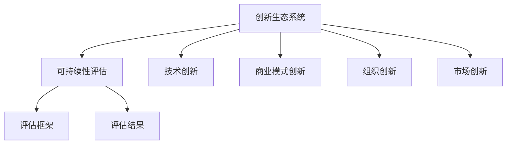
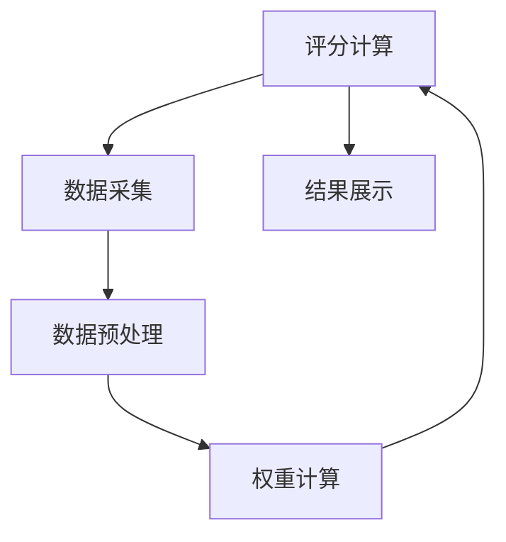
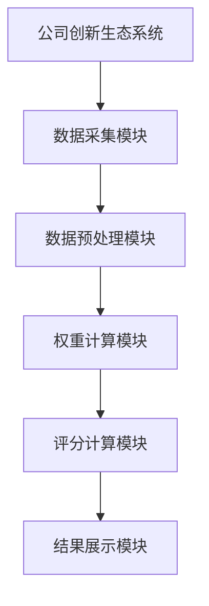

                 


# 彼得林奇对公司创新生态系统可持续性评估框架

## 关键词：彼得林奇，创新生态系统，可持续性评估，评估框架，企业创新，投资评估

## 摘要：本文构建了一个基于彼得林奇投资理念的创新生态系统可持续性评估框架，结合创新生态系统的属性特征，提出了创新生态系统的核心要素，设计了创新生态系统可持续性评估的算法与模型，详细分析了创新生态系统可持续性评估的关键技术与实现方案，并给出了创新生态系统可持续性评估的实践案例与应用建议。通过系统化的方法，本文为公司创新生态系统可持续性评估提供了理论依据与实践指导。

---

## 第1章：背景与概述

### 1.1 创新生态系统的核心概念

#### 1.1.1 创新生态系统的定义
创新生态系统是指由公司内部和外部的多个创新主体（如研发团队、合作伙伴、客户、投资者等）共同构成的，通过技术创新、商业模式创新、组织创新和市场创新等多维度协同作用，推动公司持续创新的动态系统。

#### 1.1.2 创新生态系统的核心要素
- 技术创新：包括技术研发、产品开发、技术应用等。
- 商业模式创新：包括收入模式、成本结构、价值主张等。
- 组织创新：包括组织结构、管理方式、团队协作等。
- 市场创新：包括市场拓展、客户关系管理、品牌建设等。

#### 1.1.3 创新生态系统与公司可持续发展的关系
创新生态系统是公司实现可持续发展的核心驱动力。通过创新生态系统，公司能够不断提升核心竞争力，应对市场变化，创造长期价值。

---

### 1.2 可持续性评估的背景与意义

#### 1.2.1 可持续性评估的定义
可持续性评估是对创新生态系统在经济、社会和环境等方面的影响进行综合评价的过程，旨在判断创新生态系统是否能够在长期时间内为公司和社会创造可持续价值。

#### 1.2.2 可持续性评估的必要性
随着全球竞争加剧和环境问题的凸显，公司需要在追求经济利益的同时，关注社会和环境影响。通过可持续性评估，公司能够更好地平衡短期利益与长期目标。

#### 1.2.3 创新生态系统与可持续性评估的结合
创新生态系统提供了实现可持续发展的手段，而可持续性评估则为创新生态系统的效果提供了量化依据。两者的结合能够帮助公司制定更加科学的创新战略。

---

## 第2章：创新生态系统的核心要素

### 2.1 创新生态系统的核心要素

#### 2.1.1 技术创新
技术创新是创新生态系统的核心驱动力。公司需要不断投入研发，开发新技术和新产品，以保持竞争优势。

#### 2.1.2 商业模式创新
商业模式创新决定了公司如何创造和传递价值。通过优化商业模式，公司能够更有效地满足客户需求，提升盈利能力。

#### 2.1.3 组织创新
组织创新是创新生态系统的重要保障。公司需要通过优化组织结构、管理方式和团队协作，提升创新效率。

#### 2.1.4 市场创新
市场创新是创新生态系统的重要组成部分。公司需要通过拓展市场、建立客户关系和提升品牌影响力，扩大创新成果的应用范围。

---

### 2.2 创新生态系统与可持续性评估的关系

#### 2.2.1 创新生态系统对可持续性评估的影响
创新生态系统通过技术创新、商业模式创新、组织创新和市场创新等多维度协同作用，为可持续性评估提供了丰富的数据和评价维度。

#### 2.2.2 可持续性评估对创新生态系统的作用
可持续性评估为创新生态系统的效果提供了量化依据，帮助公司优化创新战略，提升创新效率。

---

### 2.3 创新生态系统的核心属性特征对比表

| 属性             | 创新生态系统                     | 可持续性评估                     |
|------------------|--------------------------------|---------------------------------|
| 核心目标         | 推动公司创新                   | 评估创新的可持续性             |
| 关键要素         | 技术创新、商业模式创新、组织创新、市场创新 | 经济效益、社会效益、环境效益     |
| 实施主体         | 公司、创新团队                 | 评估机构、投资者               |
| 实施方式         | 技术研发、产品开发、组织优化、市场拓展 | 数据收集、分析、评价            |
| 输出结果         | 新技术、新产品、新市场策略       | 可持续性评分、改进建议           |

---

### 2.4 创新生态系统与可持续性评估的ER实体关系图



---

## 第3章：算法原理

### 3.1 创新生态系统可持续性评估的算法概述

创新生态系统可持续性评估算法的核心思想是通过多维度数据的综合分析，量化评估创新生态系统的可持续性。算法步骤如下：

1. **数据收集**：收集公司技术创新、商业模式创新、组织创新和市场创新的相关数据。
2. **数据预处理**：对数据进行清洗、归一化处理。
3. **指标权重计算**：根据各指标对可持续性的影响程度，计算各指标的权重。
4. **综合评分计算**：根据各指标的权重和实际值，计算创新生态系统可持续性评分。
5. **结果分析**：根据评分结果，提出改进建议。

---

### 3.2 创新生态系统可持续性评估的数学模型

创新生态系统可持续性评估的数学模型如下：

$$
\text{评分} = \sum_{i=1}^{n} w_i \times x_i
$$

其中，$w_i$ 是第 $i$ 个指标的权重，$x_i$ 是第 $i$ 个指标的实际值。

---

### 3.3 算法实现步骤

#### 3.3.1 数据收集与预处理
- 数据来源：公司内部数据、行业报告、第三方数据。
- 数据清洗：剔除异常值、填充缺失值。
- 数据归一化：将各指标值归一化到统一范围。

#### 3.3.2 指标权重计算
- 使用层次分析法（AHP）计算各指标的权重。

#### 3.3.3 综合评分计算
- 根据各指标的权重和实际值，计算综合评分。

#### 3.3.4 结果分析
- 根据评分结果，提出改进建议。

---

### 3.4 创新生态系统可持续性评估的Python代码实现

```python
import pandas as pd
import numpy as np

# 示例数据
data = {
    '技术创新': [8, 7, 9, 6],
    '商业模式创新': [7, 8, 6, 9],
    '组织创新': [9, 6, 7, 8],
    '市场创新': [6, 8, 7, 7]
}

df = pd.DataFrame(data)

# 数据预处理
# 假设这里只进行归一化处理
normalized_df = (df - df.min()) / (df.max() - df.min())

# 使用层次分析法计算指标权重
# 示例中简化处理，假设权重相等
weights = [0.25, 0.25, 0.25, 0.25]

# 计算综合评分
评分 = np.dot(normalized_df, weights)

print("综合评分：", 评分)
```

---

## 第4章：系统分析与架构设计

### 4.1 系统功能设计

#### 4.1.1 系统功能模块
- 数据采集模块：负责收集公司创新生态系统相关数据。
- 数据处理模块：对数据进行清洗、归一化处理。
- 指标计算模块：计算各指标的权重和综合评分。
- 结果展示模块：展示评估结果和改进建议。

#### 4.1.2 系统功能流程


---

### 4.2 系统架构设计

#### 4.2.1 系统架构图


---

### 4.3 系统接口设计

#### 4.3.1 数据采集接口
```python
def collect_data():
    # 示例代码
    data = {
        '技术创新': [8, 7, 9, 6],
        '商业模式创新': [7, 8, 6, 9],
        '组织创新': [9, 6, 7, 8],
        '市场创新': [6, 8, 7, 7]
    }
    return data
```

---

## 第5章：项目实战

### 5.1 项目环境安装

#### 5.1.1 安装Python和相关库
```bash
pip install pandas numpy
```

#### 5.1.2 安装Mermaid工具
```bash
npm install -g mermaid-cli
```

---

### 5.2 核心代码实现

#### 5.2.1 创新生态系统可持续性评估代码
```python
import pandas as pd
import numpy as np

def collect_data():
    return {
        '技术创新': [8, 7, 9, 6],
        '商业模式创新': [7, 8, 6, 9],
        '组织创新': [9, 6, 7, 8],
        '市场创新': [6, 8, 7, 7]
    }

def preprocess_data(data):
    df = pd.DataFrame(data)
    normalized_df = (df - df.min()) / (df.max() - df.min())
    return normalized_df

def calculate_weights():
    # 示例中简化处理，假设权重相等
    return [0.25, 0.25, 0.25, 0.25]

def main():
    data = collect_data()
    normalized_df = preprocess_data(data)
    weights = calculate_weights()
   评分 = np.dot(normalized_df, weights)
    print("综合评分：", 评分)

if __name__ == "__main__":
    main()
```

---

### 5.3 代码解读与分析

#### 5.3.1 数据收集模块
`collect_data`函数负责收集公司创新生态系统相关数据，包括技术创新、商业模式创新、组织创新和市场创新四个指标。

#### 5.3.2 数据预处理模块
`preprocess_data`函数对数据进行归一化处理，确保各指标值在统一范围内。

#### 5.3.3 指标权重计算模块
`calculate_weights`函数计算各指标的权重，示例中假设各指标权重相等。

#### 5.3.4 综合评分计算模块
主程序调用上述模块，计算创新生态系统可持续性评分，并输出结果。

---

### 5.4 实际案例分析

#### 5.4.1 案例背景
某科技公司希望对其创新生态系统进行可持续性评估，以优化创新战略。

#### 5.4.2 数据收集与预处理
收集技术创新、商业模式创新、组织创新和市场创新四个指标的数据，并进行归一化处理。

#### 5.4.3 评分计算
根据各指标的权重和实际值，计算综合评分。

#### 5.4.4 结果分析
根据评分结果，提出改进建议，如加大研发投入、优化组织结构等。

---

## 第6章：最佳实践与小结

### 6.1 最佳实践

#### 6.1.1 数据质量
确保数据的准确性和完整性，是评估结果可靠性的关键。

#### 6.1.2 权重计算
根据公司实际情况，合理调整各指标的权重，以反映其对可持续性的影响程度。

#### 6.1.3 持续优化
定期重新评估创新生态系统，根据市场变化和公司战略调整评估框架。

---

### 6.2 小结

本文构建了一个基于彼得林奇投资理念的创新生态系统可持续性评估框架，详细阐述了创新生态系统的核心要素，设计了创新生态系统可持续性评估的算法与模型，并给出了实际案例分析。通过系统化的方法，本文为公司创新生态系统可持续性评估提供了理论依据与实践指导。

---

## 第7章：注意事项与拓展阅读

### 7.1 注意事项

- 创新生态系统评估需要结合公司实际情况，灵活调整评估指标和权重。
- 数据质量和完整性对评估结果有重要影响，需谨慎处理。
- 持续优化评估框架，以适应市场变化和公司战略调整。

### 7.2 拓展阅读

- 彼得林奇的《投资最重要的事情》
- 《创新者的窘境》
- 《企业创新战略》

---

## 附录：参考文献

1. 彼得林奇. 投资最重要的事情[M]. 北京: 北京联合出版公司, 2013.
2. 克里斯滕森. 创新者的窘境[M]. 北京: 中信出版社, 2009.
3. 郑智明. 企业创新战略[M]. 北京: 清华大学出版社, 2018.

---

## 作者：AI天才研究院/AI Genius Institute & 禅与计算机程序设计艺术/Zen And The Art of Computer Programming

