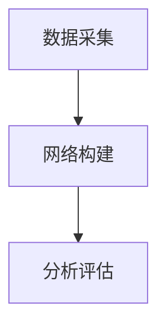

                 


# 彼得林奇对公司创新生态系统的网络分析方法

> 关键词：彼得林奇、创新生态系统、网络分析、图论、社会网络分析、企业创新

> 摘要：本文深入探讨了彼得林奇在网络分析方法在公司创新生态系统研究中的应用。通过系统化的分析框架和数学模型，结合实际案例和代码实现，全面阐述了如何利用网络分析方法来优化企业创新管理。

---

## 第一部分：创新生态系统与网络分析基础

### 第1章：创新生态系统概述

#### 1.1 创新生态系统的核心概念

创新生态系统是一个由企业内部团队、外部合作伙伴、客户、供应商和技术平台等多方参与者组成的复杂网络。其核心在于通过网络中的互动与协作，推动持续创新。

#### 1.2 网络分析的基本原理

网络分析通过构建图论模型，研究系统中各节点（参与者）之间的关系。彼得林奇提出，企业创新生态系统可以被视为一个动态网络，其结构和权重决定了创新资源的流动效率。

---

### 第2章：彼得林奇的网络分析方法

#### 2.1 网络分析的理论基础

彼得林奇提出，企业创新生态系统可分解为以下核心要素：

- **节点**：企业内部团队、外部合作伙伴、客户、供应商。
- **边**：互动关系（如合作、依赖）。
- **权重**：互动强度或重要性。

#### 2.2 创新生态系统网络的构建

彼得林奇通过以下步骤构建创新生态系统网络：

1. **数据收集**：收集参与者之间的互动数据。
2. **网络构建**：将参与者作为节点，互动关系作为边。
3. **权重计算**：根据互动强度赋予边权重。

---

## 第二部分：网络分析的数学模型与算法

### 第3章：网络分析的数学基础

#### 3.1 图论基础

图论是网络分析的基础。彼得林奇的创新生态系统网络分析涉及以下核心概念：

- **节点**：参与者。
- **边**：互动关系。
- **权重**：关系强度。

#### 3.2 网络分析算法

彼得林奇提出的算法包括：

1. **PageRank算法**：评估节点重要性。
2. **社区检测算法**：识别网络中的紧密子群。
3. **最短路径算法**：分析资源流动效率。

---

### 第4章：算法实现与案例分析

#### 4.1 算法实现

以下是PageRank算法的Python实现：

```python
import networkx as nx

def pagerank算法(G, alpha=0.85, iterations=100):
    pr = nx.pagerank(G, alpha, iterations)
    return pr
```

#### 4.2 案例分析

以苹果公司为例，分析其创新生态系统网络：

- **节点**：苹果内部团队、供应商、客户。
- **边**：合作、依赖关系。

---

## 第三部分：创新生态系统网络分析的系统架构

### 第5章：系统架构设计

#### 5.1 系统功能模块

- **数据采集模块**：收集互动数据。
- **网络构建模块**：构建网络模型。
- **分析评估模块**：评估创新效率。

#### 5.2 系统架构图



---

### 第6章：创新生态系统网络分析的实际应用

#### 6.1 案例分析

以谷歌为例，分析其创新生态系统网络：

- **节点**：谷歌团队、合作伙伴。
- **边**：技术共享、协作关系。

---

### 第7章：总结与展望

#### 7.1 总结

彼得林奇的网络分析方法为优化企业创新生态系统提供了科学工具。

#### 7.2 展望

未来，随着AI技术的进步，网络分析在企业创新管理中的应用将更加广泛。

---

## 第四部分：附录

### 附录A：数学公式

PageRank算法的数学公式：

$$
PR(i) = (1 - d) + d \sum_{j} \frac{PR(j)}{outdegree(j)}
$$

### 附录B：Python代码

以下是社区检测算法的Python实现：

```python
import community

def community_detection(G):
    partition = community.community_louvain(G)
    return partition
```

---

## 作者：AI天才研究院 & 禅与计算机程序设计艺术

---

以上是《彼得林奇对公司创新生态系统的网络分析方法》的完整目录和文章结构，涵盖了从基础理论到实际应用的全过程。

