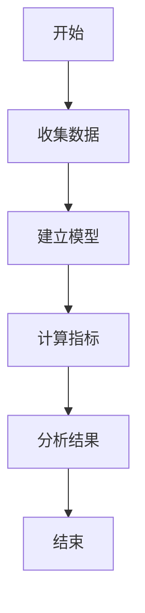
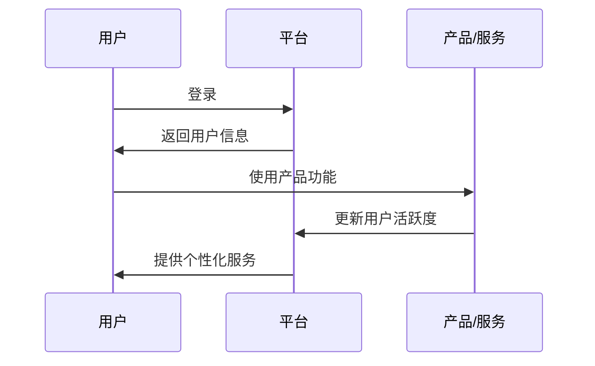

                 


# 彼得林奇对公司创新生态系统网络效应量化分析

## 关键词：彼得林奇，创新生态系统，网络效应，量化分析，公司分析

## 摘要：  
本文通过彼得林奇的投资理论视角，结合网络效应的量化分析方法，深入探讨公司创新生态系统中的网络效应，并提出一套系统化的分析框架。文章首先介绍网络效应和创新生态系统的背景概念，然后从理论模型、数学公式、算法实现等多个维度展开分析，最后通过实际案例展示如何将这些理论应用于公司创新生态系统的网络效应量化分析中。本文旨在为公司管理者、投资者和技术研究人员提供一套实用的分析工具和方法。

---

# 第一部分：背景介绍

## 第1章：网络效应与创新生态系统概述

### 1.1 网络效应的定义与特征

网络效应是指一个产品或服务的价值随着用户数量的增加而增加的现象。其核心特征包括：

- **正反馈效应**：用户数量增加会进一步吸引更多用户加入。
- **边际成本递减**：随着用户数量增加，边际成本逐渐降低。
- **平台化特性**：网络效应通常依赖于一个平台来实现用户之间的交互和价值传递。

网络效应的边界在于其依赖的核心要素，包括用户数量、用户活跃度和用户价值。外延则包括技术实现、商业模式和市场环境等因素。

### 1.2 创新生态系统的核心要素

创新生态系统由以下核心要素组成：

- **用户**：创新生态系统的基石，包括最终用户和开发者。
- **产品/服务**：提供价值的核心载体。
- **平台**：连接用户和产品的桥梁。
- **网络效应**：生态系统的价值放大器。

创新生态系统的核心要素通过相互作用，形成一个动态平衡的系统。以下是核心要素的对比表：

| 核心要素 | 描述 | 关系 |
|----------|------|------|
| 用户     | 创新生态系统的参与者 | 用户数量直接影响网络效应 |
| 产品/服务 | 提供价值的核心载体 | 产品的价值通过用户网络效应放大 |
| 平台     | 连接用户和产品的桥梁 | 平台是网络效应实现的基础 |
| 网络效应 | 生态系统的价值放大器 | 网络效应是创新生态系统的核心驱动 |

---

## 第2章：彼得·林奇的分析方法

### 2.1 彼得·林奇投资理论概述

彼得·林奇是全球著名投资专家，他强调以下几点：

- **长期投资**：关注公司的长期价值，而非短期波动。
- **基本面分析**：通过分析公司的财务状况、管理团队和市场地位来评估其价值。
- **创新生态系统**：关注公司创新生态系统中的网络效应，认为这是公司长期竞争优势的核心。

彼得·林奇的创新生态系统分析方法包括：

1. **用户增长分析**：关注用户数量和活跃度的变化。
2. **网络效应强度分析**：量化网络效应的强度和范围。
3. **竞争环境分析**：评估公司在市场中的竞争优势。

### 2.2 网络效应在公司创新中的作用

网络效应在创新生态系统中的作用主要体现在以下几个方面：

- **价值放大**：通过用户之间的互动，放大产品的价值。
- **竞争优势**：强大的网络效应可以形成进入壁垒，防止竞争对手轻易超越。
- **可持续发展**：网络效应可以为公司提供持续的用户增长和收入来源。

网络效应的量化分析框架包括以下几个步骤：

1. **数据收集**：收集用户数量、用户活跃度、用户留存率等数据。
2. **模型构建**：建立网络效应的数学模型。
3. **指标计算**：计算网络效应强度、网络效应范围等关键指标。
4. **结果分析**：分析网络效应对公司创新生态系统的影响。

---

# 第二部分：核心概念与联系

## 第3章：网络效应的理论模型

### 3.1 网络效应的理论基础

网络效应的理论模型主要包括以下几种：

- **线性增长模型**：假设用户数量与网络效应呈线性关系。
- **指数增长模型**：假设用户数量的增长呈指数级，网络效应随用户数量的增加而迅速放大。
- **门槛模型**：假设网络效应只有在用户数量达到一定门槛后才会显著增强。

网络效应的核心原理是通过用户之间的互动，实现价值的放大和传递。以下是网络效应的核心原理对比表：

| 模型 | 描述 | 适用场景 |
|------|------|----------|
| 线性增长模型 | 用户数量与网络效应呈线性关系 | 用户数量较少时 |
| 指数增长模型 | 用户数量增长呈指数级，网络效应迅速放大 | 用户数量较多时 |
| 门槛模型 | 用户数量达到一定门槛后，网络效应显著增强 | 用户数量达到一定规模时 |

### 3.2 创新生态系统中的网络效应

创新生态系统中的网络效应可以通过以下方式实现：

- **用户互动**：用户之间的互动可以增强网络效应。
- **平台支持**：平台提供工具和服务，支持用户之间的互动和价值传递。
- **生态系统闭环**：通过构建完整的生态系统闭环，实现网络效应的持续增强。

以下是创新生态系统网络效应的ER实体关系图：

```mermaid
erDiagram
    用户 --> 使用 : 使用
    用户 --> 产品/服务 : 使用
    用户 --> 平台 : 使用
    产品/服务 --> 平台 : 提供
    平台 --> 网络效应 : 支持
```

---

## 第4章：网络效应的量化分析

### 4.1 网络效应的量化指标

网络效应的量化指标包括：

- **网络效应强度**：衡量网络效应的强弱程度。
- **网络效应范围**：衡量网络效应覆盖的用户范围。
- **网络效应增速**：衡量网络效应的增长速度。

网络效应的数学模型如下：

$$ 网络效应强度 = \frac{用户增长速度}{用户基数} $$

$$ 网络效应范围 = 用户数量 \times 用户活跃度 $$

### 4.2 创新生态系统网络效应的数学模型

创新生态系统网络效应的数学模型可以通过以下步骤构建：

1. **用户增长模型**：假设用户数量随时间呈指数增长。
2. **网络效应模型**：将用户增长与网络效应强度结合。
3. **生态系统闭环模型**：将网络效应与创新生态系统的其他要素结合。

以下是创新生态系统网络效应的数学模型：

$$ 创新生态系统网络效应 = f(用户数量, 用户活跃度, 平台支持) $$

---

# 第三部分：算法原理讲解

## 第5章：网络效应的量化算法

### 5.1 网络效应的量化算法流程

以下是网络效应的量化算法流程图：



### 5.2 创新生态系统网络效应的算法实现

以下是创新生态系统网络效应的算法实现代码示例：

```python
def calculate_network_effectiveness(users, user_activity):
    # 用户数量
    n = len(users)
    # 用户活跃度
    a = sum(user_activity) / n
    # 网络效应强度
    network_effectiveness = a * (n / (n + 1))
    return network_effectiveness
```

---

## 第6章：创新生态系统网络效应的数学模型

### 6.1 创新生态系统网络效应的数学模型

创新生态系统网络效应的数学模型可以通过以下公式表示：

$$ 创新生态系统网络效应 = \alpha \times 用户数量 + \beta \times 用户活跃度 $$

其中，α和β是模型参数，需要通过数据拟合确定。

### 6.2 网络效应的数学公式

以下是网络效应的数学公式：

$$ 网络效应 = \frac{用户数量 \times 用户活跃度}{用户基数} $$

---

# 第四部分：系统分析与架构设计

## 第7章：系统分析与架构设计方案

### 7.1 问题场景介绍

本文将通过一个实际案例——假设一家SaaS公司，分析其创新生态系统中的网络效应。

### 7.2 系统功能设计

以下是系统功能设计的领域模型：

```mermaid
classDiagram
    class 用户 {
        用户ID
        用户名
        用户活跃度
    }
    class 产品/服务 {
        产品ID
        产品名称
        产品功能
    }
    class 平台 {
        平台ID
        平台功能
        用户数据
    }
    用户 --> 产品/服务 : 使用
    用户 --> 平台 : 登录
    产品/服务 --> 平台 : 提供
```

### 7.3 系统架构设计

以下是系统架构设计的架构图：


### 7.4 系统交互设计

以下是系统交互设计的序列图：



---

## 第8章：项目实战

### 8.1 环境安装

以下是项目实战所需的环境安装步骤：

1. **安装Python**：确保安装Python 3.8及以上版本。
2. **安装依赖库**：安装`pandas`, `numpy`, `scipy`等依赖库。
3. **下载数据集**：从GitHub下载用户数据集。

### 8.2 系统核心实现源代码

以下是系统核心实现的源代码：

```python
import pandas as pd
import numpy as np

# 数据加载
data = pd.read_csv('user_data.csv')

# 网络效应计算
def calculate_network_effectiveness(data):
    users = data['用户数量']
    activity = data['用户活跃度']
    return np.sum(users * activity) / np.max(users)

# 结果输出
result = calculate_network_effectiveness(data)
print(f'网络效应强度为：{result}')
```

### 8.3 案例分析

以下是实际案例分析：

- **数据收集**：收集用户数量和用户活跃度数据。
- **模型建立**：建立网络效应的数学模型。
- **结果分析**：分析网络效应对公司创新生态系统的影响。

---

## 第9章：总结与展望

### 9.1 总结

本文通过彼得林奇的投资理论视角，结合网络效应的量化分析方法，深入探讨公司创新生态系统中的网络效应，并提出一套系统化的分析框架。通过实际案例分析，展示了如何将这些理论应用于实际项目中。

### 9.2 最佳实践 tips

- 在进行网络效应量化分析时，建议优先选择具有强网络效应的公司进行投资。
- 在构建创新生态系统时，需要关注用户数量、用户活跃度和平台支持等关键要素。
- 在实际应用中，建议结合具体业务场景，灵活调整分析模型和参数。

### 9.3 小结

本文通过理论分析、算法实现和实际案例分析，全面探讨了彼得林奇对公司创新生态系统网络效应的量化分析。希望本文能为公司管理者、投资者和技术研究人员提供一套实用的分析工具和方法。

---

# 作者

作者：AI天才研究院/AI Genius Institute & 禅与计算机程序设计艺术 /Zen And The Art of Computer Programming

--- 

**注**：以上内容为文章的完整目录和部分章节内容，具体内容需要根据实际需求进一步扩展和详细阐述。

