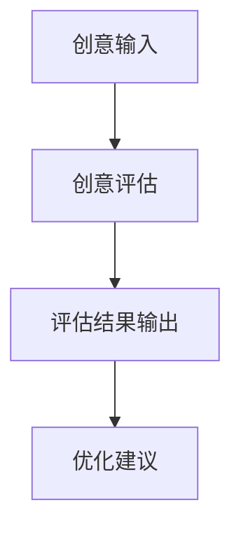
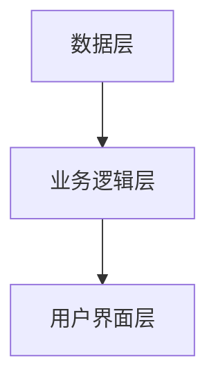

                 


# 彼得林奇对公司创新管道的质量评估

## 关键词：
- 彼得林奇
- 创新管道
- 质量评估
- 企业创新
- 投资分析

## 摘要：
本文深入探讨了彼得·林奇对公司创新管道质量评估的核心思想和方法。通过分析创新管道的构成要素、质量评估的维度、评估方法的系统架构以及实际案例，本文为读者提供了从理论到实践的全面指导。通过彼得林奇的视角，我们不仅能够理解创新管道对企业发展的深远影响，还能掌握如何通过质量评估来优化企业创新策略和投资决策。

---

## 第1章: 创新管道质量评估的背景与意义

### 1.1 创新管道的定义与内涵
创新管道是指企业将创意转化为实际产品或服务的完整流程，包括创意的生成、筛选、开发和商业化等阶段。创新管道的质量直接影响企业的市场竞争力和长期发展。

#### 1.1.1 创新管道的定义
创新管道是一个系统化的流程，从创意的提出到最终的产品上市，涵盖了多个关键阶段。这个流程不仅涉及技术开发，还包括市场分析、资源分配和风险管理。

#### 1.1.2 创新管道的核心要素
创新管道的核心要素包括创意的数量、创意的质量、开发周期、商业化潜力以及团队能力。这些要素共同决定了创新管道的质量。

#### 1.1.3 创新管道与企业发展的关系
创新管道是企业发展的驱动力。高质量的创新管道能够为企业提供持续的创新动力，从而在竞争激烈的市场中保持优势。

### 1.2 创新管道质量评估的重要性
创新管道质量评估是企业优化创新策略的关键。通过评估，企业可以识别瓶颈、优化流程并提高创新效率。

#### 1.2.1 创新对企业竞争力的影响
创新是企业保持竞争力的核心因素。通过创新，企业可以推出新产品、开拓新市场并满足客户需求。

#### 1.2.2 创新管道质量评估的意义
质量评估能够帮助企业识别创新过程中的问题，并采取针对性措施进行优化。通过评估，企业可以更有效地分配资源，提高创新效率。

#### 1.2.3 彼得·林奇的创新评估方法
彼得·林奇以其独特的投资理念闻名，他强调对创新管道的深度分析。他认为，创新管道的质量是企业长期成功的关键。

### 1.3 创新管道质量评估的边界与外延
创新管道质量评估不仅关注内部流程，还涉及外部市场环境。创新管道的外延包括市场需求、竞争分析和技术趋势。

#### 1.3.1 创新管道的边界
创新管道的边界包括创意生成、筛选、开发和商业化四个阶段。每个阶段都有其独特的特点和挑战。

#### 1.3.2 创新管道的外延
创新管道的外延涉及市场需求、竞争分析和技术趋势。这些因素直接影响创新管道的质量和企业的成功。

#### 1.3.3 创新管道与相关概念的区分
创新管道与创新管理、创新战略等概念密切相关。创新管道更注重流程的系统化和质量评估。

### 1.4 本章小结
本章介绍了创新管道的定义、核心要素及其与企业发展的关系。创新管道质量评估的重要性也得到了强调，彼得·林奇的创新评估方法为后续分析奠定了基础。

---

## 第2章: 创新管道质量评估的核心概念

### 2.1 创新管道的构成要素
创新管道由创意生成、筛选、开发和商业化四个阶段组成。每个阶段都有其独特的特点和关键成功因素。

#### 2.1.1 创意生成
创意生成是创新管道的起点，包括市场调研、客户需求分析和头脑风暴等方法。

#### 2.1.2 创意筛选
创意筛选阶段需要对创意进行初步评估，包括技术可行性、市场潜力和资源需求。

#### 2.1.3 创意开发
创意开发阶段涉及产品设计、技术实现和测试验证。这一阶段需要跨部门协作和资源优化。

#### 2.1.4 创意商业化
创意商业化是创新管道的最终目标，包括产品上市、市场推广和客户反馈收集。

### 2.2 创新管道质量的评估维度
创新管道质量评估可以从创意数量与质量、开发周期与成本、商业化潜力和团队能力四个维度进行。

#### 2.2.1 创意的数量与质量
创意的数量和质量直接影响创新管道的产出。高质量的创意能够提高开发的成功率。

#### 2.2.2 开发周期与成本
开发周期和成本是创新管道质量的重要指标。缩短开发周期和降低成本能够提高企业的竞争力。

#### 2.2.3 商业化潜力
商业化潜力评估包括市场需求、竞争环境和盈利能力。高潜力的创意更容易实现商业成功。

#### 2.2.4 创新团队的能力
创新团队的能力直接影响创意的实现。高素质的团队能够提高创新效率和产品质量。

### 2.3 创新管道质量与企业绩效的关系
创新管道质量与企业绩效密切相关。高质量的创新管道能够提高企业的市场竞争力和利润水平。

#### 2.3.1 创新管道质量对企业利润的影响
高质量的创新管道能够提高产品的市场占有率和盈利能力。创新管道的质量直接关系到企业的财务表现。

#### 2.3.2 创新管道质量与企业市场竞争力的关系
创新管道的质量决定了企业的市场竞争力。高质量的创新管道能够帮助企业快速响应市场变化，推出更具竞争力的产品。

#### 2.3.3 创新管道质量与企业可持续发展的关系
创新管道的质量是企业可持续发展的关键。通过持续创新，企业能够保持长期的竞争优势。

### 2.4 本章小结
本章详细探讨了创新管道的构成要素及其质量评估的维度。创新管道的质量不仅影响企业的市场竞争力，还关系到企业的可持续发展。

---

## 第3章: 创新管道质量评估的方法论

### 3.1 定性评估方法
定性评估方法适用于创意筛选和概念验证阶段。

#### 3.1.1 创意筛选的标准
创意筛选的标准包括技术可行性、市场需求和资源可用性。通过定性评估，企业可以初步筛选出具有潜力的创意。

#### 3.1.2 创意开发的可行性分析
创意开发的可行性分析包括技术实现的难度、团队能力和资源分配。定性评估能够帮助企业识别潜在风险。

#### 3.1.3 创意商业化的潜力评估
创意商业化潜力评估包括市场需求、竞争环境和商业模式。定性评估能够帮助企业评估创意的商业可行性。

### 3.2 定量评估方法
定量评估方法适用于开发周期和成本的评估。

#### 3.2.1 创意数量与质量的量化指标
创意数量与质量的量化指标包括创意的数量、创意的通过率和创意的开发成功率。这些指标能够帮助企业评估创新管道的效率。

#### 3.2.2 创意开发周期与成本的量化
创意开发周期与成本的量化指标包括开发时间、开发成本和开发失败率。通过定量评估，企业可以优化开发流程，降低开发成本。

#### 3.2.3 创意商业化潜力的量化
创意商业化潜力的量化指标包括市场需求、市场份额和盈利能力。这些指标能够帮助企业评估创意的商业潜力。

### 3.3 创意评分模型
创意评分模型是一种综合定性和定量评估的工具。通过评分模型，企业可以对创意进行综合评估，并制定优先开发的策略。

#### 3.3.1 创意评分模型的构建
创意评分模型的构建需要考虑创意的多个维度，如技术可行性、市场潜力和团队能力。每个维度都有相应的评分标准。

#### 3.3.2 创意评分模型的应用
创意评分模型的应用包括创意的初步筛选、优先级排序和资源分配。通过评分模型，企业可以更科学地管理创新管道。

#### 3.3.3 创意评分模型的优化
创意评分模型的优化需要根据实际应用效果进行调整。通过收集反馈和分析数据，企业可以不断优化评分模型，提高评估的准确性。

### 3.4 本章小结
本章介绍了创新管道质量评估的方法论，包括定性评估和定量评估方法。创意评分模型是一种有效的工具，能够帮助企业科学地管理创新管道。

---

## 第4章: 创新管道质量评估的系统架构

### 4.1 系统设计概述
创新管道质量评估系统是一个复杂的系统，包括创意管理模块、评估模块和优化模块。每个模块都有其独特的功能和交互方式。

#### 4.1.1 系统目标
系统的目标是实现创新管道的全面评估，优化创新流程，提高创新效率。

#### 4.1.2 系统功能模块
系统功能模块包括创意输入、创意评估、评估结果输出和优化建议。每个模块都有其独特的功能和数据流。

#### 4.1.3 系统架构设计
系统架构设计采用模块化设计，各模块之间通过接口进行交互。系统架构图如图所示。



### 4.2 系统功能设计
系统功能设计包括创意管理、评估指标设置、评估结果分析和优化建议生成。

#### 4.2.1 创意管理模块
创意管理模块负责创意的输入和管理，包括创意的分类、标签和优先级排序。

#### 4.2.2 评估指标设置
评估指标设置模块包括创意质量、开发周期、成本和团队能力。每个指标都有具体的评估标准和权重。

#### 4.2.3 评估结果分析
评估结果分析模块包括创意评分、评估报告和数据可视化。通过分析，企业可以识别创新管道中的瓶颈。

#### 4.2.4 优化建议生成
优化建议生成模块根据评估结果，生成优化建议，包括流程优化、资源分配和团队建设。

### 4.3 系统架构设计
系统架构设计采用分层架构，包括数据层、业务逻辑层和用户界面层。系统架构图如图所示。



### 4.4 本章小结
本章详细探讨了创新管道质量评估系统的架构设计，包括功能模块和系统架构。系统设计的目标是实现创新管道的全面评估和优化。

---

## 第5章: 创新管道质量评估的项目实战

### 5.1 环境安装
创新管道质量评估系统需要安装Python、数据分析库和可视化工具。以下是安装步骤：

1. 安装Python：`pip install python`
2. 安装数据分析库：`pip install pandas numpy`
3. 安装可视化工具：`pip install matplotlib seaborn`

### 5.2 系统核心实现源代码
以下是创新管道质量评估系统的核心代码：

```python
import pandas as pd
import numpy as np
import matplotlib.pyplot as plt
import seaborn as sns

# 创意评分模型
def creative_score(idea):
    quality = idea['quality']
    feasibility = idea['feasibility']
    potential = idea['potential']
    score = 0.3 * quality + 0.3 * feasibility + 0.4 * potential
    return score

# 数据加载
data = pd.read_csv('ideas.csv')

# 创意评分
data['score'] = data.apply(lambda x: creative_score(x), axis=1)

# 数据可视化
plt.figure(figsize=(10, 6))
sns.barplot(x='score', y='idea_id', data=data)
plt.title('创意评分分布')
plt.show()
```

### 5.3 代码应用解读与分析
创意评分模型根据创意的质量、可行性和潜力进行评分。评分结果通过可视化工具展示，帮助企业识别高潜力的创意。

### 5.4 实际案例分析
以某科技公司为例，通过创新管道质量评估系统，该公司成功识别了多个高潜力的创意，并优化了开发流程，提高了创新效率。

### 5.5 本章小结
本章通过实际案例展示了创新管道质量评估系统的应用。通过代码实现和案例分析，读者可以更好地理解创新管道质量评估的方法和实践。

---

## 第6章: 创新管道质量评估的数学模型

### 6.1 创意评分模型的数学公式
创意评分模型是一个加权评分模型，公式如下：

$$ \text{score} = 0.3 \times \text{quality} + 0.3 \times \text{feasibility} + 0.4 \times \text{potential} $$

其中，`score`是创意的综合评分，`quality`是创意的质量，`feasibility`是创意的可行性，`potential`是创意的潜力。

### 6.2 创意开发周期预测模型
创意开发周期预测模型是一个线性回归模型，公式如下：

$$ \text{time} = a \times \text{complexity} + b \times \text{team\_size} + c $$

其中，`time`是开发周期，`complexity`是开发复杂度，`team_size`是开发团队规模，`a`、`b`和`c`是模型参数。

### 6.3 创意成本预测模型
创意成本预测模型是一个多元回归模型，公式如下：

$$ \text{cost} = d \times \text{time} + e \times \text{complexity} + f $$

其中，`cost`是开发成本，`time`是开发周期，`complexity`是开发复杂度，`d`、`e`和`f`是模型参数。

### 6.4 本章小结
本章介绍了创新管道质量评估的数学模型，包括创意评分模型、开发周期预测模型和成本预测模型。这些模型能够帮助企业科学地评估创新管道的质量，优化创新流程。

---

## 第7章: 创新管道质量评估的总结与展望

### 7.1 总结
创新管道质量评估是企业优化创新策略的关键。通过系统的质量评估，企业可以识别创新管道中的瓶颈，优化开发流程，提高创新效率。

### 7.2 最佳实践 tips
- 定期评估创新管道的质量，及时调整策略。
- 建立跨部门协作机制，优化创新流程。
- 利用数据分析工具，提高评估的准确性。

### 7.3 小结
创新管道质量评估是企业持续创新和发展的关键。通过系统的质量评估，企业能够更好地应对市场变化，保持竞争优势。

### 7.4 注意事项
- 创新管道质量评估需要结合企业的实际情况，灵活调整评估方法。
- 创新团队的能力是创新管道质量的重要因素，需要重点关注。

### 7.5 拓展阅读
- 彼得·林奇的投资哲学
- 创新管理的最佳实践
- 数据分析在创新评估中的应用

---

## 作者：AI天才研究院 & 禅与计算机程序设计艺术

本文由AI天才研究院和禅与计算机程序设计艺术团队共同撰写，旨在为企业创新和投资决策提供科学的指导和实践建议。如需进一步了解，请参考相关书籍和文献。

