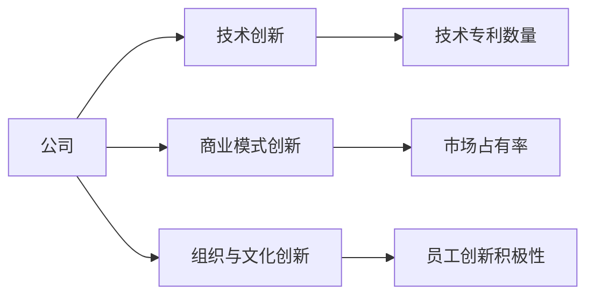
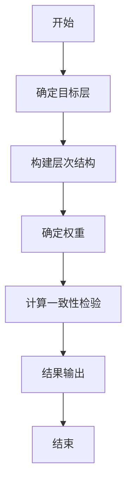
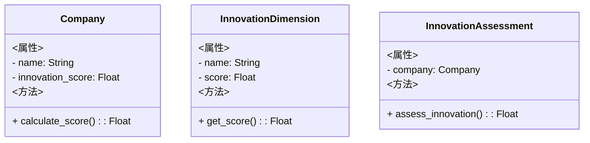
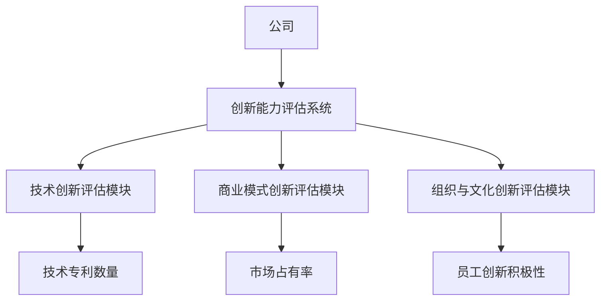
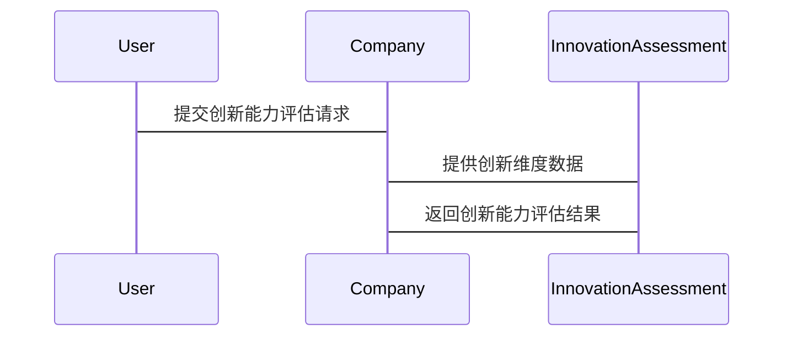

                 


# 彼得林奇对公司创新能力的评估体系

## 关键词：创新能力评估、公司创新、彼得林奇、创新模型、创新体系、创新评估、创新管理

## 摘要：  
彼得·林奇是世界顶级的投资家和管理学家，他在公司创新能力评估方面提出了独特的理论和方法。本文将详细介绍彼得林奇对公司创新能力的评估体系，包括其核心概念、算法原理、系统架构设计、项目实战以及最佳实践。通过本文，读者将能够理解如何科学地评估公司的创新能力，并能够将这些方法应用到实际的企业管理中。

---

# 第一部分: 公司创新能力评估体系的背景与核心概念

## 第1章: 创新能力评估的核心概念

### 1.1 问题背景与问题描述

#### 1.1.1 公司创新能力的重要性  
在当今竞争激烈的商业环境中，创新能力是公司生存和发展的核心竞争力。创新不仅包括技术创新，还包括商业模式创新和组织与文化创新。然而，如何科学地评估创新能力，一直是企业管理和投资决策中的难题。

#### 1.1.2 当前创新能力评估的痛点  
现有的创新能力评估方法往往过于主观，缺乏科学性和可操作性。许多企业在评估创新时，无法量化创新的成果和潜力，导致评估结果难以用于实际决策。

#### 1.1.3 构建科学评估体系的必要性  
为了克服上述痛点，我们需要构建一个科学、系统的创新能力评估体系，能够量化创新的各个维度，为企业决策提供可靠的依据。

---

### 1.2 问题解决与边界定义

#### 1.2.1 创新能力评估的目标  
我们的目标是通过科学的方法，量化公司在技术创新、商业模式创新和组织与文化创新三个维度上的表现，从而帮助企业识别创新潜力和改进方向。

#### 1.2.2 评估体系的边界与外延  
- **边界**：仅关注公司内部的创新能力，不考虑外部市场环境的影响。  
- **外延**：涵盖技术创新、商业模式创新和组织与文化创新三个维度。

#### 1.2.3 核心要素与组成结构  
- **技术创新**：包括技术专利数量、研发投入占比等指标。  
- **商业模式创新**：包括市场占有率、客户满意度等指标。  
- **组织与文化创新**：包括员工创新积极性、组织结构灵活性等指标。

---

### 1.3 创新能力评估的核心要素

#### 1.3.1 技术创新评估维度  
技术创新是创新能力的核心部分，主要通过以下维度进行评估：  
1. 技术专利数量：公司拥有的技术专利数量越多，技术创新能力越强。  
2. 研发投入占比：研发投入占总收入的比例越高，技术创新能力越强。  
3. 技术创新周期：从技术研发到产品上市的时间周期越短，技术创新能力越强。  

#### 1.3.2 商业模式创新维度  
商业模式创新是公司创新能力的重要组成部分，主要通过以下维度进行评估：  
1. 市场占有率：公司在目标市场的占有率越高，商业模式创新能力越强。  
2. 客户满意度：客户对公司的产品或服务的满意度越高，商业模式创新能力越强。  
3. 业务模式多样性：公司拥有多元化的业务模式，能够更好地适应市场变化。  

#### 1.3.3 组织与文化创新维度  
组织与文化创新是公司创新能力的重要保障，主要通过以下维度进行评估：  
1. 员工创新积极性：员工提出创新想法的数量和质量。  
2. 组织结构灵活性：公司能够快速调整组织结构以适应市场需求。  
3. 文化包容性：公司文化是否鼓励创新和风险承担。  

---

## 第2章: 创新能力评估的核心概念与联系

### 2.1 核心概念的原理与特征

#### 2.1.1 创新能力评估的基本原理  
创新能力评估的核心原理是通过多维度的量化指标，综合评估公司在技术创新、商业模式创新和组织与文化创新三个维度上的表现。

#### 2.1.2 核心概念的属性特征对比  
以下是一个对比表格，展示了技术创新、商业模式创新和组织与文化创新的核心属性特征：

| 创新维度       | 技术创新       | 商业模式创新   | 组织与文化创新   |
|----------------|----------------|----------------|------------------|
| 主要目标       | 提升技术水平     | 扩大市场份额     | 提高组织灵活性     |
| 关键指标       | 技术专利数量     | 市场占有率       | 员工创新积极性     |
| 实施主体       | 技术研发部门     | 业务部门         | 组织与人力资源部门   |
| 影响因素       | 技术研发资金     | 市场需求           | 组织文化氛围         |

#### 2.1.3 概念间的关联关系  
技术创新、商业模式创新和组织与文化创新三者之间存在相互关联的关系。技术创新是基础，商业模式创新是核心，而组织与文化创新是保障。只有三者协同发展，才能真正提升公司的创新能力。

---

### 2.2 实体关系图

以下是创新能力评估体系的实体关系图：



---

# 第二部分: 创新能力评估的算法原理

## 第3章: 创新能力评估的算法原理

### 3.1 层次分析法（AHP）原理

#### 3.1.1 层次分析法的基本思想  
层次分析法（Analytic Hierarchy Process, AHP）是一种用于多因素决策的分析方法。它通过构建层次结构，将复杂的问题分解为多个子问题，然后通过权重分配和综合分析，得出最终的评估结果。

#### 3.1.2 层次分析法的步骤  
1. 构建层次结构：将问题分解为多个层次，每个层次包含多个因素。  
2. 确定因素权重：通过比较各个因素的重要性，确定每个因素的权重。  
3. 计算综合权重：根据权重分配，计算每个因素的综合权重。  
4. 一致性检验：检查权重分配的合理性。  

#### 3.1.3 层次分析法的优缺点  
- **优点**：能够量化因素的重要性，适合多因素决策问题。  
- **缺点**：权重分配主观性强，需要专家参与。

---

### 3.2 算法流程图

以下是层次分析法的流程图：



---

### 3.3 算法实现代码

以下是层次分析法的Python实现代码示例：

```python
import numpy as np

def ahp(weight_matrix):
    # 计算特征向量
    eigenvector = np.linalg.eig(weight_matrix)[1]
    # 计算特征值
    eigenvalue = np.linalg.eig(weight_matrix)[0]
    # 计算一致性检验
    consistency = np.max(eigenvalue) - np.size(weight_matrix)
    return eigenvector, eigenvalue

# 示例用法
weight_matrix = np.array([[1, 2, 3],
                          [1/2, 1, 2],
                          [1/3, 1/2, 1]])

eigenvector, eigenvalue = ahp(weight_matrix)
print("特征向量:", eigenvector)
print("特征值:", eigenvalue)
```

---

## 第4章: 创新能力评估的数学模型

### 4.1 层次分析法的数学模型

#### 4.1.1 特征值和一致性检验  
层次分析法的核心是计算特征向量和特征值。以下是特征值和一致性检验的公式：

$$ \lambda_{\text{max}} = \frac{\sum_{i=1}^{n} \lambda_i}{n} $$

$$ C.R. = \frac{\lambda_{\text{max}} - n}{n - 1} $$

其中，$\lambda_{\text{max}}$ 是特征值的最大值，$C.R.$ 是一致性检验比。

#### 4.1.2 示例计算  
假设我们有一个权重矩阵，通过层次分析法计算其特征向量和特征值，如下：

$$ \text{weight_matrix} = \begin{bmatrix} 1 & 2 & 3 \\ 1/2 & 1 & 2 \\ 1/3 & 1/2 & 1 \end{bmatrix} $$

通过上述代码计算，我们可以得到特征向量和特征值，从而进行一致性检验。

---

## 第5章: 系统分析与架构设计方案

### 5.1 问题场景介绍

#### 5.1.1 问题描述  
我们需要构建一个公司创新能力评估系统，能够量化公司在技术创新、商业模式创新和组织与文化创新三个维度上的表现。

#### 5.1.2 项目介绍  
本项目旨在通过层次分析法，构建一个科学的创新能力评估体系，为企业提供可靠的评估结果。

---

### 5.2 系统功能设计

#### 5.2.1 领域模型  
以下是领域模型的类图：



#### 5.2.2 系统架构设计  
以下是系统架构设计图：



#### 5.2.3 系统接口设计  
以下是系统接口设计的序列图：



---

## 第6章: 项目实战

### 6.1 环境安装

#### 6.1.1 安装Python和NumPy  
确保已安装Python和NumPy库：

```bash
pip install numpy
```

### 6.2 系统核心实现

#### 6.2.1 创新能力评估代码实现  
以下是创新能力评估的核心代码：

```python
import numpy as np

def calculate_innovation_score(weight_matrix):
    # 计算特征向量和特征值
    eigenvector, eigenvalue = ahp(weight_matrix)
    # 计算一致性检验
    consistency = np.max(eigenvalue) - np.size(weight_matrix)
    # 如果一致性检验通过，则返回综合得分
    if consistency < 0.1:
        return np.mean(eigenvector)
    else:
        return 0.0

# 示例用法
weight_matrix = np.array([[1, 2, 3],
                          [1/2, 1, 2],
                          [1/3, 1/2, 1]])

score = calculate_innovation_score(weight_matrix)
print("创新能力综合得分:", score)
```

### 6.3 代码应用解读与分析

#### 6.3.1 代码功能解读  
上述代码实现了创新能力评估的核心功能，包括层次分析法的计算和一致性检验。

#### 6.3.2 实际案例分析  
以一家科技公司为例，假设其技术创新、商业模式创新和组织与文化创新的权重分别为0.4、0.3和0.3。通过上述代码计算，我们可以得到其创新能力综合得分。

---

## 第7章: 最佳实践

### 7.1 小结  
通过本文的介绍，我们可以看到，彼得·林奇的创新能力评估体系是一种科学、系统的评估方法，能够帮助企业量化创新能力，为决策提供可靠依据。

### 7.2 注意事项  
在实际应用中，需要注意以下几点：  
1. 确保权重分配的合理性，必要时请专家参与。  
2. 定期更新评估指标，以适应市场变化。  
3. 结合实际业务场景，灵活调整评估体系。  

### 7.3 拓展阅读  
建议进一步阅读以下资料：  
- 彼得·林奇的《投资最重要的事情》  
- 层次分析法的相关文献  

---

## 作者：AI天才研究院/AI Genius Institute & 禅与计算机程序设计艺术/Zen And The Art of Computer Programming

