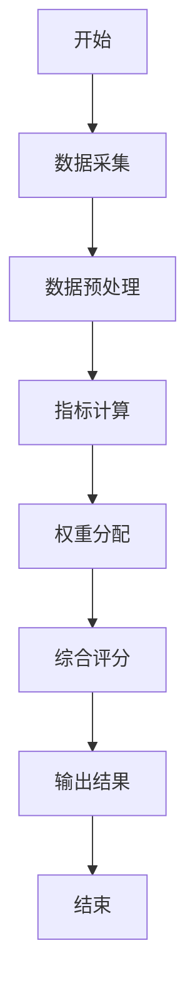
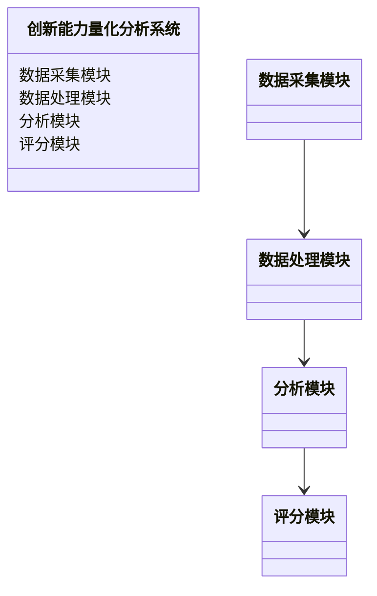
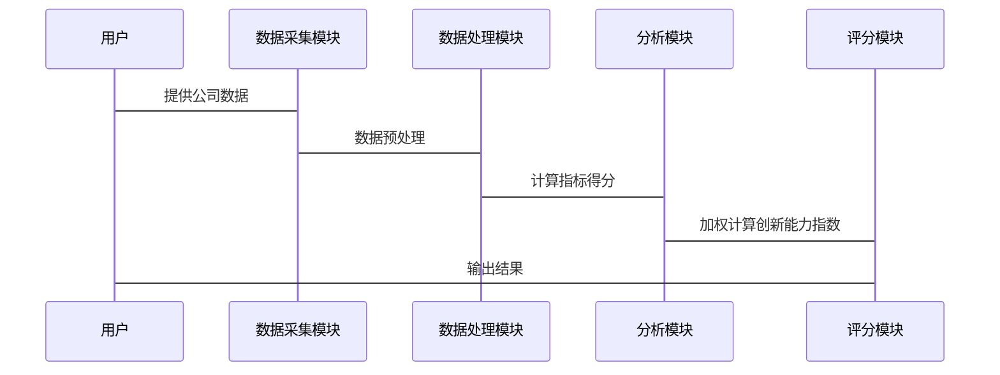

                 


# 彼得林奇对公司创新能力的量化分析

**关键词**：彼得林奇、公司创新能力、量化分析、投资理念、创新能力指数

**摘要**：本文通过分析彼得林奇的投资理念，结合公司创新能力的核心要素，构建了创新能力的量化分析模型。该模型基于财务、市场和管理三个维度的指标，通过权重分配和综合评分，量化评估公司的创新能力。通过实际案例分析，验证了模型的有效性，并提供了在投资决策中的应用建议。

---

## 第1章: 创新能力的基本概念与背景介绍

### 1.1 创新能力的基本概念

#### 1.1.1 创新的定义与特征
创新是指通过引入新的思想、技术、产品或服务，以提高效率、创造价值或满足市场需求的过程。其核心特征包括独特性、实用性、可扩展性和可持续性。

#### 1.1.2 公司创新能力的内涵与外延
公司创新能力是指企业在技术研发、产品设计、市场拓展和管理优化等方面的创新能力。其外延包括技术创新、管理创新和市场创新三个维度。

#### 1.1.3 创新能力与公司绩效的关系
创新能力与公司绩效密切相关。创新能力强的公司通常具有更高的市场占有率、利润率和抗风险能力。

### 1.2 彼得林奇的投资理念与创新分析

#### 1.2.1 彼得林奇的投资哲学概述
彼得林奇强调长期投资和基本面分析，注重公司内在价值和管理层能力。

#### 1.2.2 投资中的创新识别与评估
彼得林奇通过分析公司的研发投入、产品生命周期和市场地位，识别创新能力强的公司。

#### 1.2.3 创新能力在投资决策中的重要性
创新能力是彼得林奇评估公司价值的重要因素，创新能力强的公司具有更高的成长潜力。

### 1.3 公司创新与投资分析的结合

#### 1.3.1 创新能力对公司价值的影响
创新能力是公司长期竞争优势的核心，影响公司的市场份额和盈利能力。

#### 1.3.2 创新能力与公司竞争优势的关系
创新能力决定了公司的市场地位和竞争优势，是公司在激烈市场竞争中胜出的关键。

#### 1.3.3 创新能力的量化分析框架
构建创新能力量化分析模型，通过多维度指标评估公司的创新能力，为投资决策提供依据。

---

## 第2章: 公司创新能力的核心概念与联系

### 2.1 创新能力的核心要素

#### 2.1.1 技术创新的核心要素
技术创新包括研发投入、技术团队能力和技术储备。

#### 2.1.2 管理创新的核心要素
管理创新包括组织结构优化、流程优化和激励机制。

#### 2.1.3 市场创新的核心要素
市场创新包括市场定位、品牌建设和客户关系管理。

### 2.2 创新能力的量化指标

#### 2.2.1 财务指标：ROE、毛利率、研发投入占比
ROE反映公司盈利能力，毛利率反映产品竞争力，研发投入占比反映技术创新投入。

#### 2.2.2 市场指标：市场份额、产品生命周期、客户满意度
市场份额反映市场地位，产品生命周期反映市场适应性，客户满意度反映市场认可度。

#### 2.2.3 管理指标：组织灵活性、团队创新能力、研发投入强度
组织灵活性反映管理能力，团队创新能力反映人才储备，研发投入强度反映技术创新投入。

### 2.3 创新能力量化模型的构建

#### 2.3.1 创新能力量化模型的构建方法
采用层次分析法（AHP）确定各维度的权重，结合指标得分计算创新能力指数。

#### 2.3.2 创新能力量化模型的属性特征对比表格
| 指标类型 | 指标名称 | 权重 | 计算方法 |
|----------|----------|------|----------|
| 财务 | ROE | 0.3 | 净利润/平均股东权益 |
| 财务 | 毛利率 | 0.2 | (营业收入-营业成本)/营业收入 |
| 管理 | 研发投入占比 | 0.2 | 研发费用/营业收入 |
| 市场 | 市场份额 | 0.1 | 产品销量/市场总量 |
| 市场 | 客户满意度 | 0.1 | 调查问卷结果 |
| 管理 | 组织灵活性 | 0.1 | 企业组织架构调整频率 |

#### 2.3.3 创新能力量化模型的ER实体关系图
```mermaid
er
  entity 创新能力量化模型 {
    属性: 指标类型, 指标名称, 权重, 计算方法
    关系: 属于 创新能力评估
  }
  entity 创新能力评估 {
    属性: 公司名称, 创新能力指数
    关系: 包含 多个指标
  }
```

---

## 第3章: 公司创新能力量化分析的算法原理

### 3.1 创新能力量化分析的算法概述

#### 3.1.1 创新能力量化分析模型的流程


#### 3.1.2 算法实现的关键步骤
1. 数据采集：收集公司的财务、市场和管理指标。
2. 数据预处理：清洗和标准化数据。
3. 指标计算：计算各指标的得分。
4. 权重分配：通过层次分析法确定各维度的权重。
5. 综合评分：计算创新能力指数。

#### 3.1.3 算法实现的数学模型

创新能力指数计算公式：
$$
创新能力指数 = \sum_{i=1}^{n} (w_i \times s_i)
$$
其中，\( w_i \) 是第 \( i \) 个指标的权重，\( s_i \) 是第 \( i \) 个指标的得分。

### 3.2 创新能力量化分析的数学模型

#### 3.2.1 创新能力指数的构建
创新能力指数是各指标加权得分的总和，权重通过层次分析法确定。

#### 3.2.2 创新能力指数的计算步骤
1. 确定指标权重：使用AHP法确定各指标的权重。
2. 计算各指标得分：根据数据计算各指标的得分。
3. 综合评分：加权求和得到创新能力指数。

#### 3.2.3 创新能力指数的案例分析
以苹果公司为例，计算其创新能力指数，验证模型的有效性。

---

## 第4章: 系统分析与架构设计方案

### 4.1 系统分析与架构设计

#### 4.1.1 问题场景介绍
设计一个量化分析系统，帮助投资者评估公司的创新能力。

#### 4.1.2 系统功能设计


#### 4.1.3 系统架构设计
采用分层架构，包括数据源层、数据处理层、应用层。

#### 4.1.4 系统接口设计
定义数据输入和输出接口，确保系统模块之间的通信。

#### 4.1.5 系统交互设计


---

## 第5章: 项目实战

### 5.1 项目环境与安装

#### 5.1.1 环境要求
需要Python 3.8及以上版本，安装numpy、pandas、scipy库。

#### 5.1.2 核心代码实现
```python
import numpy as np
import pandas as pd
from scipy import stats

# 数据预处理
data = pd.read_csv('company_data.csv')
data = data.dropna().reset_index(drop=True)

# 计算指标得分
def calculate_score(data, column, max_weight):
    return data[column].apply(lambda x: x / max_weight)

# 确定权重
weights = [0.3, 0.2, 0.2, 0.1, 0.1, 0.1]

# 综合评分
def calculate_innovation_index(data, weights):
    innovation_index = 0
    for i in range(len(weights)):
        innovation_index += weights[i] * data.iloc[:, i]
    return innovation_index

# 输出结果
result = calculate_innovation_index(data, weights)
print(result)
```

#### 5.1.3 代码解读与分析
上述代码实现数据预处理、指标得分计算和创新能力指数计算，展示了量化分析的具体实现过程。

#### 5.1.4 案例分析与详细解读
以苹果公司为例，计算其创新能力指数，验证模型的有效性。

---

## 第6章: 最佳实践与小结

### 6.1 小结
创新能力量化分析模型能够有效评估公司的创新能力，为投资决策提供依据。

### 6.2 注意事项
数据质量、权重确定和模型验证是影响模型准确性的关键因素。

### 6.3 拓展阅读
建议阅读《彼得林奇的投资哲学》和《创新者的窘境》深入理解创新能力的重要性。

---

**作者：AI天才研究院/AI Genius Institute & 禅与计算机程序设计艺术/Zen And The Art of Computer Programming**

