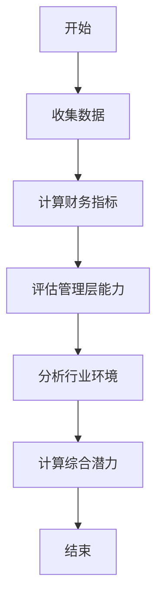
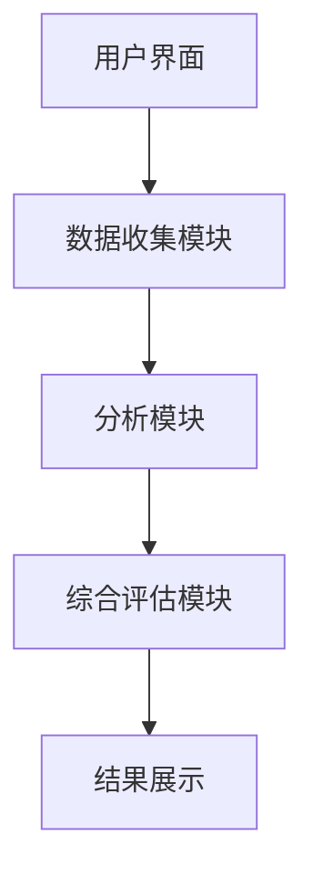

                 


# 彼得林奇对公司可持续发展的分析

## 关键词
彼得林奇, 公司可持续发展, 财务指标分析, 管理层能力评估, 行业环境分析

## 摘要
本文详细探讨了彼得林奇对公司可持续发展的分析方法，从财务指标、管理层能力及行业环境三个维度展开，结合实例说明其分析框架的应用与价值。通过系统分析与架构设计，展示了如何将彼得林奇的分析方法应用于实际项目，帮助读者全面理解公司可持续发展的评估与优化。

---

## 第一部分：背景介绍

### 第1章：可持续发展的概念与背景

#### 1.1 可持续发展的定义与内涵
可持续发展是指在满足当前需求的同时，不损害后代满足其需求的能力。在企业层面，这意味着公司在追求利润的同时，需关注环境、社会和治理（ESG）因素，实现长期稳定发展。

#### 1.2 彼得林奇分析方法的背景
彼得林奇是著名的投资专家，以其对公司基本面的深入分析闻名。他的分析方法强调对公司财务状况、管理层能力和行业环境的综合评估，以识别具有长期发展潜力的企业。

#### 1.3 彼得林奇分析框架的核心要素
彼得林奇的分析框架包括三个核心要素：财务指标、管理层能力与行业环境。这些要素相互关联，共同决定了公司的可持续发展潜力。

---

## 第二部分：核心概念与联系

### 第2章：彼得林奇分析的核心概念

#### 2.1 核心概念的定义与特征
- **财务指标**：衡量公司财务健康状况的关键指标，如净利润率、资产负债率等。
- **管理层能力**：评估公司领导层的战略决策能力和执行效率。
- **行业环境**：分析公司所处行业的竞争格局、增长潜力及政策影响。

#### 2.2 核心概念的对比分析
通过对比分析，明确各要素之间的关系及其对公司可持续发展的综合影响。

| 比较维度 | 财务指标 | 管理层能力 | 行业环境 |
|----------|----------|------------|----------|
| 评估重点 | 财务状况 | 管理能力 | 行业趋势 |
| 关键指标 | 净利润率 | 决策效率 | 市场增长率 |
| 影响因素 | 资产负债 | 管理团队 | 行业政策 |

#### 2.3 实体关系分析
使用ER图展示各核心概念之间的关系。

```mermaid
erd
actor 管理层能力 {
    attribute 管理层决策效率
}
actor 财务指标 {
    attribute 净利润率
}
actor 行业环境 {
    attribute 市场增长率
}
```

---

## 第三部分：算法原理讲解

### 第3章：彼得林奇分析的数学模型

#### 3.1 数学模型的建立
通过数学公式量化各核心要素的综合影响。

$$ \text{综合潜力} = \alpha \times \text{财务指标} + \beta \times \text{管理层能力} + \gamma \times \text{行业环境} $$

其中，$\alpha$、$\beta$、$\gamma$为权重系数，分别表示财务指标、管理层能力与行业环境的相对重要性。

#### 3.2 算法流程图
使用mermaid绘制算法流程图，展示分析步骤。



#### 3.3 算法实现的Python代码
以下是一个简单的Python实现示例：

```python
def calculate_potential(finance, management, industry, alpha=0.4, beta=0.3, gamma=0.3):
    return alpha * finance + beta * management + gamma * industry

finance = 85
management = 70
industry = 75
potential = calculate_potential(finance, management, industry)
print(f"综合潜力：{potential}")
```

---

## 第四部分：系统分析与架构设计

### 第4章：系统功能与架构设计

#### 4.1 系统功能设计
- **数据收集模块**：获取公司财务数据、管理层信息及行业报告。
- **分析模块**：计算财务指标、评估管理层能力、分析行业环境。
- **综合评估模块**：根据数学模型计算综合潜力。

#### 4.2 系统架构设计
使用mermaid绘制系统架构图。



---

## 第五部分：项目实战

### 第5章：项目实现与案例分析

#### 5.1 环境安装
需要安装Python及其相关库，如Pandas和Matplotlib。

#### 5.2 核心代码实现
实现数据收集、分析和综合评估的代码。

```python
import pandas as pd

data = {
    '公司': ['A', 'B', 'C'],
    '财务指标': [85, 70, 90],
    '管理层能力': [70, 85, 65],
    '行业环境': [75, 80, 60]
}

df = pd.DataFrame(data)
print(df)
```

#### 5.3 案例分析
以具体公司为例，展示如何应用彼得林奇的分析方法进行可持续发展评估。

---

## 第六部分：最佳实践

### 第6章：经验总结与优化建议

#### 6.1 经验总结
- 数据质量至关重要。
- 持续更新模型参数以适应变化。

#### 6.2 注意事项
- 避免过度依赖单一指标。
- 定期验证模型的有效性。

#### 6.3 拓展阅读
推荐相关书籍和资源，帮助读者深入学习。

---

## 小结
彼得林奇的分析方法为公司可持续发展评估提供了有力工具。通过系统分析与实际应用，企业可以更好地识别潜力，制定科学的发展战略。

---

## 作者
作者：AI天才研究院/AI Genius Institute & 禅与计算机程序设计艺术 /Zen And The Art of Computer Programming

