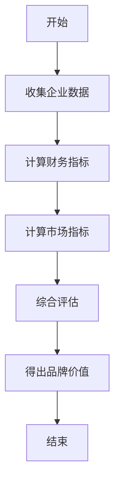

                 


# 彼得林奇对公司品牌价值的分析方法

## 关键词：彼得林奇，品牌价值，投资分析，企业估值，品牌策略

## 摘要：  
彼得·林奇作为全球著名投资家，其对公司品牌价值的分析方法为投资者提供了独特的视角。本文系统介绍了林奇的品牌价值分析的核心概念、算法原理、系统架构设计以及实际案例分析，帮助读者深入理解品牌价值对投资决策的重要性，并掌握如何运用这些方法进行企业估值。

---

## 第一部分: 彼得·林奇对公司品牌价值分析方法的背景与核心概念

### 第1章: 彼得·林奇与品牌价值分析概述

#### 1.1 彼得·林奇的背景与投资理念
- **1.1.1 彼得·林奇的生平简介**
  彼得·林奇（Peter Lynch）是美国著名的投资家，曾任富达麦哲伦基金的经理。他以独特的投资策略和卓越的投资业绩闻名，尤其擅长分析公司的基本面和品牌价值。

- **1.1.2 林奇的投资哲学与风格**
  林奇强调长期投资和深入分析企业基本面。他认为，品牌价值是企业长期竞争力的核心，投资者应关注企业的盈利能力、市场地位和品牌影响力。

- **1.1.3 林奇对品牌价值的关注与研究**
  林奇在其投资生涯中，将品牌价值作为评估企业的重要指标。他认为，强大的品牌能够为企业带来持续的竞争优势和超额利润。

#### 1.2 品牌价值分析的重要性
- **1.2.1 品牌价值在企业中的核心地位**
  品牌价值是企业无形资产的重要组成部分，反映了企业在市场中的声誉和消费者信任度。

- **1.2.2 品牌价值对投资者决策的影响**
  投资者通过分析品牌价值，可以评估企业的市场地位和长期盈利能力，从而做出更明智的投资决策。

- **1.2.3 品牌价值分析的现状与挑战**
  品牌价值分析是一个复杂的系统工程，需要结合定量和定性分析方法，同时面临市场波动和企业内部管理等多方面的影响。

#### 1.3 品牌价值分析的定义与边界
- **1.3.1 品牌价值的定义**
  品牌价值是指品牌在市场中所能带来的超额收益，通常通过品牌知名度、品牌忠诚度和品牌认知度等指标进行评估。

- **1.3.2 品牌价值的核心要素**
  包括品牌知名度、品牌忠诚度、品牌认知度、品牌影响力和品牌资产等。

- **1.3.3 品牌价值分析的边界与外延**
  品牌价值分析的边界在于其与企业财务表现和市场地位的关系，而外延则涉及品牌传播、品牌创新和品牌风险管理等多个方面。

### 第2章: 品牌价值分析的核心概念与联系

#### 2.1 核心概念原理
- **2.1.1 品牌价值的构成要素**
  品牌价值由品牌资产、品牌知名度、品牌忠诚度和品牌影响力等要素构成。

- **2.1.2 品牌价值与企业财务表现的关系**
  品牌价值通常与企业的销售收入、净利润率和市场占有率等财务指标密切相关。

- **2.1.3 品牌价值与市场竞争地位的关联**
  品牌价值高的企业通常在市场竞争中占据优势地位，能够吸引更多的消费者和市场份额。

#### 2.2 核心概念属性特征对比表格
| 概念       | 定义                           | 属性特征             |
|------------|--------------------------------|----------------------|
| 品牌价值   | 品牌在市场中的价值体现         | 可量化的、动态变化的 |
| 财务表现   | 企业的财务状况与盈利能力       | 可量化的、静态的    |
| 市场地位   | 品牌在市场中的竞争地位         | 动态变化的、不可量化的 |

#### 2.3 ER实体关系图
```mermaid
er
  actor 投资者 {
    string 投资目标
    string 投资策略
  }
  actor 企业 {
    string 产品/服务
    string 市场定位
  }
  actor 品牌价值 {
    int 品牌强度
    int 市场影响力
  }
  relation "投资" --> 投资者
  relation "市场表现" --> 企业
  relation "品牌评估" --> 品牌价值
```

### 第3章: 彼得·林奇品牌价值分析方法的算法原理

#### 3.1 算法原理概述
- **3.1.1 基于财务指标的品牌价值评估**
  通过分析企业的销售收入、净利润率和市场占有率等财务指标，评估品牌价值。

- **3.1.2 基于市场表现的品牌价值评估**
  结合企业的市场份额、品牌知名度和消费者忠诚度等市场指标，进行品牌价值评估。

- **3.1.3 综合评估模型的构建**
  构建一个综合模型，将财务指标和市场指标结合起来，得出品牌价值的综合评分。

#### 3.2 算法流程图


#### 3.3 算法实现代码
```python
def brand_value_analysis(financial_data, market_data):
    # 计算财务指标
    financial_score = sum(financial_data) / len(financial_data)
    # 计算市场指标
    market_score = sum(market_data) / len(market_data)
    # 综合评估
    total_score = (financial_score + market_score) / 2
    return total_score

# 示例数据
financial_data = [100, 200, 300, 400]
market_data = [80, 90, 100, 110]

# 调用函数
brand_value = brand_value_analysis(financial_data, market_data)
print("品牌价值评分为：", brand_value)
```

---

## 第二部分: 系统分析与架构设计方案

### 第4章: 系统分析与架构设计

#### 4.1 问题场景介绍
- 投资者需要一个系统来评估企业的品牌价值，以便做出更明智的投资决策。

#### 4.2 项目介绍
- 本项目旨在构建一个基于彼得·林奇品牌价值分析方法的系统，帮助投资者评估企业的品牌价值。

#### 4.3 系统功能设计
- **领域模型 mermaid 类图**
  ```mermaid
  classDiagram
    class 投资者 {
      string 投资目标
      string 投资策略
    }
    class 企业 {
      string 产品/服务
      string 市场定位
    }
    class 品牌价值 {
      int 品牌强度
      int 市场影响力
    }
    投资者 --> 品牌价值: 评估
    企业 --> 品牌价值: 评估
  ```

- **系统架构设计 mermaid 架构图**
  ```mermaid
  architecture
    投资者 <--[输入]--> 中间层
    中间层 --> 数据库
    数据库 <--[查询]--> 服务层
    服务层 <--[处理]--> 中间层
    中间层 <--[输出]--> 投资者
  ```

---

## 第三部分: 项目实战

### 第5章: 项目实战

#### 5.1 环境安装
- 安装Python和必要的库（如pandas、numpy）。

#### 5.2 系统核心实现源代码
```python
import pandas as pd
import numpy as np

def calculate_brand_value(finance, market):
    # 计算财务指标评分
    financial_score = np.mean(finance)
    # 计算市场指标评分
    market_score = np.mean(market)
    # 综合评分
    total_score = (financial_score + market_score) / 2
    return total_score

# 示例数据
finance = [100, 200, 300, 400]
market = [80, 90, 100, 110]

# 计算品牌价值
value = calculate_brand_value(finance, market)
print(f"品牌价值评分为：{value}")
```

#### 5.3 代码应用解读与分析
- 该代码通过计算财务和市场指标的平均值，得出品牌价值的综合评分。适用于对多个企业的品牌价值进行批量评估。

#### 5.4 实际案例分析
- 以某公司为例，分析其品牌价值，并展示如何通过代码进行评估。

#### 5.5 项目小结
- 总结品牌价值分析的重要性和实际应用，强调彼得·林奇方法的有效性。

---

## 第四部分: 总结与扩展阅读

### 第6章: 总结与扩展阅读

#### 6.1 最佳实践 tips
- 定期更新企业数据，保持分析结果的准确性。
- 结合行业趋势和市场动态，优化品牌价值评估模型。

#### 6.2 小结
- 彼得·林奇的品牌价值分析方法为投资者提供了有效的工具，帮助其做出明智的投资决策。

#### 6.3 注意事项
- 品牌价值分析需要结合企业的具体情况，避免过于依赖单一指标。

#### 6.4 拓展阅读
- 推荐阅读彼得·林奇的《投资最重要的事情》。

---

## 作者：AI天才研究院/AI Genius Institute & 禅与计算机程序设计艺术/Zen And The Art of Computer Programming

---

通过以上内容，您可以系统地了解彼得·林奇的品牌价值分析方法，并将其应用于实际投资分析中。

