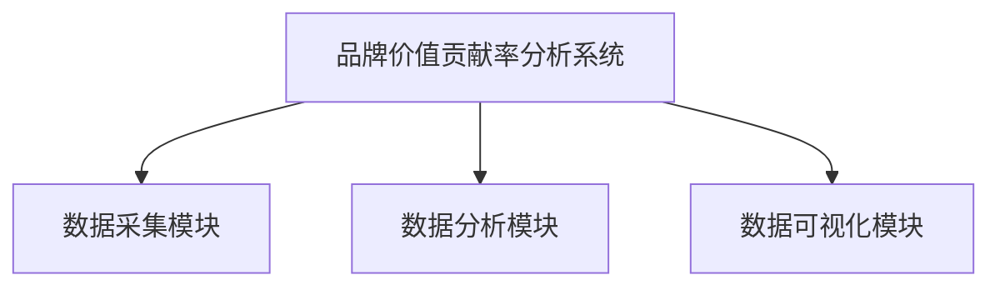
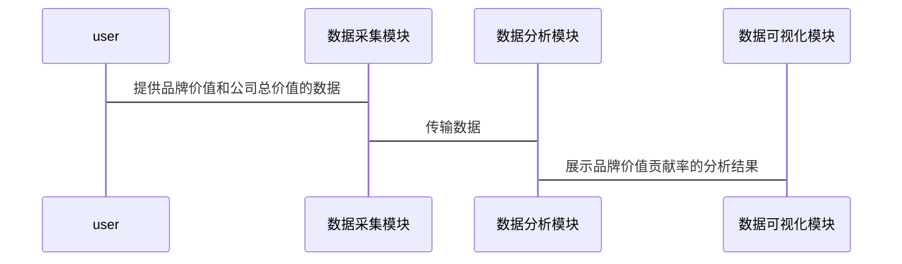

                 


# 彼得林奇对公司品牌价值贡献率的分析

## 关键词：品牌价值、公司价值、彼得林奇、贡献率、投资分析

## 摘要：本文深入分析了彼得林奇对公司品牌价值贡献率的分析方法，从品牌价值的核心概念、模型构建、算法原理到系统架构设计、项目实战，再到最佳实践，全面解读了品牌价值对公司的整体价值影响。通过详细的案例分析和系统设计，帮助读者理解如何量化品牌价值对公司的贡献，并提供实际应用的指导。

---

# 第一部分: 彼得林奇对公司品牌价值贡献率的背景介绍

## 第1章: 品牌价值与公司价值的概述

### 1.1 品牌价值的基本概念
#### 1.1.1 品牌的定义与内涵
品牌是企业的无形资产，代表着企业的形象、声誉和客户认知。品牌不仅仅是名称和标志，还包括品牌的核心价值、文化内涵以及与客户的情感联系。

#### 1.1.2 品牌价值的构成要素
品牌价值由多个要素构成，包括品牌知名度、品牌忠诚度、品牌识别度、品牌创新能力和品牌社会责任感。

#### 1.1.3 品牌与公司价值的关系
品牌是公司价值的重要组成部分。强大的品牌能够提升公司的市场地位、客户忠诚度和利润率，从而增加公司的整体价值。

### 1.2 彼得林奇的分析方法
#### 1.2.1 彼得林奇的投资理念
彼得林奇是著名的投资专家，他强调长期投资和基本面分析，认为公司的品牌价值是影响公司长期发展的关键因素。

#### 1.2.2 彼得林奇对公司价值的评估方法
彼得林奇通过分析公司的财务数据、市场地位、竞争优势和品牌影响力，评估公司的整体价值。

#### 1.2.3 彼得林奇的品牌价值分析框架
彼得林奇提出，品牌价值贡献率是衡量品牌对 company value 贡献的重要指标，其计算公式为：
$$ \text{品牌价值贡献率} = \frac{\text{品牌价值}}{\text{公司总价值}} $$

## 第2章: 品牌价值对 company value 的影响

### 2.1 品牌价值对 company value 的核心作用
#### 2.1.1 品牌价值对公司市场价值的影响
强大的品牌能够提升公司的市场地位，增加公司的市场份额和产品溢价能力，从而提高公司的市场价值。

#### 2.1.2 品牌价值对公司运营价值的影响
品牌价值能够降低公司的营销成本，提升客户忠诚度和产品销售速度，从而提高公司的运营效率和盈利能力。

#### 2.1.3 品牌价值对公司长期发展的意义
品牌价值是公司长期发展的基石，能够为公司提供持续的竞争优势和市场影响力，确保公司的长期稳定发展。

### 2.2 彼得林奇的品牌价值贡献率模型
#### 2.2.1 品牌价值贡献率的定义
品牌价值贡献率是指品牌价值对 company value 的贡献程度，是衡量品牌对公司的核心价值贡献的重要指标。

#### 2.2.2 彼得林奇模型的核心假设
彼得林奇模型假设品牌价值是公司总价值的重要组成部分，并且品牌价值可以通过市场数据和财务数据进行量化。

#### 2.2.3 模型的数学表达式
$$ \text{品牌价值贡献率} = \frac{\text{品牌价值}}{\text{公司总价值}} $$

### 2.3 品牌价值贡献率的计算方法
#### 2.3.1 数据收集与处理
品牌价值和公司总价值的数据可以通过市场调研、财务报表和行业报告获取。

#### 2.3.2 模型参数的估计
通过回归分析和市场比较法，估计品牌价值和公司总价值之间的关系。

#### 2.3.3 模型的验证与调整
通过实际案例验证模型的准确性，并根据实际情况对模型进行调整和优化。

---

# 第二部分: 品牌价值贡献率的核心概念与联系

## 第3章: 品牌价值的核心要素分析

### 3.1 品牌核心要素的识别
#### 3.1.1 品牌知名度
品牌知名度是品牌被消费者认知和记忆的程度，是品牌价值的重要组成部分。

#### 3.1.2 品牌忠诚度
品牌忠诚度是消费者对品牌的偏好和重复购买意愿，是品牌价值的重要体现。

#### 3.1.3 品牌识别度
品牌识别度是品牌在市场中的独特性和可识别性，是品牌价值的核心要素之一。

### 3.2 品牌价值与公司价值的对比分析
#### 3.2.1 品牌价值的定性与定量分析
品牌价值可以通过市场调研、消费者调查和财务数据进行定性和定量分析。

#### 3.2.2 品牌价值与公司价值的对比表格
以下是品牌价值与公司价值的对比表格：

| 项目                | 品牌价值                     | 公司价值                     |
|---------------------|-----------------------------|-----------------------------|
| 定义                | 品牌的市场影响力和客户认知    | 公司的资产、收益和市场地位   |
| 构成要素            | 品牌知名度、忠诚度、识别度    | 资产、利润、市场份额、品牌价值|
| 影响                | 提升公司市场地位和客户忠诚度  | 影响公司的整体市场价值       |

#### 3.2.3 品牌价值对 company value 的影响路径
以下是品牌价值对 company value 的影响路径：

1. 提升品牌知名度，增加市场份额。
2. 提高品牌忠诚度，降低客户流失率。
3. 增强品牌识别度，提升产品溢价能力。

## 第4章: 品牌价值与公司价值的 ER 实体关系图

### 4.1 实体关系图的构建
以下是品牌价值与公司价值的 ER 实体关系图：

```mermaid
erDiagram
    company {
        id
        name
        market_value
        brand_value
    }
    brand {
        id
        name
        brand_reputation
        brand_popularity
        brand_recognition
    }
    company_brand_relationship {
        id
        company_id
        brand_id
        brand_contribution_rate
    }
    company o2m company_brand_relationship
    brand o2m company_brand_relationship
```

---

# 第三部分: 品牌价值贡献率的算法原理

## 第5章: 品牌价值贡献率的计算模型

### 5.1 品牌价值贡献率模型的数学表达
$$ \text{品牌价值贡献率} = \frac{\text{品牌价值}}{\text{公司总价值}} $$

### 5.2 品牌价值贡献率的计算步骤
1. 收集品牌价值和公司总价值的数据。
2. 计算品牌价值贡献率。
3. 分析品牌价值贡献率对 company value 的影响。

### 5.3 品牌价值贡献率的 mermaid 流程图
```mermaid
flowchart TD
    A[开始] -> B[收集品牌价值和公司总价值数据]
    B -> C[计算品牌价值贡献率]
    C -> D[分析品牌价值贡献率对 company value 的影响]
    D -> E[结束]
```

---

# 第四部分: 系统分析与架构设计方案

## 第6章: 系统功能设计

### 6.1 系统功能模块
1. 数据采集模块：收集品牌价值和公司总价值的数据。
2. 数据分析模块：计算品牌价值贡献率。
3. 数据可视化模块：展示品牌价值贡献率的分析结果。

### 6.2 系统架构设计
以下是系统架构设计的 mermaid 图：



### 6.3 系统接口设计
1. 数据采集接口：接收品牌价值和公司总价值的数据。
2. 数据分析接口：计算品牌价值贡献率。
3. 数据可视化接口：展示品牌价值贡献率的分析结果。

### 6.4 系统交互设计
以下是系统交互设计的 mermaid 图：



---

# 第五部分: 项目实战

## 第7章: 项目实战分析

### 7.1 项目背景与目标
选择一家公司进行品牌价值贡献率的分析，目标是通过实际案例展示品牌价值对 company value 的影响。

### 7.2 数据收集与处理
收集目标公司的品牌价值和公司总价值的数据，包括品牌知名度、品牌忠诚度、品牌识别度等。

### 7.3 数据分析与计算
使用彼得林奇的品牌价值贡献率模型计算品牌价值贡献率。

### 7.4 结果展示与解读
展示品牌价值贡献率的分析结果，并解读品牌价值对 company value 的影响。

---

# 第六部分: 最佳实践与小结

## 第8章: 最佳实践

### 8.1 实际应用中的注意事项
1. 数据的准确性和完整性是关键。
2. 品牌价值贡献率的计算需要结合实际情况进行调整。
3. 品牌价值对 company value 的影响是长期的，需要持续关注和优化。

### 8.2 小结
品牌价值是公司价值的重要组成部分，彼得林奇的品牌价值贡献率模型为量化品牌价值对 company value 的贡献提供了有效的工具。

### 8.3 拓展阅读
1. 彼得林奇的投资哲学。
2. 品牌价值的定量分析方法。

---

# 作者：AI天才研究院/AI Genius Institute & 禅与计算机程序设计艺术 /Zen And The Art of Computer Programming

