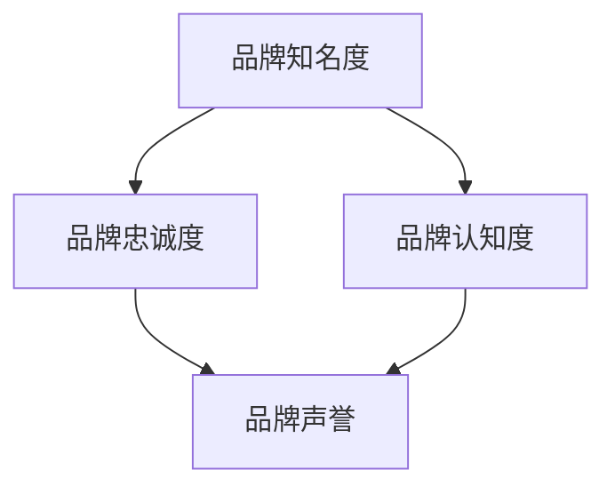
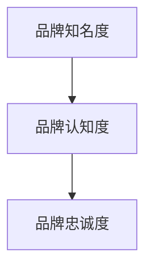

                 


# 彼得林奇对公司品牌资产价值随时间变化的追踪研究

**关键词**: 彼得林奇, 品牌资产, 时间变化, 投资研究, 价值评估

**摘要**: 本文深入探讨了彼得林奇如何对公司品牌资产价值随时间变化进行追踪研究。文章首先介绍了品牌资产的基本概念及其在投资决策中的重要性，然后详细分析了彼得林奇的品牌资产分析框架和投资策略。接下来，文章从数学模型、系统架构等多个维度，详细讲解了品牌资产价值的评估方法和动态变化的分析工具。最后，通过实际案例分析和项目实战，展示了如何将理论应用于实践，帮助投资者更好地理解品牌资产的价值变化，并做出明智的投资决策。

---

# 第一部分: 公司品牌资产价值追踪研究的背景与基础

## 第1章: 品牌资产的基本概念与理论基础

### 1.1 品牌资产的核心概念

#### 1.1.1 品牌资产的定义与内涵

品牌资产是企业无形资产的重要组成部分，指的是消费者对品牌认知、情感和信任的总和。品牌资产的核心在于其对消费者行为和企业价值的影响。彼得林奇认为，品牌资产是企业长期竞争优势的核心来源，其价值会随着时间的推移而波动。

**图1.1: 品牌资产的构成要素**



#### 1.1.2 品牌资产的构成要素

品牌资产的构成要素包括品牌知名度、品牌认知度、品牌忠诚度和品牌声誉。这些要素共同决定了品牌资产的强弱和价值高低。

| 要素 | 定义 | 影响 |
|------|------|------|
| 品牌知名度 | 消费者对品牌的熟悉程度 | 品牌知名度越高，品牌资产价值越大 |
| 品牌认知度 | 消费者对品牌的理解和记忆 | 品牌认知度越高，品牌资产稳定性越强 |
| 品牌忠诚度 | 消费者对品牌的偏好程度 | 品牌忠诚度越高，品牌资产的抗风险能力越强 |
| 品牌声誉 | 消费者对品牌的信任程度 | 品牌声誉越好，品牌资产的市场价值越高 |

#### 1.1.3 品牌资产与企业价值的关系

品牌资产与企业价值密切相关。品牌资产可以通过公式 $V = k \times EBIT$ 来量化，其中 $k$ 是品牌资产的价值系数，$EBIT$ 是息税折旧前利润。彼得林奇认为，品牌资产的系数 $k$ 是决定企业价值的关键因素之一。

---

### 1.2 品牌价值的影响因素

#### 1.2.1 品牌知名度与认知度

品牌知名度和认知度是品牌资产的核心要素。品牌知名度决定了品牌的市场覆盖范围，而品牌认知度则决定了消费者对品牌的理解和记忆深度。彼得林奇认为，品牌知名度的提升可以通过广告宣传、市场推广和产品创新等方式实现。

**图1.2: 品牌知名度与认知度的关系**



#### 1.2.2 品牌忠诚度与客户满意度

品牌忠诚度是消费者对品牌的偏好程度，而客户满意度则是消费者对品牌产品或服务的满意程度。彼得林奇认为，品牌忠诚度和客户满意度是品牌资产的重要指标，可以通过调查问卷和数据分析的方法进行评估。

#### 1.2.3 品牌形象与声誉

品牌形象是消费者对品牌的整体感知，而品牌声誉则是消费者对品牌的信任程度。彼得林奇强调，品牌形象和声誉是品牌资产的核心要素，可以通过市场调研和舆情分析的方法进行评估。

---

## 第2章: 彼得林奇的公司品牌资产分析框架

### 2.1 彼得林奇投资理念概述

#### 2.1.1 投资哲学与品牌价值

彼得林奇的投资哲学强调长期价值投资，他认为品牌资产是企业长期竞争优势的核心来源。品牌资产的价值可以通过企业的财务表现、市场地位和消费者行为来评估。

#### 2.1.2 彼得林奇的选股策略

彼得林奇的选股策略注重品牌资产的量化评估，他通过分析企业的财务报表、市场地位和消费者行为来选择具有长期竞争优势的公司。

#### 2.1.3 品牌资产在投资决策中的地位

品牌资产是彼得林奇投资决策的核心依据之一。他认为，品牌资产的强弱决定了企业的市场地位和长期盈利能力。

---

### 2.2 彼得林奇的品牌资产分析方法

#### 2.2.1 品牌资产的量化指标

彼得林奇通过品牌资产的量化指标来评估品牌资产的价值。这些指标包括品牌知名度、品牌忠诚度、品牌声誉和品牌强度。

#### 2.2.2 品牌资产的动态变化

彼得林奇认为，品牌资产的动态变化受到市场环境、消费者行为和企业战略的影响。他通过分析品牌资产的变化趋势来评估品牌的长期价值。

#### 2.2.3 品牌资产与公司财务表现的关系

品牌资产与公司财务表现密切相关。品牌资产的强弱决定了企业的收入、利润和市场份额。彼得林奇通过分析品牌资产与财务表现的关系来评估企业的投资价值。

---

# 第二部分: 品牌资产价值的评估与追踪方法

## 第3章: 品牌价值的评估模型与方法

### 3.1 品牌价值的计算模型

#### 3.1.1 品牌价值的公式推导

品牌价值的计算公式为：

$$ V = k \times EBIT $$

其中，$k$ 是品牌资产的价值系数，$EBIT$ 是息税折旧前利润。

#### 3.1.2 品牌价值评估的数学模型

品牌价值的评估可以通过回归分析和因子分析的方法进行。回归分析用于评估品牌资产与财务表现的关系，而因子分析则用于识别品牌资产的关键驱动因素。

#### 3.1.3 品牌价值与财务指标的关系

品牌价值与财务指标密切相关。品牌资产的强弱决定了企业的收入、利润和市场份额。彼得林奇通过分析品牌价值与财务指标的关系来评估企业的投资价值。

---

### 3.2 品牌强度的评估体系

#### 3.2.1 品牌强度的定义与测量

品牌强度是品牌资产的核心要素之一，可以通过消费者行为和市场表现来测量。品牌强度的测量指标包括品牌忠诚度、品牌认知度和品牌声誉。

#### 3.2.2 品牌强度评估的维度分析

品牌强度评估的维度包括品牌知名度、品牌忠诚度、品牌声誉和品牌创新能力。彼得林奇通过分析这些维度来评估品牌强度的强弱。

#### 3.2.3 品牌强度与市场表现的相关性

品牌强度与市场表现密切相关。品牌强度越高，企业的市场份额和利润率越高。彼得林奇通过分析品牌强度与市场表现的相关性来评估企业的投资价值。

---

## 第4章: 彼得林奇的品牌资产追踪方法

### 4.1 品牌资产的动态变化分析

#### 4.1.1 品牌资产变化的驱动因素

品牌资产的变化受到市场环境、消费者行为和企业战略的影响。彼得林奇通过分析这些驱动因素来评估品牌资产的变化趋势。

#### 4.1.2 品牌资产变化的周期性规律

品牌资产的变化具有周期性规律。彼得林奇认为，品牌资产的变化可以通过市场周期和经济周期来预测。

#### 4.1.3 品牌资产变化的预警指标

彼得林奇通过分析品牌资产的变化趋势，提出了品牌资产变化的预警指标，包括品牌忠诚度下降、品牌声誉受损和市场份额萎缩等。

---

### 4.2 品牌资产的长期追踪策略

#### 4.2.1 长期品牌资产追踪的框架

彼得林奇提出了长期品牌资产追踪的框架，包括品牌资产的定期评估、市场环境的动态分析和企业战略的持续优化。

#### 4.2.2 品牌资产追踪的工具与方法

彼得林奇通过市场调研、舆情分析和财务报表分析等工具和方法来追踪品牌资产的变化。

#### 4.2.3 品牌资产追踪的案例分析

彼得林奇通过具体案例分析，展示了如何通过品牌资产追踪来评估企业的长期投资价值。

---

# 第三部分: 彼得林奇投资策略与品牌资产分析

## 第5章: 彼得林奇的投资策略与品牌资产

### 5.1 彼得林奇的选股标准

#### 5.1.1 品牌资产在选股中的权重

彼得林奇在选股中高度重视品牌资产的价值，他认为品牌资产是决定企业长期竞争优势的核心因素。

#### 5.1.2 品牌资产与财务表现的关系

彼得林奇通过分析品牌资产与财务表现的关系，来评估企业的投资价值。

#### 5.1.3 品牌资产与市场地位的关系

彼得林奇认为，品牌资产的强弱决定了企业的市场地位。他通过分析品牌资产与市场地位的关系，来选择具有长期竞争优势的公司。

---

## 第6章: 彼得林奇的品牌资产分析与投资决策

### 6.1 品牌资产的动态变化与投资决策

彼得林奇通过分析品牌资产的动态变化，来评估企业的投资价值。他认为，品牌资产的强弱决定了企业的长期盈利能力。

### 6.2 品牌资产的长期趋势与投资机会

彼得林奇认为，品牌资产的长期趋势是决定企业投资价值的关键因素。他通过分析品牌资产的长期趋势，来寻找投资机会。

---

## 第7章: 项目实战与品牌资产追踪系统

### 7.1 环境安装与数据收集

#### 7.1.1 系统环境安装

品牌资产追踪系统的安装需要安装Python、Pandas、Matplotlib和Scikit-learn等工具。

#### 7.1.2 数据收集与预处理

通过网络爬虫和数据清洗等方法，收集品牌资产相关数据，并进行预处理。

### 7.2 系统核心代码实现

#### 7.2.1 品牌资产计算代码

```python
import pandas as pd
import numpy as np

# 数据预处理
data = pd.read_csv('brand_data.csv')
data = data.dropna()

# 品牌资产计算
def calculate_brand_value(data):
    brand_value = data['EBIT'] * data['k']
    return brand_value

brand_value = calculate_brand_value(data)
```

#### 7.2.2 品牌资产变化趋势代码

```python
import matplotlib.pyplot as plt

# 品牌资产变化趋势分析
plt.figure(figsize=(10,6))
plt.plot(data['date'], data['brand_value'], 'b-', label='Brand Value')
plt.xlabel('日期')
plt.ylabel('品牌价值')
plt.title('品牌资产变化趋势')
plt.legend()
plt.show()
```

### 7.3 案例分析与结果解读

通过具体案例分析，展示如何利用品牌资产追踪系统来评估企业的投资价值。

### 7.4 项目总结与经验分享

总结项目实施的经验和教训，提出改进建议。

---

## 第8章: 总结与展望

### 8.1 总结

本文深入探讨了彼得林奇如何对公司品牌资产价值随时间变化进行追踪研究。通过理论分析和实践案例，展示了品牌资产在投资决策中的重要性。

### 8.2 展望

未来，随着人工智能和大数据技术的发展，品牌资产的评估和追踪将更加精准和高效。投资者可以通过技术手段更好地理解和管理品牌资产，以实现长期投资收益。

---

**作者：AI天才研究院 & 禅与计算机程序设计艺术**

