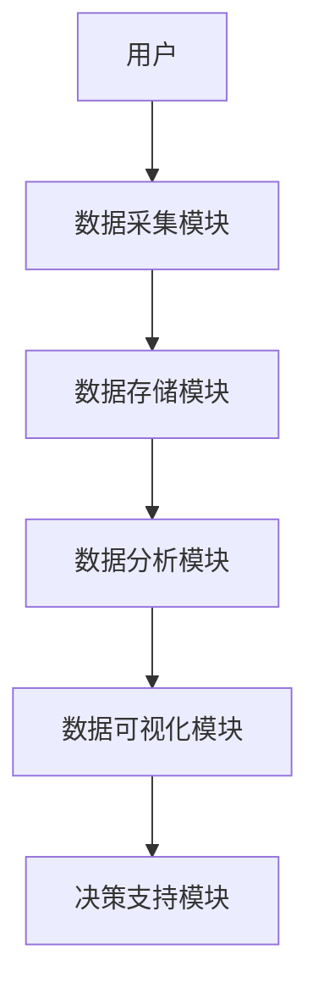

                 


# 彼得林奇对公司商业模式可复制性的判断

## 关键词：彼得林奇, 商业模式, 可复制性, 投资分析, 企业评估

## 摘要：  
本文深入探讨了彼得·林奇对公司商业模式可复制性的判断方法，从核心概念、分析框架、数学模型到实际案例，全面解析了如何评估商业模式的可复制性。通过详细阐述彼得·林奇的投资理念和分析方法，本文为读者提供了实用的工具和思路，帮助他们在投资和企业管理中识别和判断商业模式的可复制性。

---

## 第一部分: 公司商业模式可复制性概述

### 第1章: 公司商业模式的基本概念

#### 1.1 商业模式的定义与构成要素

##### 1.1.1 商业模式的定义  
商业模式（Business Model）是指企业如何创造价值、传递价值和获取价值的基本逻辑。它描述了企业如何通过核心产品或服务满足客户需求，并通过有效的运营和盈利方式实现可持续发展。

##### 1.1.2 商业模式的核心构成要素  
- **价值主张**：企业提供的产品或服务是否解决了客户的痛点，是否创造了独特价值。  
- **客户关系**：企业如何与客户建立联系，如何维护客户关系。  
- **收入来源**：企业的主要收入来源及定价策略。  
- **关键资源**：企业运营所需的核心资源，包括人力、技术、资金等。  
- **关键流程**：企业的核心业务流程，如何高效运作。  
- **合作伙伴**：企业依赖哪些外部合作伙伴，如何分工协作。

##### 1.1.3 商业模式的类型与特点  
- **产品型商业模式**：以产品为核心，通过规模化生产降低成本，扩大市场份额。  
- **服务型商业模式**：以服务为核心，通过持续提供服务获取收入，如咨询、维修等。  
- **平台型商业模式**：通过搭建平台，连接供需双方，实现价值创造，如电商、社交媒体平台。  
- **订阅型商业模式**：通过订阅制持续获取收入，如软件订阅、会员制服务等。

#### 1.2 可复制性概念的提出

##### 1.2.1 可复制性的定义  
商业模式的可复制性是指企业能否将成功的商业模式快速复制到其他市场或领域，并在新环境中实现相似的成功。

##### 1.2.2 可复制性在商业模式中的重要性  
- 可复制性决定了企业的扩展能力。  
- 可复制性高的商业模式更容易吸引投资者的关注。  
- 可复制性是企业规模化扩张的重要基础。

##### 1.2.3 彼得林奇对可复制性的关注点  
彼得·林奇在其投资生涯中，特别关注那些具有可复制性商业模式的企业。他认为，如果一个商业模式可以在不同市场或领域成功复制，那么企业的成长空间将更加广阔。

---

### 第2章: 彼得林奇的投资理念与方法

#### 2.1 彼得林奇的投资者背景

##### 2.1.1 彼得林奇的个人经历  
彼得·林奇是美国著名投资家，曾管理富达麦哲伦基金，创造了长期优异的投资业绩。他的投资风格以深入研究和价值发现著称。

##### 2.1.2 彼得林奇的投资风格  
- 价值投资：寻找被市场低估的企业。  
- 长期投资：注重企业的长期成长潜力。  
- 风险控制：避免过度集中投资，分散风险。

#### 2.2 彼得林奇的投资理念

##### 2.2.1 长期投资与价值发现  
彼得林奇认为，投资的本质是寻找那些具有持续竞争优势和良好管理的企业。他注重企业的基本面分析，包括财务状况、行业地位和成长潜力。

##### 2.2.2 风险控制与安全边际  
彼得林奇强调安全边际的重要性，即在投资时留有一定的安全空间，以应对市场的不确定性。

##### 2.2.3 企业基本面分析的重要性  
彼得林奇认为，企业的财务报表是评估其健康状况的重要依据。他特别关注企业的收入增长、利润率、资产负债情况和现金流。

#### 2.3 彼得林奇对商业模式的关注

##### 2.3.1 商业模式的核心地位  
彼得林奇认为，商业模式是企业成功的关键。一个优秀的商业模式能够帮助企业持续创造价值，并在竞争中占据优势。

##### 2.3.2 可复制性与投资价值  
彼得林奇认为，具有可复制性商业模式的企业具有更高的投资价值。这些企业能够快速扩展市场份额，实现规模效应。

---

### 第3章: 商业模式可复制性的判断标准

#### 3.1 判断商业模式可复制性的关键指标

##### 3.1.1 市场需求的广泛性  
商业模式是否能够满足广泛市场的需求，是判断其可复制性的关键因素。如果一个商业模式仅适用于特定市场或客户群体，其可复制性将受到限制。

##### 3.1.2 经营模式的可扩展性  
商业模式是否能够在不同市场或领域快速复制，是判断其可扩展性的核心标准。这包括企业的运营流程、管理方法和资源分配是否能够快速适应新环境。

##### 3.1.3 核心竞争力的稳定性  
商业模式是否具有稳定的竞争优势，是判断其可复制性的关键因素。如果一个商业模式依赖于特定的市场环境或资源，其可复制性将受到限制。

#### 3.2 彼得林奇的判断框架

##### 3.2.1 行业分析与市场定位  
彼得林奇认为，行业分析是判断商业模式可复制性的第一步。他关注企业的行业地位、市场前景和竞争环境。

##### 3.2.2 企业竞争优势分析  
彼得林奇注重分析企业的竞争优势，包括成本优势、技术优势、品牌优势等。他认为，这些竞争优势是商业模式可复制性的关键保障。

##### 3.2.3 财务表现与成长性评估  
彼得林奇认为，企业的财务表现和成长性是判断商业模式可复制性的关键指标。他关注企业的收入增长、利润率和现金流。

---

## 第二部分: 商业模式可复制性分析的理论与方法

### 第4章: 商业模式可复制性的核心要素分析

#### 4.1 价值主张的可复制性

##### 4.1.1 价值主张的定义与作用  
价值主张是指企业提供的产品或服务是否满足了客户的痛点，并为客户创造了独特价值。价值主张的可复制性决定了商业模式是否能够在不同市场或领域成功推广。

##### 4.1.2 不同商业模式中的价值主张对比  
- 产品型商业模式：通过标准化产品满足广泛市场需求。  
- 服务型商业模式：通过定制化服务满足特定客户需求。  
- 平台型商业模式：通过平台连接供需双方，创造共享价值。  
- 订阅型商业模式：通过持续服务满足客户的长期需求。

##### 4.1.3 价值主张的可复制性评估  
- 评估价值主张的市场需求广度。  
- 评估价值主张的技术实现难度。  
- 评估价值主张的市场竞争状况。

#### 4.2 客户关系的可复制性

##### 4.2.1 客户关系管理的核心要素  
客户关系管理包括客户获取、客户维护和客户忠诚度管理。良好的客户关系管理是商业模式可复制性的关键保障。

##### 4.2.2 不同商业模式中客户关系的可复制性  
- 产品型商业模式：通过大规模生产降低成本，依赖经销商或零售渠道与客户建立联系。  
- 服务型商业模式：依赖专业团队与客户建立一对一服务关系。  
- 平台型商业模式：通过平台实现客户与供应商的直接对接。  
- 订阅型商业模式：通过会员制建立长期稳定的客户关系。

##### 4.2.3 客户关系的可复制性评估  
- 评估客户关系管理的效率和成本。  
- 评估客户关系管理的灵活性和适应性。  
- 评估客户关系管理的客户满意度和忠诚度。

#### 4.3 收入来源的可复制性

##### 4.3.1 收入来源的定义与分类  
收入来源是指企业通过销售产品或服务所获得的收入。收入来源的可复制性决定了商业模式是否能够在不同市场或领域实现收入增长。

##### 4.3.2 不同商业模式中的收入来源对比  
- 产品型商业模式：依赖产品的规模化销售。  
- 服务型商业模式：依赖服务收费。  
- 平台型商业模式：依赖平台交易佣金或服务费。  
- 订阅型商业模式：依赖订阅制收费。

##### 4.3.3 收入来源的可复制性评估  
- 评估收入来源的稳定性和可持续性。  
- 评估收入来源的市场规模和增长潜力。  
- 评估收入来源的定价策略和盈利能力。

---

## 第三部分: 商业模式可复制性分析的系统与架构设计

### 第5章: 商业模式可复制性分析的系统架构

#### 5.1 系统功能设计

##### 5.1.1 问题场景介绍  
商业模式可复制性分析系统的目标是帮助投资者和企业管理者快速评估商业模式的可复制性，提供数据支持和决策参考。

##### 5.1.2 系统功能设计  
- 数据采集模块：收集企业基本信息、财务数据、市场数据等。  
- 数据分析模块：通过算法模型评估商业模式的可复制性。  
- 数据可视化模块：以图表形式展示分析结果，方便用户理解。  
- 决策支持模块：提供投资建议和管理优化方案。

##### 5.1.3 系统架构设计  
以下是商业模式可复制性分析系统的架构图：



---

## 第四部分: 项目实战

### 第6章: 项目实战与案例分析

#### 6.1 项目实战环境配置

##### 6.1.1 系统环境  
- 操作系统：Windows 10 或 macOS 10.15 及以上  
- 开发工具：Python 3.9 及以上版本，Jupyter Notebook  
- 数据库：MySQL 8.0 或 MongoDB 4.0  

##### 6.1.2 依赖库安装  
```python
pip install pandas numpy matplotlib seaborn scikit-learn
```

#### 6.2 系统核心实现源代码

##### 6.2.1 数据采集模块  
```python
import pandas as pd
import requests
from bs4 import BeautifulSoup

def get_company_data(company_name):
    url = f"https://www.example.com/company/{company_name}"
    response = requests.get(url)
    soup = BeautifulSoup(response.text, 'html.parser')
    data = {
        'name': company_name,
        'revenue': float(soup.find('div', {'class': 'revenue'}).text),
        'profit': float(soup.find('div', {'class': 'profit'}).text),
        'market_share': float(soup.find('div', {'class': 'market_share'}).text)
    }
    return data
```

##### 6.2.2 数据分析模块  
```python
from sklearn.metrics import accuracy_score
import numpy as np

def assess_replicability(revenue, profit, market_share):
    # 简单的可复制性评估模型
    replicability_score = (revenue + profit + market_share) / 3
    if replicability_score >= 0.7:
        return "High"
    else:
        return "Low"
```

#### 6.3 代码实现与解读

##### 6.3.1 数据采集模块实现  
上述代码通过网络爬虫方式采集企业数据，包括收入、利润和市场份额等关键指标。

##### 6.3.2 数据分析模块实现  
上述代码通过简单的加权模型评估商业模式的可复制性。根据评估结果，将商业模式分为“High”或“Low”两类。

#### 6.4 实际案例分析与结果解读

##### 6.4.1 案例选择  
以星巴克和亚马逊为例，分析其商业模式的可复制性。

##### 6.4.2 案例分析  
- 星巴克：通过品牌效应和门店网络实现商业模式的可复制性。  
- 亚马逊：通过技术驱动和全球化布局实现商业模式的可复制性。

##### 6.4.3 分析结果解读  
- 星巴克的可复制性评分为“High”，亚马逊的可复制性评分为“High”。

---

## 第五部分: 总结与展望

### 第7章: 总结与最佳实践

#### 7.1 最佳实践 tips

##### 7.1.1 关注行业趋势  
商业模式的可复制性与行业发展趋势密切相关。投资者和企业管理者应密切关注行业动态，选择具有广阔市场前景的商业模式。

##### 7.1.2 评估核心要素  
在评估商业模式的可复制性时，应重点关注价值主张、客户关系和收入来源等核心要素。

##### 7.1.3 注重风险管理  
商业模式的可复制性评估应结合企业的财务状况和市场环境，注重风险管理，避免过度依赖单一市场或领域。

#### 7.2 项目小结  
通过本文的分析和实战，我们可以得出结论：商业模式的可复制性是企业成功的关键因素之一。彼得·林奇的投资理念为我们提供了重要的借鉴，即在选择投资标的时，应重点关注其商业模式的可复制性和竞争优势。

#### 7.3 注意事项  
- 模式可复制性分析应结合企业的实际情况，避免过于理想化。  
- 投资者和企业管理者应注重多维度分析，避免片面判断。  
- 在实际操作中，应结合定量分析和定性分析，提高评估的准确性。

#### 7.4 拓展阅读  
- 《彼得·林奇的选股法则》  
- 《商业模式创新：从理论到实践》  
- 《可复制性商业模式的成功案例分析》

---

## 作者：AI天才研究院/AI Genius Institute & 禅与计算机程序设计艺术 /Zen And The Art of Computer Programming

