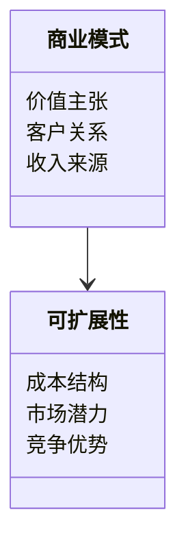
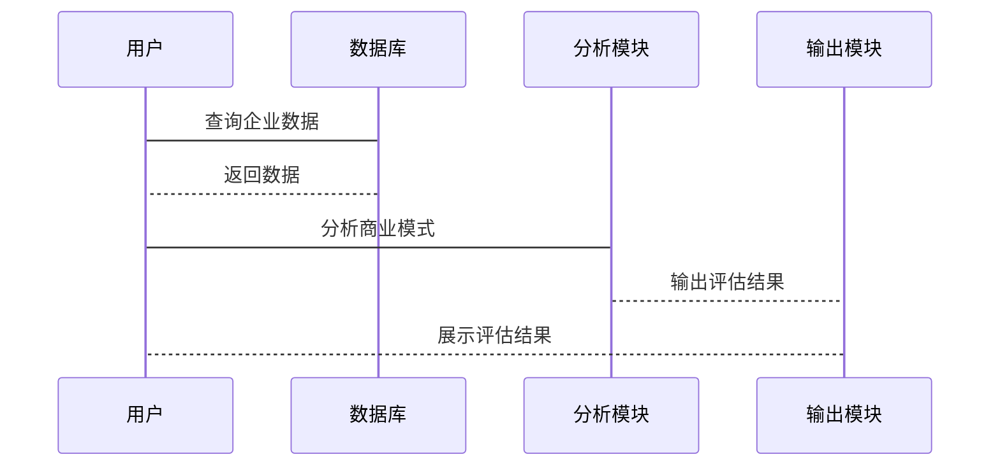

                 


# 彼得林奇对公司商业模式可扩展性的判断

## 关键词：商业模式、可扩展性、彼得林奇、投资分析、企业价值、财务分析

## 摘要：  
本文通过分析彼得·林奇的投资理念，深入探讨如何判断公司商业模式的可扩展性。文章从商业模式的核心要素、可扩展性的关键特征、彼得·林奇的判断标准等方面展开，结合实际案例和数学模型，详细阐述如何通过商业模式的可扩展性来评估公司的投资价值。本文旨在为投资者提供一套科学的分析框架，帮助他们更好地识别具有长期增长潜力的企业。

---

## 第1章：商业模式与可扩展性基础

### 1.1 商业模式的定义与构成要素

#### 1.1.1 商业模式的核心概念  
商业模式（Business Model）是企业创造和传递价值的方式，包括企业如何获取资源、创造价值以及获取收益的过程。一个成功的商业模式需要能够清晰地回答以下问题：  
- 我们为谁创造价值？  
- 我们如何创造价值？  
- 我们如何获得回报？

#### 1.1.2 商业模式的三要素  
- **价值主张**：企业提供的产品或服务是否解决了客户的核心问题，是否创造了独特的价值。  
- **客户关系**：企业与客户之间的关系是否稳定且可持续，客户是否愿意为企业的价值付费。  
- **收入来源**：企业的收入模式是否清晰且可扩展，能否随着业务增长而持续增长。

#### 1.1.3 可扩展性的定义与特征  
可扩展性是指商业模式在不显著增加成本的情况下，能够实现收入和利润持续增长的能力。一个可扩展的商业模式通常具有以下特征：  
- 成本结构的杠杆效应：固定成本低，边际成本低。  
- 市场覆盖的广度：能够覆盖更广泛的客户群体。  
- 创新能力：能够不断优化产品或服务，适应市场变化。

### 1.2 彼得·林奇的背景与投资理念

#### 1.2.1 彼得·林奇的投资者身份与风格  
彼得·林奇是美国著名的投资经理人，曾管理富达麦哲伦基金，创造了年化13%的超额收益。他以深入研究企业商业模式、关注公司基本面著称，被誉为“股神”巴菲特之后最成功的基金经理之一。

#### 1.2.2 林奇对商业模式的关注点  
林奇认为，企业的商业模式是决定其长期增长潜力的关键因素。他特别关注以下几点：  
- 企业的收入来源是否稳定且可扩展。  
- 企业的成本结构是否具有杠杆效应。  
- 企业的竞争优势是否能够长期维持。

#### 1.2.3 林奇的投资哲学与可扩展性判断  
林奇的投资哲学可以总结为：**买入优秀企业的股票，而不是市场的波动**。他强调通过深入分析企业的商业模式，判断其是否具有可扩展性，从而找到那些能够持续增长的企业。

### 1.3 可扩展性判断的重要性

#### 1.3.1 为什么可扩展性是投资的关键  
可扩展性决定了企业是否能够在不显著增加成本的情况下实现收入和利润的增长。对于投资者来说，可扩展性意味着企业具有持续增长的潜力，能够为股东创造长期价值。

#### 1.3.2 可扩展性与公司成长性的关系  
可扩展性是公司成长性的核心驱动力。一个具有可扩展性的商业模式能够帮助企业在不增加过多成本的情况下实现规模扩张，从而推动公司持续成长。

#### 1.3.3 如何通过可扩展性判断潜在投资机会  
通过分析企业的商业模式，判断其是否具有可扩展性，可以帮助投资者筛选出那些具有长期增长潜力的企业。

---

## 第2章：商业模式的核心要素与可扩展性

### 2.1 商业模式的核心要素分析

#### 2.1.1 价值主张的创新性  
价值主张是商业模式的核心，创新性的价值主张能够为客户创造独特的价值，从而建立竞争优势。

#### 2.1.2 客户关系的稳定性  
稳定的客户关系是商业模式可持续发展的基础。企业需要通过有效的客户关系管理，确保客户愿意长期为企业的价值付费。

#### 2.1.3 收入来源的可持续性  
收入来源是商业模式的核心，可持续的收入来源能够确保企业长期的财务健康。例如，订阅模式的收入来源具有较高的可扩展性。

### 2.2 可扩展性的关键特征

#### 2.2.1 成本结构的优化  
成本结构的优化是商业模式可扩展性的关键。通过降低固定成本和边际成本，企业可以在不显著增加成本的情况下实现收入增长。

#### 2.2.2 资源的可扩展性  
资源的可扩展性是指企业能否在不显著增加资源投入的情况下实现业务增长。例如，软件企业的边际成本接近于零，具有很强的资源可扩展性。

#### 2.2.3 市场的可扩展性  
市场的可扩展性是指企业能否在更广泛的市场中推广其产品或服务。一个具有广泛市场潜力的商业模式更容易实现规模扩张。

### 2.3 商业模式可扩展性分析的逻辑框架

#### 2.3.1 从客户价值到收入来源的逻辑链条  
商业模式的可扩展性分析需要从客户价值出发，分析企业的收入来源是否能够随着客户价值的创造而持续增长。

#### 2.3.2 模式可扩展性与公司规模的关系  
模式可扩展性与公司规模密切相关。一个可扩展的商业模式能够帮助企业在不显著增加成本的情况下实现规模扩张。

#### 2.3.3 模式可扩展性的边界与外延  
模式可扩展性的边界是指企业在现有资源和能力下能够实现的最大规模。外延则是指企业通过扩展资源和能力进一步扩大规模的潜力。

---

## 第3章：彼得·林奇的可扩展性判断方法

### 3.1 林奇的商业模式分析框架

#### 3.1.1 林奇的“三张报表”分析法  
林奇通过分析企业的收入表、利润表和资产负债表，判断企业的财务健康状况和盈利能力。他特别关注企业的收入增长是否具有可扩展性。

#### 3.1.2 林奇的“护城河”概念与可扩展性  
林奇认为，企业是否具有竞争优势（护城河）是判断其商业模式可扩展性的关键。一个具有强大竞争优势的企业更容易实现长期增长。

#### 3.1.3 林奇的“竞争优势”评估法  
林奇通过分析企业的竞争优势，判断其商业模式是否具有可扩展性。他特别关注企业的成本优势、技术优势和市场优势。

### 3.2 林奇的可扩展性判断标准

#### 3.2.1 收入增长的持续性  
林奇认为，企业的收入增长是否具有持续性是判断其商业模式可扩展性的关键。他特别关注企业的收入来源是否能够随着业务增长而持续增长。

#### 3.2.2 利润率的稳定性  
利润率的稳定性是判断企业财务健康状况的重要指标。一个具有稳定利润率的企业更容易实现长期增长。

#### 3.2.3 市场份额的可扩展性  
林奇认为，企业的市场份额是否具有可扩展性是判断其商业模式潜力的重要因素。一个能够扩大市场份额的企业更容易实现规模扩张。

### 3.3 林奇的案例分析方法

#### 3.3.1 通过案例分析理解可扩展性  
林奇通过分析具体案例，帮助企业理解商业模式可扩展性的核心要素。例如，他通过分析可口可乐的商业模式，指出其具有强大的可扩展性。

#### 3.3.2 林奇的经典投资案例解析  
林奇通过分析富达麦哲伦基金的投资案例，展示了如何通过商业模式可扩展性判断企业的投资价值。

#### 3.3.3 如何从案例中提炼可扩展性判断标准  
林奇通过分析案例，总结出一套可扩展性判断标准，帮助投资者更好地识别具有长期增长潜力的企业。

---

## 第4章：商业模式可扩展性评估的数学模型

### 4.1 商业模式可扩展性评估的数学模型

#### 4.1.1 评估模型的构建  
商业模式可扩展性评估模型需要综合考虑企业的收入增长、成本结构、市场份额等因素，构建一个加权评分系统。

#### 4.1.2 模型的数学公式  
$$ \text{可扩展性评分} = \sum_{i=1}^{n} w_i \times s_i $$  
其中，\( w_i \) 是第 \( i \) 个因素的权重，\( s_i \) 是第 \( i \) 个因素的评分。

#### 4.1.3 模型的应用与解读  
通过加权评分系统，投资者可以量化评估企业的商业模式可扩展性，从而做出更科学的投资决策。

---

## 第5章：系统分析与架构设计方案

### 5.1 系统功能设计

#### 5.1.1 领域模型（Mermaid 类图）  


#### 5.1.2 系统架构设计（Mermaid 架构图）  
```mermaid
container 商业模式分析系统 {
    participant 用户
    participant 数据库
    participant 分析模块
    participant 输出模块
}
```

#### 5.1.3 系统交互设计（Mermaid 序列图）  


---

## 第6章：项目实战

### 6.1 环境安装与核心实现

#### 6.1.1 环境安装  
需要安装 Python 和相关库（如 pandas、numpy），以及 Mermaid 图表工具。

#### 6.1.2 核心实现代码  
```python
import pandas as pd
import numpy as np

def calculate_expandability_score(company_data):
    # 计算可扩展性评分
    weights = {'收入增长': 0.4, '成本结构': 0.3, '市场份额': 0.3}
    scores = {'收入增长': company_data['收入增长'], 
              '成本结构': company_data['成本结构'], 
              '市场份额': company_data['市场份额']}
    total_score = 0
    for key in weights:
        total_score += weights[key] * scores[key]
    return total_score

# 示例数据
company_data = {
    '收入增长': 0.8,
    '成本结构': 0.7,
    '市场份额': 0.6
}

score = calculate_expandability_score(company_data)
print(f"可扩展性评分为：{score}")
```

#### 6.1.3 代码应用解读与分析  
通过上述代码，我们可以量化评估企业的商业模式可扩展性，从而为投资者提供科学的投资决策依据。

---

## 第7章：最佳实践与小结

### 7.1 最佳实践 tips

#### 7.1.1 关注企业的收入来源  
收入来源是商业模式的核心，具有可持续性和可扩展性的收入来源是企业长期增长的关键。

#### 7.1.2 分析企业的成本结构  
成本结构的优化是商业模式可扩展性的关键。具有杠杆效应的成本结构能够帮助企业在不显著增加成本的情况下实现收入增长。

#### 7.1.3 评估企业的竞争优势  
竞争优势是判断商业模式可扩展性的关键因素。具有强大竞争优势的企业更容易实现长期增长。

### 7.2 小结

通过分析彼得·林奇的投资理念，我们能够更好地理解如何判断公司商业模式的可扩展性。商业模式的可扩展性是企业长期增长的核心驱动力，投资者需要通过深入分析企业的商业模式，判断其是否具有可扩展性，从而做出更科学的投资决策。

### 7.3 注意事项

- 在分析商业模式时，需要结合企业的实际情况，避免过于理论化。  
- 需要持续关注企业的财务数据和市场变化，及时调整评估标准。  
- 在实际投资中，需要结合多种因素进行综合判断，避免单一指标误导决策。

### 7.4 拓展阅读

- 彼得·林奇的《投资最重要的事情》  
- 《商业模式画布》  
- 《可扩展性商业模式的构建与优化》

---

## 作者：AI天才研究院/AI Genius Institute & 禅与计算机程序设计艺术 /Zen And The Art of Computer Programming

