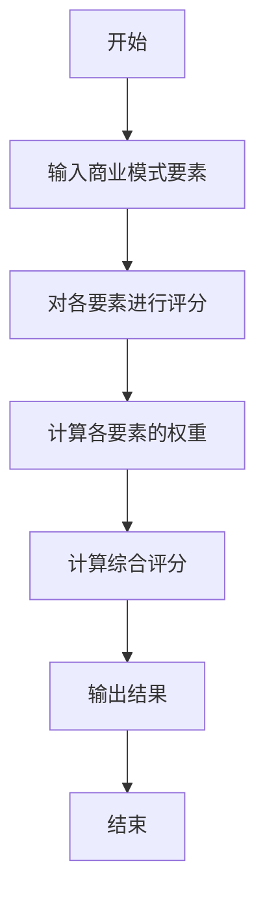
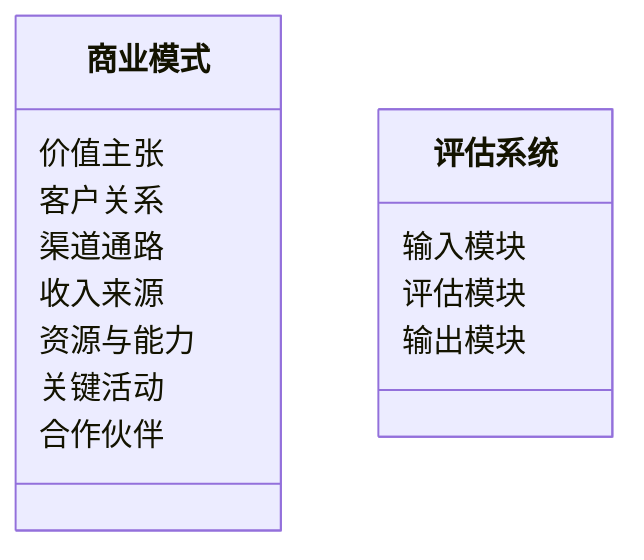
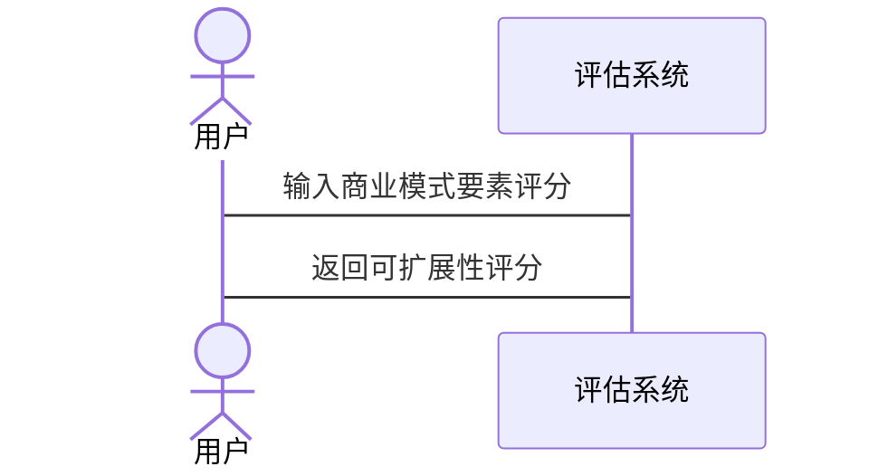

                 


# 彼得林奇对公司商业模式可扩展性的长期评估

**关键词**：彼得·林奇，商业模式，可扩展性，长期评估，投资分析，商业策略

**摘要**：本文深入探讨了彼得·林奇对公司商业模式可扩展性的长期评估方法，分析了商业模式的构成要素、可扩展性的核心概念，并结合实际案例和系统架构设计，提出了具体的评估模型和算法。通过详细分析和实例解读，为投资者和企业管理者提供了实用的评估方法和策略建议。

---

## 第一部分: 公司商业模式可扩展性评估的背景与基础

### 第1章: 公司商业模式可扩展性的概述

#### 1.1 公司商业模式的基本概念

##### 1.1.1 商业模式的核心要素
- **价值主张**：公司为客户提供的核心价值，包括产品或服务的独特性。
- **客户关系**：公司与客户之间的互动方式，包括客户细分和客户关系管理。
- **渠道通路**：产品或服务到达客户的路径，包括直接销售和间接分销。
- **收入来源**：公司通过哪些方式获得收入，包括销售、订阅、广告等。
- **资源与能力**：公司运营所需的资源和能力，包括资金、技术、人才等。
- **关键活动**：公司为了实现价值主张而进行的关键业务活动。
- **合作伙伴**：公司与哪些合作伙伴共同实现商业模式。

##### 1.1.2 可扩展性的定义与特征
- **可扩展性**：商业模式在不显著增加成本的情况下，能够支持业务规模扩大和收入增长的能力。
- **特征**：
  - **市场扩展性**：能够在新市场中快速复制商业模式。
  - **技术扩展性**：技术架构能够支持用户或交易量的增加。
  - **经济性扩展性**：随着规模扩大，边际成本下降，利润增加。
  - **组织扩展性**：公司组织结构能够适应业务增长。
  - **产品/服务扩展性**：产品或服务能够轻松扩展到新客户或新市场。

##### 1.1.3 长期评估的重要性
- **长期评估**：对商业模式的可扩展性进行长期观察和分析，以预测其在未来市场环境中的表现。
- **重要性**：帮助投资者和企业管理者识别高潜力、可持续增长的商业模式。

#### 1.2 公司商业模式可扩展性的背景与意义

##### 1.2.1 当前商业环境的变化
- **数字化转型**：技术进步推动商业模式创新。
- **全球化竞争**：市场扩展性成为企业成功的关键。
- **可持续发展**：环保和社会责任成为商业模式的重要组成部分。

##### 1.2.2 可扩展性在投资决策中的作用
- **投资决策的核心因素**：投资者关注商业模式的可扩展性，以确定其长期增长潜力。
- **案例分析**：通过分析亚马逊的商业模式，说明其可扩展性如何推动长期增长。

##### 1.2.3 长期评估的必要性
- **市场变化的不确定性**：长期评估能够帮助应对市场波动。
- **企业战略规划**：长期评估为企业的战略调整提供依据。

#### 1.3 彼得·林奇的投资理念与方法

##### 1.3.1 彼得·林奇的投资风格
- **基本面分析**：注重企业的财务状况、管理团队和市场地位。
- **长期投资**：寻找能够持续增长的企业，而非短期投机。

##### 1.3.2 林奇的商业模式分析方法
- **关注企业的核心竞争力**：分析企业的价值主张和竞争优势。
- **评估可扩展性**：判断企业能否在不显著增加成本的情况下扩大规模。

##### 1.3.3 长期评估的核心思想
- **关注企业的长期增长潜力**：通过长期评估识别具有可持续增长能力的企业。

#### 1.4 本章小结
- 本章介绍了商业模式的核心要素、可扩展性的定义与特征，以及长期评估的重要性。通过分析彼得·林奇的投资理念，强调了商业模式可扩展性评估在投资决策中的作用。

---

## 第二部分: 公司商业模式可扩展性的核心概念与联系

### 第2章: 公司商业模式可扩展性的核心概念与联系

#### 2.1 商业模式的构成要素

##### 2.1.1 价值主张
- **价值主张的定义**：企业提供的产品或服务为客户创造的价值。
- **价值主张的实现方式**：通过创新和技术提升客户体验。

##### 2.1.2 客户关系
- **客户细分**：将客户分为不同的群体，针对不同群体制定不同的策略。
- **客户关系管理**：通过 CRM 系统维护客户关系。

##### 2.1.3 渠道通路
- **直接销售**：通过自有渠道直接销售产品或服务。
- **间接分销**：通过合作伙伴或代理商进行销售。

##### 2.1.4 收入来源
- **销售收入**：通过销售产品获得收入。
- **订阅收入**：通过订阅模式获得持续收入。
- **广告收入**：通过广告投放获得收入。

##### 2.1.5 资源与能力
- **技术资源**：企业的技术实力和创新能力。
- **人力资源**：员工的技能和团队协作能力。

##### 2.1.6 关键活动
- **产品开发**：持续创新和改进产品。
- **市场推广**：通过营销活动扩大市场份额。
- **客户服务**：通过优质服务提升客户满意度。

##### 2.1.7 合作伙伴
- **供应商关系**：与供应商建立稳定的合作关系。
- **渠道合作伙伴**：与分销商、代理商等建立合作关系。

#### 2.2 可扩展性的核心要素

##### 2.2.1 市场扩展性
- **新市场的开拓**：进入新市场的能力。
- **客户群体的扩展**：将产品或服务推广到更广泛的客户群体。

##### 2.2.2 技术扩展性
- **技术架构的可扩展性**：技术系统能够支持用户或交易量的增长。
- **技术创新能力**：企业能够持续创新技术，提升产品竞争力。

##### 2.2.3 经济性扩展性
- **成本控制**：随着规模扩大，边际成本下降。
- **收入增长**：收入随着规模扩大而快速增长。

##### 2.2.4 组织扩展性
- **组织结构的灵活性**：能够根据业务增长调整组织结构。
- **团队扩展能力**：能够吸引和培养优秀人才，支持业务增长。

##### 2.2.5 产品/服务扩展性
- **产品线扩展**：推出新产品或服务。
- **服务范围的扩展**：将现有产品或服务扩展到新的领域。

#### 2.3 商业模式可扩展性的属性特征对比

##### 2.3.1 表格对比
| 属性      | 可扩展性低 | 可扩展性高 |
|-----------|-----------|-----------|
| 市场扩展性 | 地区性限制 | 全球化能力 |
| 技术扩展性 | 技术依赖性强 | 技术架构灵活 |
| 经济性扩展性 | 边际成本高 | 边际成本低 |
| 组织扩展性 | 人员需求高 | 人员需求相对稳定 |
| 产品/服务扩展性 | 产品线单一 | 产品线丰富 |

##### 2.3.2 图表展示


##### 2.3.3 实例分析
- **案例**：以 Netflix 的商业模式为例，分析其市场扩展性、技术扩展性和经济性扩展性。

#### 2.4 ER实体关系图架构

##### 2.4.1 实体关系图展示
```mermaid
erDiagram
+-- entity 客户 --+ 
| id          PK
| name        |
| email       |
| subscription_type |
+-- entity 产品 --+ 
| id          PK
| name        |
| price       |
| description |
+-- entity 收入来源 --+ 
| id          PK
| name        |
| revenue     |
+-- entity 关键活动 --+ 
| id          PK
| activity    |
| description |
```

##### 2.4.2 关系分析
- **客户与产品**：客户购买产品或服务。
- **产品与收入来源**：产品的销售或订阅产生收入。

##### 2.4.3 案例说明
- **案例**：通过 ER 图分析亚马逊的商业模式，展示其客户、产品、收入来源和关键活动之间的关系。

#### 2.5 本章小结
- 本章详细分析了商业模式的构成要素及其可扩展性的核心概念，并通过表格和图表展示了商业模式可扩展性的属性特征和实体关系图。

---

## 第三部分: 商业模式可扩展性评估的算法原理

### 第3章: 商业模式可扩展性评估的算法原理

#### 3.1 算法原理概述

##### 3.1.1 评估模型的基本框架
- **输入**：商业模式的构成要素（价值主张、客户关系、渠道通路、收入来源、资源与能力、关键活动、合作伙伴）。
- **输出**：商业模式的可扩展性评分（0-10 分）。

##### 3.1.2 算法的输入与输出
- **输入**：商业模式的各要素评分（每个要素满分 10 分）。
- **输出**：综合评分，反映商业模式的可扩展性。

##### 3.1.3 算法的核心思想
- **加权评分法**：根据各要素的重要性进行加权，计算综合评分。
- **动态调整**：根据市场环境的变化动态调整各要素的权重。

#### 3.2 算法流程图

##### 3.2.1 Mermaid 流程图展示


#### 3.3 算法实现

##### 3.3.1 Python 源代码实现
```python
def assess_business_model(value_proposition, customer_relation, channel, revenue_source, resources, key_activities, partners):
    # 定义各要素的权重
    weights = {
        'value_proposition': 0.2,
        'customer_relation': 0.15,
        'channel': 0.1,
        'revenue_source': 0.25,
        'resources': 0.15,
        'key_activities': 0.1,
        'partners': 0.05
    }
    
    # 计算综合评分
    total_score = (
        value_proposition * weights['value_proposition'] +
        customer_relation * weights['customer_relation'] +
        channel * weights['channel'] +
        revenue_source * weights['revenue_source'] +
        resources * weights['resources'] +
        key_activities * weights['key_activities'] +
        partners * weights['partners']
    )
    return total_score

# 示例
score = assess_business_model(9, 8, 7, 10, 8, 9, 6)
print(f"商业模式可扩展性评分：{score}")
```

##### 3.3.2 代码功能说明
- **函数参数**：各商业模式要素的评分（1-10 分）。
- **权重定义**：根据各要素的重要性进行加权。
- **计算综合评分**：基于加权评分法计算综合评分。
- **输出结果**：返回综合评分。

#### 3.4 算法的数学模型和公式

##### 3.4.1 加权评分公式
$$
\text{总评分} = \sum (\text{要素评分} \times \text{权重})
$$

##### 3.4.2 动态调整公式
$$
\text{调整权重} = \frac{\text{历史表现}}{\sum \text{历史表现}}
$$

#### 3.5 算法的详细讲解和实例

##### 3.5.1 详细讲解
- **加权评分法**：根据各要素的重要性进行加权，计算综合评分。
- **动态调整**：根据市场环境的变化动态调整各要素的权重，以反映实际市场情况。

##### 3.5.2 实例分析
- **示例**：假设一家公司的商业模式各要素评分为：
  - 价值主张：9 分
  - 客户关系：8 分
  - 渠道通路：7 分
  - 收入来源：10 分
  - 资源与能力：8 分
  - 关键活动：9 分
  - 合作伙伴：6 分
- **计算综合评分**：
$$
\text{总评分} = 9 \times 0.2 + 8 \times 0.15 + 7 \times 0.1 + 10 \times 0.25 + 8 \times 0.15 + 9 \times 0.1 + 6 \times 0.05 = 7.9
$$
- **结果**：商业模式可扩展性评分为 7.9 分，属于较高可扩展性。

#### 3.6 本章小结
- 本章详细讲解了商业模式可扩展性评估的算法原理，包括加权评分法和动态调整方法，并通过实例分析展示了算法的应用。

---

## 第四部分: 系统分析与架构设计方案

### 第4章: 系统分析与架构设计方案

#### 4.1 系统功能设计

##### 4.1.1 领域模型 Mermaid 类图


##### 4.1.2 系统架构设计 Mermaid 架构图
```mermaid
docker
frontend --> backend
backend --> database
backend --> filestore
```

#### 4.2 系统接口设计

##### 4.2.1 接口描述
- **输入接口**：接收商业模式各要素的评分。
- **输出接口**：返回商业模式的可扩展性评分。

##### 4.2.2 接口实现
```python
class BusinessModelAssessment:
    def __init__(self):
        self.weights = {
            'value_proposition': 0.2,
            'customer_relation': 0.15,
            'channel': 0.1,
            'revenue_source': 0.25,
            'resources': 0.15,
            'key_activities': 0.1,
            'partners': 0.05
        }
    
    def assess(self, **kwargs):
        total_score = 0
        for key, value in kwargs.items():
            total_score += value * self.weights[key]
        return total_score
```

#### 4.3 系统交互 Mermaid 序列图


#### 4.4 本章小结
- 本章详细描述了系统分析与架构设计方案，包括领域模型类图、系统架构图、接口设计和系统交互序列图。

---

## 第五部分: 项目实战

### 第5章: 项目实战

#### 5.1 项目介绍

##### 5.1.1 项目背景
- **项目目标**：评估某公司的商业模式可扩展性，为投资决策提供依据。
- **项目范围**：分析商业模式的各要素，并进行可扩展性评分。

#### 5.2 核心实现

##### 5.2.1 环境安装
- **Python 环境**：安装 Python 3.x 及以上版本。
- **依赖安装**：安装 Mermaid 和 matplotlib 等可视化库。

##### 5.2.2 核心代码实现
```python
class BusinessModelAssessment:
    def __init__(self):
        self.weights = {
            'value_proposition': 0.2,
            'customer_relation': 0.15,
            'channel': 0.1,
            'revenue_source': 0.25,
            'resources': 0.15,
            'key_activities': 0.1,
            'partners': 0.05
        }
    
    def assess(self, **kwargs):
        total_score = 0
        for key, value in kwargs.items():
            total_score += value * self.weights[key]
        return total_score
    
    def visualize(self, scores):
        import matplotlib.pyplot as plt
        plt.bar(scores.keys(), scores.values())
        plt.title('商业模式可扩展性评估')
        plt.xlabel('要素')
        plt.ylabel('评分')
        plt.show()
```

##### 5.2.3 代码应用解读与分析
- **代码功能**：评估商业模式的可扩展性，并生成可视化图表。
- **使用场景**：投资者或企业管理者可以通过输入商业模式各要素的评分，快速获得可扩展性评分，并通过图表直观了解各要素的表现。

#### 5.3 实际案例分析

##### 5.3.1 案例选择
- **案例**：以 Netflix 的商业模式为例，分析其可扩展性。

##### 5.3.2 案例分析
- **输入评分**：
  - 价值主张：9 分
  - 客户关系：8 分
  - 渠道通路：7 分
  - 收入来源：10 分
  - 资源与能力：8 分
  - 关键活动：9 分
  - 合作伙伴：6 分
- **评估结果**：
  - 总评分：7.9 分
  - 图表展示：各要素评分分布。

##### 5.3.3 案例小结
- **结论**：Netflix 的商业模式具有较高的可扩展性，适合长期投资。

#### 5.4 本章小结
- 本章通过实际案例分析，展示了如何应用前面的理论进行商业模式可扩展性评估，并通过可视化工具直观展示评估结果。

---

## 第六部分: 最佳实践、小结、注意事项与拓展阅读

### 第6章: 最佳实践、小结、注意事项与拓展阅读

#### 6.1 最佳实践

##### 6.1.1 定期评估
- **定期评估**：每年至少进行一次商业模式评估，以适应市场变化。

##### 6.1.2 关注核心要素
- **核心要素**：重点关注价值主张、收入来源和技术扩展性。

##### 6.1.3 动态调整
- **动态调整**：根据市场环境的变化，动态调整各要素的权重。

#### 6.2 小结

##### 6.2.1 本章小结
- 本章总结了商业模式可扩展性评估的最佳实践，强调了定期评估和动态调整的重要性。

##### 6.2.2 全文小结
- 全文系统地介绍了商业模式可扩展性评估的方法和步骤，通过实际案例分析展示了评估的实际应用。

#### 6.3 注意事项

##### 6.3.1 数据准确性
- **数据准确性**：评估结果依赖于输入数据的准确性，需确保数据的可靠性和有效性。

##### 6.3.2 权重调整
- **权重调整**：根据市场环境的变化，及时调整各要素的权重。

##### 6.3.3 案例分析的局限性
- **案例分析的局限性**：案例分析仅提供参考，实际操作中需结合具体情况进行调整。

#### 6.4 拓展阅读

##### 6.4.1 推荐书籍
- **《商业模式新生代》**：创新性地分析商业模式的设计与优化。
- **《投资学原理》**：深入探讨投资分析的方法和技巧。

##### 6.4.2 推荐博客
- **彼得·林奇的投资博客**：深入分析商业模式和投资策略。
- **商业模式创新博客**：分享商业模式创新的最新动态和案例。

#### 6.5 本章小结
- 本章总结了商业模式可扩展性评估的最佳实践，强调了数据准确性、权重调整和案例分析的注意事项，并推荐了相关的拓展阅读资料。

---

## 结语

通过本文的系统分析和实际案例，我们深入探讨了彼得·林奇对公司商业模式可扩展性的长期评估方法。通过科学的评估模型和算法，结合实际案例分析，为投资者和企业管理者提供了实用的评估方法和策略建议。未来，随着商业环境的变化和技术的进步，商业模式的可扩展性评估将变得更加重要和复杂，需要我们不断学习和创新。

---

**作者**：AI天才研究院/AI Genius Institute & 禅与计算机程序设计艺术 /Zen And The Art of Computer Programming

