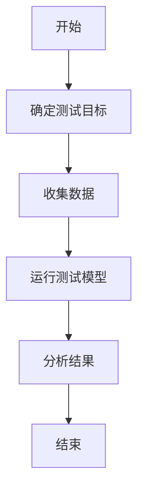

                 

# 彼得林奇对公司商业模式适应性的压力测试方法

> 关键词：彼得林奇、商业模式、压力测试、适应性、投资分析

> 摘要：本文通过分析彼得林奇的投资方法，探讨如何对公司商业模式进行适应性压力测试。结合数学模型和实际案例，详细讲解压力测试的实施步骤和应用场景，帮助投资者和企业管理者更好地评估商业模式的稳健性。

---

## 第1章: 公司商业模式与压力测试概述

### 1.1 公司商业模式的定义与重要性
#### 1.1.1 公司商业模式的核心概念
公司商业模式是企业获取、创造和传递价值的基本逻辑，包括价值主张、客户关系、渠道、资源和流程等关键要素。良好的商业模式能够确保企业在竞争激烈的市场中持续盈利。

#### 1.1.2 商业模式对企业价值的影响
商业模式直接决定企业的市场地位、收入来源和成本结构。一个适应性强的商业模式能够在市场变化中快速调整，为企业创造更大的价值。

#### 1.1.3 压力测试的定义与作用
压力测试是一种通过模拟极端市场条件，评估企业商业模式在不利环境下的表现和适应能力。其作用在于发现商业模式中的潜在风险，并提出改进方案。

---

### 1.2 压力测试的背景与意义
#### 1.2.1 压力测试的起源与发展
压力测试起源于金融领域，用于评估金融机构在极端市场条件下的稳健性。随着企业面临的外部环境日益复杂，压力测试逐渐扩展到商业模式分析领域。

#### 1.2.2 商业模式适应性压力测试的必要性
在经济波动、技术变革和市场竞争加剧的情况下，企业需要对其商业模式进行压力测试，以确保其在极端情况下的可持续性。

#### 1.2.3 彼得林奇投资方法的启示
彼得林奇以其独特的投资方法闻名，他注重分析企业的商业模式和财务状况。通过压力测试，投资者可以更好地评估企业的抗风险能力。

---

## 第2章: 商业模式适应性压力测试的核心概念

### 2.1 商业模式适应性压力测试的理论基础
#### 2.1.1 商业模式的构成要素
- 价值主张：企业为客户提供的核心价值。
- 客户关系：企业与客户之间的互动方式。
- 渠道：企业传递价值的主要途径。
- 资源：企业运营所需的核心资源。
- 流程：企业的关键业务流程。

#### 2.1.2 压力测试的维度与指标
- 财务指标：收入、利润、成本等。
- 市场指标：市场份额、客户流失率。
- 运营指标：供应链稳定性、生产效率。

#### 2.1.3 适应性压力测试的框架
适应性压力测试框架包括测试目标、测试场景设计、数据收集、模型运行和结果分析五个步骤。

---

### 2.2 商业模式适应性压力测试的数学模型
#### 2.2.1 商业模式适应性评分公式
$$ S = \sum_{i=1}^{n} w_i \cdot f_i $$
其中，$S$ 是商业模式适应性评分，$w_i$ 是第 $i$ 个因素的权重，$f_i$ 是第 $i$ 个因素的评分。

#### 2.2.2 适应性压力测试的流程图

---

## 第3章: 彼得林奇的商业模式分析方法

### 3.1 彼得林奇的商业模式分析框架
#### 3.1.1 五力分析模型
五力分析模型（波特五力模型）包括行业竞争结构、潜在进入者威胁、替代品威胁、供应商议价能力和客户议价能力。

#### 3.1.2 商业模式画布
商业模式画布（Business Model Canvas）包括关键合作伙伴、关键活动、价值主张、客户关系、渠道、成本结构和收入来源。

#### 3.1.3 企业生命周期理论
企业生命周期理论将企业分为导入期、成长期、成熟期和衰退期，不同阶段的企业商业模式需要不同的压力测试方法。

---

### 3.2 彼得林奇压力测试方法的具体步骤
#### 3.2.1 识别关键业务假设
通过分析企业的商业模式，识别其关键假设，例如客户需求、成本结构和收入来源。

#### 3.2.2 设计压力测试场景
根据市场环境设计多种极端场景，例如经济衰退、市场需求骤减或技术突变。

#### 3.2.3 评估商业模式的弹性
通过模拟不同场景下的企业表现，评估商业模式的弹性和抗风险能力。

---

## 第4章: 商业模式适应性压力测试的实施方法

### 4.1 压力测试的实施步骤
#### 4.1.1 确定测试目标
明确压力测试的目标，例如评估企业的财务稳健性或市场适应能力。

#### 4.1.2 收集数据与信息
收集企业的财务数据、市场数据和运营数据，为压力测试提供基础。

#### 4.1.3 运行压力测试模型
根据设计的测试场景，运行压力测试模型，模拟企业在极端条件下的表现。

#### 4.1.4 分析与解读结果
分析测试结果，识别潜在风险，并提出改进建议。

---

### 4.2 压力测试工具与方法
#### 4.2.1 商业模式画布工具
使用商业模式画布工具，可视化企业的商业模式，并识别关键假设。

#### 4.2.2 五力分析工具
通过五力分析工具，评估企业在不同市场环境下的竞争地位。

#### 4.2.3 数学模型工具
使用数学模型工具，模拟企业在不同场景下的财务表现。

---

## 第5章: 实际案例分析

### 5.1 零售行业案例
以某零售企业为例，分析其商业模式在市场需求骤减情况下的适应能力。

### 5.2 科技行业案例
以某科技公司为例，分析其商业模式在技术突变情况下的适应能力。

### 5.3 金融行业案例
以某金融机构为例，分析其商业模式在经济衰退情况下的适应能力。

---

## 第6章: 系统架构设计与实现

### 6.1 系统功能设计
设计一个基于彼得林奇方法的压力测试系统，包括数据输入、模型运行和结果输出三个功能模块。

### 6.2 系统架构设计
使用分层架构设计，包括数据层、业务逻辑层和用户界面层。

### 6.3 系统接口设计
设计系统接口，包括数据接口和用户接口。

### 6.4 系统交互设计
使用序列图描述系统交互流程，例如用户输入测试参数，系统运行模型并输出结果。

---

## 第7章: 项目实战

### 7.1 环境安装
安装必要的开发工具和软件，例如Python、Jupyter Notebook和Mermaid工具。

### 7.2 系统核心实现
实现压力测试模型，包括数据处理、模型运行和结果分析。

### 7.3 代码应用解读
通过代码示例，解读压力测试模型的实现过程。

### 7.4 实际案例分析
通过具体案例，展示压力测试模型的应用效果。

### 7.5 项目小结
总结项目实施过程中的经验和教训，提出改进建议。

---

## 第8章: 总结与展望

### 8.1 总结
总结彼得林奇商业模式适应性压力测试方法的核心内容和实际应用价值。

### 8.2 展望
展望未来的研究方向，例如结合人工智能技术，进一步提高压力测试的准确性和效率。

---

## 作者：AI天才研究院 & 禅与计算机程序设计艺术

