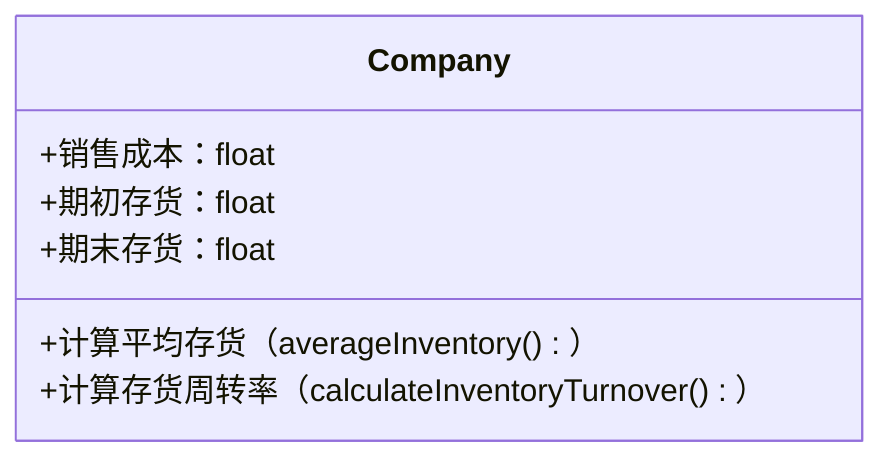
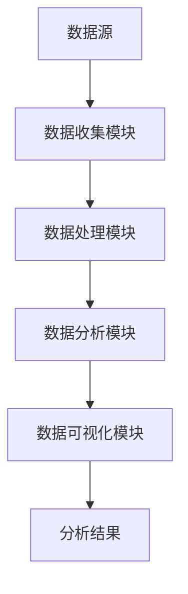

                 


# 彼得林奇对公司存货周转率变化的深度分析

## 关键词：存货周转率，彼得·林奇，投资分析，财务指标，企业效率

## 摘要：本文深入分析了彼得·林奇如何利用存货周转率变化来评估公司财务健康状况和投资价值。通过详细讲解存货周转率的定义、计算方法、行业基准以及其对投资决策的影响，本文为投资者和管理层提供了实用的分析工具和方法。

---

# 第一部分：公司存货周转率变化的背景与重要性

## 第1章：存货周转率的基本概念

### 1.1 存货周转率的定义与计算公式

#### 1.1.1 存货周转率的定义
存货周转率是衡量公司存货管理效率和运营能力的重要指标，反映了公司在一定时期内存货的周转速度。它通过比较公司在一定时期内的销售成本与平均存货价值，评估存货的流动性。

#### 1.1.2 存货周转率的计算公式
存货周转率的计算公式如下：
$$ \text{存货周转率} = \frac{\text{销售成本（COGS）}}{\text{平均存货}} $$
其中，平均存货的计算公式为：
$$ \text{平均存货} = \frac{\text{期初存货} + \text{期末存货}}{2} $$

#### 1.1.3 存货周转率的行业基准
不同行业的存货周转率基准差异较大。例如，零售行业通常需要较高的存货周转率，而制造行业可能对存货周转率的要求相对较低。投资者在分析存货周转率时，应参考同行业内的平均水平。

### 1.2 存货周转率的重要性

#### 1.2.1 存货周转率与企业财务健康的关系
存货周转率高表明公司存货管理效率高，资金占用少，运营能力强。反之，低存货周转率可能意味着存货积压，资金无法有效利用，影响企业的财务健康。

#### 1.2.2 存货周转率对投资者决策的影响
存货周转率是投资者评估公司运营效率和盈利能力的重要指标。高存货周转率通常与较高的销售能力和较强的市场竞争力相关，有助于提升公司的整体估值。

#### 1.2.3 存货周转率对管理层的启示
管理层可以通过分析存货周转率发现存货管理中的问题，优化库存结构，降低运营成本，提高资金使用效率。

---

## 第2章：彼得·林奇的投资理念与存货周转率分析

### 2.1 彼得·林奇的投资策略概述

#### 2.1.1 彼得·林奇的投资哲学
彼得·林奇是美国著名投资经理人，以其独特的选股策略和长期投资理念闻名。他认为，投资成功的关键在于选择优质的公司，并长期持有。

#### 2.1.2 彼得·林奇选股标准
彼得·林奇选股注重公司的基本面，包括盈利能力、成长潜力、财务健康和管理层能力。存货周转率作为财务指标之一，是其分析的重要组成部分。

#### 2.1.3 彼得·林奇对财务指标的关注
彼得·林奇认为，财务指标是评估公司健康状况的重要工具。他尤其关注那些能够反映公司运营效率和盈利能力的指标，如存货周转率、净利润率和销售增长率。

### 2.2 存货周转率在彼得·林奇分析体系中的地位

#### 2.2.1 存货周转率作为财务健康指标的作用
彼得·林奇认为，存货周转率是衡量公司运营效率的重要指标。高存货周转率通常意味着公司能够快速销售库存，减少资金占用，提高流动性。

#### 2.2.2 存货周转率与企业盈利能力的关系
存货周转率与企业盈利能力密切相关。高存货周转率通常意味着公司能够高效地将存货转化为收入，从而提高净利润率。

#### 2.2.3 存货周转率与企业流动资产效率的关联
存货周转率反映了公司流动资产的使用效率。高存货周转率表明公司能够充分利用流动资产，提高整体运营效率。

---

## 第3章：彼得·林奇对公司存货周转率变化的深度分析方法

### 3.1 彼得·林奇分析存货周转率的基本步骤

#### 3.1.1 数据收集与整理
彼得·林奇分析存货周转率的第一步是收集公司最近几个季度或几年的财务报表数据，包括销售成本和存货余额。

#### 3.1.2 数据分析与计算
计算存货周转率：
$$ \text{存货周转率} = \frac{\text{销售成本}}{\text{平均存货}} $$

#### 3.1.3 结果解读与投资决策
彼得·林奇会结合行业基准和公司历史数据，分析存货周转率的变化趋势，判断公司的存货管理效率和运营能力。

### 3.2 彼得·林奇存货周转率分析的案例研究

#### 3.2.1 案例一：XYZ公司的存货周转率分析
假设XYZ公司2022年的销售成本为500万元，期初存货为100万元，期末存货为150万元。计算其存货周转率为：
$$ \text{平均存货} = \frac{100 + 150}{2} = 125 \text{万元} $$
$$ \text{存货周转率} = \frac{500}{125} = 4 $$

#### 3.2.2 案例二：ABC公司的存货周转率分析
假设ABC公司2022年的销售成本为300万元，期初存货为60万元，期末存货为90万元。计算其存货周转率为：
$$ \text{平均存货} = \frac{60 + 90}{2} = 75 \text{万元} $$
$$ \text{存货周转率} = \frac{300}{75} = 4 $$

#### 3.2.3 案例三：123公司的存货周转率分析
假设123公司2022年的销售成本为200万元，期初存货为50万元，期末存货为70万元。计算其存货周转率为：
$$ \text{平均存货} = \frac{50 + 70}{2} = 60 \text{万元} $$
$$ \text{存货周转率} = \frac{200}{60} \approx 3.33 $$

---

## 第4章：彼得·林奇存货周转率分析的数学模型与公式

### 4.1 存货周转率计算公式

#### 4.1.1 存货周转率的计算公式
$$ \text{存货周转率} = \frac{\text{销售成本}}{\text{平均存货}} $$

#### 4.1.2 平均存货的计算方法
$$ \text{平均存货} = \frac{\text{期初存货} + \text{期末存货}}{2} $$

#### 4.1.3 存货周转率与销售成本的关系
存货周转率与销售成本成正比，与平均存货成反比。

### 4.2 彼得·林奇分析方法的数学模型

#### 4.2.1 数据分析模型
彼得·林奇通过分析存货周转率的变化趋势，判断公司存货管理效率和运营能力。

#### 4.2.2 指标对比模型
彼得·林奇会将公司的存货周转率与行业基准和历史数据进行对比，评估其相对表现。

#### 4.2.3 投资决策模型
彼得·林奇结合存货周转率和其他财务指标，综合评估公司的投资价值。

---

## 第5章：系统分析与架构设计

### 5.1 问题场景介绍
为了系统地分析存货周转率，我们需要构建一个数据分析系统，包括数据收集、处理、分析和可视化。

### 5.2 系统功能设计

#### 5.2.1 数据收集模块
负责收集公司的财务数据，包括销售成本和存货余额。

#### 5.2.2 数据处理模块
计算存货周转率和平均存货。

#### 5.2.3 数据分析模块
分析存货周转率的变化趋势，评估公司财务健康状况。

#### 5.2.4 数据可视化模块
生成图表和报告，展示分析结果。

### 5.3 系统架构设计

#### 5.3.1 领域模型


#### 5.3.2 系统架构


---

## 第6章：项目实战

### 6.1 环境安装
需要安装Python和相关数据分析库，如Pandas、Matplotlib。

### 6.2 核心实现源代码

#### 6.2.1 数据处理代码
```python
import pandas as pd

# 假设data.csv包含公司财务数据
df = pd.read_csv('data.csv')

# 计算平均存货
df['average_inventory'] = (df['initial_inventory'] + df['final_inventory']) / 2

# 计算存货周转率
df['inventory_turnover'] = df['sales_cost'] / df['average_inventory']
```

#### 6.2.2 数据可视化代码
```python
import matplotlib.pyplot as plt

plt.figure(figsize=(10,6))
plt.plot(df['inventory_turnover'], label='存货周转率')
plt.title('存货周转率变化趋势')
plt.xlabel('时间')
plt.ylabel('存货周转率')
plt.legend()
plt.show()
```

### 6.3 案例分析
以XYZ公司为例，分析其存货周转率的变化趋势，并结合行业基准进行评估。

### 6.4 分析解读
存货周转率的变化反映了公司存货管理效率的变动。例如，如果存货周转率持续下降，可能表明公司存货积压或销售能力减弱。

---

## 第7章：最佳实践、小结与注意事项

### 7.1 最佳实践
- 定期监控存货周转率的变化趋势。
- 结合其他财务指标（如净利润率、销售增长率）进行综合分析。
- 参考行业基准，评估公司的相对表现。

### 7.2 小结
本文深入分析了彼得·林奇如何利用存货周转率变化来评估公司财务健康状况和投资价值。通过详细讲解存货周转率的定义、计算方法、行业基准以及其对投资决策的影响，本文为投资者和管理层提供了实用的分析工具和方法。

### 7.3 注意事项
- 存货周转率分析应结合公司具体业务和行业特点。
- 数据分析时需注意季节性因素和特殊事件的影响。
- 投资决策应综合考虑多种因素，避免单一指标误导。

---

# 作者：AI天才研究院 & 禅与计算机程序设计艺术

---

通过以上步骤，您可以撰写一篇结构清晰、内容丰富的技术博客文章，详细介绍彼得·林奇对公司存货周转率变化的深度分析。

