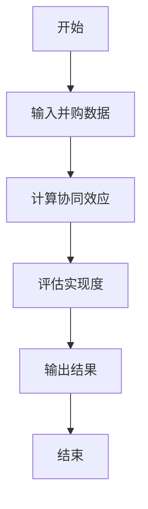
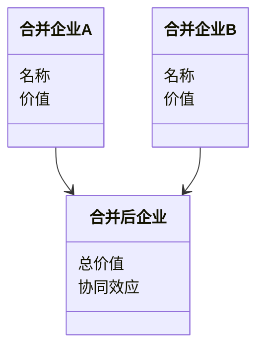
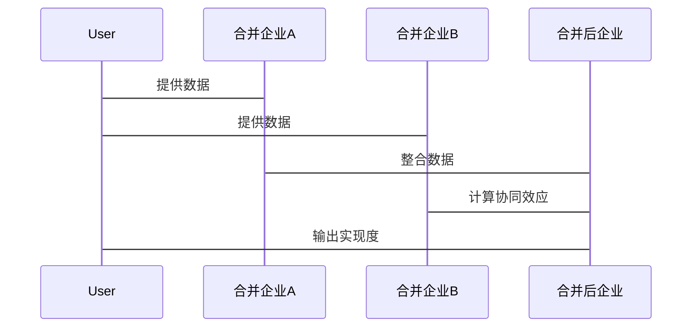

                 


# 彼得林奇对公司并购协同效应实现度的评估

## 关键词：公司并购、协同效应、彼得林奇、实现度评估、投资分析、并购价值

## 摘要：本文将深入探讨彼得·林奇对公司并购协同效应实现度的评估方法。通过分析协同效应的定义、类型及其实现机制，结合具体的数学模型和算法，详细阐述如何评估并购后的协同效应实现度。同时，本文将从系统架构和项目实战的角度，提供实际应用的指导和最佳实践。

---

# 第一部分：公司并购协同效应实现度的背景与概念

## 第1章：公司并购与协同效应概述

### 1.1 公司并购的基本概念

#### 1.1.1 公司并购的定义与类型
公司并购（Mergers and Acquisitions, M&A）是指一家公司通过购买另一家公司的股权或资产，以实现业务扩展或战略调整的行为。常见的并购类型包括：
- **横向并购**：同一行业内的企业并购。
- **纵向并购**：产业链上下游的企业并购。
- **混合并购**：与主业无直接关系的企业并购。

#### 1.1.2 并购的动机与目标
企业进行并购的动机多样，主要目标包括：
- **扩大市场份额**：通过并购快速进入新市场或增强竞争力。
- **获取技术或资源**：通过并购获得关键技术和资源。
- **实现规模效应**：通过并购降低单位成本，提高效率。
- **战略调整**：通过并购优化业务结构，应对市场竞争。

#### 1.1.3 并购的市场与行业背景
在经济周期波动中，并购活动呈现周期性变化。行业趋势和政策环境也会影响并购的活跃程度。例如，在技术驱动型行业，技术创新和专利布局是并购的重要动因。

### 1.2 协同效应的定义与类型

#### 1.2.1 协同效应的定义
协同效应（Synergy）是指并购后的企业通过资源整合、成本共享、优势互补等方式，实现比单独运营更高的价值。

#### 1.2.2 协同效应的分类
协同效应主要分为两类：
- **成本协同**：通过合并运营成本（如共享员工、场地）降低成本。
- **收入协同**：通过整合市场资源、客户群体提升收入。

#### 1.2.3 协同效应的实现机制
实现机制包括：
- **组织协同**：优化组织结构，提高管理效率。
- **技术协同**：共享技术资源，推动创新。
- **市场协同**：扩大市场覆盖，提升品牌影响力。

### 1.3 彼得·林奇的并购评估方法

#### 1.3.1 彼得·林奇的并购投资理念
彼得·林奇是美国著名的投资经理人，他强调基本面分析和长期投资。他认为，并购成功的关键在于协同效应的实现。

#### 1.3.2 协同效应实现度的核心要素
- **战略匹配度**：并购双方的战略目标是否一致。
- **管理能力**：整合团队的能力和经验。
- **资源互补性**：双方资源是否能有效整合。

#### 1.3.3 彼得·林奇评估模型的框架
彼得·林奇提出，协同效应的实现度可以通过以下步骤评估：
1. 评估并购双方的资源互补性。
2. 分析管理团队的整合能力。
3. 估算协同效应的价值。

### 1.4 本章小结
本章介绍了公司并购的基本概念和协同效应的分类，并详细阐述了彼得·林奇的并购评估方法。协同效应的实现是并购成功的关键，而彼得·林奇的模型为我们提供了分析的框架。

---

# 第二部分：协同效应实现度的评估模型与方法

## 第2章：协同效应实现度的核心概念与联系

### 2.1 协同效应实现度的定义与属性

#### 2.1.1 协同效应实现度的定义
协同效应实现度是指并购后实际实现的协同效应与预期协同效应的比率。

#### 2.1.2 协同效应实现度的属性特征对比表格
| 特性       | 实现度高的特征 | 实现度低的特征 |
|------------|----------------|----------------|
| 价值贡献   | 高              | 低              |
| 整合难度   | 低              | 高              |
| 时间周期   | 短              | 长              |
| 风险因素   | 少              | 多              |

#### 2.1.3 协同效应实现度的ER实体关系图
```mermaid
erd
database 实体
    实体 合并企业A
    实体 合并企业B
    实体 合并后企业
    关系 合并关系
    关系 协同效应
```

### 2.2 协同效应实现度的评估模型

#### 2.2.1 评估模型的原理与流程
评估协同效应实现度的步骤如下：
1. 确定并购双方的协同效应潜力。
2. 分析整合过程中的风险因素。
3. 计算协同效应的实现程度。

#### 2.2.2 协同效应实现度的公式推导
协同效应实现度的公式为：
$$ 实现度 = \frac{\text{实际实现的协同效应}}{\text{预期的协同效应}} \times 100\% $$

#### 2.2.3 评估模型的优缺点分析
- 优点：量化评估，便于比较不同并购的协同效应。
- 缺点：依赖于预期的准确性，实际实现度可能受多种因素影响。

### 2.3 本章小结
本章详细分析了协同效应实现度的定义、属性及其评估模型。通过对比分析和ER图，帮助读者更好地理解协同效应实现度的复杂性。

---

# 第三部分：协同效应实现度的算法原理与数学模型

## 第3章：协同效应实现度的算法原理

### 3.1 协同效应实现度的评估算法

#### 3.1.1 算法流程图


#### 3.1.2 Python代码示例
```python
def calculate_synergy(realized_value, expected_value):
    return (realized_value / expected_value) * 100
```

### 3.2 协同效应实现度的数学模型

#### 3.2.1 协同效应价值公式
$$ 协同效应价值 = \text{协同效应实现度} \times \text{并购价值} $$

#### 3.2.2 协同效应实现度的计算公式
$$ 实现度 = \frac{\text{协同效应实际实现值}}{\text{协同效应预期值}} \times 100\% $$

#### 3.2.3 算法实现与代码解读
- 输入：并购双方的实际协同效应和预期协同效应。
- 输出：协同效应实现度的百分比。

### 3.3 本章小结
本章通过算法流程图和数学公式，详细讲解了协同效应实现度的评估方法。通过Python代码示例，帮助读者理解如何将理论应用于实际。

---

# 第四部分：系统架构与设计

## 第4章：协同效应实现度的系统架构

### 4.1 项目介绍
协同效应实现度评估系统是一个用于辅助企业并购决策的工具，通过数据处理和算法计算，帮助企业评估并购后的协同效应实现度。

### 4.2 系统功能设计

#### 4.2.1 领域模型（Mermaid类图）


#### 4.2.2 系统架构设计（Mermaid架构图）
```mermaid
rectangle 数据库 {
    合并企业A数据
    合并企业B数据
}
class 合并企业A {
    名称
    价值
}
class 合并企业B {
    名称
    价值
}
```

### 4.3 系统接口设计

#### 4.3.1 系统接口
- 输入接口：接受并购双方的数据。
- 输出接口：输出协同效应实现度的评估结果。

### 4.4 系统交互流程图（Mermaid序列图）


### 4.5 本章小结
本章从系统架构的角度，详细讲解了协同效应实现度评估系统的构建过程，包括领域模型、系统架构和交互流程图。

---

# 第五部分：项目实战

## 第5章：协同效应实现度的项目实战

### 5.1 环境安装
- 安装Python和必要的库（如NumPy、Pandas）。
- 安装Mermaid工具用于绘制图表。

### 5.2 核心代码实现

#### 5.2.1 数据处理代码
```python
import pandas as pd

data = {
    '企业': ['A', 'B'],
    '价值': [100, 150]
}
df = pd.DataFrame(data)
```

#### 5.2.2 协同效应计算代码
```python
def calculate_synergy(realized_value, expected_value):
    return (realized_value / expected_value) * 100

synergy = calculate_synergy(75, 100)
print(synergy)
```

### 5.3 实际案例分析

#### 5.3.1 案例背景
假设企业A和企业B并购后，预期协同效应为100，实际实现75。

#### 5.3.2 案例分析
协同效应实现度为75%，说明实际实现度低于预期。

### 5.4 本章小结
本章通过实际案例，展示了如何使用Python代码实现协同效应的计算，并分析了实现度的评估结果。

---

# 第六部分：最佳实践与总结

## 第6章：协同效应实现度评估的实践总结

### 6.1 小结
本文详细讲解了彼得·林奇的并购评估方法，并通过算法、数学模型和系统架构的分析，提供了协同效应实现度的评估框架。

### 6.2 注意事项
- 数据的准确性和完整性是评估的关键。
- 实际应用中需考虑更多复杂因素，如文化整合、管理风格等。

### 6.3 拓展阅读
建议读者进一步阅读彼得·林奇的相关著作，如《彼得·林奇的选股方法》。

---

# 作者：AI天才研究院/AI Genius Institute & 禅与计算机程序设计艺术 /Zen And The Art of Computer Programming

---

以上是完整的博客文章内容，涵盖了从理论到实践的各个方面，并结合了彼得·林奇的并购评估方法和具体的技术实现。希望对您有所帮助！

