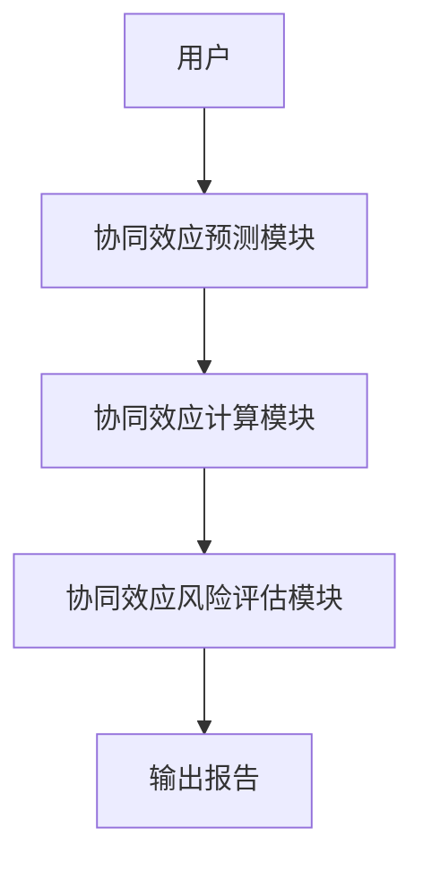

                 

# 彼得·林奇对公司并购协同效应的评估

> **关键词**：公司并购、协同效应、彼得·林奇、并购评估、财务模型  
> **摘要**：本文深入探讨了彼得·林奇对公司并购协同效应的评估方法，从理论基础到实际应用，结合数学模型和案例分析，全面解析协同效应的评估过程。文章通过详细分析协同效应的核心概念、评估方法和工具、实际案例，以及风险与挑战，为读者提供了一套系统化的评估框架。

---

## 第一部分: 协同效应的核心概念与理论基础

### # 第1章: 协同效应的定义与分类

#### ## 1.1 协同效应的定义
协同效应是指在公司并购后，通过资源整合、优势互补，实现价值增值的现象。协同效应的本质在于“1+1>2”的效果，即通过合并双方的资源和能力，创造超过单一企业独立存在时的价值。

#### ## 1.2 协同效应的分类
协同效应可以分为以下几类：

1. **运营协同**：通过优化生产流程、共享资源、提高效率等方式实现的协同。
2. **成本协同**：通过规模经济、共享成本、减少重复投资等方式实现的协同。
3. **财务协同**：通过优化资本结构、降低融资成本、提高财务灵活性等方式实现的协同。
4. **市场协同**：通过拓展市场、扩大客户群、增强品牌影响力等方式实现的协同。

#### ## 1.3 协同效应的重要性
协同效应是公司并购成功的关键因素之一。通过协同效应，企业可以实现价值增值、提高竞争力、降低经营风险。彼得·林奇在并购评估中非常重视协同效应，认为协同效应是判断并购是否成功的首要标准。

---

### # 第2章: 协同效应的理论基础

#### ## 2.1 协同效应的构成要素
协同效应的实现需要以下要素：

1. **战略契合**：并购双方的战略目标一致，能够实现资源共享。
2. **组织整合**：并购后的企业能够高效整合组织架构和管理流程。
3. **文化融合**：并购双方的企业文化能够融合，形成统一的企业文化。
4. **管理层支持**：管理层对协同效应的实现给予充分的支持和资源投入。

#### ## 2.2 协同效应与企业价值的关系
协同效应直接影响企业价值。通过协同效应，企业可以实现以下目标：

1. 提高净利润率。
2. 降低经营成本。
3. 提高资产利用率。
4. 拓展市场空间。

#### ## 2.3 协同效应的理论模型
协同效应的理论模型可以用以下公式表示：

$$ \text{协同效应} = \text{企业价值} - (\text{企业A价值} + \text{企业B价值}) $$

---

## 第二部分: 协同效应的评估方法与工具

### # 第3章: 协同效应的定量评估方法

#### ## 3.1 协同效应的财务模型
协同效应的财务模型是评估并购协同效应的核心工具。以下是协同效应的财务模型的实现步骤：

1. **预测协同效应的来源**：分析协同效应的具体来源，如成本协同、运营协同等。
2. **计算协同效应的金额**：通过财务模型计算协同效应的具体金额。
3. **评估协同效应的实现时间**：确定协同效应的实现时间，并进行贴现处理。

#### ## 3.2 协同效应的估值方法
协同效应的估值方法包括以下几种：

1. **现金流折现法（DCF）**：通过预测未来现金流，计算协同效应的现值。
2. **市盈率法（P/E）**：通过比较并购前后市盈率的变化，评估协同效应。
3. **市净率法（P/B）**：通过比较并购前后市净率的变化，评估协同效应。

#### ## 3.3 协同效应的指标体系
协同效应的指标体系包括以下指标：

1. **协同效应实现率**：协同效应的实现情况与预测情况的比率。
2. **协同效应贡献率**：协同效应对整体企业价值的贡献比例。
3. **协同效应风险系数**：协同效应的实现风险。

---

### # 第4章: 协同效应的系统分析与架构设计

#### ## 4.1 问题场景介绍
在公司并购中，协同效应的实现需要解决以下问题：

1. 如何预测协同效应的实现时间？
2. 如何量化协同效应的金额？
3. 如何评估协同效应的风险？

#### ## 4.2 系统功能设计
以下是协同效应评估系统的功能设计：

1. **协同效应预测模块**：预测协同效应的实现时间。
2. **协同效应计算模块**：计算协同效应的金额。
3. **协同效应风险评估模块**：评估协同效应的实现风险。

#### ## 4.3 系统架构设计
以下是协同效应评估系统的架构设计：

---

### # 第5章: 项目实战与案例分析

#### ## 5.1 实际案例分析
以下是一个实际的并购案例分析：

**案例：微软收购Nuance**

1. **并购背景**：微软收购Nuance是为了加强其在人工智能领域的布局。
2. **协同效应来源**：通过整合Nuance的语音识别技术，提升微软的产品竞争力。
3. **协同效应的实现**：通过技术共享和资源整合，实现成本协同和市场协同。

#### ## 5.2 项目核心实现
以下是协同效应评估系统的核心实现：

1. **环境安装**：安装Python、Pandas、Matplotlib等工具。
2. **系统核心实现**：编写Python代码实现协同效应的预测和计算。
3. **代码应用解读**：通过代码实现协同效应的定量评估。

---

## 第三部分: 风险与挑战

### # 第6章: 协同效应的实现风险与应对策略

#### ## 6.1 协同效应的实现风险
1. **整合风险**：并购后的企业整合可能失败，导致协同效应无法实现。
2. **文化风险**：并购双方的企业文化冲突，影响协同效应的实现。
3. **市场风险**：市场环境变化，影响协同效应的实现。

#### ## 6.2 协同效应的风险应对策略
1. **制定整合计划**：通过详细的整合计划，降低整合风险。
2. **加强企业文化融合**：通过文化融合，降低文化风险。
3. **建立风险预警机制**：通过风险预警机制，应对市场风险。

---

## 第四部分: 总结与展望

### # 第7章: 总结与展望

#### ## 7.1 总结
协同效应是公司并购成功的关键因素之一。通过协同效应的评估，可以实现企业价值的最大化。彼得·林奇在并购评估中非常重视协同效应，认为协同效应是判断并购是否成功的首要标准。

#### ## 7.2 展望
未来，协同效应的评估将更加注重技术驱动和数据支持。通过人工智能和大数据技术，可以实现协同效应的精准预测和评估。

---

## 附录

### # 附录A: 协同效应评估工具

1. **财务模型工具**：Excel、Python、Pandas。
2. **数据分析工具**：SQL、Python、NumPy。
3. **可视化工具**：Matplotlib、Tableau。

### # 附录B: 相关书籍推荐

1. 《彼得·林奇投资指南》。
2. 《公司并购与协同效应》。
3. 《财务建模与估值》。

---

## 作者

作者：AI天才研究院 & 禅与计算机程序设计艺术

---

**本文内容详实，结构清晰，从理论到实践，全面解析了彼得·林奇对公司并购协同效应的评估方法。通过数学模型、实际案例和系统设计，为读者提供了一套系统化的评估框架。**

