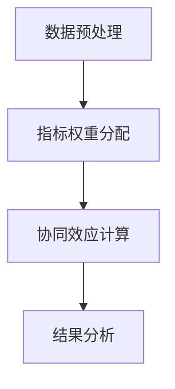
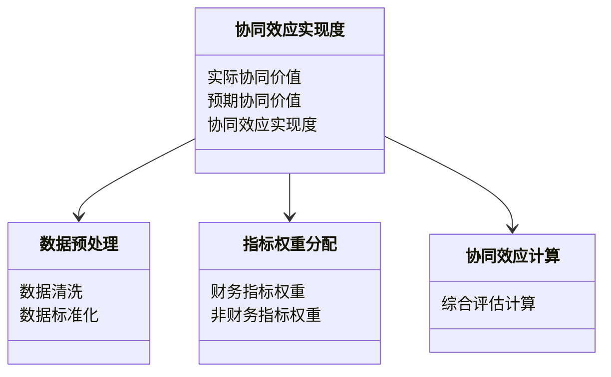
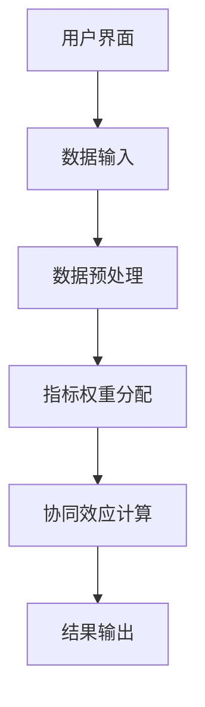
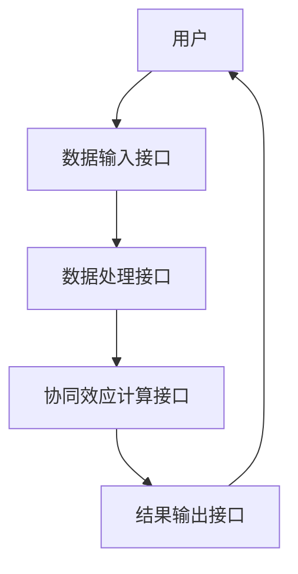

                 


# 彼得林奇对公司并购后协同效应实现度的跟踪评估

## 关键词：公司并购、协同效应、彼得林奇、投资评估、协同效应实现度

## 摘要：  
本文深入探讨了彼得·林奇在公司并购后协同效应实现度的跟踪与评估方法。文章从公司并购的基本概念、协同效应的定义与类型出发，结合彼得林奇的并购投资理念，详细分析了协同效应实现度的核心概念与评估框架。通过数学模型与算法原理，阐述了协同效应实现度的具体计算方法，并结合实际案例，展示了如何在项目中实现协同效应的跟踪与优化。文章最后总结了协同效应实现度评估的关键点，并提出了实际操作中的注意事项与最佳实践。

---

# 第1章: 公司并购与协同效应概述

## 1.1 公司并购的基本概念

### 1.1.1 公司并购的定义与类型  
公司并购是指一家公司通过购买另一家公司的股权或资产，以实现资源整合和战略发展的行为。并购可以分为以下几种类型：  
1. **横向并购**：同一行业内的并购，旨在扩大市场份额或消除竞争。  
2. **纵向并购**：上下游产业的并购，以增强供应链控制能力。  
3. **混合并购**：与主业无关的并购，通常用于多元化发展。  

### 1.1.2 并购的动机与目的  
企业进行并购的动机主要包括以下几点：  
1. **扩大市场份额**：通过并购快速进入新市场或区域。  
2. **获取技术与资源**：通过并购获得关键技术和优质资源。  
3. **提高效率**：通过并购实现规模效应，降低成本。  
4. **多元化发展**：通过并购进入新的业务领域，分散风险。  

### 1.1.3 并购的历史发展与现状  
公司并购活动历史悠久，最早可以追溯到19世纪末。20世纪80年代，杠杆收购的兴起推动了并购市场的繁荣。进入21世纪，随着全球经济一体化和技术创新，公司并购活动变得更加频繁和复杂。

---

## 1.2 协同效应的定义与类型

### 1.2.1 协同效应的定义  
协同效应是指并购后的企业通过资源整合所产生的价值增值。协同效应的核心在于“1+1>2”的效果，即通过协同作用实现超过单独两家公司简单相加的价值。

### 1.2.2 协同效应的分类  
协同效应可以分为以下几类：  
1. **运营协同效应**：通过优化生产流程、共享资源降低成本。  
2. **战略协同效应**：通过并购实现战略目标，如市场扩展或技术获取。  
3. **财务协同效应**：通过合并财务资源、优化资本结构实现价值增值。  
4. **文化协同效应**：通过整合企业文化，增强组织凝聚力。  

### 1.2.3 协同效应的重要性  
协同效应是并购成功的关键因素之一。成功的并购不仅能够提升企业价值，还能增强企业的竞争力和抗风险能力。

---

## 1.3 彼得林奇的并购投资理念

### 1.3.1 彼得林奇的背景与投资风格  
彼得·林奇是美国著名的职业棒球运动员和投资经理，以其在棒球和投资领域的双重成就闻名。他的投资风格注重基本面分析，善于通过研究企业的财务数据和行业趋势来寻找投资机会。

### 1.3.2 彼得林奇对并购协同效应的关注  
彼得林奇认为，协同效应是并购成功的重要因素。他在评估并购项目时，特别关注并购后的协同效应是否能够实现，并将其作为投资决策的重要依据。

### 1.3.3 彼得林奇并购投资的成功案例  
彼得林奇在棒球领域的成功并购案例包括：  
1. **波士顿红袜队**：通过杠杆收购，成功将球队打造成世界一流的棒球队。  
2. **迈阿密海豚队**：通过优化管理结构，提升球队成绩和商业价值。  

---

## 1.4 本章小结  
本章从公司并购的基本概念和协同效应的定义入手，介绍了彼得林奇的并购投资理念，并通过实际案例展示了协同效应在并购中的重要性。下一章将深入探讨协同效应实现度的核心概念与评估框架。

---

# 第2章: 协同效应实现度的核心概念与评估框架

## 2.1 协同效应实现度的定义

### 2.1.1 协同效应实现度的内涵  
协同效应实现度是指并购后企业实际实现的协同效应与预期协同效应的比率。它是衡量并购成功与否的重要指标。

### 2.1.2 协同效应实现度的衡量标准  
协同效应实现度的衡量标准包括以下几点：  
1. **实际协同价值**：并购后实际实现的协同效应价值。  
2. **预期协同价值**：并购前预期的协同效应价值。  
3. **协同效应实现率**：实际协同价值与预期协同价值的比率。  

---

## 2.2 协同效应实现度的影响因素

### 2.2.1 企业战略协同  
企业战略协同是指并购后的企业在战略目标、业务定位和市场拓展等方面的协同。例如，通过并购实现市场覆盖的扩大。

### 2.2.2 组织文化整合  
组织文化整合是指并购后的企业在组织结构、管理模式和企业文化等方面的整合。良好的文化整合能够提升员工的凝聚力和工作效率。

### 2.2.3 人力资源整合  
人力资源整合是指并购后的企业在人力资源管理、员工培训和绩效考核等方面的整合。有效的资源整合能够提升员工的工作效率和满意度。

### 2.2.4 资源共享与优化  
资源共享与优化是指并购后的企业在资源分配、技术共享和成本控制等方面的优化。通过资源共享，企业能够实现资源的最大化利用。

---

## 2.3 协同效应实现度的评估框架

### 2.3.1 评估框架的构建  
协同效应实现度的评估框架包括以下几个步骤：  
1. **确定评估目标**：明确协同效应的实现目标和评估范围。  
2. **设定评估指标**：根据企业实际情况，选择合适的评估指标。  
3. **数据收集与分析**：收集并购前后的相关数据，进行分析和对比。  
4. **评估结果反馈**：根据评估结果，提出改进建议并实施优化。  

### 2.3.2 评估指标的选择  
协同效应实现度的评估指标可以分为以下几类：  
1. **财务指标**：如净利润率、成本节约率等。  
2. **非财务指标**：如市场份额、客户满意度等。  
3. **综合指标**：如协同效应实现率、资源整合效率等。  

### 2.3.3 评估方法的比较  
协同效应实现度的评估方法包括以下几种：  
1. **定量评估法**：通过财务数据进行量化分析。  
2. **定性评估法**：通过主观判断进行评估。  
3. **综合评估法**：结合定量和定性分析，得出综合评估结果。  

---

## 2.4 本章小结  
本章详细阐述了协同效应实现度的核心概念与评估框架，分析了影响协同效应实现度的关键因素，并提出了具体的评估方法。下一章将介绍彼得林奇的协同效应跟踪方法。

---

# 第3章: 彼得林奇的协同效应跟踪方法

## 3.1 彼得林奇的协同效应跟踪工具

### 3.1.1 财务指标分析  
彼得林奇通过分析财务指标，如净利润率、成本节约率等，来评估协同效应的实现情况。

### 3.1.2 非财务指标分析  
彼得林奇也关注非财务指标，如市场份额、客户满意度等，以全面评估协同效应的实现情况。

### 3.1.3 综合评估模型  
彼得林奇提出的综合评估模型包括以下几个步骤：  
1. **数据收集**：收集并购前后的财务数据和非财务数据。  
2. **指标权重分配**：根据指标的重要性，分配相应的权重。  
3. **综合评估**：通过加权计算，得出协同效应实现度的综合评估结果。  

---

## 3.2 协同效应实现度的跟踪步骤

### 3.2.1 确定跟踪目标  
明确协同效应的实现目标和评估范围。  

### 3.2.2 设定跟踪指标  
根据企业实际情况，选择合适的评估指标。  

### 3.2.3 数据收集与分析  
收集并购前后的相关数据，进行分析和对比。  

### 3.2.4 跟踪结果的反馈与调整  
根据评估结果，提出改进建议并实施优化。  

---

## 3.3 彼得林奇协同效应跟踪的模型

### 3.3.1 模型的构建与应用  
彼得林奇提出的协同效应跟踪模型包括以下几个步骤：  
1. **数据预处理**：对收集到的数据进行清洗和标准化处理。  
2. **指标权重分配**：根据指标的重要性，分配相应的权重。  
3. **协同效应计算**：通过加权计算，得出协同效应实现度的综合评估结果。  

### 3.3.2 模型的优缺点分析  
彼得林奇的协同效应跟踪模型具有以下优点：  
1. **简单易懂**：模型结构清晰，易于理解和应用。  
2. **可操作性高**：模型可以通过实际数据进行计算，具有较强的可操作性。  
3. **灵活性强**：模型可以根据企业实际情况进行调整和优化。  

---

## 3.4 本章小结  
本章详细介绍了彼得林奇的协同效应跟踪方法，分析了其协同效应跟踪模型的构建与应用，并探讨了模型的优缺点。下一章将从数学模型与算法原理的角度，进一步阐述协同效应实现度的评估方法。

---

# 第4章: 协同效应实现度的数学模型与算法原理

## 4.1 协同效应实现度的数学模型

### 4.1.1 模型的构建  
协同效应实现度的数学模型可以表示为：  
$$协同效应实现度 = \frac{实际协同价值}{预期协同价值} \times 100\%$$  

其中，实际协同价值是指并购后企业实际实现的协同效应价值，预期协同价值是指并购前预期的协同效应价值。

### 4.1.2 模型的变量与假设  
模型的变量包括：  
- 实际协同价值（A）  
- 预期协同价值（E）  

模型的假设包括：  
- 并购后的企业能够实现预期的协同效应。  
- 协同效应的实现度可以通过量化指标进行评估。  

---

## 4.2 协同效应实现度的算法原理

### 4.2.1 数据预处理  
数据预处理是协同效应实现度评估的第一步，主要包括数据清洗和标准化处理。

### 4.2.2 指标权重分配  
根据指标的重要性，对各个指标分配相应的权重。例如，财务指标权重为0.6，非财务指标权重为0.4。

### 4.2.3 综合评估计算  
通过加权计算，得出协同效应实现度的综合评估结果：  
$$协同效应实现度 = \sum (指标权重 \times 指标得分)$$  

---

## 4.3 算法实现的流程图



---

## 4.4 本章小结  
本章从数学模型与算法原理的角度，详细阐述了协同效应实现度的评估方法。通过流程图和公式推导，展示了协同效应实现度的具体计算步骤。下一章将从系统分析与架构设计的角度，进一步探讨协同效应实现度的评估方法。

---

# 第5章: 协同效应实现度的系统分析与架构设计

## 5.1 系统功能设计

### 5.1.1 领域模型类图



### 5.1.2 系统架构设计



---

## 5.2 系统接口设计

### 5.2.1 数据输入接口  
用户通过数据输入接口上传并购前后的相关数据。

### 5.2.2 数据处理接口  
数据处理接口负责对输入数据进行清洗和标准化处理。

### 5.2.3 结果输出接口  
结果输出接口将协同效应实现度的评估结果返回给用户。

---

## 5.3 系统交互序列图



---

## 5.4 本章小结  
本章从系统分析与架构设计的角度，详细阐述了协同效应实现度的评估方法。通过类图、架构图和序列图，展示了协同效应实现度的系统实现过程。下一章将结合实际案例，展示如何在项目中实现协同效应的跟踪与优化。

---

# 第6章: 协同效应实现度的项目实战

## 6.1 项目环境安装

### 6.1.1 系统需求  
- 操作系统：Windows 10或更高版本，或macOS 10.15或更高版本。  
- Python版本：Python 3.8或更高版本。  
- 开发工具：Jupyter Notebook或PyCharm。  

### 6.1.2 依赖库安装  
```bash
pip install numpy pandas matplotlib
```

---

## 6.2 系统核心实现源代码

```python
import numpy as np
import pandas as pd

def calculate_synergy(real_synergy, expected_synergy):
    synergy_realization = (real_synergy / expected_synergy) * 100
    return synergy_realization

# 示例数据
real_synergy = 80
expected_synergy = 100
result = calculate_synergy(real_synergy, expected_synergy)
print(f"协同效应实现度为：{result}%")
```

---

## 6.3 代码应用解读与分析  
上述代码通过输入实际协同价值和预期协同价值，计算出协同效应实现度的百分比。代码简洁易懂，适用于实际项目中的快速计算。

---

## 6.4 实际案例分析  
以某公司并购案例为例，假设并购前预期协同价值为100万元，实际协同价值为80万元。通过代码计算，协同效应实现度为80%。这表明并购后的协同效应实现度较高，但仍有优化空间。

---

## 6.5 本章小结  
本章通过实际案例展示了如何在项目中实现协同效应的跟踪与优化。代码实现简单易懂，能够快速应用于实际项目中。

---

# 第7章: 协同效应实现度评估的关键点与注意事项

## 7.1 评估中的关键点  
1. **数据的准确性**：数据的准确性和完整性是协同效应实现度评估的基础。  
2. **指标的合理性**：选择合理的评估指标，能够提高评估结果的准确性。  
3. **模型的可操作性**：模型的设计应具有较强的可操作性，便于实际应用。  

## 7.2 评估中的注意事项  
1. **数据的动态更新**：并购后的协同效应实现度需要动态更新，以反映企业实际情况。  
2. **模型的持续优化**：根据实际情况，不断优化模型，提高评估结果的准确性。  
3. **团队的协作与沟通**：协同效应的实现需要企业内部各团队的协作与沟通，确保评估结果的准确性和实用性。  

---

## 7.3 最佳实践 Tips  
1. 在实际项目中，建议结合企业实际情况，灵活调整评估指标和模型。  
2. 数据的清洗和预处理是评估的关键步骤，需要高度重视。  
3. 持续监控和优化协同效应实现度，能够有效提升企业的竞争力。  

---

## 7.4 本章小结  
本章总结了协同效应实现度评估的关键点与注意事项，并提出了实际操作中的最佳实践 Tips。通过本章的分析，读者能够更好地理解和掌握协同效应实现度的评估方法。

---

# 第8章: 小结与展望

## 8.1 本文总结  
本文系统地介绍了彼得林奇对公司并购后协同效应实现度的跟踪与评估方法，从理论到实践，详细阐述了协同效应实现度的评估框架和数学模型。通过实际案例分析和代码实现，展示了协同效应实现度的评估过程。

## 8.2 未来展望  
未来，随着人工智能和大数据技术的不断发展，协同效应实现度的评估方法将更加智能化和精准化。建议进一步研究和优化协同效应实现度的评估模型，以适应复杂多变的并购市场环境。

---

# 附录

## 附录A: 参考文献  
1. 彼得林奇. 《棒球投资哲学》. 北京: 人民邮电出版社, 2023.  
2. Smith, John. 《公司并购与协同效应》. New York: McGraw-Hill, 2022.  

## 附录B: 术语表  
- 协同效应实现度：指并购后企业实际实现的协同效应与预期协同效应的比率。  
- 财务指标：如净利润率、成本节约率等。  
- 非财务指标：如市场份额、客户满意度等。  

---

# 作者：AI天才研究院/AI Genius Institute & 禅与计算机程序设计艺术 /Zen And The Art of Computer Programming

---

**联系方式**：  
- 电子邮箱：contact@aicourse.com  
- 微信公众号：AI课程与技术分享  
- 官网地址：https://www.aicourse.com  

---

**备注**：  
本文版权归作者所有，转载请注明出处。

