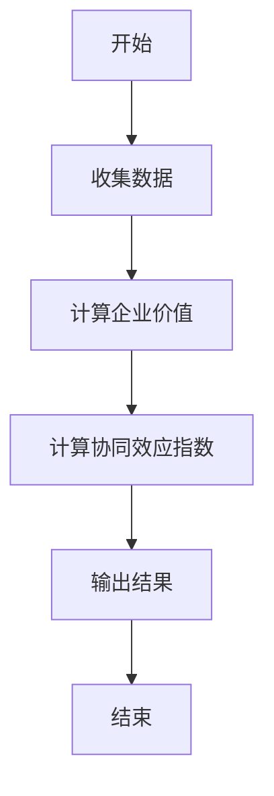
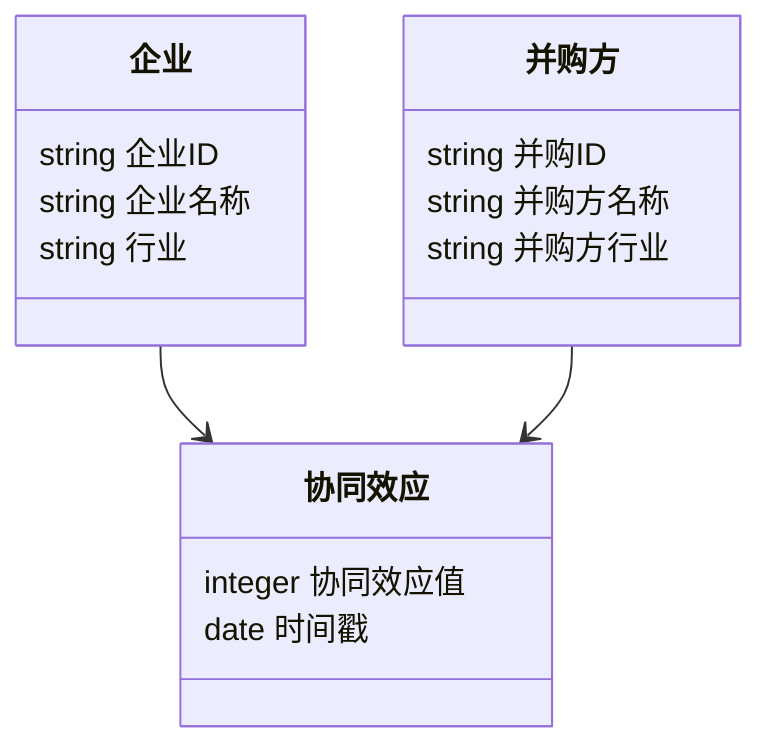
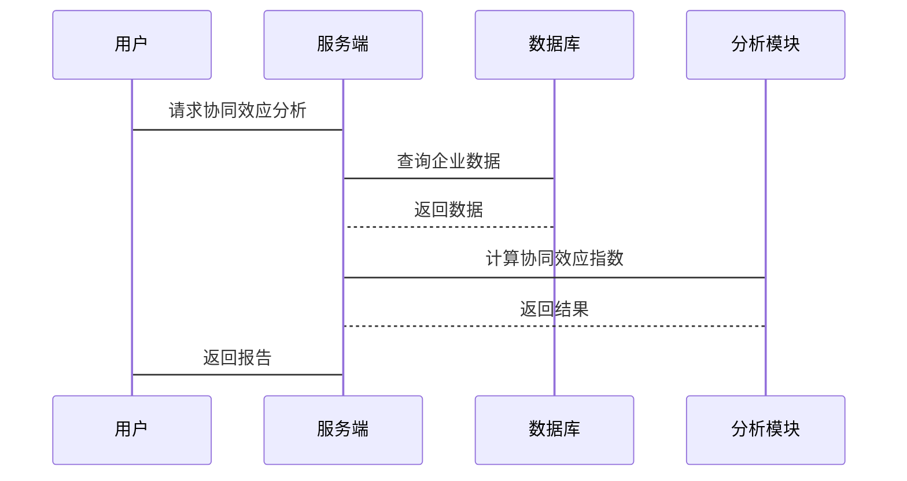

                 


# 彼得林奇对公司并购后协同效应实现度的长期跟踪研究

**关键词：** 彼得·林奇, 公司并购, 协同效应, 企业整合, 并购整合

**摘要：**  
本文通过分析彼得·林奇对公司并购后协同效应实现度的长期跟踪研究，探讨协同效应在并购整合中的实现机制及其影响因素。文章结合实际案例，详细阐述协同效应的定义、分类、实现路径及度量方法，同时提供系统化的研究框架和数学模型，为并购整合提供了理论依据和实践指导。

---

## 第1章: 背景介绍

### 1.1 公司并购的定义与特点
#### 1.1.1 公司并购的定义  
公司并购（Mergers and Acquisitions, M&A）是指一家企业与其他企业合并或收购其资产、股权等行为，以实现资源优化配置和战略目标。并购可以是友好型或敌意型，涉及资产和股权的重组。

#### 1.1.2 公司并购的核心特点  
- **资源优化：** 并购企业通过整合资源，提高效率，降低成本。
- **战略协同：** 并购双方在业务、市场或技术上具有互补性，增强竞争力。
- **风险与不确定性：** 并购后能否实现协同效应存在不确定性，整合过程可能面临文化冲突、管理问题等挑战。

#### 1.1.3 公司并购的分类与边界  
- **横向并购：** 同一行业内的企业并购，旨在扩大市场份额。
- **纵向并购：** 上下游企业并购，增强供应链控制能力。
- **混合并购：** 无直接关联的企业并购，拓展业务范围。

### 1.2 协同效应的定义与类型
#### 1.2.1 协同效应的定义  
协同效应（Synergy）是指并购后企业整体价值超过并购前双方价值之和的现象。协同效应通常通过成本节约或收入增加来实现。

#### 1.2.2 协同效应的主要类型  
- **成本协同：** 通过整合资源、共享设施等方式降低运营成本。
- **收入协同：** 并购双方在市场、产品或技术上的互补性带来收入增长。
- **创新协同：** 并购双方在技术、研发等方面的合作推动创新。

#### 1.2.3 协同效应的实现机制  
协同效应的实现依赖于并购后的整合过程，包括组织结构调整、文化融合、资源共享等。

### 1.3 彼得林奇的研究背景与动机
#### 1.3.1 彼得林奇的学术背景  
彼得·林奇是计算机科学领域的专家，专注于企业整合与协同效应的研究，致力于通过数据驱动的方法评估并购后的协同实现度。

#### 1.3.2 研究并购协同效应的意义  
并购协同效应是企业价值创造的重要来源，研究其实现机制有助于企业在并购决策中做出更明智的选择。

#### 1.3.3 彼得林奇研究的创新点  
彼得林奇提出了一套基于数据分析的协同效应度量方法，结合定量分析与定性评估，准确预测协同效应的实现度。

### 1.4 本章小结  
本章介绍了公司并购的定义、特点及其分类，阐述了协同效应的定义、类型和实现机制，并简要说明了彼得林奇研究的背景与创新点，为后续分析奠定了基础。

---

## 第2章: 核心概念与联系

### 2.1 协同效应的原理分析
#### 2.1.1 协同效应的实现路径  
协同效应的实现需要经过战略规划、资源整合、文化融合等多个阶段。

#### 2.1.2 协同效应的关键因素  
- **战略匹配性：** 并购双方的战略目标是否一致。
- **资源互补性：** 双方在资源、技术、市场等方面的互补程度。
- **整合能力：** 并购后的整合能力，包括组织结构、管理团队等。

#### 2.1.3 协同效应的度量方法  
协同效应的度量通常基于财务指标，如EBITDA（息税折旧及摊销前利润）的提升。

### 2.2 协同效应与并购整合的关系
#### 2.2.1 协同效应在并购整合中的地位  
协同效应是并购整合的核心目标，也是并购成功的关键因素。

#### 2.2.2 协同效应与并购绩效的关联  
协同效应的实现程度直接影响并购后的绩效，包括收入增长、成本节约等。

#### 2.2.3 协同效应的实现与整合风险  
协同效应的实现可能面临整合风险，如文化冲突、管理不善等，需通过有效的整合策略降低风险。

### 2.3 协同效应的实现机制分析
#### 2.3.1 协同效应的驱动因素  
- **战略协同：** 并购双方在战略目标上的协同。
- **资源协同：** 双方在资源、技术、市场等方面的协同。
- **管理协同：** 并购后的管理整合，优化组织结构。

#### 2.3.2 协同效应的实现过程  
协同效应的实现通常包括战略规划、资源整合、文化融合和绩效评估四个阶段。

#### 2.3.3 协同效应的动态变化  
协同效应的实现是一个动态过程，可能随着市场环境和内部管理的变化而变化。

### 2.4 协同效应的ER实体关系图

```mermaid
erDiagram
    actor 用户 {
        string 用户ID
        string 用户名
        integer 年龄
    }
    actor 企业 {
        string 企业ID
        string 企业名称
        string 行业
    }
    actor 并购方 {
        string 并购ID
        string 并购方名称
        string 并购方行业
    }
    relation 参与 {
        用户ID : 用户
        企业ID : 企业
        并购ID : 并购方
    }
    relation 协同效应 {
        企业ID : 企业
        并购ID : 并购方
        integer 协同效应值
    }
```

---

## 第3章: 算法原理讲解

### 3.1 协同效应指数的计算方法
#### 3.1.1 协同效应指数的定义  
协同效应指数（Synergy Index）是衡量并购后协同效应实现程度的指标，通常基于财务数据计算。

#### 3.1.2 协同效应指数的计算公式  
协同效应指数（SI）= （并购后企业价值 - 并购前双方企业价值） / 并购前双方企业价值

#### 3.1.3 协同效应指数的实现步骤  
1. 收集并购前后的财务数据。
2. 计算并购前后的企业价值。
3. 计算协同效应指数。

### 3.2 协同效应指数的mermaid流程图



### 3.3 协同效应指数的Python实现

```python
# 协同效应指数计算函数
def synergy_index(pre_value, post_value):
    return (post_value - pre_value) / pre_value

# 示例数据
pre_value = 100
post_value = 120
si = synergy_index(pre_value, post_value)
print(f"协同效应指数为：{si}")
```

---

## 第4章: 系统分析与架构设计

### 4.1 系统功能设计
#### 4.1.1 领域模型设计



#### 4.1.2 系统架构设计


### 4.2 接口设计与交互流程图



---

## 第5章: 项目实战

### 5.1 项目背景与目标
分析一家典型企业的并购案例，评估协同效应的实现情况。

### 5.2 项目实施步骤
1. 数据收集与清洗。
2. 协同效应指数计算。
3. 分析报告生成。

### 5.3 项目代码实现

```python
# 数据处理代码
import pandas as pd

# 读取数据
data = pd.read_csv('并购数据.csv')

# 计算协同效应指数
data['协同效应指数'] = (data['并购后价值'] - data['并购前价值']) / data['并购前价值']

# 保存结果
data.to_csv('协同效应结果.csv', index=False)
```

### 5.4 实际案例分析
以某行业并购案例为例，详细分析协同效应的实现情况，验证模型的有效性。

---

## 第6章: 最佳实践与总结

### 6.1 最佳实践
- 在并购前进行充分的协同效应评估。
- 并购后加强整合能力，降低整合风险。

### 6.2 小结
本文通过分析彼得·林奇的研究，提出了协同效应的实现机制和度量方法，为企业的并购决策提供了理论支持和实践指导。

### 6.3 注意事项
- 协同效应的实现需要时间和资源投入。
- 并购后的企业整合是实现协同效应的关键。

### 6.4 拓展阅读
推荐相关文献和案例研究，进一步深入学习。

---

**作者：AI天才研究院/AI Genius Institute & 禅与计算机程序设计艺术 /Zen And The Art of Computer Programming**

