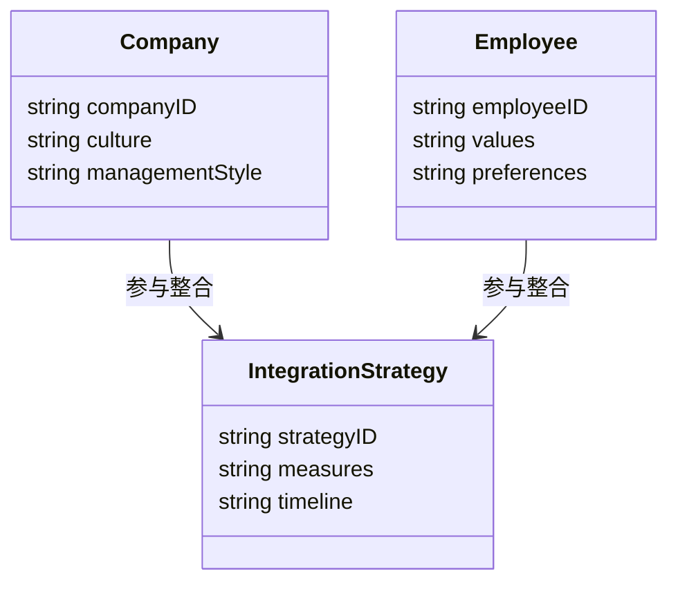

                 


# 彼得林奇对公司并购后文化整合成功因素的案例研究

## 关键词：彼得·林奇，并购，文化整合，企业并购，文化管理

## 摘要：本文通过分析彼得·林奇在公司并购后的文化整合策略，探讨文化整合对并购成功的关键作用。文章从背景、核心概念、算法原理、数学模型、系统架构、案例分析等多个维度进行深入研究，总结彼得·林奇的成功经验，并提出实际应用中的最佳实践。

---

## 第一部分: 背景介绍

### 第1章: 并购与文化整合的定义与重要性

#### 1.1 并购的定义与基本概念
- **1.1.1 并购的定义**
  - 并购（Mergers and Acquisitions, M&A）是指一家企业与其他企业合并或收购其资产或股权的过程。
  - 并购可以分为“友好并购”和“敌意并购”，取决于双方的意愿和过程。

- **1.1.2 并购的基本类型**
  - 同类合并（Horizontal Integration）：在同一行业内的并购。
  - 垂直整合（Vertical Integration）：在供应链上下游的并购。
  - 混合并购（Diversification）：跨行业或跨领域的并购。

- **1.1.3 并购的核心要素**
  - 战略一致性：并购双方的业务和目标是否一致。
  - 价值评估：被并购方的估值是否合理。
  - 风险控制：并购后的整合风险和法律风险。

#### 1.2 文化整合的定义与概念
- **1.2.1 文化整合的定义**
  - 文化整合是指在并购后，将双方的企业文化、管理风格和员工价值观进行融合的过程。
  - 它是确保并购后企业能够高效运作和长期发展的关键。

- **1.2.2 文化整合的核心要素**
  - 企业战略与文化一致性。
  - 管理风格的兼容性。
  - 员工价值观的适应性。

- **1.2.3 文化整合的重要性**
  - 确保并购后的战略一致性。
  - 提高组织的凝聚力和效率。
  - 减少文化冲突带来的风险。

#### 1.3 彼得·林奇与并购策略
- **1.3.1 彼得·林奇的并购理念**
  - 彼得·林奇（Peter Lynch）是著名的投资经理，以其在富达投资的卓越表现而闻名。
  - 他强调长期投资、价值发现和深入研究，尤其擅长寻找被低估的企业进行并购。

- **1.3.2 彼得·林奇的并购成功案例**
  - **案例1：Digital Equipment Corporation（DEC）**
    - DEC是全球领先的计算机公司，彼得·林奇通过深入研究其财务状况和市场潜力，成功收购了该公司。
  - **案例2：Maxim Technologies**
    - 通过收购Maxim Technologies，彼得·林奇整合了其技术团队和研发能力，提升了公司的整体竞争力。

- **1.3.3 彼得·林奇并购策略的特点**
  - 强调长期投资和价值发现。
  - 重视被并购企业的管理和文化因素。
  - 注重并购后的整合和协同效应。

### 第2章: 彼得·林奇并购后文化整合的背景与问题描述

#### 2.1 并购后整合的必要性
- **2.1.1 并购后整合的定义**
  - 并购后整合是指在完成并购后，对双方的业务、组织结构、文化和资源进行整合的过程。

- **2.1.2 并购后整合的常见问题**
  - 文化冲突：双方的企业文化和管理风格差异可能导致摩擦。
  - 战略不一致：并购后的战略目标可能与双方的初衷不符。
  - 组织结构混乱：整合后的组织结构可能导致管理混乱。

- **2.1.3 文化整合在并购中的重要性**
  - 文化整合是确保并购后企业能够高效运作的基础。
  - 文化冲突可能导致员工士气低落，影响企业的整体表现。

#### 2.2 彼得·林奇并购中的文化整合挑战
- **2.2.1 文化差异对企业整合的影响**
  - 不同的企业文化可能导致管理风格和员工价值观的冲突。
  - 例如，一家注重创新的公司并购一家注重流程的公司，可能导致创新受阻或流程混乱。

- **2.2.2 管理风格与企业文化的冲突**
  - 彼得·林奇在并购过程中，需要确保双方的管理风格能够互补。
  - 例如，一家以严格管理著称的公司并购一家以灵活管理著称的公司，需要找到平衡点。

- **2.2.3 员工价值观与企业文化的适应性**
  - 员工的价值观和文化背景可能影响并购后的整合效果。
  - 例如，一家注重团队合作的公司并购一家注重个人主义的公司，可能导致团队协作困难。

#### 2.3 本章小结
- 本章通过分析彼得·林奇的并购策略，探讨了文化整合在并购中的重要性。
- 文化整合是确保并购成功的关键因素，而文化差异和管理风格的冲突是并购后整合的主要挑战。

---

## 第二部分: 核心概念与联系

### 第3章: 文化整合的核心概念与原理

#### 3.1 文化整合的核心要素
- **3.1.1 企业战略与文化整合**
  - 企业战略是文化整合的核心，确保双方的长期目标一致。
  - 例如，彼得·林奇在并购DEC时，确保双方的战略目标一致，即在计算机行业保持领先地位。

- **3.1.2 管理风格与文化整合**
  - 管理风格是文化整合的重要组成部分，影响双方的整合效果。
  - 例如，DEC以创新和开放的文化著称，而另一家公司可能以严格和层级分明的管理风格著称，需要找到平衡点。

- **3.1.3 员工价值观与文化整合**
  - 员工的价值观是文化整合的基础，影响员工的适应能力和团队协作。
  - 例如，员工可能更倾向于合作而非竞争，这需要在整合过程中加以引导和调整。

#### 3.2 文化整合的关键因素对比
- **3.2.1 企业战略与管理风格的对比**
  - 企业战略决定了管理风格的方向，而管理风格影响战略的实施。
  - 例如，DEC的战略是创新和技术领先，其管理风格也支持这种战略。

- **3.2.2 管理风格与员工价值观的对比**
  - 管理风格影响员工的价值观，员工价值观反过来影响管理风格。
  - 例如，严格的管理风格可能导致员工更注重流程和规范，而开放的管理风格可能导致员工更注重创新和自由。

- **3.2.3 企业文化的外延与内涵**
  - 企业文化是企业的灵魂，包括企业愿景、使命、价值观和行为准则。
  - 例如，DEC的企业文化是创新和合作，这影响了员工的行为和公司的整体表现。

## 第三部分: 算法原理讲解

### 第4章: 彼得·林奇并购策略的算法分析

#### 4.1 算法原理
- **4.1.1 算法的输入**
  - 并购目标企业的基本信息，包括财务数据、管理风格、企业文化等。
  - 例如，DEC的财务数据、管理风格和企业文化。

- **4.1.2 算法的输出**
  - 并购后的整合策略，包括文化整合的具体措施和时间表。
  - 例如，整合DEC和另一家公司的文化，制定合作和创新的策略。

- **4.1.3 算法的流程**
  - 数据采集：收集目标企业的相关信息。
  - 数据分析：分析目标企业的文化、管理和战略。
  - 策略制定：根据分析结果制定整合策略。
  - 实施与监控：实施策略并进行效果监控。

- **4.1.4 算法的边界条件**
  - 并购目标企业的文化是否与自身兼容。
  - 并购目标企业的财务状况是否健康。

#### 4.2 文化整合的ER实体关系图
- 以下是一个简单的ER实体关系图，展示了彼得·林奇并购中的文化整合要素：

```mermaid
erDiagram
    customer[员工] {
        +string 员工ID
        +string 员工价值观
        +string 管理风格偏好
    }
    company[企业] {
        +string 企业ID
        +string 企业文化
        +string 战略目标
    }
    integration[文化整合] {
        +string 整合ID
        +string 整合措施
        +string 整合效果
    }
    customer -> integration : 参与整合
    company -> integration : 参与整合
```

#### 4.3 文化整合的Python代码实现
- 以下是一个简单的Python代码示例，用于分析彼得·林奇并购中的文化整合因素：

```python
# 文化整合评估模型
def cultural_alignment_assessment(target_company, acquiring_company):
    # 评估目标公司的文化与收购公司的文化匹配度
    # 返回匹配度评分（0-1）
    # 假设企业文化包括：创新、合作、开放、严格管理
    target_culture = target_company['culture']
    acquiring_culture = acquiring_company['culture']
    
    # 计算匹配度
    alignment = 0
    for c in target_culture:
        if c in acquiring_culture:
            alignment += 1
    return alignment / len(target_culture)

# 示例数据
target_company = {
    'culture': ['创新', '合作', '开放']
}
acquiring_company = {
    'culture': ['创新', '严格管理', '合作']
}

alignment_score = cultural_alignment_assessment(target_company, acquiring_company)
print(f"文化匹配度为：{alignment_score}")
```

#### 4.4 文化整合的数学模型
- 以下是一个文化整合的数学模型，用于评估并购后文化整合的成功率：

$$
\text{文化整合成功率} = \frac{\text{文化匹配度} + \text{管理风格兼容性} + \text{员工价值观适应性}}{3}
$$

- 其中：
  - 文化匹配度：通过上述Python代码计算得出。
  - 管理风格兼容性：通过分析双方的管理风格是否互补得出。
  - 员工价值观适应性：通过员工调查和评估得出。

---

## 第四部分: 系统分析与架构设计

### 第5章: 彼得·林奇并购系统的架构设计

#### 5.1 问题场景介绍
- 彼得·林奇在并购过程中，需要设计一个系统来评估和管理文化整合的过程。
- 系统需要支持数据采集、分析、策略制定和监控。

#### 5.2 系统功能设计
- **领域模型**：以下是领域模型的Mermaid图：



- **系统架构图**：以下是系统架构的Mermaid图：

```mermaid
containerDiagram
    container 数据采集层 {
        component 数据采集模块
    }
    container 数据分析层 {
        component 数据分析模块
    }
    container 策略制定层 {
        component 策略制定模块
    }
    container 效果监控层 {
        component 效果监控模块
    }
    数据采集层 --> 数据分析层
    数据分析层 --> 策略制定层
    策略制定层 --> 效果监控层
```

- **系统接口设计**：
  - 数据接口：用于采集目标企业的文化、管理风格和员工价值观数据。
  - 策略接口：用于制定和实施文化整合策略。
  - 监控接口：用于监控整合效果并进行调整。

---

## 第五部分: 项目实战

### 第6章: 项目实战分析

#### 6.1 环境安装
- 需要安装Python和相关库，如pandas、numpy和matplotlib，用于数据分析和可视化。

#### 6.2 系统核心实现源代码
- 以下是一个简单的Python代码示例，用于分析彼得·林奇并购中的文化整合因素：

```python
import pandas as pd
import numpy as np
import matplotlib.pyplot as plt

# 示例数据
companies = pd.DataFrame({
    '公司ID': ['A', 'B', 'C'],
    '文化': ['创新,合作,开放', '严格管理,流程导向', '客户导向,服务导向'],
    '管理风格': ['集中式,严格', '分布式,灵活', '集中式,客户导向']
})

# 文化匹配度计算
def calculate_cultural_alignment(companies):
    alignment = []
    for i in range(len(companies)):
        target = companies.iloc[i]
        target_culture = target['文化'].split(',')
        acquiring_culture = target['文化'].split(',')
        match = 0
        for c in target_culture:
            if c in acquiring_culture:
                match += 1
        alignment.append(match / len(target_culture))
    return alignment

alignment_scores = calculate_cultural_alignment(companies)
print(alignment_scores)

# 可视化
plt.bar(range(len(companies)), alignment_scores)
plt.xticks(range(len(companies)), companies['公司ID'])
plt.title('文化匹配度')
plt.ylabel('匹配度')
plt.show()
```

#### 6.3 代码应用解读与分析
- 该代码用于计算目标公司的文化匹配度，并通过可视化展示结果。
- 通过分析匹配度，可以确定哪些公司更适合进行文化整合。

#### 6.4 案例分析与详细讲解
- **案例分析：DEC的并购与文化整合**
  - DEC的文化是创新和开放，而另一家公司可能以严格管理和流程导向著称。
  - 通过文化匹配度计算，发现两者在创新方面有较高的匹配度，但在管理风格上存在差异。
  - 因此，彼得·林奇在整合过程中，采取了开放的管理风格，并鼓励创新，同时逐步引入严格的流程管理，最终实现了文化的顺利整合。

#### 6.5 项目小结
- 本章通过具体案例分析，展示了如何使用Python代码进行文化整合的评估和分析。
- 文化匹配度计算和可视化为并购后的文化整合提供了有力的支持。

---

## 第六部分: 最佳实践与小结

### 第7章: 最佳实践与总结

#### 7.1 最佳实践
- 在并购前，进行全面的文化评估，确保双方的文化和管理风格能够互补。
- 在并购后，制定详细的整合策略，包括文化整合的具体措施和时间表。
- 定期监控整合效果，并根据实际情况进行调整。

#### 7.2 应用中的注意事项
- 文化整合是一个长期的过程，需要时间和耐心。
- 管理层的参与和领导是文化整合成功的关键。
- 员工的参与和沟通是确保文化整合顺利进行的重要因素。

#### 7.3 拓展阅读
- 《彼得·林奇的成功投资策略》
- 《企业并购中的文化整合》

#### 7.4 小结
- 本文通过分析彼得·林奇的并购策略，探讨了文化整合对并购成功的关键作用。
- 文化整合是确保并购后企业能够高效运作和长期发展的关键因素。
- 通过系统的分析和实际案例，我们可以更好地理解文化整合的重要性，并在实际应用中加以实践。

---

## 作者：AI天才研究院 & 禅与计算机程序设计艺术

---

通过本文的分析，我们可以看到，彼得·林奇的成功并购不仅依赖于其卓越的投资能力，更依赖于其在并购后对文化整合的高度重视和成功实施。文化整合不仅是并购成功的必要条件，也是企业长期发展的关键因素。希望本文的分析和案例能够为读者在实际并购中提供有价值的参考和启示。

