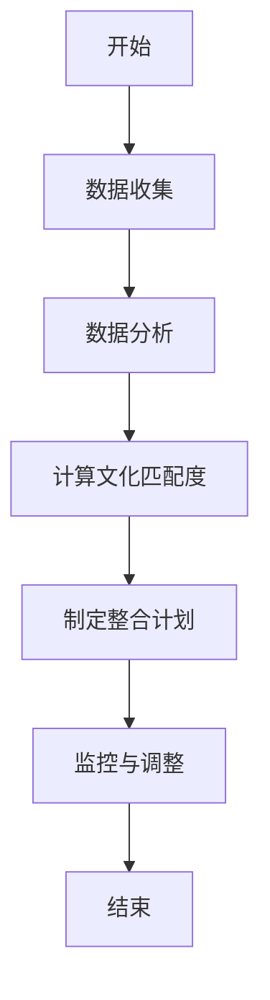

                 

# 彼得林奇对公司并购后文化整合成功率的评估

> 关键词：彼得·林奇、公司并购、文化整合、成功率评估、企业战略

> 摘要：本文深入探讨了彼得·林奇在公司并购后文化整合成功率的评估方法，结合其投资理念和实际案例，分析了文化整合的核心要素、影响因素以及评估模型，并提出了实际操作的步骤与策略。文章通过详细的分析和具体的案例，为读者提供了系统性的方法和工具，帮助他们在实际并购过程中更好地进行文化整合，从而提高并购的成功率。

---

## 第一部分: 公司并购与文化整合概述

### 第1章: 公司并购的基本概念与文化整合的重要性

#### 1.1 公司并购的定义与类型

##### 1.1.1 公司并购的定义
公司并购（Mergers and Acquisitions，简称M&A）是指一家公司（并购方）对另一家公司（被并购方）进行合并或收购的行为。并购可以通过多种方式进行，包括资产购买、股权收购、换股合并等。并购的目的是为了实现规模经济、获取技术优势、进入新市场或提升竞争力。

##### 1.1.2 公司并购的主要类型
1. **横向并购（Horizontal Mergers）**：指同一行业内的企业之间的并购，目的是扩大市场份额或消除竞争。
2. **纵向并购（Vertical Mergers）**：指产业链上下游的企业之间的并购，目的是整合供应链，提高效率。
3. **混合并购（Diversification Mergers）**：指不同行业或业务领域的企业之间的并购，目的是 diversification（多元化）。

##### 1.1.3 公司并购的动机与目标
1. **市场扩张**：通过并购进入新市场或扩大现有市场占有率。
2. **技术获取**：通过并购获取关键技术和知识产权。
3. **成本节约**：通过并购实现规模经济，降低生产成本。
4. **财务优化**：通过并购优化资本结构，降低融资成本。

#### 1.2 文化整合的定义与内涵

##### 1.2.1 文化整合的定义
文化整合是指在公司并购过程中，将被并购企业的文化和并购方的企业文化进行融合，形成一种新的文化体系。文化整合不仅仅是企业文化的简单结合，而是通过沟通、协调和融合，形成一种能够适应新战略目标的文化。

##### 1.2.2 文化整合的核心要素
1. **企业价值观**：包括企业的使命、愿景和核心价值观。
2. **企业制度**：包括企业的组织结构、管理制度和决策机制。
3. **企业行为规范**：包括员工的行为准则、沟通方式和工作习惯。

##### 1.2.3 文化整合与企业绩效的关系
文化整合的成功与否直接影响企业的绩效。成功的文化整合可以提高员工的凝聚力、增强企业的创新能力和市场竞争力；失败的文化整合可能导致员工士气低落、企业效率下降甚至并购失败。

#### 1.3 彼得·林奇与公司并购的背景

##### 1.3.1 彼得·林奇的投资者背景
彼得·林奇（Peter Lynch）是美国著名的职业棒球选手和棒球评论员，以他在棒球界的职业生涯和评论工作而闻名。他不仅在棒球领域有着卓越的表现，还在投资领域有着深刻的见解。林奇的投资理念强调长期价值、风险控制和对市场的深刻理解。

##### 1.3.2 彼得·林奇对并购的独特见解
林奇认为，并购不仅仅是数字游戏，更是文化和战略的整合。他强调在并购过程中，必须重视被并购企业的文化和价值观，确保双方在战略目标和企业文化的高度一致。

##### 1.3.3 并购后文化整合的现实意义
文化整合是并购成功的关键因素之一。通过文化整合，可以实现企业战略的协同、组织的高效运转和员工的高效配合，从而提高并购后的绩效。

---

### 第2章: 文化整合的核心概念与影响因素

#### 2.1 文化整合的核心概念

##### 2.1.1 企业文化的定义与特征
企业文化是企业在长期的经营活动中形成的，由企业愿景、使命、核心价值观、管理风格和员工行为规范等构成。企业文化具有独特性、稳定性、渗透性和导向性等特点。

##### 2.1.2 文化整合的复杂性与挑战
文化整合的复杂性主要体现在：
1. 企业文化的多样性：不同企业有不同的文化背景和价值观。
2. 文化冲突：由于文化差异导致的摩擦和矛盾。
3. 整合难度：文化整合需要时间和资源，且容易受到外部环境的影响。

##### 2.1.3 文化整合的目标与路径
文化整合的目标是实现企业文化的融合，形成一种新的文化体系，以支持企业的战略目标。文化整合的路径包括：
1. 理解与尊重：理解被并购企业的文化，尊重其文化特点。
2. 沟通与协调：通过沟通和协调，消除文化冲突，实现文化融合。
3. 文化融合：将两种文化的核心要素结合起来，形成新的文化体系。

#### 2.2 影响文化整合的主要因素

##### 2.2.1 企业战略与文化匹配度
企业战略与文化匹配度是文化整合的关键因素之一。如果被并购企业的文化与并购方的战略目标不一致，文化整合的难度会大大增加。

##### 2.2.2 领导层的作用与风格
领导层在文化整合中起着至关重要的作用。领导层的风格、决策能力和沟通能力直接影响文化整合的效果。

##### 2.2.3 员工的文化适应性
员工的文化适应性是文化整合的重要因素。如果员工能够快速适应新的文化环境，文化整合的效果会更加显著。

#### 2.3 文化整合的评估维度

##### 2.3.1 企业文化融合度
企业文化融合度是指并购后的企业文化与原并购方和被并购方的文化的融合程度。

##### 2.3.2 员工满意度与忠诚度
员工满意度和忠诚度是文化整合的重要评估指标。员工满意度高、忠诚度高的企业，文化整合的效果较好。

##### 2.3.3 绩效指标与整合效果
绩效指标是文化整合效果的重要评估标准。包括企业销售额、利润率、员工生产力等指标。

---

### 第3章: 彼得·林奇的文化整合评估模型

#### 3.1 模型的构建与核心要素

##### 3.1.1 模型的构建逻辑
彼得·林奇的文化整合评估模型基于以下逻辑：
1. 并购前的文化评估：了解被并购企业的文化特点和文化优势。
2. 并购后的整合计划制定：根据文化评估结果，制定文化整合计划。
3. 整合过程中的监控与调整：在整合过程中，实时监控整合效果，并根据实际情况进行调整。

##### 3.1.2 模型的核心要素与关系
1. 并购前的文化评估：包括企业愿景、使命、核心价值观、管理风格等。
2. 整合计划：包括文化融合策略、沟通机制、培训计划等。
3. 整合效果：包括企业文化融合度、员工满意度、绩效指标等。

##### 3.1.3 模型的适用范围与边界
彼得·林奇的文化整合评估模型适用于各种类型的公司并购，尤其是那些注重企业文化和战略协同的并购。

#### 3.2 模型的具体步骤与实施方法

##### 3.2.1 并购前的文化评估
1. **文化评估**：通过问卷调查、访谈等方式，评估被并购企业的企业文化。
2. **文化匹配度分析**：分析并购方和被并购方的文化匹配度。

##### 3.2.2 并购后的整合计划制定
1. **文化融合策略**：制定文化融合的具体策略，如文化培训、文化宣导等。
2. **沟通机制**：建立有效的沟通机制，确保双方的文化信息能够及时传递和理解。

##### 3.2.3 整合过程中的监控与调整
1. **整合效果监控**：定期监控整合效果，包括员工满意度、绩效指标等。
2. **整合策略调整**：根据监控结果，及时调整整合策略，确保整合目标的实现。

#### 3.3 模型的优缺点与实际应用

##### 3.3.1 模型的优缺点
1. **优点**：彼得·林奇的文化整合评估模型具有科学性和实用性，能够有效指导企业进行文化整合。
2. **缺点**：模型的实施需要较高的资源投入，且需要企业具备较强的文化管理能力。

##### 3.3.2 模型的实际应用
彼得·林奇的文化整合评估模型已经在多个并购案例中得到应用，并取得了显著的效果。例如，在某次横向并购中，通过该模型成功实现了双方文化的融合，提高了企业的绩效。

---

## 第四章: 彼得·林奇的文化整合评估模型的数学模型与算法原理

### 4.1 文化整合评估的数学模型

#### 4.1.1 文化匹配度的计算公式
文化匹配度的计算公式如下：

$$
文化匹配度 = \frac{相似性得分}{总得分} \times 100\%
$$

其中，相似性得分是根据并购方和被并购方的文化特征进行对比得出的得分，总得分是文化特征的总分数。

#### 4.1.2 整合效果的评估公式
整合效果的评估公式如下：

$$
整合效果 = \frac{绩效提升分数 + 员工满意度分数}{总分数} \times 100\%
$$

其中，绩效提升分数是并购后企业绩效的提升情况，员工满意度分数是员工满意度的提升情况，总分数是绩效提升分数和员工满意度分数的总和。

### 4.2 文化整合的算法原理

#### 4.2.1 算法步骤
1. **数据收集**：收集并购方和被并购方的文化特征数据。
2. **数据分析**：对文化特征数据进行分析，计算文化匹配度。
3. **制定整合计划**：根据文化匹配度，制定文化整合计划。
4. **监控与调整**：在整合过程中，实时监控整合效果，并根据实际情况进行调整。

#### 4.2.2 算法流程图

---

## 第五章: 彼得·林奇的文化整合评估模型的实际应用与案例分析

### 5.1 实际应用

#### 5.1.1 案例背景
某科技公司通过并购一家软件公司，希望实现技术互补和市场扩展。在并购过程中，该公司采用了彼得·林奇的文化整合评估模型，成功实现了文化的融合。

#### 5.1.2 应用步骤
1. **文化评估**：通过问卷调查和访谈，评估被并购公司的文化特征。
2. **文化匹配度分析**：分析并购方和被并购方的文化匹配度。
3. **制定整合计划**：根据文化匹配度，制定文化整合计划。
4. **监控与调整**：在整合过程中，实时监控整合效果，并根据实际情况进行调整。

#### 5.1.3 整合效果
通过彼得·林奇的文化整合评估模型，该公司成功实现了文化的融合，提高了员工的满意度和忠诚度，同时也提升了企业的绩效。

### 5.2 案例分析

#### 5.2.1 成功案例
某跨国公司通过并购一家小型企业，实现了文化的融合。在并购过程中，该公司采用了彼得·林奇的文化整合评估模型，成功地将被并购公司的文化与自身文化进行了融合。

#### 5.2.2 失败案例
某公司通过并购一家与自身文化差异较大的公司，但由于忽视了文化整合的重要性，导致了文化的冲突，最终并购失败。

#### 5.2.3 案例分析总结
文化整合是并购成功的关键因素之一。通过彼得·林奇的文化整合评估模型，企业可以更好地进行文化整合，提高并购的成功率。

---

## 第六章: 彼得·林奇的文化整合评估模型的未来趋势与挑战

### 6.1 未来趋势

#### 6.1.1 数字化转型对文化整合的影响
随着数字化转型的推进，文化整合的方式和手段也在发生变化。企业需要更加注重数字化文化整合，利用新技术实现文化的融合。

#### 6.1.2 全球化与文化整合
全球化背景下，文化整合的复杂性进一步增加。企业需要更加注重跨文化整合，以应对全球化带来的挑战。

#### 6.1.3 文化整合与企业创新
文化整合与企业创新密切相关。通过文化整合，企业可以更好地激发员工的创新潜能，提高企业的创新能力。

### 6.2 挑战与解决方案

#### 6.2.1 文化整合的复杂性
文化整合的复杂性主要体现在文化差异和文化冲突上。企业需要通过有效的沟通和协调，消除文化冲突，实现文化的融合。

#### 6.2.2 文化整合的资源投入
文化整合需要大量的资源投入，包括时间和资金。企业需要在资源投入上进行合理规划，确保文化整合的顺利进行。

#### 6.2.3 文化整合的效果评估
文化整合的效果评估是一个复杂的过程，需要企业采用科学的评估方法，确保评估结果的准确性。

---

## 第七章: 总结与展望

### 7.1 总结

#### 7.1.1 文化整合的重要性
文化整合是并购成功的关键因素之一。通过文化整合，企业可以实现战略目标的协同、组织的高效运转和员工的高效配合。

#### 7.1.2 彼得·林奇文化整合评估模型的价值
彼得·林奇的文化整合评估模型为企业的文化整合提供了一种科学的方法和工具，帮助企业更好地进行文化整合，提高并购的成功率。

#### 7.1.3 文化整合的未来发展方向
随着数字化转型和全球化的推进，文化整合的方式和手段也在发生变化。企业需要更加注重跨文化整合，以应对全球化带来的挑战。

### 7.2 展望

#### 7.2.1 数字化文化整合
未来，文化整合将更加注重数字化手段的应用。企业可以通过数字化工具实现文化的融合，提高文化整合的效率。

#### 7.2.2 跨文化整合
随着全球化的发展，跨文化整合将成为文化整合的重要方向。企业需要更加注重跨文化整合，以应对全球化带来的挑战。

#### 7.2.3 文化整合与企业创新
文化整合与企业创新密切相关。通过文化整合，企业可以更好地激发员工的创新潜能，提高企业的创新能力。

---

## 第八章: 作者信息

作者：AI天才研究院/AI Genius Institute & 禅与计算机程序设计艺术 /Zen And The Art of Computer Programming

