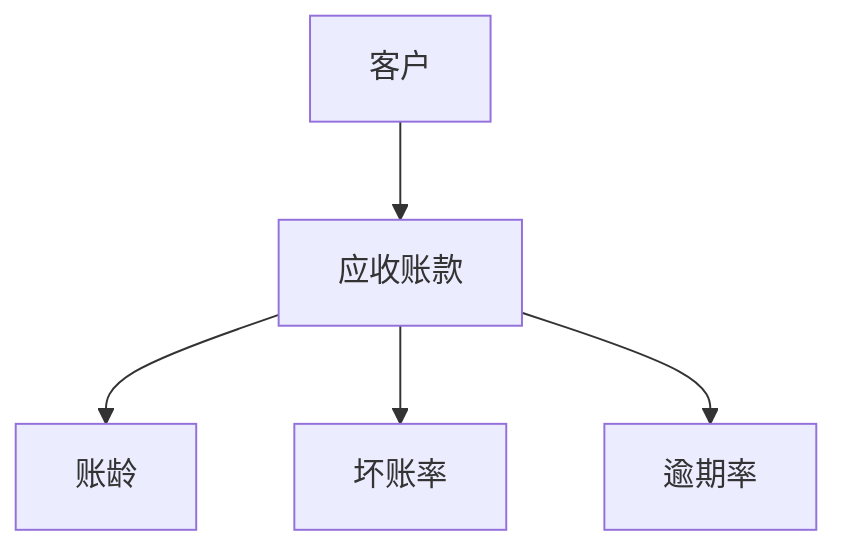
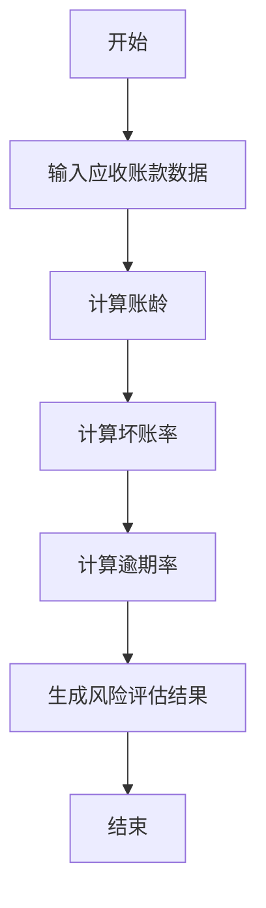
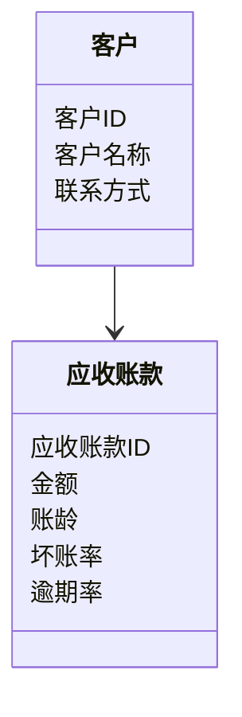

                 


# 彼得林奇对公司应收账款管理的看法

> 关键词：彼得·林奇，应收账款管理，投资策略，企业财务，风险管理

> 摘要：本文从彼得·林奇的投资理念出发，深入分析其对公司的应收账款管理的看法。通过探讨应收账款管理的核心概念、算法原理、系统架构以及项目实战，结合实际案例，全面解读如何将彼得·林奇的投资策略应用于企业的应收账款管理，帮助企业优化财务管理，降低风险，提升整体竞争力。

---

# 第1章: 背景介绍与核心概念

## 1.1 应收账款管理的定义与重要性

### 1.1.1 应收账款的定义

应收账款是企业在日常经营活动中，因销售商品、提供服务或出租资产而应向客户收取的款项。它是企业流动资产的重要组成部分，反映了企业在经营过程中的资金占用情况。

### 1.1.2 应收账款管理的重要性

应收账款管理是企业财务管理的核心内容之一。有效的应收账款管理可以帮助企业：

- 降低坏账风险，确保资金安全。
- 提高资金周转率，优化现金流。
- 维护客户关系，促进业务长期合作。
- 为企业的价值评估提供重要数据支持。

### 1.1.3 应收账款管理的核心目标

应收账款管理的核心目标是实现资金的高效回收，同时降低管理成本和风险。具体目标包括：

- 及时准确地记录和跟踪应收账款。
- 评估客户的信用风险，制定合理的收款策略。
- 监控账款回收情况，及时发现并解决潜在问题。

## 1.2 彼得·林奇与投资管理的关联

### 1.2.1 彼得·林奇的投资者身份

彼得·林奇是美国著名的基金经理，以其在投资领域的卓越表现闻名。他在投资过程中注重对企业基本面的分析，尤其是对企业的财务健康状况的关注。

### 1.2.2 投资管理与企业财务管理的联系

投资管理和企业财务管理密切相关。投资者在评估企业价值时，通常会关注企业的财务状况，包括应收账款、存货、负债等。应收账款作为企业流动资产的重要组成部分，直接影响企业的财务健康和投资价值。

### 1.2.3 应收账款管理在投资中的作用

在投资过程中，应收账款管理是评估企业财务状况的重要指标。投资者通常会关注企业的应收账款周转率、账龄分布以及坏账准备情况，以判断企业的资金回收能力、经营效率和财务风险。

## 1.3 应收账款管理的背景与现状

### 1.3.1 全球化背景下的应收账款管理

在全球化背景下，企业面临的市场环境更加复杂，应收账款管理的难度也在增加。跨国经营使得企业需要面对不同国家的信用政策、汇率波动等风险。

### 1.3.2 数字化对企业应收账款管理的影响

随着信息技术的发展，数字化技术正在改变应收账款的管理方式。企业可以通过ERP系统、大数据分析等工具，实现应收账款的自动化管理，提高管理效率和准确性。

### 1.3.3 当前企业应收账款管理的挑战与趋势

当前，企业应收账款管理面临的主要挑战包括：

- 客户信用风险增加。
- 应收账款周转率下降。
- 数字化管理技术的应用不足。

趋势则包括：

- 更加注重风险管理。
- 借助技术手段实现智能化管理。
- 强化应收账款的全过程管理。

---

## 1.4 本章小结

本章从应收账款管理的定义和重要性出发，探讨了彼得·林奇与投资管理的关联，以及应收账款管理在全球化和数字化背景下的现状和趋势。接下来的章节将深入分析应收账款管理的核心概念、算法原理、系统架构以及项目实战。

---

# 第2章: 应收账款管理的核心概念与联系

## 2.1 核心概念原理

### 2.1.1 应收账款的生命周期

应收账款的生命周期包括以下几个阶段：

1. **形成阶段**：企业因销售商品或提供服务而产生应收账款。
2. **跟踪阶段**：企业对应收账款进行记录和跟踪。
3. **评估阶段**：评估应收账款的风险，制定收款策略。
4. **回收阶段**：通过各种手段回收应收账款。
5. **核销阶段**：对无法收回的应收账款进行核销处理。

### 2.1.2 应收账款的分类与特征

应收账款可以按以下方式分类：

- 按账龄分类：分为逾期应收账款和未逾期应收账款。
- 按客户分类：分为优质客户应收账款和高风险客户应收账款。
- 按金额分类：分为大额应收账款和小额应收账款。

### 2.1.3 应收账款管理与企业财务健康的关系

应收账款管理是企业财务健康的重要组成部分。良好的应收账款管理可以：

- 提高企业的流动资金周转率。
- 降低企业的财务风险。
- 增强企业的信用能力。

---

## 2.2 核心概念属性特征对比表格

| 概念        | 特征         | 描述                                             |
|-------------|--------------|--------------------------------------------------|
| 应收账款    | 账龄         | 应收账款形成的时间长度                           |
|             | 坏账率       | 坏账金额占应收账款总额的比例                     |
|             | 逾期率       | 逾期账款占应收账款总额的比例                     |

---

## 2.3 ER实体关系图（Mermaid流程图）



---

## 2.4 本章小结

本章详细介绍了应收账款管理的核心概念，包括应收账款的生命周期、分类与特征，以及其与企业财务健康的关系。通过对比表格和ER实体关系图，进一步明确了应收账款管理的关键要素。

---

# 第3章: 应收账款管理的算法原理

## 3.1 算法原理概述

### 3.1.1 应收账款风险评估模型

应收账款风险评估模型是基于客户信用风险的评估，结合账龄、坏账率、逾期率等因素，对应收账款的回收风险进行量化评估。

### 3.1.2 信用评分模型

信用评分模型是通过对客户的信用信息进行分析，赋予各项指标一定的权重，计算出客户的信用评分，从而判断客户的还款能力。

### 3.1.3 算法的基本原理

应收账款风险评估模型和信用评分模型是基于统计学和机器学习的算法，通过历史数据训练模型，实现对手客户信用风险的预测和评估。

---

## 3.2 算法流程图（Mermaid）



---

## 3.3 算法数学模型与公式

### 3.3.1 应收账款风险评估公式

$$
风险评估结果 = \alpha \times 账龄 + \beta \times 坏账率 + \gamma \times 逾期率
$$

其中，$\alpha$、$\beta$、$\gamma$ 是各因素的权重系数。

### 3.3.2 信用评分模型

$$
信用评分 = \sum_{i=1}^{n} w_i \times x_i
$$

其中，$w_i$ 是第 $i$ 个特征的权重，$x_i$ 是第 $i$ 个特征的值。

---

## 3.4 算法实现与代码示例

### 3.4.1 环境安装

需要安装 Python 和相关库，例如 `pandas` 和 `scikit-learn`。

### 3.4.2 核心实现代码

```python
import pandas as pd
from sklearn.linear_model import LinearRegression

# 示例数据
data = {
    '账龄': [1, 2, 3, 4, 5],
    '坏账率': [0.1, 0.2, 0.3, 0.4, 0.5],
    '逾期率': [0.05, 0.1, 0.15, 0.2, 0.25]
}

df = pd.DataFrame(data)

# 训练模型
model = LinearRegression()
model.fit(df[['账龄', '坏账率']], df['逾期率'])

# 预测结果
new_data = {
    '账龄': [6],
    '坏账率': [0.6]
}
new_df = pd.DataFrame(new_data)
预测结果 = model.predict(new_df[['账龄', '坏账率']])
print(预测结果)
```

---

## 3.5 本章小结

本章通过数学模型和算法流程图，详细讲解了应收账款管理的算法原理。通过Python代码示例，进一步展示了如何利用机器学习算法实现应收账款风险评估和信用评分。

---

# 第4章: 应收账款管理的系统架构与设计

## 4.1 系统分析与架构设计方案

### 4.1.1 问题场景介绍

企业应收账款管理系统需要实现对手客户的信用评估、账款跟踪、风险预警等功能。

### 4.1.2 系统功能设计

- **领域模型**：定义系统的核心实体和关系。



- **系统架构设计**


---

## 4.2 项目实战

### 4.2.1 环境安装

安装 Python 和相关库，例如 `Django` 或 `Flask`。

### 4.2.2 核心实现代码

```python
from django.db import models

class Customer(models.Model):
    customer_id = models.CharField(max_length=50)
    customer_name = models.CharField(max_length=100)
    contact_info = models.CharField(max_length=200)

class AccountsReceivable(models.Model):
    ar_id = models.CharField(max_length=50)
    amount = models.DecimalField(max_digits=10, decimal_places=2)
    customer = models.ForeignKey(Customer, on_delete=models.CASCADE)
    days_past_due = models.IntegerField()
    bad_debt_ratio = models.DecimalField(max_digits=5, decimal_places=4)
    overdue_ratio = models.DecimalField(max_digits=5, decimal_places=4)
```

---

## 4.3 本章小结

本章通过系统架构设计和项目实战，展示了如何将应收账款管理的理论应用于实际系统开发。通过领域模型和系统架构图，进一步明确了系统的实现方式。

---

# 第5章: 应收账款管理的最佳实践与注意事项

## 5.1 最佳实践

### 5.1.1 定期评估客户信用风险

企业应定期评估客户的信用风险，及时调整收款策略。

### 5.1.2 建立完善的应收账款管理制度

制定明确的应收账款管理流程和制度，确保管理的规范性。

### 5.1.3 借助技术手段实现智能化管理

利用ERP系统、大数据分析等技术手段，提高应收账款管理的效率和准确性。

---

## 5.2 注意事项

### 5.2.1 风险控制

企业应注重应收账款的风险控制，合理计提坏账准备，避免因应收账款问题导致的财务损失。

### 5.2.2 数据安全

在应收账款管理的信息化过程中，企业应注意数据安全，防止数据泄露和丢失。

### 5.2.3 持续优化

应收账款管理是一个动态过程，企业应根据实际情况，不断优化管理策略和方法。

---

## 5.3 本章小结

本章总结了应收账款管理的最佳实践和注意事项，为企业提供了具体的指导和建议。

---

# 第6章: 总结与展望

## 6.1 总结

通过本文的分析，我们可以看出应收账款管理是企业财务管理的重要组成部分，而彼得·林奇的投资理念为我们提供了全新的视角。通过科学的管理方法和先进技术的应用，企业可以有效降低应收账款管理的风险，提高资金周转效率。

## 6.2 展望

随着人工智能和大数据技术的不断发展，应收账款管理将更加智能化和精准化。未来，企业可以通过更加先进的技术手段，实现应收账款管理的全面升级，进一步提升企业的竞争力。

---

# 作者：AI天才研究院/AI Genius Institute & 禅与计算机程序设计艺术 /Zen And The Art of Computer Programming

---

以上是《彼得林奇对公司应收账款管理的看法》的文章目录大纲和内容概要。希望这篇文章能够为企业提供有价值的参考，帮助企业在应收账款管理方面实现更高效的管理。

