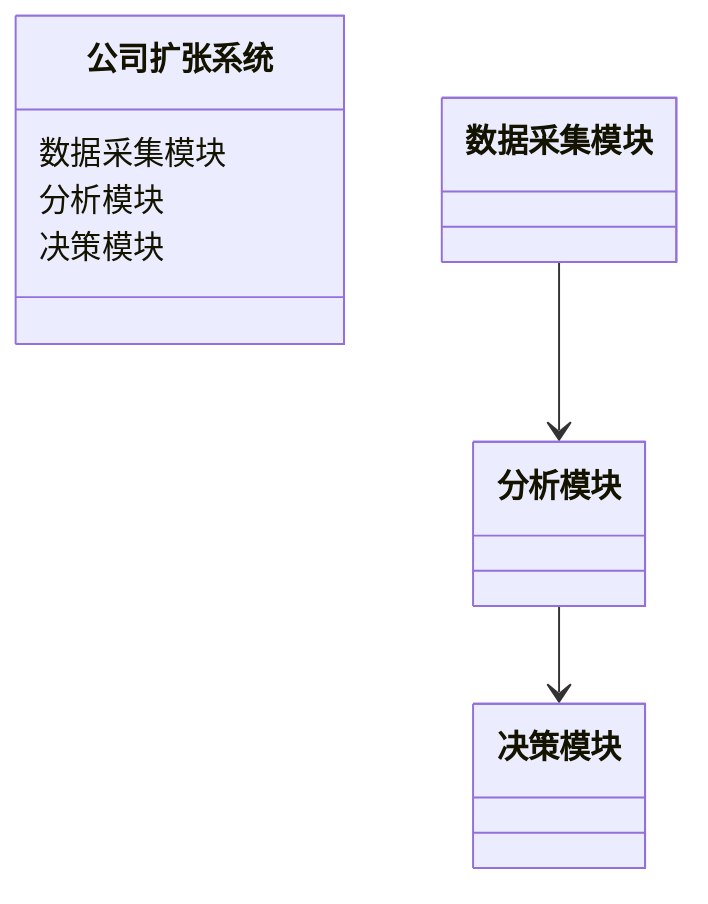

                 


# 彼得林奇对公司扩张策略的看法

## 关键词
- 彼得林奇
- 公司扩张
- 投资策略
- 市场分析
- 财务指标

## 摘要
彼得林奇作为全球著名投资专家，以其独特的基本面分析和风险管理能力闻名。本文从彼得林奇的视角出发，系统阐述公司扩张策略的核心概念、分析框架、数学模型、系统架构及实战案例。通过ROE和ROA等关键财务指标的分析，结合企业扩张的系统架构设计和项目实战，本文详细解读了彼得林奇如何评估公司扩张的可行性，并提供可操作的实战方案。最后，本文总结了公司扩张的关键点和注意事项，为读者提供了深刻的见解和实用的建议。

## 第一部分：公司扩张的背景与核心概念

### 第1章：公司扩张的背景与重要性

#### 1.1 公司扩张的定义与边界
公司扩张是指企业在现有基础上，通过多种方式扩大业务范围、市场份额或资产规模的过程。常见的扩张方式包括内生增长、并购、战略联盟等。公司扩张的边界在于资源分配效率与风险控制的平衡，过度扩张可能导致资源分散和管理难度增加，而适度扩张则有助于提升企业的竞争力和抗风险能力。

#### 1.2 彼得林奇的背景与投资理念
彼得林奇是全球著名投资专家，以其管理的麦哲伦基金创造了辉煌的投资业绩。他强调基本面分析，认为企业的内在价值是投资的核心。彼得林奇的分析框架涵盖了企业的财务状况、市场地位、管理团队等多个维度，尤其关注企业的可持续增长能力。

### 第2章：公司扩张的核心概念与联系

#### 2.1 公司扩张的核心概念
公司扩张涉及多个核心概念，包括驱动因素、扩张模式和优缺点。驱动因素包括市场需求、竞争压力和资源利用效率；扩张模式包括内生增长、并购和战略联盟；优缺点则体现在市场占有率提升的同时，也面临资源分散和管理难度增加的问题。

#### 2.2 核心概念属性对比表格
| 属性       | 描述                                                                 |
|------------|----------------------------------------------------------------------|
| 驱动力     | 市场需求、竞争压力、资源利用效率等                                       |
| 扩张模式   | 内生增长、并购、战略联盟等                                             |
| 优缺点     | 优点：扩大市场份额、增强竞争力；缺点：资源分散、管理难度增加等       |

#### 2.3 实体关系图
```mermaid
er
  actor 公司 {
    <-(1,n) 扩张策略
    <-(1,n) 驱动因素
    <-(1,n) 模式选择
  }
```

## 第二部分：公司扩张的分析框架与数学模型

### 第3章：公司扩张的分析框架

#### 3.1 分析框架原理
彼得林奇的公司扩张分析框架基于基本面分析，重点关注企业的财务指标、市场环境和竞争态势。通过分析这些因素，彼得林奇能够评估企业的扩张可行性，并制定相应的投资策略。

#### 3.2 分析框架的数学模型
彼得林奇的分析框架依赖于关键财务指标，如ROE和ROA。

- ROE（净资产收益率）：衡量企业使用股东资产的效率。
$$ROE = \frac{净利润}{股东权益}$$

- ROA（资产回报率）：衡量企业利用资产的效率。
$$ROA = \frac{净利润}{平均资产总额}$$

### 第4章：数学模型与算法原理

#### 4.1 算法原理
彼得林奇的分析框架通过计算ROE和ROA，评估企业的盈利能力和资产利用效率，从而判断企业扩张的可行性。

#### 4.2 算法实现
以下是Python代码实现：

```python
def calculate_roe(net_profit, shareholders_equity):
    return net_profit / shareholders_equity

def calculate_roa(net_profit, average_assets):
    return net_profit / average_assets

# 示例数据
net_profit = 1000000  # 净利润（美元）
shareholders_equity = 5000000  # 股东权益（美元）
average_assets = 10000000  # 平均资产总额（美元）

roe = calculate_roe(net_profit, shareholders_equity)
roa = calculate_roa(net_profit, average_assets)

print(f"ROE: {roe:.2f}%")
print(f"ROA: {roa:.2f}%")
```

### 第5章：系统架构与设计

#### 5.1 系统架构设计
企业扩张的系统架构包括数据采集模块、分析模块和决策模块。



## 第三部分：项目实战与总结

### 第6章：项目实战

#### 6.1 项目背景与环境
选择一家科技公司XYZ作为案例，分析其扩张策略。

#### 6.2 核心实现
计算XYZ公司的ROE和ROA，评估其扩张可行性。

```python
net_profit_xyz = 1500000  # 净利润
shareholders_equity_xyz = 7500000  # 股东权益
average_assets_xyz = 15000000  # 平均资产

roe_xyz = calculate_roe(net_profit_xyz, shareholders_equity_xyz)
roa_xyz = calculate_roa(net_profit_xyz, average_assets_xyz)

print(f"XYZ公司 ROE: {roe_xyz:.2f}%")
print(f"XYZ公司 ROA: {roa_xyz:.2f}%")
```

#### 6.3 实战总结
通过计算，XYZ公司的ROE和ROA均高于行业平均水平，具备扩张的可行性。彼得林奇的分析框架帮助我们确认了XYZ公司的扩张策略是合理的。

### 第7章：总结与最佳实践

#### 7.1 总结
彼得林奇的公司扩张策略强调基本面分析和风险管理。通过ROE和ROA等关键指标的分析，投资者可以评估企业的扩张可行性。

#### 7.2 最佳实践
- 定期评估企业的财务指标
- 关注企业的市场环境和竞争态势
- 保持对企业的持续跟踪和分析

#### 7.3 注意事项
- 公司扩张需考虑资源分配效率
- 风险管理是扩张成功的关键
- 定期复盘和调整扩张策略

## 第四部分：扩展阅读

- 彼得林奇的《投资之道》
- 其他投资经典书籍

## 作者
作者：AI天才研究院 & 禅与计算机程序设计艺术

---

通过以上结构，文章详细解读了彼得林奇的公司扩张策略，从理论分析到实际操作，为读者提供了全面的指导和实用的建议。

