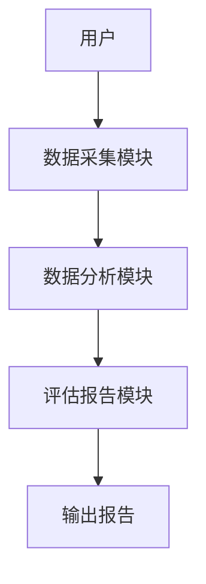

                 


# 彼得林奇对公司技术优势的评估

> 关键词：彼得林奇，技术优势，公司评估，投资决策，竞争优势

> 摘要：本文深入分析了彼得·林奇对公司技术优势的评估方法，探讨了技术优势在企业竞争中的作用，以及如何通过技术优势评估来制定投资策略。文章从背景介绍、核心概念、算法原理、数学模型、系统分析、项目实战等多个维度展开，全面解析了技术优势评估的核心要素及其在投资决策中的应用。

---

## 第一部分：彼得林奇对公司技术优势的评估概述

### 第1章：技术优势评估的背景与重要性

#### 1.1 技术优势评估的背景

技术优势是企业在市场竞争中保持领先地位的关键因素。彼得·林奇作为全球知名的投资专家，提出了技术优势评估的方法，帮助投资者识别具有长期竞争优势的企业。技术优势不仅包括技术创新，还包括技术的可行性和可持续性。

#### 1.2 技术优势在企业竞争中的作用

- 技术优势是企业核心竞争力的体现。
- 技术优势能够降低生产成本，提高产品质量。
- 技术优势是企业抵御竞争对手的重要手段。

#### 1.3 彼得·林奇的分析框架

彼得·林奇的技术优势评估框架包括以下几个方面：

1. 技术创新性：技术是否具有创新性，是否能够带来新的市场机会。
2. 技术可行性：技术是否能够在实际应用中落地，是否具有可操作性。
3. 技术可持续性：技术是否能够长期保持竞争优势，是否具有持续改进的潜力。

---

### 第2章：彼得·林奇的技术优势分析框架

#### 2.1 彼得·林奇的分析方法

彼得·林奇的技术优势评估方法主要包括以下几个步骤：

1. 技术识别：识别企业的核心技术及其应用场景。
2. 技术量化：将技术优势转化为可量化的指标。
3. 技术动态跟踪：持续关注技术的演变和市场竞争的变化。

#### 2.2 技术优势评估的核心要素

- 技术创新性：技术是否具有独特的创新点，是否能够为企业的业务带来新的增长点。
- 技术可行性：技术是否能够在实际应用中实现，是否具有技术可行性。
- 技术可持续性：技术是否能够在长期的竞争中保持优势，是否具有持续改进的潜力。

---

## 第二部分：技术优势评估的核心概念与联系

### 第3章：技术优势的构成要素

#### 3.1 技术优势的构成要素

1. 技术创新性：技术是否具有独特的创新点，是否能够为企业的业务带来新的增长点。
2. 技术可行性：技术是否能够在实际应用中实现，是否具有技术可行性。
3. 技术可持续性：技术是否能够在长期的竞争中保持优势，是否具有持续改进的潜力。

#### 3.2 技术优势与竞争优势的关系

- 技术优势是竞争优势的核心来源。
- 技术优势能够提高企业的市场地位，增强企业的盈利能力。
- 技术优势是企业应对市场竞争的重要手段。

---

### 第4章：技术优势与竞争优势的联系

#### 4.1 技术优势对竞争优势的影响

1. 技术优势能够提高企业的市场地位，增强企业的盈利能力。
2. 技术优势是企业应对市场竞争的重要手段。
3. 技术优势是企业核心竞争力的体现。

#### 4.2 技术优势与竞争优势的对比

通过对比技术优势和竞争优势，可以更好地理解技术优势在企业竞争中的作用。以下是技术优势与竞争优势的对比表格：

| **属性**       | **技术优势**             | **竞争优势**           |
|----------------|--------------------------|------------------------|
| **定义**       | 技术的独特性和先进性     | 企业在市场中的优势     |
| **核心要素**   | 技术创新性、可行性、可持续性 | 价格、质量、品牌、服务等 |
| **影响因素**   | 技术研发能力、技术储备    | 市场需求、竞争环境、企业资源等 |
| **作用**       | 提高企业竞争力，降低生产成本 | 增强企业的市场地位，提升企业的盈利能力 |

---

## 第三部分：技术优势评估的算法原理

### 第5章：技术优势评估的算法原理

#### 5.1 算法原理概述

彼得·林奇的技术优势评估方法主要包括以下几个步骤：

1. 数据采集：收集企业的技术信息，包括技术创新性、技术可行性、技术可持续性等方面的数据。
2. 数据分析：通过数据分析，量化技术优势的各个维度。
3. 综合评估：将各个维度的评估结果进行综合，得出企业的技术优势得分。

#### 5.2 算法实现

以下是彼得·林奇技术优势评估算法的Python代码示例：

```python
def calculate_technical_advantage(company_technology_info):
    innovation = company_technology_info['innovation']
    feasibility = company_technology_info['feasibility']
    sustainability = company_technology_info['sustainability']
    
    total_score = (innovation + feasibility + sustainability) / 3
    return total_score

# 示例数据
company_technology_info = {
    'innovation': 8,
    'feasibility': 7,
    'sustainability': 9
}

advantage_score = calculate_technical_advantage(company_technology_info)
print(f"技术优势得分：{advantage_score}")
```

---

### 第6章：技术优势评估的数学模型

#### 6.1 技术优势评估的数学模型

技术优势评估的数学模型如下：

$$
\text{技术优势得分} = \frac{\text{技术创新性} + \text{技术可行性} + \text{技术可持续性}}{3}
$$

其中，技术创新性、技术可行性和技术可持续性均采用1-10分的评分标准。

#### 6.2 案例分析

假设某公司的技术优势评分为：

$$
\text{技术创新性} = 9, \quad \text{技术可行性} = 8, \quad \text{技术可持续性} = 7
$$

则技术优势得分为：

$$
\text{技术优势得分} = \frac{9 + 8 + 7}{3} = 8
$$

---

## 第四部分：技术优势评估的系统分析与架构设计

### 第7章：系统分析与架构设计

#### 7.1 系统功能设计

以下是技术优势评估系统的功能模块：

1. 数据采集模块：收集企业的技术信息。
2. 数据分析模块：对技术信息进行分析和处理。
3. 评估报告模块：生成技术优势评估报告。

#### 7.2 系统架构设计

以下是技术优势评估系统的架构图：



---

## 第五部分：项目实战

### 第8章：项目实战

#### 8.1 环境安装

以下是技术优势评估系统的环境安装步骤：

1. 安装Python：https://www.python.org/downloads/
2. 安装必要的库：`pip install pandas numpy`

#### 8.2 核心代码实现

以下是技术优势评估系统的Python代码示例：

```python
import pandas as pd
import numpy as np

def calculate_technical_advantage(technology_data):
    innovation = technology_data['innovation']
    feasibility = technology_data['feasibility']
    sustainability = technology_data['sustainability']
    
    total_score = (innovation + feasibility + sustainability) / 3
    return total_score

# 示例数据
technology_data = pd.DataFrame({
    'innovation': [8, 7, 9],
    'feasibility': [6, 8, 7],
    'sustainability': [7, 9, 6]
})

# 计算技术优势得分
technology_data['advantage_score'] = technology_data.apply(lambda x: calculate_technical_advantage(x), axis=1)

print(technology_data)
```

---

## 第六部分：总结与展望

### 第9章：总结与展望

#### 9.1 总结

本文深入分析了彼得·林奇对公司技术优势的评估方法，探讨了技术优势在企业竞争中的作用，以及如何通过技术优势评估来制定投资策略。文章从背景介绍、核心概念、算法原理、数学模型、系统分析、项目实战等多个维度展开，全面解析了技术优势评估的核心要素及其在投资决策中的应用。

#### 9.2 展望

未来，随着技术的不断发展，技术优势评估的方法和工具也将不断完善。投资者需要更加关注技术的创新性和可持续性，以应对日益激烈的市场竞争。

---

## 作者

作者：AI天才研究院/AI Genius Institute & 禅与计算机程序设计艺术 /Zen And The Art of Computer Programming

---

以上是《彼得林奇对公司技术优势的评估》的文章内容，涵盖了技术优势评估的背景、核心概念、算法原理、数学模型、系统分析、项目实战等多个方面，希望对您有所帮助！

