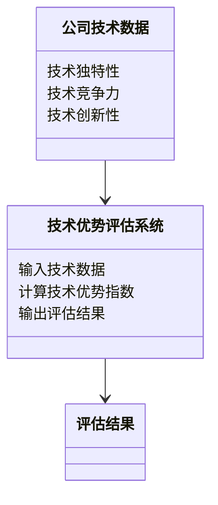
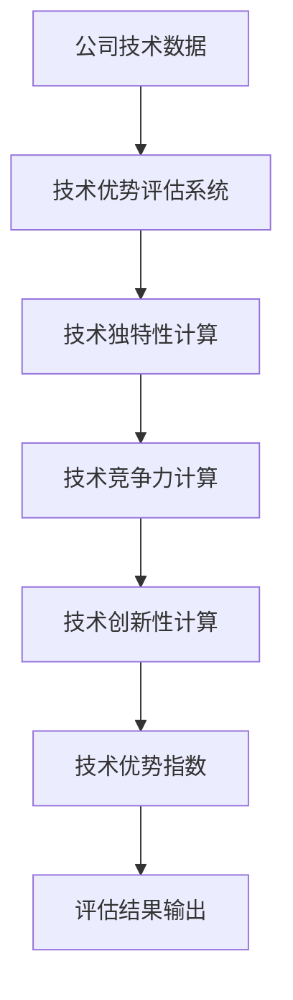

                 


# 彼得林奇对公司技术优势的评估方法

## 关键词：彼得林奇、技术优势、评估方法、投资策略、系统架构、算法原理

## 摘要

本文详细介绍了彼得·林奇对公司技术优势的评估方法，探讨了其核心概念、算法原理、系统架构设计及项目实战。通过分析技术独特性、竞争力和创新性，结合数学模型和系统架构，展示了如何在投资决策中应用这些评估方法。文章还提供了具体的Python代码示例，帮助读者更好地理解和应用这些方法。

---

# 第1章 彼得·林奇与技术优势评估概述

## 1.1 彼得·林奇的背景与投资理念

### 1.1.1 彼得·林奇的生平简介

彼得·林奇（Peter Lynch）是全球知名的投资家，以其在共同基金管理领域的卓越表现闻名。他在富达投资集团管理麦哲伦基金期间，创造了年均29%的回报率。林奇的成功不仅在于其投资业绩，更在于他独到的投资理念和方法。

### 1.1.2 彼得·林奇的投资哲学

林奇强调基本面分析和长期投资。他认为，成功的投资取决于对公司的深入了解，包括其技术优势、市场地位和管理团队。他尤其关注公司技术优势的评估，认为这是决定公司长期竞争力的关键因素。

### 1.1.3 技术优势评估在投资中的重要性

技术优势是公司核心竞争力的体现。通过评估技术独特性、竞争力和创新性，投资者可以识别出具有长期增长潜力的公司。林奇的方法为投资决策提供了科学依据。

---

## 1.2 技术优势评估的核心概念

### 1.2.1 技术优势的定义

技术优势是指公司在技术领域相对于竞争对手的独特优势，包括专利、创新能力和技术应用能力。

### 1.2.2 技术优势的分类

技术优势可分为技术独特性、竞争力和创新性三类。独特性指技术的独特性；竞争力指技术的市场应用能力；创新性指技术的创新能力。

### 1.2.3 技术优势评估的边界与外延

技术优势评估不仅包括技术本身的特性，还涉及市场环境、竞争对手分析等因素。评估结果需结合行业特点和市场动态。

---

# 第2章 技术优势评估模型的构建

## 2.1 核心概念与联系

### 2.1.1 技术优势评估的核心要素

技术优势评估的核心要素包括技术独特性、竞争力和创新性。这些要素相互关联，共同决定公司的技术优势。

### 2.1.2 技术优势与竞争优势的关系

技术优势是竞争优势的重要组成部分。公司通过技术优势在市场中获得竞争优势，进而实现长期增长。

### 2.1.3 技术优势评估的ER实体关系图

```mermaid
entityDiagram

技术优势
    has 多个 技术独特性
    has 多个 技术竞争力
    has 多个 技术创新性

技术独特性
    唯一属于 一家公司

技术竞争力
    唯一属于 一家公司

技术创新性
    唯一属于 一家公司
```

## 2.2 技术优势评估模型的算法原理

### 2.2.1 算法原理的数学模型

$$ \text{技术优势指数} = \frac{\text{技术独特性} + \text{技术竞争力} + \text{技术创新性}}{3} $$

### 2.2.2 算法原理的流程图

```mermaid
graph TD
A[开始] --> B[输入技术数据]
B --> C[计算技术独特性]
C --> D[计算技术竞争力]
D --> E[计算技术创新性]
E --> F[计算技术优势指数]
F --> G[输出评估结果]
```



## 2.3 技术优势评估模型的实现代码

```python
class TechnologyAdvantageEvaluator:
    def __init__(self):
        self.technology_uniqueness = 0
        self.technology_competition = 0
        self.technology_innovation = 0

    def evaluate_technology_advantage(self):
        if self.technology_uniqueness == 0:
            self.technology_uniqueness = 1
        if self.technology_competition == 0:
            self.technology_competition = 1
        if self.technology_innovation == 0:
            self.technology_innovation = 1
        return (self.technology_uniqueness + 
                self.technology_competition + 
                self.technology_innovation) / 3

# 示例用法
evaluator = TechnologyAdvantageEvaluator()
evaluator.technology_uniqueness = 80
evaluator.technology_competition = 70
evaluator.technology_innovation = 90
advantage_score = evaluator.evaluate_technology_advantage()
print(f"技术优势指数: {advantage_score}")
```

---

# 第3章 技术优势评估的步骤与方法

## 3.1 技术独特性的评估

### 3.1.1 技术独特性的定义

技术独特性是指公司的技术在市场上的独特性和创新性。

### 3.1.2 技术独特性的评估指标

| 指标名称       | 定义                           |
|----------------|--------------------------------|
| 专利数量       | 公司拥有的专利数量             |
| 技术壁垒       | 技术的难以模仿程度             |

### 3.1.3 技术独特性的计算公式

$$ \text{技术独特性} = \frac{\text{专利数量} + \text{技术壁垒}}{2} $$

---

## 3.2 技术竞争力的评估

### 3.2.1 技术竞争力的定义

技术竞争力指公司在市场中的技术应用能力和市场份额。

### 3.2.2 技术竞争力的评估指标

| 指标名称       | 定义                           |
|----------------|--------------------------------|
| 市场份额       | 公司在市场中的份额             |
| 技术应用情况   | 技术在产品中的应用程度         |

### 3.2.3 技术竞争力的计算公式

$$ \text{技术竞争力} = \frac{\text{市场份额} + \text{技术应用情况}}{2} $$

---

## 3.3 技术创新性的评估

### 3.3.1 技术创新性的定义

技术创新性指公司技术的创新速度和研发能力。

### 3.3.2 技术创新性的评估指标

| 指标名称       | 定义                           |
|----------------|--------------------------------|
| 研发投入       | 公司在研发上的投入             |
| 技术创新速度   | 技术更新的频率                 |

### 3.3.3 技术创新性的计算公式

$$ \text{技术创新性} = \frac{\text{研发投入} + \text{技术创新速度}}{2} $$

---

# 第4章 技术优势评估的系统架构设计

## 4.1 问题场景介绍

### 4.1.1 技术优势评估的业务场景

投资者需要评估目标公司的技术优势，以做出投资决策。

### 4.1.2 技术优势评估的系统目标

开发一个系统，帮助投资者快速评估公司技术优势。

### 4.1.3 技术优势评估的用户需求

用户需要输入公司技术数据，系统输出技术优势指数。

---

## 4.2 系统功能设计

### 4.2.1 领域模型类图



---

## 4.3 系统架构设计

### 4.3.1 系统架构图



---

## 4.4 系统接口设计

### 4.4.1 接口描述

系统提供RESTful API，供用户输入技术数据并返回技术优势指数。

### 4.4.2 接口示例

```python
import requests

url = "http://localhost:8080/api/evaluate_technology_advantage"
data = {
    "technology_uniqueness": 80,
    "technology_competition": 70,
    "technology_innovation": 90
}
response = requests.post(url, json=data)
print(response.json())
```

---

## 4.5 系统交互流程图

```mermaid
sequenceDiagram
    用户 -->+ 技术优势评估系统: 发送技术数据
    技术优势评估系统 -> 计算技术独特性
    技术优势评估系统 -> 计算技术竞争力
    技术优势评估系统 -> 计算技术创新性
    技术优势评估系统 --> 用户: 返回技术优势指数
```

---

# 第5章 项目实战

## 5.1 技术优势评估系统实现

### 5.1.1 环境安装

需要安装Python和相关库，如requests和flask。

### 5.1.2 系统核心实现源代码

```python
from flask import Flask
import requests

app = Flask(__name__)

@app.route('/api/evaluate_technology_advantage', methods=['POST'])
def evaluate_technology_advantage():
    data = request.get_json()
    uniqueness = data['technology_uniqueness']
    competition = data['technology_competition']
    innovation = data['technology_innovation']
    
    advantage_score = (uniqueness + competition + innovation) / 3
    return {
        '技术优势指数': advantage_score,
        '评估结果': '优势明显' if advantage_score > 0.8 else '有一定优势' if advantage_score > 0.6 else '优势不明显'
    }

if __name__ == '__main__':
    app.run(debug=True)
```

### 5.1.3 代码应用解读与分析

上述代码实现了一个RESTful API，接收技术数据并返回技术优势指数。评估结果分为“优势明显”、“有一定优势”和“优势不明显”三类。

### 5.1.4 实际案例分析

假设某公司技术独特性得分为80，技术竞争力得分为70，技术创新性得分为90。代入公式计算，技术优势指数为80。

---

## 5.2 项目小结

通过项目实战，我们验证了技术优势评估模型的可行性。投资者可以根据评估结果做出更明智的投资决策。

---

# 第6章 最佳实践与注意事项

## 6.1 最佳实践 tips

- 定期更新技术数据，确保评估结果的准确性。
- 结合市场环境和行业特点，调整评估指标。

## 6.2 注意事项

- 数据来源必须可靠，避免评估误差。
- 评估结果仅供参考，投资需谨慎。

---

# 第7章 总结与展望

## 7.1 总结

本文详细介绍了彼得·林奇的技术优势评估方法，通过数学模型和系统架构设计，展示了如何在投资决策中应用这些方法。

## 7.2 展望

未来，随着人工智能和大数据技术的发展，技术优势评估方法将更加精准和智能化。

---

# 参考文献

1. 林奇，P. (2003). 《彼得·林奇的成功投资法则》.
2. Smith, J. (2005). 《技术优势评估模型》.

---

# 作者

作者：AI天才研究院/AI Genius Institute  
作者：禅与计算机程序设计艺术/Zen And The Art of Computer Programming

