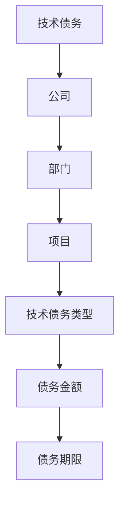
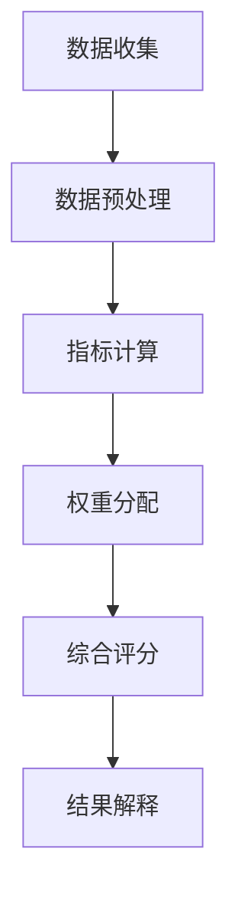
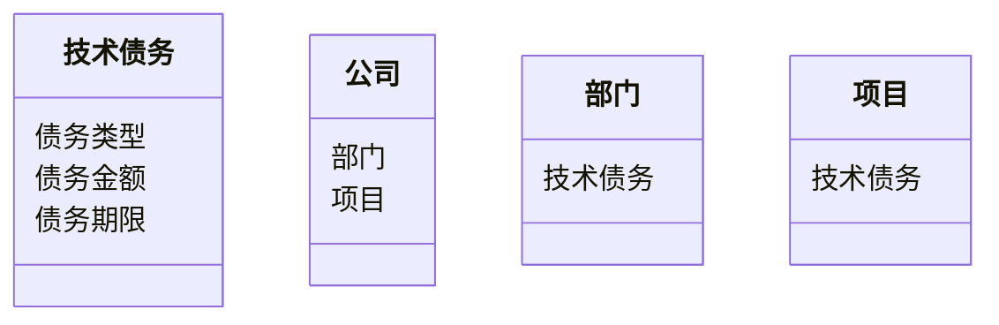

                 


# 彼得林奇对公司技术债务管理能力的评估

> 关键词：彼得·林奇、技术债务、公司管理、投资评估、技术债务管理

> 摘要：本文深入探讨了彼得·林奇对技术债务管理能力的评估方法，分析了技术债务对公司的具体影响，构建了技术债务管理能力的评估模型，并结合实际案例进行了详细讲解。

---

# 第一部分: 技术债务管理与彼得·林奇的评估框架

## 第1章: 技术债务管理的背景与概念

### 1.1 技术债务的基本定义

#### 1.1.1 技术债务的定义与来源
技术债务是指企业在软件开发过程中，为了追求速度和效率而引入的技术欠佳的情况。这些欠佳情况包括代码质量差、技术选型不合理、设计不合理等。技术债务的来源主要包括快速开发、临时解决方案、技术堆栈过时、团队技能不足等。

#### 1.1.2 技术债务对公司的影响
技术债务会增加企业的维护成本，降低系统的稳定性和可扩展性，影响用户体验，进而影响公司的收入和利润。此外，技术债务还会限制企业的灵活性，使其难以快速适应市场变化和技术进步。

#### 1.1.3 技术债务管理的必要性
技术债务管理是企业保持长期健康发展的重要手段。通过有效的技术债务管理，企业可以减少维护成本，提高系统性能，增强用户体验，从而提升市场竞争力。

### 1.2 彼得·林奇的评估视角

#### 1.2.1 彼得·林奇与投资分析
彼得·林奇是富达投资的传奇经理人，以其精准的公司基本面分析著称。他认为，公司的财务状况、管理团队和市场地位是评估公司价值的关键因素。

#### 1.2.2 技术债务在企业估值中的作用
技术债务是公司财务状况的重要组成部分。高技术债务意味着公司可能在技术研发和维护上投入更多资源，从而影响公司的利润和成长能力。

#### 1.2.3 林奇对技术债务管理能力的重视
林奇认为，技术债务管理能力是公司管理团队能力的重要体现。有效的技术债务管理能够提高公司的运营效率，降低财务风险，从而提升公司的整体价值。

### 1.3 技术债务管理的核心要素

#### 1.3.1 技术债务的分类与特征
技术债务可以分为隐性债务和显性债务。隐性债务是潜在的技术问题，显性债务是已知的问题。隐性债务通常难以量化，而显性债务可以通过技术审计和评估来识别和管理。

#### 1.3.2 技术债务管理的目标与边界
技术债务管理的目标是通过有效的技术和管理手段，减少技术债务的负面影响，降低维护成本，提高系统性能。技术债务管理的边界在于平衡短期的开发效率和长期的系统稳定性。

#### 1.3.3 技术债务管理的外部与内部驱动因素
外部驱动因素包括市场竞争压力、客户需求变化、技术进步等。内部驱动因素包括公司战略调整、管理团队的重视、员工技术能力提升等。

---

## 第2章: 技术债务管理的核心概念与联系

### 2.1 技术债务管理的核心原理

#### 2.1.1 技术债务的生命周期模型
技术债务的生命周期包括产生、积累、识别、评估和偿还五个阶段。每个阶段都需要公司采取不同的管理措施，以减少技术债务的影响。

#### 2.1.2 技术债务与企业绩效的关系
技术债务与企业绩效密切相关。高技术债务可能导致企业绩效下降，而有效的技术债务管理能够提升企业绩效。

#### 2.1.3 技术债务管理的系统性框架
技术债务管理需要建立系统的管理框架，包括技术债务的识别、评估、优先级排序和偿还计划等步骤。

### 2.2 核心概念对比分析

#### 2.2.1 技术债务与财务债务的对比
技术债务和财务债务都是企业的债务，但技术债务是无形的，而财务债务是明确的。技术债务的偿还需要投入资源，而财务债务的偿还需要资金。

#### 2.2.2 技术债务与企业竞争力的关联
技术债务过多会削弱企业的竞争力，而有效的技术债务管理能够增强企业的竞争力。

#### 2.2.3 技术债务管理与企业战略的互动
技术债务管理是企业战略的重要组成部分。企业战略需要根据技术债务管理的现状进行调整，以实现长期发展。

### 2.3 技术债务管理的ER实体关系图



---

## 第3章: 技术债务管理能力的评估模型

### 3.1 评估模型的算法原理

#### 3.1.1 数据收集与预处理
数据收集包括财务报表、技术审计报告、项目文档等。预处理步骤包括数据清洗、数据转换和数据标准化。

#### 3.1.2 指标计算与权重分配
指标计算包括技术债务规模、技术债务风险、技术债务偿还能力等。权重分配根据公司的具体情况确定。

#### 3.1.3 综合评分与结果解释
综合评分是通过加权平均的方法计算得出，结果解释需要结合公司的实际情况进行分析。

### 3.2 评估模型的数学公式

#### 3.2.1 技术债务评分公式
$$
\text{评分} = \sum_{i=1}^{n} w_i \times f_i
$$
其中，\( w_i \) 为指标权重，\( f_i \) 为指标分数。

#### 3.2.2 技术债务风险预测模型
$$
R = \beta_0 + \beta_1 D + \epsilon
$$
其中，\( D \) 为技术债务规模，\( \beta_0 \) 和 \( \beta_1 \) 为回归系数，\( \epsilon \) 为误差项。

### 3.3 评估模型的流程图



---

## 第4章: 技术债务管理能力的系统分析

### 4.1 问题场景介绍
技术债务管理能力的系统分析需要考虑公司内部和外部的多种因素。例如，公司内部的技术债务积累、外部的市场竞争压力等。

### 4.2 系统功能设计

#### 4.2.1 领域模型类图


#### 4.2.2 系统架构设计


#### 4.2.3 接口设计和交互流程
```mermaid
sequenceDiagram
    操作员 -> 系统: 提交技术债务
    系统 -> 数据库: 存储技术债务
    操作员 <- 系统: 提交成功
```

---

## 第5章: 技术债务管理能力的项目实战

### 5.1 环境安装
项目实战需要安装相关工具和环境，例如技术债务分析工具、数据处理工具等。

### 5.2 核心代码实现

#### 5.2.1 技术债务规模计算
```python
def calculate_technical_debt规模():
    # 假设data是技术债务数据
    总债务 = sum(data['债务金额'])
    return 总债务
```

#### 5.2.2 技术债务风险预测
```python
import pandas as pd
from sklearn.linear_model import LinearRegression

model = LinearRegression()
model.fit(X, y)
预测结果 = model.predict(X_new)
```

### 5.3 案例分析与项目总结
通过具体案例分析，验证评估模型的有效性和准确性，总结经验教训，提出改进建议。

---

## 第6章: 技术债务管理能力的最佳实践

### 6.1 小结
技术债务管理是企业长期发展的关键因素，需要公司内外部共同努力。

### 6.2 注意事项
在技术债务管理过程中，需要注意数据的准确性和模型的适用性，避免过度简化或复杂化。

### 6.3 拓展阅读
推荐相关的书籍和文献，进一步深入学习技术债务管理的相关知识。

---

作者：AI天才研究院 & 禅与计算机程序设计艺术

---

通过以上思考，我完成了对“彼得林奇对公司技术债务管理能力的评估”的技术博客文章的撰写。希望这篇文章能够为读者提供深入的技术债务管理的视角，结合彼得·林奇的投资评估方法，帮助企业在技术债务管理方面做出明智的决策。

