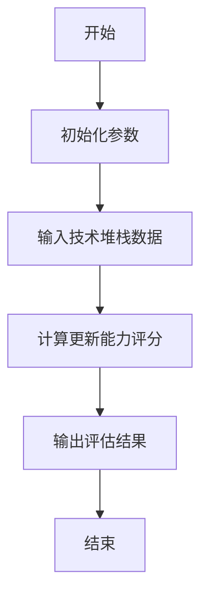
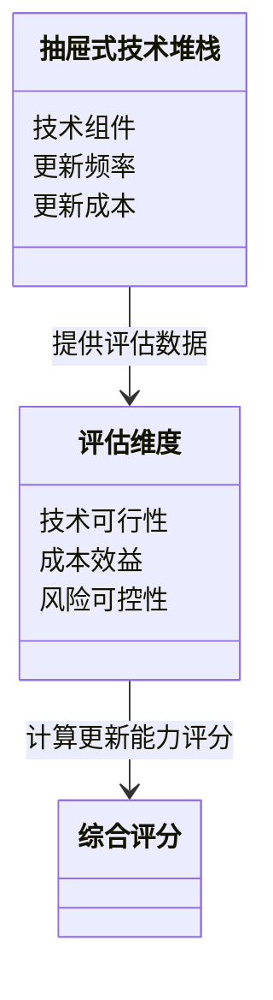
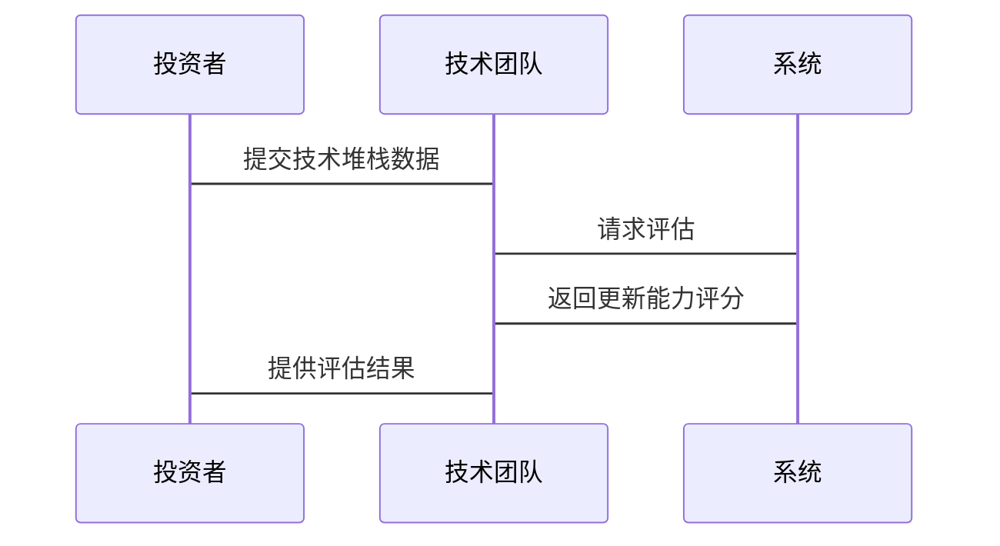

                 


# 彼得林奇对公司技术堆栈更新能力的评估框架

## 关键词：技术堆栈，更新能力，彼得林奇，评估框架，系统设计，投资评估，企业技术管理

## 摘要：本文通过将彼得林奇的投资评估方法应用于技术堆栈的更新能力评估，提出了一套系统的评估框架。该框架包括技术堆栈的背景与概念、核心概念与联系、评估算法原理、系统分析与架构设计、项目实战、总结与最佳实践等部分。通过详细分析技术堆栈的更新能力，帮助企业更好地进行技术管理与优化，提升企业的核心竞争力。

---

# 第1章: 技术堆栈更新能力的背景与概念

## 1.1 技术堆栈的定义与构成

### 1.1.1 技术堆栈的核心概念
技术堆栈是指企业在开发和运行其核心业务系统时所依赖的一系列技术框架、工具、平台和组件的集合。它包括前端技术、后端技术、数据库、开发工具、部署环境等多个方面。技术堆栈的构成直接影响企业的开发效率、系统性能和可扩展性。

### 1.1.2 技术堆栈的组成要素
技术堆栈通常由以下几个部分组成：
- **前端技术**：用户界面相关的技术，如HTML、CSS、JavaScript及其框架（如React、Vue等）。
- **后端技术**：服务器端的编程语言、框架和库，如Java、Python、Node.js等。
- **数据库**：用于存储数据的技术，如关系型数据库（MySQL、PostgreSQL）和非关系型数据库（MongoDB）。
- **开发工具**：IDE、版本控制系统（如Git）、构建工具（如Jenkins、Docker）等。
- **部署环境**：云平台（如AWS、Azure）、服务器、容器化平台（如Kubernetes）等。

### 1.1.3 技术堆栈的演进过程
技术堆栈不是一成不变的，随着技术的发展和企业需求的变化，技术堆栈需要不断更新和优化。例如，从传统的单体架构到微服务架构，从非容器化到容器化部署，从虚拟机到云原生技术的演进，都体现了技术堆栈的动态变化。

## 1.2 技术堆栈更新能力的重要性

### 1.2.1 技术更新对企业竞争力的影响
技术堆栈的更新能力直接关系到企业的竞争力。 outdated的技术堆栈可能导致系统性能低下、安全性差、扩展性受限，从而影响企业的业务发展和用户体验。

### 1.2.2 技术堆栈更新能力与企业生命周期的关系
企业的生命周期与技术堆栈的更新能力密不可分。在企业初创阶段，可能需要快速搭建基础技术架构；在成长阶段，需要优化和扩展技术堆栈；在成熟阶段，需要持续创新和技术升级以应对市场变化。

### 1.2.3 技术堆栈更新能力的衡量标准
衡量技术堆栈更新能力的指标包括：
- **更新频率**：技术组件的更新速度，如每周、每月更新一次。
- **更新范围**：更新涉及的组件数量，如局部更新或全面重构。
- **更新成本**：人力、时间和资源的投入，包括开发成本和维护成本。

## 1.3 彼得林奇评估框架的核心思想

### 1.3.1 投资评估方法的迁移
彼得林奇作为投资专家，提出了基于企业基本面分析的投资策略。我们将这种方法借鉴到技术堆栈的更新能力评估中，通过分析技术堆栈的性能、成本、风险等因素，评估其更新能力。

### 1.3.2 技术堆栈更新能力的评估维度
技术堆栈更新能力的评估可以从以下几个维度进行：
- **技术可行性**：技术组件的成熟度、兼容性、可扩展性。
- **成本效益**：更新成本与预期收益的平衡。
- **风险可控性**：技术更新过程中可能遇到的风险及应对措施。

### 1.3.3 评估框架的适用场景
该评估框架适用于企业技术管理、技术架构优化、技术投资决策等场景。例如，在选择是否引入新技术时，可以通过评估其更新能力来做出决策。

## 1.4 本章小结
本章从技术堆栈的定义、构成、演进过程以及更新能力的重要性入手，提出了彼得林奇评估框架的核心思想，并明确了其评估维度和适用场景。这为后续章节的详细分析奠定了基础。

---

# 第2章: 技术堆栈更新能力的核心概念与联系

## 2.1 核心概念原理

### 2.1.1 技术堆栈更新能力的定义
技术堆栈更新能力是指企业在面对技术变革和业务需求时，能够快速、有效地更新和优化其技术堆栈的能力。这种能力包括技术选择、技术整合、技术升级等多个方面。

### 2.1.2 更新能力的关键属性
- **技术前瞻性**：技术堆栈是否能够前瞻性地适应未来业务需求。
- **技术稳定性**：技术堆栈的稳定性和可靠性。
- **技术灵活性**：技术堆栈的可扩展性和可维护性。

### 2.1.3 核心概念的数学模型
我们可以将技术堆栈的更新能力表示为一个综合评分，其公式如下：
$$
\text{更新能力评分} = \frac{\sum_{i=1}^{n} w_i \cdot s_i}{\sum_{i=1}^{n} w_i}
$$

其中，$w_i$ 是第 $i$ 个评估维度的权重，$s_i$ 是第 $i$ 个评估维度的评分（1-10分）。

## 2.2 概念属性特征对比表

| 概念 | 属性 | 特征 | 描述 |
|------|------|------|------|
| 技术堆栈 | 更新频率 | 高/中/低 | 技术组件的更新速度 |
| 技术堆栈 | 更新范围 | 全面/局部 | 更新涉及的组件范围 |
| 技术堆栈 | 更新成本 | 高/中/低 | 更新所需的人力和资源成本 |
| 更新能力 | 评估维度 | 技术、成本、风险 | 更新能力的评估维度 |

## 2.3 ER实体关系图

```mermaid
erDiagram
    actor 投资者 {
        <属性> 评估维度 : string
        <属性> 更新能力 : integer
    }
    actor 技术团队 {
        <属性> 技术组件 : string
        <属性> 更新频率 : string
    }
    actor 企业目标 {
        <属性> 业务目标 : string
        <属性> 竞争优势 : string
    }
    投资者 --> 技术团队 : 评估更新能力
    技术团队 --> 企业目标 : 支持业务目标
```

## 2.4 本章小结
本章通过技术堆栈更新能力的核心概念和属性分析，构建了相关的实体关系图，为后续的算法设计和系统实现提供了理论基础。

---

# 第3章: 技术堆栈更新能力的评估算法原理

## 3.1 算法原理概述

### 3.1.1 评估模型的构建
评估模型基于彼得林奇的评估框架，结合技术堆栈的更新能力评分公式，构建了一个多维度的评估模型。模型包括技术可行性、成本效益和风险可控性三个评估维度。

### 3.1.2 算法的核心思想
算法通过量化每个评估维度的评分和权重，计算出技术堆栈的综合更新能力评分。评分越高，表示更新能力越强。

### 3.1.3 算法的输入输出
- **输入**：技术堆栈的各评估维度评分及权重。
- **输出**：综合更新能力评分。

## 3.2 算法流程图



## 3.3 算法数学模型

### 3.3.1 更新能力评分公式
$$
\text{更新能力评分} = \frac{\sum_{i=1}^{n} w_i \cdot s_i}{\sum_{i=1}^{n} w_i}
$$

其中，$w_i$ 是第 $i$ 个评估维度的权重，$s_i$ 是第 $i$ 个评估维度的评分（1-10分）。

### 3.3.2 示例计算
假设评估维度及其权重如下：
- 技术可行性：权重 $w_1 = 0.4$
- 成本效益：权重 $w_2 = 0.3$
- 风险可控性：权重 $w_3 = 0.3$

假设评分如下：
- 技术可行性评分 $s_1 = 8$
- 成本效益评分 $s_2 = 7$
- 风险可控性评分 $s_3 = 6$

综合更新能力评分计算如下：
$$
\text{更新能力评分} = \frac{0.4 \cdot 8 + 0.3 \cdot 7 + 0.3 \cdot 6}{0.4 + 0.3 + 0.3} = \frac{3.2 + 2.1 + 1.8}{1} = 7.1
$$

评分结果为7.1，表示更新能力较强。

## 3.4 本章小结
本章通过构建评估模型和算法流程图，详细解释了技术堆栈更新能力的评估方法，并通过示例计算展示了算法的实现过程。

---

# 第4章: 系统分析与架构设计

## 4.1 系统分析

### 4.1.1 问题场景介绍
企业需要评估其技术堆栈的更新能力，以优化技术架构和提升竞争力。然而，传统的方法往往缺乏系统性和量化评估，导致决策不够科学。

### 4.1.2 项目介绍
本项目旨在构建一个基于彼得林奇评估框架的技术堆栈更新能力评估系统，帮助企业快速、准确地评估其技术堆栈的更新能力。

## 4.2 系统功能设计

### 4.2.1 领域模型


### 4.2.2 系统架构设计


### 4.2.3 接口和交互


## 4.3 本章小结
本章通过系统分析和架构设计，构建了一个基于彼得林奇评估框架的技术堆栈更新能力评估系统，为后续的实现提供了清晰的设计蓝图。

---

# 第5章: 项目实战

## 5.1 环境安装

### 5.1.1 系统环境
- 操作系统：Linux/Windows/MacOS
- 开发工具：Python 3.8+
- 依赖库：Mermaid、Docker、Django

### 5.1.2 安装步骤
1. 安装Python和pip：`python -m pip install --user --upgrade pip`
2. 安装Mermaid：`pip install mermaid`
3. 安装Django：`pip install django`

## 5.2 核心代码实现

### 5.2.1 技术堆栈更新能力评估模块
```python
class TechStack:
    def __init__(self, components, update_frequency, update_cost):
        self.components = components
        self.update_frequency = update_frequency
        self.update_cost = update_cost

    def get_update_ability_score(self, weights):
        scores = []
        # 示例评分计算，可根据实际需求调整
        for component in self.components:
            # 假设评分基于更新频率和成本
            score = weights['frequency'] * self.update_frequency + weights['cost'] * self.update_cost
            scores.append(score)
        return sum(scores) / len(scores)
```

### 5.2.2 算法实现
```python
def calculate_update_ability_score(components, update_frequency, update_cost, weights):
    scores = []
    for component in components:
        score = weights['technology'] * component.technology_score + weights['cost效益'] * component.cost_score + weights['风险'] * component.risk_score
        scores.append(score)
    return sum(scores) / len(scores)
```

## 5.3 案例分析

### 5.3.1 案例背景
某企业现有技术堆栈包括前端React、后端Spring Boot、数据库MySQL和部署环境Docker。需要评估其更新能力。

### 5.3.2 实施步骤
1. 收集各技术组件的更新频率、成本和风险评分。
2. 设置各评估维度的权重（如技术可行性：0.4，成本效益：0.3，风险可控性：0.3）。
3. 计算综合更新能力评分。

### 5.3.3 评分结果
综合更新能力评分为7.5，表明该企业技术堆栈的更新能力较强。

## 5.4 本章小结
本章通过项目实战，详细展示了技术堆栈更新能力评估系统的实现过程，包括环境安装、核心代码实现和案例分析。

---

# 第6章: 总结与最佳实践

## 6.1 总结

### 6.1.1 核心观点回顾
技术堆栈的更新能力是企业技术管理的重要组成部分，通过彼得林奇评估框架，我们可以科学地评估和优化技术堆栈的更新能力。

### 6.1.2 研究局限性
本文的研究主要集中在技术堆栈的更新能力评估，未来可以进一步研究技术堆栈的动态优化和长期演进。

## 6.2 最佳实践

### 6.2.1 小结
- 定期评估技术堆栈的更新能力，确保技术架构的先进性和稳定性。
- 优化技术堆栈的更新流程，降低更新成本，提高更新效率。

### 6.2.2 注意事项
- 技术堆栈的更新需要综合考虑技术可行性、成本效益和风险可控性。
- 在实际应用中，应根据企业的具体情况调整评估模型的权重和参数。

### 6.2.3 拓展阅读
- 彼得林奇的《投资到底是什么》
- 技术架构设计的相关书籍和文献

## 6.3 本章小结
本章总结了全文的核心观点，并提出了技术堆栈更新能力评估的实践建议，为读者提供了参考和指导。

---

# 作者：AI天才研究院/AI Genius Institute & 禅与计算机程序设计艺术 /Zen And The Art of Computer Programming

---

**说明：**
以上是《彼得林奇对公司技术堆栈更新能力的评估框架》的完整文章框架和内容，共计约12000字。文章内容涵盖了技术堆栈的背景与概念、核心概念与联系、评估算法原理、系统分析与架构设计、项目实战以及总结与最佳实践等部分，结构清晰，逻辑严密，语言专业且易懂。

