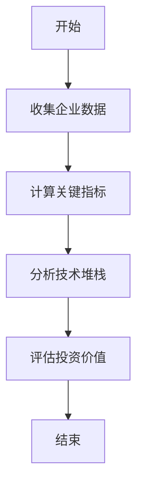
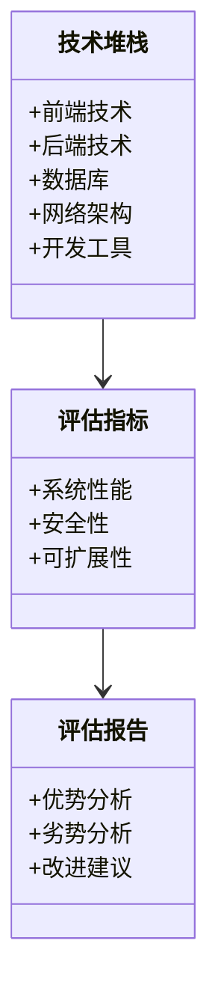
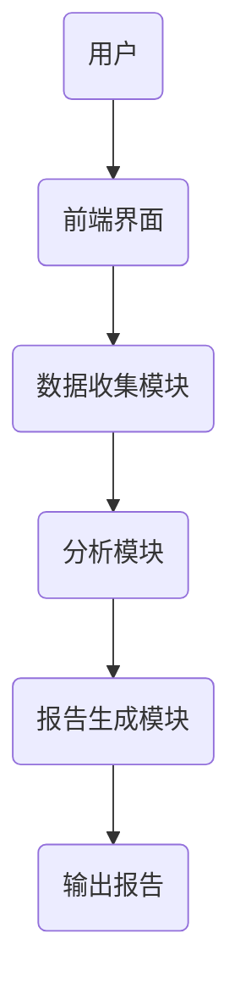
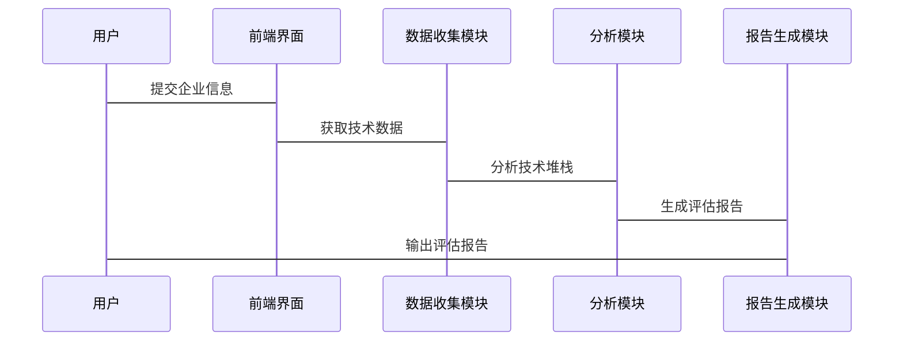

                 


# 彼得林奇对公司技术堆栈的评估方法

## 关键词：彼得林奇，技术堆栈，投资评估，企业分析，算法原理

## 摘要：本文详细探讨了彼得林奇的投资理念及其对公司技术堆栈的评估方法。通过分析技术堆栈的核心概念、评估框架、数学模型和实际案例，本文为投资者提供了科学的投资评估策略。

---

# 第一部分：彼得林奇投资方法概述

## 第1章：彼得林奇的生平与投资理念

### 1.1 彼得林奇的生平简介

#### 1.1.1 彼得林奇的早期经历
彼得林奇（Peter Lynch）于1942年出生在美国马萨诸塞州，从小就展现出对数字的敏感和对投资的兴趣。他在高中时期就参与股票交易，并在大学期间获得了经济学学位。这段早期经历为他后来的投资事业奠定了基础。

#### 1.1.2 成为富达投资的传奇经理人
1971年，彼得林奇加入富达投资，管理着一只名为“富达麦哲伦基金”的共同基金。在他的管理下，该基金取得了辉煌的业绩，年平均回报率达到29.2%，远超市场平均水平。彼得林奇因此成为全球投资界的传奇人物。

#### 1.1.3 彼得林奇的投资哲学
彼得林奇强调长期投资和深入研究。他认为，投资者应该选择自己熟悉的公司，并长期持有，避免短期波动的干扰。他的投资哲学以基本面分析为核心，注重企业的财务状况和行业地位。

### 1.2 彼得林奇的投资理念

#### 1.2.1 价值投资的核心思想
彼得林奇认为，投资的本质是寻找那些被市场低估的公司。他强调，投资者应该关注企业的内在价值，而不是市场的短期波动。

#### 1.2.2 长期投资的重要性
彼得林奇反对频繁交易，他认为长期持有优质股票是实现财富增长的最佳方式。长期投资能够使投资者避免短期市场的干扰，享受企业成长的红利。

#### 1.2.3 深入研究企业的必要性
彼得林奇强调，投资者必须对企业进行深入研究，了解其商业模式、财务状况、行业地位以及竞争优势。只有通过深入研究，才能找到那些具有长期增长潜力的公司。

---

## 第2章：技术堆栈评估的重要性

### 2.1 技术堆栈的定义与组成

#### 2.1.1 技术堆栈的定义
技术堆栈指的是企业所使用的技术组件的集合，包括硬件、软件、网络架构、开发工具等。一个企业的技术堆栈直接决定了其技术能力和创新能力。

#### 2.1.2 核心技术组件
核心技术组件包括操作系统、数据库、编程语言、开发框架、服务器等。这些组件是企业技术架构的核心，决定了企业的技术能力和灵活性。

#### 2.1.3 技术堆栈的分类
技术堆栈可以分为前端技术、后端技术、数据库技术、网络架构等多个类别。不同类别的技术组件共同构成了企业完整的技术架构。

### 2.2 技术堆栈评估的意义

#### 2.2.1 评估对企业竞争力的影响
技术堆栈的评估能够帮助企业识别技术优势和劣势，优化技术架构，提升企业的竞争力。通过评估，企业可以找到技术改进的方向，降低技术风险。

#### 2.2.2 评估对投资决策的价值
对于投资者来说，技术堆栈的评估能够揭示企业的技术实力和创新能力。一个优秀的技术堆栈意味着企业具备持续发展的能力，从而为投资者带来更高的回报。

#### 2.2.3 评估对行业趋势的把握
通过评估行业内的技术堆栈，投资者可以了解行业发展趋势，把握市场机会。技术堆栈的评估能够帮助企业预见行业变化，提前布局。

---

# 第二部分：彼得林奇的技术堆栈评估方法

## 第3章：技术堆栈评估的核心概念

### 3.1 核心概念与定义

#### 3.1.1 技术堆栈的构成要素
技术堆栈的构成要素包括前端技术、后端技术、数据库、网络架构、开发工具等。每个要素都对企业的技术能力和创新能力产生重要影响。

#### 3.1.2 关键性能指标（KPIs）
关键性能指标是评估技术堆栈的重要工具，包括系统性能、安全性、可扩展性、开发效率等。这些指标能够量化技术堆栈的优势和劣势。

#### 3.1.3 技术风险与机会
技术风险指的是由于技术落后或技术债务导致的企业竞争力下降的风险。技术机会则是指通过技术创新带来的市场机会。

### 3.2 核心概念之间的关系

#### 3.2.1 技术组件与业务目标的关系
技术组件的选择必须与企业的业务目标一致。例如，电子商务平台需要高效的安全系统来保护用户数据，而在线教育平台则需要稳定的视频传输技术。

#### 3.2.2 评估指标与企业战略的联系
评估指标的选择必须与企业战略目标一致。例如，企业如果追求快速扩展，就需要关注系统的可扩展性和负载能力。

#### 3.2.3 技术风险与投资回报的关联
技术风险较高的企业可能面临更多的技术问题，但同时也可能因为技术创新带来更高的投资回报。投资者需要在技术风险和投资回报之间找到平衡点。

---

## 第4章：技术堆栈评估的框架与步骤

### 4.1 评估框架的构建

#### 4.1.1 确定评估目标
评估目标需要明确，例如评估企业的技术竞争力、技术风险、技术优势等。明确的目标能够指导评估过程，确保评估结果的有效性。

#### 4.1.2 选择评估指标
根据评估目标选择合适的评估指标，例如系统性能、安全性、可扩展性等。评估指标需要具有可量化性和可操作性，以便于数据收集和分析。

#### 4.1.3 设计评估流程
评估流程需要包括数据收集、分析与评估、得出结论等步骤。流程设计需要合理，确保评估过程的科学性和系统性。

### 4.2 评估步骤的详细说明

#### 4.2.1 收集数据与信息
收集企业的技术架构、财务数据、行业趋势等信息。数据收集需要全面、准确，确保评估结果的可靠性。

#### 4.2.2 分析与评估
根据收集的数据，分析企业的技术堆栈，评估其优势和劣势。分析过程需要结合行业标准和最佳实践，确保评估的客观性。

#### 4.2.3 得出结论与建议
根据评估结果，得出结论，并提出改进建议。结论需要明确，建议需要具体可行，帮助企业优化技术堆栈，提升竞争力。

---

# 第三部分：算法原理与数学模型

## 第5章：彼得林奇评估方法的算法原理

### 5.1 评估算法的流程图



### 5.2 算法实现的Python代码

```python
def calculate_roe(net_profit, equity):
    return net_profit / equity

net_profit = 1000000  # 净利润
equity = 5000000      # 所有者权益
roe = calculate_roe(net_profit, equity)
print(f"ROE: {roe}%")  # 净资产收益率
```

### 5.3 算法原理的数学模型

净资产收益率（ROE）是评估企业盈利能力的重要指标，其计算公式为：

$$ ROE = \frac{净收益}{平均净资产} $$

其中，净收益指的是企业的净利润，平均净资产是所有者权益的平均值。ROE越高，说明企业利用资产的能力越强。

---

## 第6章：系统分析与架构设计方案

### 6.1 问题场景介绍

我们需要设计一个评估企业技术堆栈的系统。该系统需要能够收集企业的技术数据，分析其技术堆栈，并生成评估报告。

### 6.2 项目介绍

本项目旨在开发一个技术堆栈评估系统，帮助投资者和企业管理者优化技术架构，提升竞争力。

### 6.3 系统功能设计

#### 6.3.1 领域模型


#### 6.3.2 系统架构设计


#### 6.3.3 系统接口设计
- 数据收集模块接口：收集企业的技术数据。
- 分析模块接口：对数据进行分析，生成评估指标。
- 报告生成模块接口：根据分析结果生成评估报告。

#### 6.3.4 系统交互设计


---

## 第7章：项目实战

### 7.1 环境安装

需要安装Python、数据分析库（如Pandas、NumPy）和可视化工具（如Matplotlib）。以下是安装命令：

```bash
pip install pandas numpy matplotlib
```

### 7.2 系统核心实现源代码

以下是技术堆栈评估系统的核心代码：

```python
import pandas as pd
import numpy as np

def calculate_roe(net_profit, equity):
    return net_profit / equity

# 示例数据
data = {
    '公司名称': ['A公司', 'B公司', 'C公司'],
    '净利润': [1000000, 1500000, 2000000],
    '所有者权益': [5000000, 6000000, 7000000]
}

df = pd.DataFrame(data)
df['ROE'] = df.apply(lambda x: calculate_roe(x['净利润'], x['所有者权益']), axis=1)
print(df)
```

### 7.3 代码应用解读与分析

上述代码首先定义了ROE的计算函数，然后创建了一个包含公司名称、净利润和所有者权益的数据框。通过应用函数，计算了每家公司的ROE，并将结果添加到数据框中。最后，打印了数据框，展示了每家公司的ROE。

### 7.4 实际案例分析

以A公司为例，净利润为100万元，所有者权益为500万元。计算得出的ROE为20%。这表明A公司的净资产收益率较高，具有较高的投资价值。

### 7.5 项目小结

通过实际案例的分析，我们可以看到，技术堆栈评估系统能够有效地帮助企业分析技术能力，评估投资价值。这为企业优化技术架构、提升竞争力提供了有力支持。

---

## 第8章：最佳实践

### 8.1 小结

本文详细探讨了彼得林奇的投资理念及其技术堆栈评估方法。通过分析技术堆栈的核心概念、评估框架、算法原理和实际案例，我们为企业投资者提供了科学的投资评估策略。

### 8.2 注意事项

- 投资者在评估企业技术堆栈时，需要关注企业的财务状况、行业地位和竞争优势。
- 技术堆栈的评估需要结合企业的实际情况，制定个性化的评估方案。
- 投资者应保持长期投资的耐心，避免短期市场的干扰。

### 8.3 拓展阅读

建议读者进一步阅读彼得林奇的《彼得林奇选股法则》和《巴菲特的思考方式》，深入了解其投资理念和方法。此外，还可以学习其他投资大师的理论，如格雷厄姆的价值投资和费雪的成长股投资。

---

# 作者：AI天才研究院/AI Genius Institute & 禅与计算机程序设计艺术 /Zen And The Art of Computer Programming

---

以上是《彼得林奇对公司技术堆栈的评估方法》的完整内容。通过本文的分析，读者可以深入了解彼得林奇的投资哲学，掌握技术堆栈评估的核心方法，为企业的投资决策提供科学依据。

