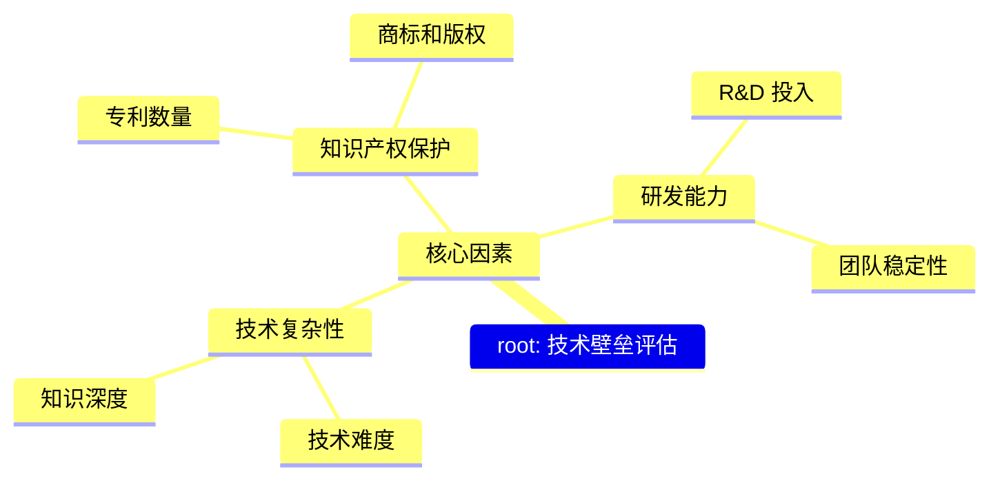
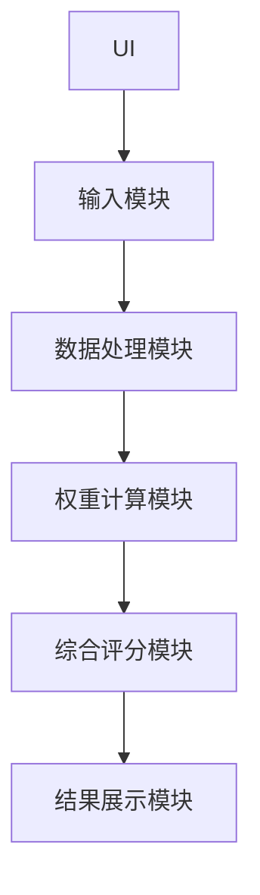
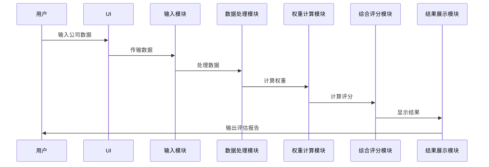

                 


# 彼得林奇对公司技术壁垒的评估方法

## 关键词：技术壁垒，彼得林奇，投资评估，层次分析法，技术复杂性，知识产权

## 摘要：本文详细探讨了彼得·林奇评估公司技术壁垒的方法，从背景介绍、核心概念到算法原理、数学模型，再到系统架构设计、项目实战及最佳实践，系统性地分析了技术壁垒的评估过程。通过层次分析法（AHP）构建评估模型，并结合实际案例，展示了如何量化技术壁垒，帮助投资者做出更明智的投资决策。

---

## 第一部分：背景介绍

### 第1章：技术壁垒的定义与重要性

#### 1.1 技术壁垒的核心概念
- **技术壁垒的定义**：技术壁垒是指企业在技术上形成的竞争优势，使其难以被竞争对手复制或超越。
- **技术壁垒在投资中的作用**：技术壁垒是评估公司长期价值的重要指标，高技术壁垒意味着更高的市场地位和盈利能力。
- **技术壁垒与竞争优势的关系**：技术壁垒是企业核心竞争力的体现，能够有效防止竞争对手的侵入。

#### 1.2 技术壁垒的重要性
- **技术壁垒对企业长期价值的影响**：技术壁垒高的公司通常具有更高的利润率和市场份额。
- **技术壁垒对行业竞争力的决定作用**：技术壁垒是企业在行业中保持优势的关键因素。
- **技术壁垒与企业护城河的构建**：技术壁垒是企业护城河的重要组成部分，能够有效抵御竞争。

---

## 第二部分：技术壁垒的构成要素

### 第2章：技术壁垒的关键构成

#### 2.1 技术复杂性
- **技术复杂性的定义**：技术复杂性指的是技术实现的难度和所需的专业知识。
- **技术复杂性对竞争壁垒的影响**：技术复杂性越高，竞争对手越难复制，技术壁垒越强。
- **技术复杂性与企业研发投入的关系**：研发投入是技术复杂性的重要驱动因素，研发投入越大，技术复杂性越高。

#### 2.2 知识产权保护
- **专利、商标与版权的保护**：知识产权是技术壁垒的重要组成部分，专利保护技术的独特性，商标和版权保护品牌和创意。
- **知识产权对技术壁垒的贡献**：知识产权能够有效防止技术泄露和盗用，增强技术壁垒。
- **知识产权的法律风险与应对策略**：企业需要定期审查和维护知识产权，防止无效或被挑战的情况。

#### 2.3 技术团队与研发能力
- **技术团队的构成与能力评估**：技术团队的能力和稳定性直接影响技术壁垒的强弱。
- **研发能力对企业技术壁垒的影响**：强大的研发能力能够不断推动技术创新，维持技术壁垒。
- **技术团队的稳定性与创新能力**：稳定的团队能够持续创新，保持技术领先。

---

## 第三部分：技术壁垒的评估方法

### 第3章：技术壁垒的评估方法

#### 3.1 层次分析法（AHP）介绍
- **层次分析法的核心原理**：层次分析法是一种定性和定量相结合的决策分析方法，适用于多因素决策问题。
- **层次分析法的步骤**：
  1. 构建层次结构。
  2. 确定各因素的权重。
  3. 计算各因素的综合评分。
- **层次分析法的优势**：能够将复杂的决策问题分解为易于处理的小问题，适合技术壁垒的多因素评估。

#### 3.2 技术壁垒评估的层次结构
- **层次结构的构建**：技术壁垒评估包括技术复杂性、知识产权保护、研发能力三大因素，每个因素下又有具体的指标。
- **层次结构的 Mermaid 表示**：


#### 3.3 层次分析法的应用
- **权重计算**：使用层次分析法计算各因素的权重，确定技术复杂性、知识产权保护和研发能力的权重。
- **综合评分计算**：根据各因素的权重和评分，计算出技术壁垒的综合评分。

---

### 第4章：技术壁垒评估的数学模型

#### 4.1 技术壁垒评估的层次分析模型
- **层次分析模型的公式**：
  $$ A = \lambda_1 A_1 + \lambda_2 A_2 + \lambda_3 A_3 $$
  其中，$\lambda_i$ 是各因素的权重，$A_i$ 是各因素的评分。

#### 4.2 技术壁垒综合评分公式
- **综合评分公式**：
  $$ S = \sum_{i=1}^{n} w_i \cdot s_i $$
  其中，$w_i$ 是第 i 个因素的权重，$s_i$ 是第 i 个因素的评分。

---

### 第5章：技术壁垒评估的系统架构设计

#### 5.1 系统功能设计
- **系统功能模块**：
  - 用户输入模块：输入公司技术壁垒的相关数据。
  - 权重计算模块：根据层次分析法计算各因素的权重。
  - 综合评分模块：计算技术壁垒的综合评分。
  - 结果展示模块：输出评估结果。

#### 5.2 系统架构设计
- **系统架构图的 Mermaid 表示**：


#### 5.3 系统接口设计
- **输入接口**：接收公司技术壁垒的相关数据。
- **输出接口**：输出技术壁垒的综合评分和详细报告。

#### 5.4 系统交互流程
- **交互流程图的 Mermaid 表示**：


---

### 第6章：技术壁垒评估的项目实战

#### 6.1 项目环境安装
- **所需工具**：Python、numpy、scipy、mermaid、LaTeX。
- **安装命令**：
  ```bash
  pip install numpy scipy mermaid4jupyter
  ```

#### 6.2 核心代码实现
- **层次分析法的 Python 实现**：
  ```python
  import numpy as np

  def calculate_weights(matrix):
      # 计算一致性检验
      n = matrix.shape[0]
      max_eigenvalue = np.max(matrix)
      CI = (max_eigenvalue - n) / (n - 1)
      return CI

  def main():
      # 示例数据矩阵
      data = [
          [1, 2, 3],
          [2, 1, 1],
          [3, 1, 1],
      ]
      matrix = np.array(data)
      # 计算权重
      weights = calculate_weights(matrix)
      print("权重计算结果：", weights)

  if __name__ == "__main__":
      main()
  ```

#### 6.3 案例分析与解读
- **案例选择**：以某科技公司为例，分析其技术壁垒。
- **评估过程**：
  1. 收集公司技术壁垒的相关数据。
  2. 构建层次分析模型。
  3. 计算各因素的权重和综合评分。
  4. 输出评估报告。

#### 6.4 项目小结
- **项目总结**：层次分析法是一种有效的技术壁垒评估方法，能够量化技术壁垒的强弱。
- **项目经验**：在实际应用中，需要结合具体情况进行调整和优化。

---

### 第7章：技术壁垒评估的最佳实践

#### 7.1 评估的关键点
- **动态调整评估标准**：根据行业和技术的发展，动态调整评估标准。
- **关注技术团队**：技术团队的能力和稳定性是技术壁垒的重要影响因素。
- **结合定量与定性分析**：层次分析法是一种定量分析方法，但需要结合定性分析。

#### 7.2 小结
- **小结内容**：本文系统性地介绍了彼得·林奇评估技术壁垒的方法，从理论到实践，详细讲解了层次分析法的应用。
- **注意事项**：在实际应用中，需要根据具体情况调整评估模型。

#### 7.3 拓展阅读
- **推荐书籍**：
  - 《投资学原理》
  - 《技术分析实战》

---

## 作者：AI天才研究院 & 禅与计算机程序设计艺术

