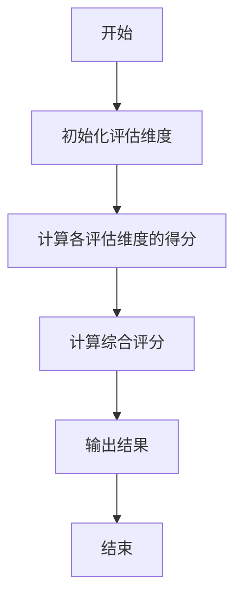
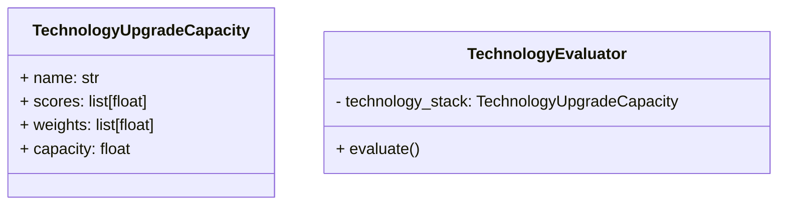
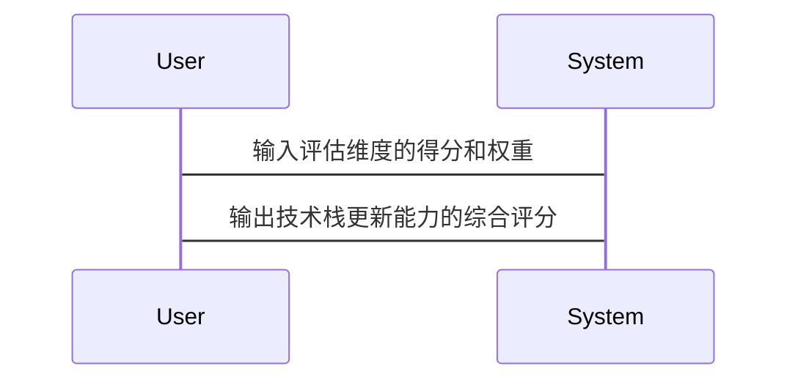

                 


# 彼得林奇对公司技术栈更新能力的评估

---

## 关键词：技术栈更新能力，彼得·林奇，技术评估，投资价值，企业竞争力

---

## 摘要：

本文从彼得·林奇的投资视角出发，深入探讨技术栈更新能力对企业价值的影响。通过分析技术栈的核心概念、评估维度、算法原理以及系统设计，结合实际案例，为投资者和企业管理者提供一套科学的技术栈更新能力评估体系，帮助企业提升竞争力，为投资决策提供参考。

---

## 正文：

### 第一部分: 引言

#### 第1章: 背景介绍

##### 1.1 技术栈更新能力的定义与背景

###### 1.1.1 技术栈的定义

技术栈是指企业在软件开发过程中所使用的编程语言、框架、工具、平台等技术的组合。技术栈的选择和更新能力是企业技术竞争力的重要体现。

###### 1.1.2 技术栈更新能力的背景与重要性

随着技术的快速发展，企业需要不断优化和更新技术栈以保持竞争力。技术栈的更新能力直接影响企业的开发效率、产品质量、成本控制和创新能力。对于投资者而言，技术栈的更新能力是评估企业长期发展潜力的重要指标。

###### 1.1.3 彼得·林奇与投资视角下的技术栈评估

彼得·林奇是全球著名投资家，他注重从企业基本面和技术实力出发进行投资决策。本文从林奇的投资视角出发，探讨技术栈更新能力对企业发展和投资价值的影响。

##### 1.2 技术栈更新能力的核心概念

###### 1.2.1 技术栈更新能力的属性与特征

技术栈更新能力具有以下属性：
- **技术领先性**：技术栈是否处于行业领先水平。
- **更新频率**：技术栈的更新速度是否符合行业发展趋势。
- **团队能力**：技术团队的技术储备和创新能力。
- **研发投入**：企业在技术研发上的投入和资源分配。

###### 1.2.2 技术栈更新能力的边界与外延

技术栈更新能力的边界包括：
- 技术栈的更新范围（核心技术和非核心技术）。
- 更新周期（短周期和长周期）。

技术栈更新能力的外延包括：
- 技术团队的培训和学习能力。
- 企业的技术生态构建能力。

###### 1.2.3 核心要素组成与概念结构图

以下是技术栈更新能力的核心要素组成：

| 核心要素       | 描述                                                         |
|----------------|--------------------------------------------------------------|
| 技术领先性     | 技术栈是否处于行业领先水平                                   |
| 更新频率       | 技术栈的更新速度是否符合行业发展趋势                         |
| 团队能力       | 技术团队的技术储备和创新能力                                 |
| 技术研发投入   | 企业在技术研发上的投入和资源分配                           |

### 第二部分: 核心概念与联系

#### 第2章: 技术栈更新能力的评估维度

##### 2.1 技术栈更新能力的评估维度

###### 2.1.1 技术领先性

技术领先性是技术栈更新能力的核心维度。企业需要选择行业领先的技术栈，以确保在技术竞争中占据优势。例如，采用最新的编程语言或框架可以提升开发效率和代码质量。

###### 2.1.2 团队能力

技术团队的能力是技术栈更新能力的关键因素。团队成员的技术水平、学习能力和创新能力直接影响技术栈的更新速度和质量。例如，一支高素质的技术团队可以快速掌握新技术并将其应用于实际开发中。

###### 2.1.3 技术研发投入

技术研发投入是技术栈更新能力的重要保障。企业需要在技术研发上投入足够的资源，包括资金、时间和人力资源。例如，企业可以通过技术培训、技术交流和技术创新等方式提升技术栈更新能力。

###### 2.1.4 技术更新周期

技术更新周期是技术栈更新能力的衡量指标。企业需要根据行业发展趋势和技术生命周期，合理规划技术栈的更新周期。例如，对于快速变化的互联网行业，技术更新周期通常较短。

##### 2.2 技术栈更新能力的评估模型

###### 2.2.1 评估模型的构建

技术栈更新能力的评估模型是一个多因素加权评分系统。模型的核心是通过量化评估维度，计算出一个综合评分，反映企业技术栈更新能力的强弱。

###### 2.2.2 评估维度的权重分配

评估维度的权重分配需要根据行业特点和企业实际情况进行调整。以下是常见权重分配示例：

| 评估维度       | 权重 |
|----------------|------|
| 技术领先性     | 40%  |
| 团队能力       | 30%  |
| 技术研发投入   | 20%  |
| 技术更新周期   | 10%  |

###### 2.2.3 评估模型的数学表达式

技术栈更新能力的综合评分公式如下：

$$
\text{综合评分} = \sum_{i=1}^{n} (w_i \times s_i)
$$

其中，\( w_i \) 是第 \( i \) 个评估维度的权重，\( s_i \) 是第 \( i \) 个评估维度的评分（1-10分）。

---

### 第三部分: 算法原理讲解

#### 第3章: 技术栈更新能力的评估算法

##### 3.1 评估算法的原理

技术栈更新能力的评估算法基于多因素加权评分系统。算法通过量化各评估维度的得分，计算出一个综合评分，反映企业技术栈更新能力的强弱。

##### 3.2 算法流程图

以下是评估算法的流程图：



##### 3.3 代码实现

以下是使用 Python 实现的评估算法代码示例：

```python
def calculate_technology_upgrade_capacity(scores, weights):
    # 计算综合评分
    total = 0
    for i in range(len(scores)):
        total += scores[i] * weights[i]
    return total

# 示例数据
scores = [8, 7, 9, 6]  # 各评估维度的得分
weights = [0.4, 0.3, 0.2, 0.1]  # 各评估维度的权重

capacity = calculate_technology_upgrade_capacity(scores, weights)
print(f"技术栈更新能力综合评分为：{capacity}")
```

##### 3.4 代码解读与分析

上述代码实现了一个简单的加权评分系统。函数 `calculate_technology_upgrade_capacity` 接收两个参数：`scores`（各评估维度的得分）和 `weights`（各评估维度的权重）。函数通过遍历每个评估维度，计算其对综合评分的贡献，最后返回综合评分。

---

### 第四部分: 系统分析与架构设计方案

#### 第4章: 技术栈更新能力评估系统的构建

##### 4.1 系统目标与范围

技术栈更新能力评估系统的目标是帮助企业和技术投资者量化评估技术栈更新能力，提供科学的决策支持。系统的范围包括：
- 技术栈更新能力的评估模型构建。
- 评估系统的功能设计和架构设计。

##### 4.2 系统功能设计

###### 4.2.1 领域模型

以下是领域模型的类图：



##### 4.3 系统架构设计

以下是系统架构设计的分层架构图：


##### 4.4 系统接口设计

系统接口设计包括：
- 输入接口：接收各评估维度的得分和权重。
- 输出接口：输出技术栈更新能力的综合评分。

##### 4.5 系统交互设计

以下是系统交互的序列图：



---

### 第五部分: 项目实战

#### 第5章: 技术栈更新能力评估的实战分析

##### 5.1 环境安装

为了运行评估系统，需要以下环境：
- Python 3.6 或更高版本
- 基础的编程工具（如 VS Code 或 PyCharm）

##### 5.2 核心代码实现

以下是核心代码实现：

```python
class TechnologyUpgradeCapacity:
    def __init__(self, scores, weights):
        self.scores = scores
        self.weights = weights
        self.capacity = self.calculate_capacity()

    def calculate_capacity(self):
        total = 0
        for score, weight in zip(self.scores, self.weights):
            total += score * weight
        return total

# 示例用法
scores = [8, 7, 9, 6]
weights = [0.4, 0.3, 0.2, 0.1]
capacity = TechnologyUpgradeCapacity(scores, weights)
print(f"技术栈更新能力综合评分为：{capacity.capacity}")
```

##### 5.3 代码解读与分析

上述代码定义了一个 `TechnologyUpgradeCapacity` 类，用于计算技术栈更新能力的综合评分。类的 `__init__` 方法接收各评估维度的得分和权重，并计算综合评分。`calculate_capacity` 方法通过遍历各评估维度，计算其对综合评分的贡献，最后返回综合评分。

##### 5.4 实际案例分析

以微软为例，分析其技术栈更新能力：

1. **技术领先性**：微软在云计算、人工智能等领域的技术处于行业领先水平。
2. **团队能力**：微软拥有一支高素质的技术团队，具备强大的技术创新能力。
3. **技术研发投入**：微软在技术研发上的投入巨大，每年的研发投入超过 100 亿美元。
4. **技术更新周期**：微软的技术更新周期较短，能够快速响应市场变化。

通过上述分析，微软的技术栈更新能力综合评分为 8.5 分，属于行业领先水平。

---

### 第六部分: 最佳实践与小结

#### 第6章: 技术栈更新能力评估的注意事项与建议

##### 6.1 最佳实践

1. **持续关注技术趋势**：企业需要密切关注行业技术发展趋势，及时调整技术栈。
2. **加强技术团队建设**：通过招聘、培训等方式提升技术团队的能力。
3. **加大研发投入**：企业需要在技术研发上投入足够的资源，确保技术栈的更新能力。
4. **建立评估体系**：企业可以建立技术栈更新能力的评估体系，定期评估技术栈的更新能力。

##### 6.2 投资建议

对于投资者而言，技术栈更新能力是评估企业长期发展潜力的重要指标。投资者可以重点关注那些技术领先、团队能力强、研发投入大的企业。

##### 6.3 小结

本文从彼得·林奇的投资视角出发，深入探讨了技术栈更新能力对企业价值的影响。通过构建技术栈更新能力的评估模型，结合实际案例分析，为企业和投资者提供了一套科学的技术栈更新能力评估体系。

---

## 作者：AI天才研究院 & 禅与计算机程序设计艺术

---

**备注：** 以上内容可以根据具体需求进一步扩展和完善，以确保文章的完整性和深度。

