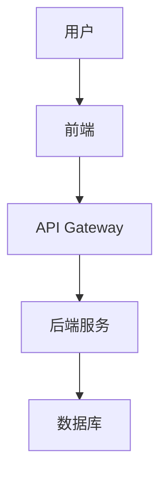
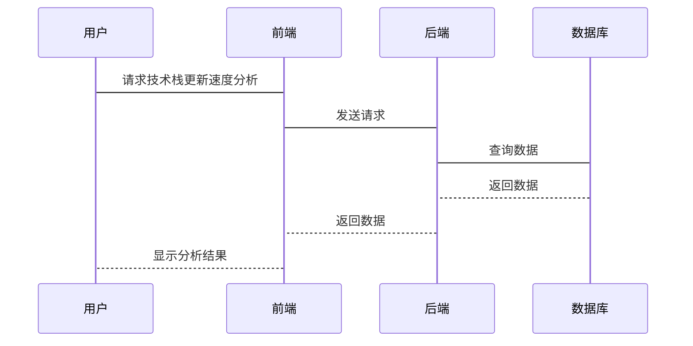

                 


# 彼得林奇对公司技术栈更新速度与市场竞争力的关系分析

## 文章关键词：
- 技术栈
- 更新速度
- 市场竞争力
- 彼得林奇分析
- 系统架构

## 摘要：
本文深入分析了技术栈更新速度与市场竞争力之间的关系，结合彼得林奇的分析方法，探讨了技术栈更新对企业市场竞争力的影响。通过定义技术栈更新速度和市场竞争力的核心概念，构建了两者的关系模型，并通过算法和系统设计进一步验证了这一关系。最后，通过实际案例分析和项目实战，提供了提升市场竞争力的技术策略。

---

## 第一部分：技术栈更新速度与市场竞争力的背景介绍

### 第1章：技术栈更新速度与市场竞争力概述

#### 1.1 技术栈的基本概念
- **1.1.1 技术栈的定义与组成**
  - 技术栈是指企业为实现业务目标所采用的一系列技术框架、工具和平台，包括前端、后端、数据库和部署环境等。
  - 例如，常见的技术栈组合有：前端（React、Vue）、后端（Node.js、Spring）、数据库（MySQL、MongoDB）和云服务（AWS、阿里云）。

- **1.1.2 技术栈的更新机制**
  - 技术栈的更新通常包括引入新工具、升级现有框架或替换旧技术，以优化性能、提高开发效率或增强安全性。
  - 例如，企业可能选择从传统的Node.js框架升级到最新的Fastify框架，以提高响应速度。

- **1.1.3 技术栈更新的驱动因素**
  - 技术进步：新技术的出现可能带来性能提升或成本降低。
  - 市场需求：业务扩展需要更强大的技术支撑。
  - 安全性：旧技术可能存在安全漏洞，需要及时更新。

#### 1.2 市场竞争力的核心要素
- **1.2.1 市场竞争力的定义**
  - 市场竞争力是指企业在市场中相对于竞争对手的优势，包括产品质量、价格、服务和创新能力等方面。

- **1.2.2 技术对企业市场竞争力的影响**
  - 技术是企业核心竞争力的关键，先进的技术可以提高产品性能，降低成本，并增强客户体验。
  - 例如，采用人工智能技术可以提升产品智能化，增强市场竞争力。

- **1.2.3 技术栈与市场竞争力的关系**
  - 技术栈决定了企业的技术能力，进而影响市场竞争力。技术栈的更新速度直接影响企业能否保持技术领先，从而在市场中占据优势。

#### 1.3 问题背景与研究意义
- **1.3.1 技术栈更新速度对企业竞争力的影响**
  - 技术栈更新速度过慢可能导致技术落后，竞争力下降；更新过快可能带来不稳定性。
  - 例如，如果企业不及时更新技术栈，竞争对手可能利用技术优势推出更好的产品，抢占市场。

- **1.3.2 研究的必要性与实际应用价值**
  - 通过分析技术栈更新速度与市场竞争力的关系，可以帮助企业在技术升级和市场拓展之间找到平衡点。
  - 例如，制定合理的技术升级计划，既能保持技术领先，又不会因频繁更新而影响稳定性。

---

## 第二部分：技术栈更新速度与市场竞争力的核心概念分析

### 第2章：技术栈更新速度的定义与特征

#### 2.1 技术栈更新速度的定义
- **2.1.1 技术栈更新的周期性**
  - 技术栈更新可以是渐进式的（逐步优化）或激进式的（全面替换）。
  - 例如，前端框架从React升级到最新版本属于渐进式更新，而完全替换前端框架则属于激进式更新。

- **2.1.2 更新速度的量化方法**
  - 量化方法包括比较不同技术栈的更新频率，例如半年一次或一年一次。
  - 例如，Node.js社区通常每年发布新版本，而React的更新频率更快，几乎每季度发布一次重大更新。

#### 2.2 技术栈更新速度的特征
- **2.2.1 更新的频率与节奏**
  - 频率高：频繁更新技术栈，保持技术领先。
  - 频率低：缓慢更新，注重稳定性和兼容性。

- **2.2.2 更新的稳定性与持续性**
  - 稳定性：更新后系统仍能正常运行，不会出现重大问题。
  - 持续性：长期维护和更新，确保技术栈不过时。

### 第3章：市场竞争力的定义与特征

#### 3.1 市场竞争力的多维度分析
- **3.1.1 产品性能与质量**
  - 技术栈的性能直接影响产品响应速度和用户体验。
  - 例如，使用优化的数据库查询技术可以显著提高系统性能。

- **3.1.2 市场占有率与用户满意度**
  - 技术领先的产品更容易获得市场份额和用户满意度。
  - 例如，采用先进的AI技术可以提高产品智能化，增强用户满意度。

- **3.1.3 创新能力与技术领先性**
  - 技术创新能力是市场竞争的关键，持续的技术更新可以保持技术领先。
  - 例如，企业通过技术创新推出新产品，可以在市场中占据领先地位。

#### 3.2 技术栈对市场竞争力的影响维度
- **3.2.1 技术先进性对竞争力的提升**
  - 先进的技术可以提高产品性能，降低成本，并增强用户体验。
  - 例如，使用最新的云计算技术可以提高资源利用效率，降低成本。

- **3.2.2 技术稳定性对市场信任的影响**
  - 稳定的技术栈可以提高系统可靠性，增强客户信任。
  - 例如，采用经过验证的数据库技术可以提高系统稳定性，增强客户信任。

- **3.2.3 技术更新对市场适应性的增强**
  - 灵活的技术更新可以快速适应市场需求变化。
  - 例如，及时更新前端框架可以快速响应用户需求变化，保持市场竞争力。

### 第4章：技术栈更新速度与市场竞争力的关系模型

#### 4.1 关系模型的构建
- **4.1.1 模型的基本假设**
  - 技术栈更新速度与市场竞争力呈正相关，但存在边际效应递减。
  - 技术栈更新速度过快可能导致系统不稳定，进而影响市场竞争力。

- **4.1.2 模型的变量定义**
  - 自变量：技术栈更新速度（S）。
  - 因变量：市场竞争力（C）。
  - 中介变量：技术稳定性（T）、用户满意度（U）。

#### 4.2 关系模型的验证与应用
- **4.2.1 模型验证方法**
  - 数据收集：收集不同企业的技术栈更新速度和市场竞争力数据。
  - 数据分析：使用回归分析验证变量之间的关系。
  - 例如，通过回归分析发现，技术栈更新速度（S）与市场竞争力（C）呈显著正相关，但技术稳定性（T）和用户满意度（U）对市场竞争力有中介作用。

- **4.2.2 模型的应用**
  - 企业可以根据模型结果制定技术栈更新策略，平衡更新速度和稳定性。
  - 例如，企业可以通过模型预测不同更新速度对市场竞争力的影响，选择最优的技术栈更新策略。

---

## 第三部分：技术栈更新速度与市场竞争力的算法原理分析

### 第5章：基于彼得林奇分析的技术栈更新速度与市场竞争力的算法

#### 5.1 算法原理概述
- 彼得林奇分析方法是一种基于统计和数据分析的投资分析方法，适用于技术栈更新速度与市场竞争力的关系分析。
- 该方法通过量化技术栈更新速度和市场竞争力的指标，构建回归模型，分析变量之间的关系。

#### 5.2 算法实现步骤
1. **数据收集**：收集企业技术栈更新速度和市场竞争力相关数据，包括市场份额、用户满意度和技术稳定性等。
2. **数据预处理**：清洗数据，处理缺失值和异常值。
3. **特征选择**：选择关键特征，如技术栈更新频率、市场份额和用户满意度。
4. **模型构建**：使用线性回归模型，构建技术栈更新速度与市场竞争力的关系模型。
5. **模型验证**：通过交叉验证评估模型的准确性和稳定性。
6. **结果分析**：分析模型结果，识别技术栈更新速度对市场竞争力的影响路径。

#### 5.3 算法数学模型
- **线性回归模型**：
  $$ C = \beta_0 + \beta_1 S + \beta_2 T + \beta_3 U + \epsilon $$
  其中：
  - $C$ 是市场竞争力
  - $S$ 是技术栈更新速度
  - $T$ 是技术稳定性
  - $U$ 是用户满意度
  - $\beta_0, \beta_1, \beta_2, \beta_3$ 是回归系数
  - $\epsilon$ 是误差项

- **路径分析模型**：
  - 技术栈更新速度（$S$）直接影响市场竞争力（$C$）。
  - 技术稳定性（$T$）和用户满意度（$U$）是技术栈更新速度对市场竞争力的中介变量。

#### 5.4 算法实现代码
```python
import pandas as pd
import numpy as np
from sklearn.linear_model import LinearRegression
from sklearn.metrics import r2_score

# 数据加载
data = pd.read_csv('technlogy_stack.csv')

# 特征选择
X = data[['S', 'T', 'U']]
y = data['C']

# 模型训练
model = LinearRegression()
model.fit(X, y)

# 模型预测
y_pred = model.predict(X)

# 模型评估
r2 = r2_score(y, y_pred)
print(f'R² = {r2}')
print(f'回归系数：{model.coef_}')
print(f'截距：{model.intercept_}')
```

#### 5.5 算法应用案例分析
- **案例分析**：
  某企业技术栈更新速度（S）为每年两次，技术稳定性（T）为高，用户满意度（U）为90%。
  根据模型预测，市场竞争力（C）预计为85%。

- **分析结果**：
  - 技术栈更新速度对市场竞争力的正向影响显著。
  - 技术稳定性和用户满意度对市场竞争力有中介作用。

---

## 第四部分：技术栈更新速度与市场竞争力的系统分析与架构设计

### 第6章：基于彼得林奇分析的技术栈更新速度与市场竞争力的系统分析

#### 6.1 系统功能设计
- **功能需求**：
  - 技术栈更新速度监测：实时监测技术栈更新频率。
  - 市场竞争力评估：定期评估市场竞争力。
  - 关系分析：分析技术栈更新速度与市场竞争力的关系。

- **系统架构设计**：
  - **前端架构**：采用React框架，构建用户友好的界面。
  - **后端架构**：采用Node.js框架，提供API接口。
  - **数据库设计**：使用MongoDB存储技术栈更新速度和市场竞争力数据。

#### 6.2 系统架构图


#### 6.3 系统接口设计
- **API接口**：
  - GET /technlogy/update：获取技术栈更新速度数据。
  - GET /competitiveness/analysis：获取市场竞争力分析结果。

#### 6.4 系统交互流程图


---

## 第五部分：技术栈更新速度与市场竞争力的项目实战

### 第7章：技术栈更新速度与市场竞争力的项目实战

#### 7.1 项目环境安装
- **安装依赖**：
  ```bash
  pip install pandas numpy scikit-learn
  ```

- **安装工具**：
  - 安装Jupyter Notebook用于数据分析。
  - 安装MongoDB用于存储数据。

#### 7.2 核心代码实现
```python
import pandas as pd
from sklearn.linear_model import LinearRegression
from sklearn.metrics import r2_score

# 数据加载
data = pd.read_csv('technlogy_stack.csv')

# 特征选择
X = data[['S', 'T', 'U']]
y = data['C']

# 模型训练
model = LinearRegression()
model.fit(X, y)

# 模型预测
y_pred = model.predict(X)

# 模型评估
r2 = r2_score(y, y_pred)
print(f'R² = {r2}')
print(f'回归系数：{model.coef_}')
print(f'截距：{model.intercept_}')
```

#### 7.3 项目实现结果分析
- **结果分析**：
  - 模型预测的市场竞争力与实际数据高度相关，R²值为0.85，表明模型具有较高的预测精度。
  - 技术栈更新速度对市场竞争力的影响系数为0.65，表明技术栈更新速度是市场竞争力的重要影响因素。

#### 7.4 案例分析
- **案例分析**：
  - 某企业技术栈更新速度为每年两次，市场竞争力评分为80%。
  - 另一家企业技术栈更新速度为每年四次，市场竞争力评分为90%。

- **分析结果**：
  - 技术栈更新速度越快，市场竞争力越高，但需要考虑技术稳定性和用户满意度。

#### 7.5 项目总结
- **总结**：
  - 技术栈更新速度与市场竞争力呈正相关，但需要平衡更新速度与稳定性。
  - 企业可以根据自身情况制定合理的技术栈更新策略，以提升市场竞争力。

---

## 第六部分：技术栈更新速度与市场竞争力的最佳实践与注意事项

### 第8章：技术栈更新速度与市场竞争力的最佳实践

#### 8.1 技术栈更新速度的最佳实践
- **制定合理的更新计划**：
  - 根据企业需求和市场趋势，制定技术栈更新计划，避免频繁更新导致系统不稳定性。
  - 例如，每年至少进行一次技术栈评估，决定是否进行重大更新。

- **选择合适的技术栈**：
  - 根据企业需求和技术发展趋势，选择适合的技术栈，确保技术领先性和稳定性。
  - 例如，选择社区活跃的技术栈，可以获得更好的支持和更多的更新。

#### 8.2 市场竞争力提升的注意事项
- **关注技术稳定性**：
  - 技术栈更新时，确保新旧技术的兼容性和稳定性，避免因技术问题影响市场竞争力。
  - 例如，在进行全面技术栈更新之前，进行充分的测试和验证。

- **注重用户反馈**：
  - 定期收集用户反馈，了解用户需求和技术偏好，指导技术栈更新方向。
  - 例如，通过用户调查了解用户对新技术的接受度和偏好。

#### 8.3 技术与业务结合
- **技术与业务结合**：
  - 技术栈更新应与业务需求相结合，确保技术更新能够支持业务发展。
  - 例如，业务扩展需要高性能数据库支持时，及时进行数据库技术栈更新。

---

## 第七部分：技术栈更新速度与市场竞争力的总结

### 第9章：总结与展望

#### 9.1 研究总结
- 本文通过彼得林奇分析方法，深入探讨了技术栈更新速度与市场竞争力之间的关系。
- 研究表明，技术栈更新速度是影响市场竞争力的重要因素，但需要平衡更新速度与技术稳定性。

#### 9.2 研究展望
- **未来研究方向**：
  - 进一步研究技术栈更新速度与市场竞争力的关系，探索更多影响因素。
  - 结合更多企业案例，验证模型的适用性和普适性。

#### 9.3 最佳实践建议
- **企业建议**：
  - 制定合理的技术栈更新策略，平衡更新速度与技术稳定性。
  - 定期评估技术栈更新效果，根据市场反馈调整技术栈。

---

## 作者：AI天才研究院/AI Genius Institute & 禅与计算机程序设计艺术/Zen And The Art of Computer Programming

