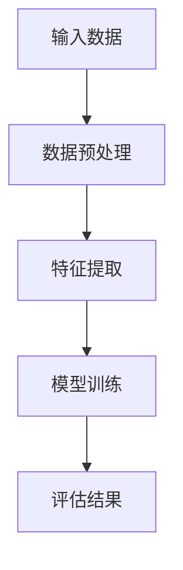

                 

# 彼得林奇对公司文化的重视

> **关键词**：彼得·林奇，公司文化，投资策略，企业文化评估，风险管理  
> **摘要**：本文探讨了彼得·林奇作为投资大师，如何将公司文化作为投资决策的核心因素之一。文章详细分析了公司文化在投资中的重要性，提出了公司文化的评估标准和方法，并通过案例展示了如何将这些标准应用于实际投资决策中。

---

## 第一部分: 公司文化在投资中的重要性

### 第1章: 公司文化的核心概念与背景介绍

#### 1.1 什么是公司文化
##### 1.1.1 公司文化的定义与内涵
公司文化是企业的灵魂，它包括企业的价值观、使命、愿景、管理风格以及员工的行为准则。公司文化不仅影响员工的工作态度和效率，还决定了企业在市场中的长期表现。

##### 1.1.2 公司文化的构成要素
公司文化由以下几个核心要素构成：
1. **企业价值观**：企业的核心信念和价值观，如诚信、创新、客户至上等。
2. **企业使命和愿景**：企业的长期目标和追求。
3. **管理风格**：管理层的决策风格和管理方式。
4. **员工关系**：员工之间的互动和团队合作氛围。
5. **企业行为准则**：企业在经营过程中遵循的道德和规范。

##### 1.1.3 公司文化与企业绩效的关系
公司文化是企业绩效的核心驱动力之一。积极向上的文化能够激发员工的潜力，增强企业的凝聚力和竞争力。相反，消极的文化会导致员工士气低落，企业效率低下。

---

#### 1.2 彼得·林奇的背景与投资理念
##### 1.2.1 彼得·林奇的生平简介
彼得·林奇（Peter Lynch）是美国著名的投资大师，被誉为“股神”巴菲特之后最成功的基金经理之一。他在共同基金管理领域的成就斐然，管理的麦哲伦基金创造了年平均收益率29%的惊人成绩。

##### 1.2.2 林奇的投资风格与哲学
林奇的投资风格以“基本面分析”和“长期持有”为核心。他认为，成功的投资不仅仅依赖于市场的短期波动，更取决于企业本身的内在价值和长期发展潜力。

##### 1.2.3 林奇对公司文化的重视
林奇认为，公司文化是企业成功的关键因素之一。他特别关注企业的管理团队、员工激励机制以及企业价值观，因为这些因素直接影响企业的长期发展和投资价值。

---

#### 1.3 公司文化在投资中的作用
##### 1.3.1 公司文化对投资者决策的影响
公司文化影响投资者对企业的信任度和投资信心。一个具有优秀文化的公司更容易获得投资者的青睐，因为其管理团队和员工更有可能为企业创造长期价值。

##### 1.3.2 公司文化与企业长期发展的关系
公司文化是企业长期发展的基石。优秀的企业文化能够激发员工的创造力和责任感，从而推动企业在竞争激烈的市场中保持领先地位。

##### 1.3.3 公司文化在企业风险管理中的地位
公司文化是企业风险管理的重要组成部分。健康的企业文化能够有效降低企业内部风险，如管理层腐败、员工士气低落等问题。

---

### 第2章: 公司文化的评估与分析

#### 2.1 公司文化的核心要素分析
##### 2.1.1 企业治理结构
企业治理结构是公司文化的重要组成部分，包括董事会结构、股权分配、管理层职责等内容。良好的治理结构能够确保企业决策的透明性和公正性。

##### 2.1.2 管理层的稳定性与决策能力
管理层的稳定性与决策能力直接影响企业的战略规划和执行效果。一个稳定的管理层能够为企业制定长期战略并确保其有效实施。

##### 2.1.3 员工激励机制
员工激励机制是公司文化的重要体现。有效的激励机制能够激发员工的工作热情和创造力，从而提高企业的整体绩效。

##### 2.1.4 企业价值观与使命
企业价值观与使命是公司文化的灵魂。它们决定了企业的行为准则和长期发展目标，是企业与员工之间的重要纽带。

---

#### 2.2 彼得·林奇的公司文化评估标准
##### 2.2.1 管理层的诚信与责任感
林奇认为，管理层的诚信与责任感是企业成功的关键。他特别关注管理层的决策能力和对企业长期发展的承诺。

##### 2.2.2 员工的凝聚力与忠诚度
林奇认为，员工的凝聚力与忠诚度是企业文化的直接体现。一个团结的团队能够更好地应对市场挑战并实现企业目标。

##### 2.2.3 企业的创新能力和适应性
林奇非常重视企业的创新能力和适应性。他倾向于投资那些能够快速适应市场变化并不断创新的企业。

##### 2.2.4 企业的财务健康状况
林奇认为，企业的财务健康状况是公司文化的重要反映。健康的财务状况表明企业管理层能够有效控制成本并合理分配资源。

---

#### 2.3 公司文化评估的指标与方法
##### 2.3.1 公司文化评估的指标体系
公司文化评估的指标体系包括以下几个方面：
1. **管理层的稳定性与决策能力**
2. **员工的凝聚力与忠诚度**
3. **企业的创新能力和适应性**
4. **企业的财务健康状况**

##### 2.3.2 文化评估的定性与定量方法
定性方法包括对企业治理结构、管理层诚信、员工激励机制等的评估；定量方法则包括对企业财务状况、员工满意度、市场表现等数据的分析。

##### 2.3.3 文化评估的实际操作步骤
1. **收集数据**：包括企业财务报表、员工满意度调查、管理层简历等。
2. **分析数据**：根据评估指标对数据进行分析和评分。
3. **综合评估**：结合定性和定量分析，得出企业的文化评分。

---

### 第3章: 公司文化对投资决策的影响

#### 3.1 公司文化与投资策略的关系
##### 3.1.1 公司文化对投资风险的控制
优秀的企业文化能够降低投资风险。健康的公司文化能够减少企业内部问题的发生，从而降低投资风险。

##### 3.1.2 公司文化对投资收益的提升
优秀的企业文化能够提升投资收益。企业的创新能力和员工的积极性能够推动企业实现更高的业绩，从而为投资者带来更高的回报。

##### 3.1.3 公司文化对投资周期的影响
公司文化影响投资周期。优秀的企业文化能够延长企业的生命周期，从而为投资者提供更长的投资周期。

---

#### 3.2 彼得·林奇的公司文化投资策略
##### 3.2.1 林奇的选股标准与文化因素
林奇在选股时特别关注企业的文化因素，包括管理层的诚信、员工的凝聚力、企业的创新能力和财务健康状况。

##### 3.2.2 林奇对管理层的信任与评估
林奇非常重视管理层的信任与评估。他倾向于投资那些由具有诚信和责任感的管理层领导的企业。

##### 3.2.3 林奇对员工激励机制的关注
林奇认为，有效的员工激励机制是企业成功的关键。他倾向于投资那些能够激发员工积极性的企业。

---

#### 3.3 公司文化在投资组合中的应用
##### 3.3.1 如何通过公司文化优化投资组合
投资者可以通过对公司文化的评估，选择那些具有优秀文化的企业进行投资，从而优化投资组合的风险和收益。

##### 3.3.2 文化因素在资产配置中的权重
文化因素在资产配置中的权重因企业而异。一般来说，文化因素在长期投资中具有更大的权重。

##### 3.3.3 公司文化对投资风险分散的作用
公司文化能够分散投资风险。通过选择不同文化背景的企业进行投资，投资者可以降低因单一文化问题带来的风险。

---

## 第四部分: 公司文化评估的系统分析与架构设计

### 第4章: 公司文化评估的系统框架
#### 4.1 系统的整体架构
公司文化评估系统包括数据输入、数据预处理、特征提取、模型训练和评估结果输出五个模块。

#### 4.2 系统的功能模块划分
1. **数据输入模块**：接收企业的财务数据、员工数据和管理层数据。
2. **数据预处理模块**：对数据进行清洗和标准化处理。
3. **特征提取模块**：提取企业的关键文化特征。
4. **模型训练模块**：根据提取的特征训练评估模型。
5. **评估结果输出模块**：输出企业的文化评分和投资建议。

---

### 第5章: 公司文化评估的算法原理
#### 5.1 算法概述
公司文化评估算法采用加权评分法，根据企业的文化特征对企业进行评分。

#### 5.2 算法流程图（Mermaid）

#### 5.3 加权评分模型
$$ \text{文化评分} = \sum_{i=1}^{n} w_i x_i $$
其中，\( w_i \) 是第 \( i \) 个特征的权重，\( x_i \) 是第 \( i \) 个特征的评分。

---

### 第6章: 项目实战
#### 6.1 案例分析
假设我们有一家科技公司，其文化特征如下：
- **管理层诚信**：9分（满分10分）
- **员工凝聚力**：8分
- **创新能力**：7分
- **财务健康状况**：8分

根据加权评分模型，我们可以计算出该公司的文化评分为：
$$ \text{文化评分} = 0.4 \times 9 + 0.3 \times 8 + 0.2 \times 7 + 0.1 \times 8 = 8.0 $$

#### 6.2 投资建议
根据文化评分模型，该公司的文化评分为8分，属于优秀企业。投资者可以考虑长期持有该公司的股票，因为其管理层诚信度高，员工凝聚力强，创新能力强，财务状况健康。

---

## 第五部分: 总结与展望

### 第7章: 总结与最佳实践
#### 7.1 总结
公司文化是投资决策的重要因素之一。彼得·林奇的成功经验表明，投资者需要重视公司文化，选择那些具有优秀文化的企业进行投资。

#### 7.2 最佳实践
1. **全面评估企业文化**：投资者需要全面评估企业的文化特征，包括管理层诚信、员工凝聚力、创新能力等。
2. **长期投资**：公司文化的评估需要时间，投资者应采取长期投资策略。
3. **分散投资**：通过选择不同文化背景的企业进行投资，可以降低投资风险。

---

## 第六部分: 参考文献与拓展阅读

### 6.1 参考文献
1. 彼得·林奇. 《彼得·林奇的成功投资法则》
2. 哈佛商学院. 《公司治理与企业文化》
3. 约翰·奈特. 《企业文化与企业绩效》

---

## 作者：AI天才研究院/AI Genius Institute & 禅与计算机程序设计艺术 /Zen And The Art of Computer Programming

