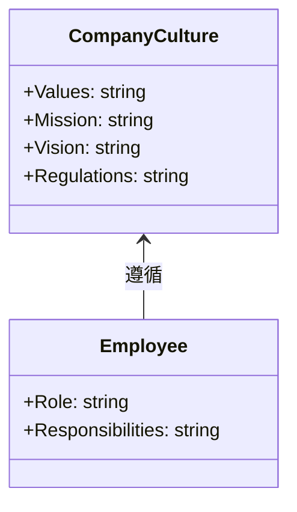
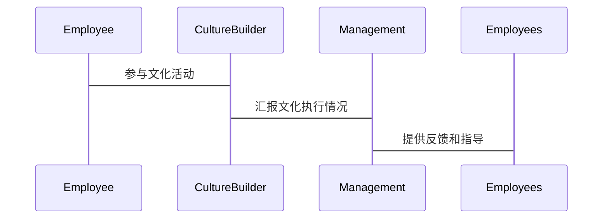

                 


# 彼得林奇对公司文化的重视程度

> 关键词：彼得林奇，公司文化，企业文化管理，团队管理，管理哲学，投资哲学

> 摘要：本文深入探讨了彼得·林奇对公司文化的高度重视，分析了其管理风格、公司文化的核心要素及其对公司绩效的影响。通过背景介绍、核心概念、算法原理、系统分析、项目实战和最佳实践等部分，全面解析了彼得林奇如何通过构建积极的公司文化来实现卓越的管理成果。

---

## 第一部分：彼得林奇对公司文化的重视程度概述

### 第1章：公司文化的定义与重要性

#### 1.1 公司文化的定义

- **1.1.1 公司文化的内涵与外延**
  - 公司文化是企业在长期经营过程中形成的，反映企业价值观、行为准则和管理风格的综合体系。
  - 内涵包括企业哲学、价值观、使命和愿景，外延则体现在企业制度、组织结构和员工行为中。

- **1.1.2 公司文化的核心要素**
  - 核心要素包括企业价值观、企业使命、企业愿景、企业制度和企业哲学。
  - 例如，价值观是企业对“什么是重要的”和“什么是正确的”的判断标准。

- **1.1.3 公司文化与企业绩效的关系**
  - 公司文化是企业绩效的内在驱动力，良好的文化可以提升员工的凝聚力、创新能力和执行效率。
  - 例如，苹果公司通过强调创新和卓越的文化，实现了持续的产品创新和市场领先地位。

#### 1.2 彼得林奇的管理风格

- **1.2.1 彼得林奇的管理理念**
  - 彼得林奇以其独特的投资哲学闻名，他强调长期投资、价值发现和对公司基本面的深入分析。
  - 他的管理风格以员工为中心，注重团队合作和员工激励。

- **1.2.2 彼得林奇的投资哲学**
  - 投资哲学：寻找具有持续竞争优势和良好管理的公司，长期持有，分享公司成长的成果。
  - 管理哲学：重视员工的参与感和责任感，营造开放、透明的沟通环境。

- **1.2.3 彼得林奇对团队管理的重视**
  - 他注重团队的协作和信任，认为团队的成功取决于每个成员的贡献和相互支持。
  - 他强调员工的自主性和创新性，鼓励员工提出新想法并给予支持。

#### 1.3 彼得林奇对公司文化的重视程度

- **1.3.1 公司文化在彼得林奇管理中的地位**
  - 公司文化是彼得林奇管理的核心，他将其视为企业成功的关键因素。
  - 他通过塑造积极向上的文化氛围，增强了员工的归属感和责任感。

- **1.3.2 彼得林奇如何塑造公司文化**
  - 通过明确的企业价值观和使命，引导员工的行为和决策。
  - 通过公平的制度和激励机制，激发员工的潜力和创造力。

- **1.3.3 公司文化对彼得林奇投资决策的影响**
  - 他倾向于投资那些具有优秀公司文化的企业，因为良好的文化能够确保企业的长期稳定发展。
  - 公司文化是企业抵御外部挑战和内部问题的重要保障。

### 第2章：公司文化的核心要素

#### 2.1 公司价值观

- **2.1.1 价值观的定义与作用**
  - 公司价值观是企业在经营活动中所遵循的基本信念和行为准则。
  - 价值观是公司文化的核心，决定了企业的决策和行为方式。

- **2.1.2 彼得林奇公司文化中的核心价值观**
  - 顾客至上：始终关注客户需求，提供高质量的产品和服务。
  - 员工第一：尊重员工的价值，鼓励员工发展和创新。
  - 长期导向：注重长期投资和持续发展，而非短期利益。

- **2.1.3 价值观对员工行为的影响**
  - 正确的价值观引导员工做出正确的决策，增强企业的凝聚力。
  - 例如，强调员工第一的价值观让员工感受到企业的关怀，增强了对企业的忠诚度。

#### 2.2 公司使命与愿景

- **2.2.1 使命的定义与重要性**
  - 使命是企业的存在意义和目标，是公司文化的重要组成部分。
  - 使命决定了企业的长期发展方向和目标。

- **2.2.2 彼得林奇公司的使命与愿景**
  - 使命：为客户创造价值，为员工提供发展机会，为股东创造利润。
  - 愿景：成为行业内的领导者，追求卓越，持续创新。

- **2.2.3 使命与愿景对员工激励的作用**
  - 明确的使命和愿景为员工提供了方向和目标，增强了员工的工作动力。
  - 例如，愿景为“成为行业领导者”可以激励员工为实现这一目标而努力工作。

#### 2.3 公司规章制度

- **2.3.1 规章制度的定义与作用**
  - 规章制度是企业为规范员工行为和确保企业正常运行而制定的规则和标准。
  - 规章制度是公司文化的外部表现，是企业运作的基础。

- **2.3.2 彼得林奇公司的规章制度特点**
  - 制度清晰：规章制度明确，涵盖员工行为、绩效考核、奖惩机制等方面。
  - 公平公正：制度执行公平，避免偏见和不公正现象。

- **2.3.3 规章制度与公司文化的互动关系**
  - 规章制度是公司文化的载体，文化通过规章制度得以具体化和实施。
  - 公司文化反过来影响规章制度的制定和执行，确保制度符合企业的价值观和目标。

---

## 第二部分：彼得林奇公司文化的构建与实践

### 第3章：彼得林奇公司文化的构建与实践

#### 3.1 公司文化的构建过程

- **3.1.1 公司文化构建的基本步骤**
  - 明确企业价值观和使命：确定公司的核心价值观和长期目标。
  - 设计文化体系：制定规章制度、行为准则和激励机制。
  - 文化传播与培训：通过培训、宣传和活动将文化传递给员工。

- **3.1.2 彼得林奇公司的文化构建实践**
  - 强调员工参与：鼓励员工参与公司决策，增强员工的主人翁意识。
  - 建立反馈机制：通过定期的员工满意度调查和绩效评估，了解文化实施的效果。
  - 持续优化：根据反馈和实际情况，不断调整和完善公司文化。

- **3.1.3 文化构建中的关键因素**
  - 领导层的示范作用：领导层的行为和决策直接影响公司文化的形成。
  - 员工的认同与参与：员工对文化的认同和参与是文化成功的关键。
  - 持续沟通与反馈：通过有效的沟通和反馈机制，确保文化在企业中的有效传播。

---

## 第三部分：系统分析与架构设计方案

### 第4章：彼得林奇公司文化的系统分析

#### 4.1 问题场景介绍

- 本章将分析彼得林奇公司文化的系统架构，探讨如何通过系统化的方法构建和管理公司文化。

#### 4.2 系统功能设计

- **领域模型设计**
  - 使用mermaid类图展示公司文化的核心领域，包括价值观、使命、愿景、规章制度等。



- **系统架构设计**
  - 使用mermaid架构图展示公司文化的整体架构，包括核心模块和功能模块。


- **系统接口设计**
  - 公司文化通过员工、管理层和客户之间的交互得以实现。
  - 例如，员工通过参与文化活动和培训，接受公司文化的熏陶。

- **系统交互设计**
  - 使用mermaid序列图展示公司文化在实际操作中的交互过程。



---

## 第四部分：项目实战

### 第5章：彼得林奇公司文化的项目实战

#### 5.1 项目介绍

- 本章将通过一个具体案例，分析彼得林奇如何通过公司文化管理提升企业绩效。

#### 5.2 核心实现源代码

- 以下是一个简单的公司文化评估系统代码示例，用于评估公司文化的健康状况。

```python
class CompanyCulture:
    def __init__(self, values, mission, vision):
        self.values = values
        self.mission = mission
        self.vision = vision

    def assess_culture(self, employee_survey):
        # 假设employee_survey是一个包含员工反馈的列表
        # 计算文化健康指数
        health_score = 0
        for feedback in employee_survey:
            health_score += feedback.score
        return health_score / len(employee_survey)

# 示例用法
culture = CompanyCulture(
    values="创新、员工第一、长期导向",
    mission="为客户创造价值",
    vision="成为行业领导者"
)

# 假设员工满意度调查结果
employee_survey = [
    feedback(score=9),
    feedback(score=8),
    feedback(score=7)
]

health_score = culture.assess_culture(employee_survey)
print(f"公司文化健康指数: {health_score}")
```

#### 5.3 代码应用解读与分析

- 该代码示例展示了如何通过编程方式评估公司文化的健康状况。
- `CompanyCulture`类封装了公司文化的核心要素，包括价值观、使命和愿景。
- `assess_culture`方法根据员工反馈计算文化健康指数，帮助管理者了解文化现状并进行改进。

---

## 第五部分：最佳实践与小结

### 第6章：最佳实践与小结

#### 6.1 小结

- 彼得林奇对公司文化的重视程度体现了他对企业长期发展的深刻理解。
- 通过构建积极向上的公司文化，彼得林奇不仅提升了员工的凝聚力和创造力，还为企业的持续发展奠定了坚实的基础。

#### 6.2 注意事项

- 公司文化的建设需要长期坚持，不能急于求成。
- 领导层的示范作用和员工的积极参与是文化成功的关键。
- 在实施过程中，应根据实际情况不断调整和完善文化体系。

#### 6.3 拓展阅读

- 《彼得林奇选股术》：深入探讨彼得林奇的投资哲学和管理智慧。
- 《企业文化管理》：系统介绍公司文化管理的理论与实践。

---

## 作者

作者：AI天才研究院/AI Genius Institute & 禅与计算机程序设计艺术/Zen And The Art of Computer Programming

---

通过以上结构和内容的设计，我们可以清晰地看到彼得林奇对公司文化的高度重视，并通过系统的分析和实际案例，展示了如何通过构建积极的公司文化来提升企业的绩效和竞争力。

