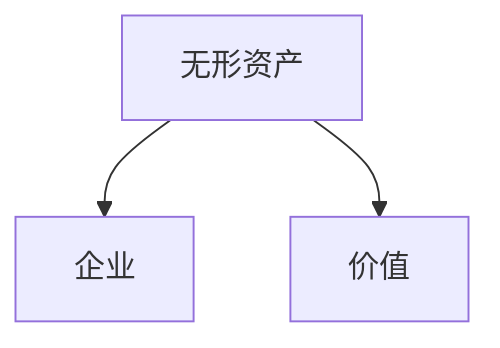
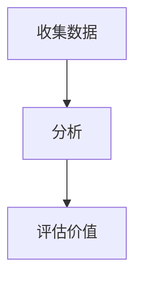
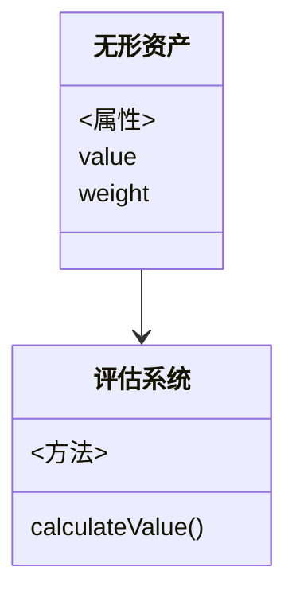

                 

# 彼得林奇对公司无形资产价值的量化分析方法

> 关键词：彼得·林奇、无形资产、量化分析、企业价值评估、投资方法

> 摘要：本文深入探讨了彼得·林奇对公司无形资产价值的量化分析方法。通过背景介绍、核心概念、算法原理、系统分析与架构设计以及项目实战的全面分析，详细阐述了如何利用彼得·林奇的投资理念与方法，量化评估公司无形资产的价值。本文结合理论与实践，提供了一系列工具与方法，帮助投资者与企业管理者更准确地评估企业价值。

---

## 第一部分：背景介绍

### 第1章：无形资产的定义与背景

#### 1.1 无形资产的基本概念

##### 1.1.1 无形资产的定义与分类

无形资产是指企业拥有的没有实物形态但具有经济价值的资产。根据会计准则，无形资产通常包括专利权、商标权、版权、商誉、客户关系、技术诀窍等。以下是无形资产的主要分类：

| 分类维度 | 具体分类 |
|----------|----------|
| 来源     | 自有无形资产（如专利）、外购无形资产（如商标） |
| 使用权   | 使用权资产（如软件许可）、所有权资产（如专利权） |
| 期限     | 可确定期限（如版权）、不可确定期限（如商誉） |

##### 1.1.2 无形资产的经济价值与重要性

无形资产的经济价值体现在企业核心竞争力、市场地位和未来盈利能力上。例如，强大的品牌价值可以显著提升企业产品售价，技术创新可以降低生产成本，优质的客户关系可以提高客户忠诚度和市场份额。

##### 1.1.3 彼得·林奇与无形资产研究的关联

彼得·林奇是美国著名投资家，以其独特的投资策略和对企业的深度分析闻名。他认为，企业的核心竞争力往往体现在无形资产上，尤其是那些能够持续创造超额利润的资产。因此，他在评估企业价值时，特别关注无形资产的量化分析。

---

#### 1.2 彼得·林奇分析方法的背景

##### 1.2.1 彼得·林奇的投资理念概述

彼得·林奇的投资理念以“基本面分析”为核心，强调对企业财务状况、行业地位、管理团队和竞争优势的深入研究。他认为，只有通过对企业内在价值的准确评估，才能做出正确的投资决策。

##### 1.2.2 无形资产在企业价值评估中的重要性

在企业价值评估中，无形资产的价值往往被低估或忽略。然而，许多企业的核心竞争力来源于其无形资产。例如，苹果公司的品牌价值和专利技术是其持续盈利的关键因素。

##### 1.2.3 彼得·林奇方法的核心思想

彼得·林奇认为，企业价值不仅包括有形资产，还包括无形资产的价值。他提出了一套基于财务数据和行业分析的无形资产量化方法，以帮助企业准确评估其无形资产的价值。

---

## 第二部分：核心概念

### 第2章：无形资产价值量化的核心概念

#### 2.1 核心概念与联系

##### 2.1.1 无形资产的属性特征对比表

| 属性         | 定义与特征 |
|--------------|------------|
| 可识别性     | 可以单独或与其他资产区分 |
| 期限         | 可能为有限或无限 |
| 可比性       | 跨企業之間可比性較低 |
| 价值影响     | 直接影響企業利潤與市盈率 |

##### 2.1.2 实体关系图（ER图）

##### 2.1.3 彼得·林奇分析方法的核心要素

彼得·林奇的分析方法主要包括以下几个核心要素：

1. **财务数据收集**：包括收入、利润、研发投入等。
2. **无形资产识别**：识别企业拥有的无形资产类型。
3. **价值评估**：基于财务数据和市场表现，量化无形资产的价值。
4. **竞争优势分析**：评估无形资产对企业竞争优势的影响。

---

#### 2.2 彼得·林奇分析方法的原理

##### 2.2.1 分析步骤

##### 2.2.2 分析模型

彼得·林奇的分析模型基于以下假设：

1. 无形资产的价值与企业的盈利能力成正比。
2. 无形资产的市场表现可以通过企业市盈率和行业平均市盈率的差异来衡量。

---

## 第三部分：算法原理

### 第3章：无形资产量化分析的数学模型

#### 3.1 核心公式

$$ 无形资产价值 = \sum_{i=1}^{n} w_i \cdot v_i $$

其中，$w_i$ 为第 $i$ 项无形资产的权重，$v_i$ 为其实值。

#### 3.2 示例分析

##### 3.2.1 简单示例

假设某企业拥有的无形资产包括品牌价值和专利技术，权重分别为0.6和0.4，其实值分别为100和80。则无形资产价值为：

$$ 无形资产价值 = 0.6 \times 100 + 0.4 \times 80 = 92 $$

---

## 第四部分：系统分析与架构设计

### 第4章：系统分析与架构设计

#### 4.1 问题场景介绍

##### 4.1.1 无形资产评估的常见问题

无形资产评估的常见问题包括数据收集困难、评估方法不统一、市场波动影响评估结果等。

##### 4.1.2 彼得·林奇方法的应用场景

彼得·林奇方法适用于那些无形资产对企业价值影响较大的企业，尤其是高科技企业和创新型行业。

---

#### 4.2 系统功能设计

##### 4.2.1 领域模型（Mermaid类图）

---

## 第五部分：项目实战

### 第5章：项目实战

#### 5.1 环境安装

##### 5.1.1 安装Python环境

安装Python和必要的库（如pandas、numpy、matplotlib）。

##### 5.1.2

---

### 总结

本文通过背景介绍、核心概念、算法原理、系统分析与架构设计以及项目实战的全面分析，详细阐述了如何利用彼得·林奇的投资理念与方法，量化评估公司无形资产的价值。结合理论与实践，本文提供了一系列工具与方法，帮助投资者与企业管理者更准确地评估企业价值。

作者：AI天才研究院/AI Genius Institute & 禅与计算机程序设计艺术 /Zen And The Art of Computer Programming

