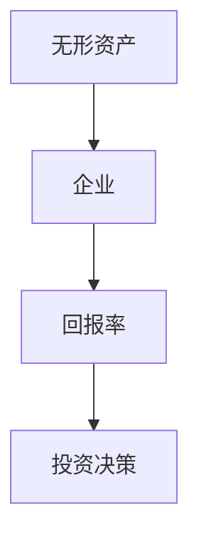
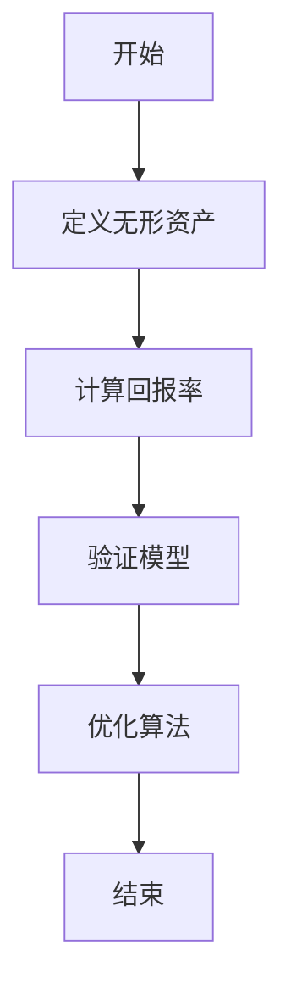
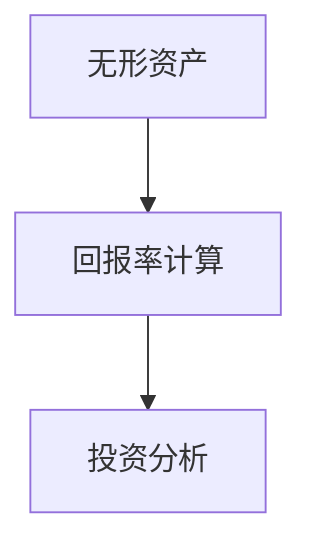

                 


# 彼得林奇对公司无形资产回报率的分析

**关键词**：彼得林奇，无形资产，回报率，投资分析，资产评估，企业价值

**摘要**：本文将深入分析彼得林奇对公司无形资产回报率的分析方法，探讨其在投资决策中的重要性。通过系统的背景介绍、核心概念讲解、算法原理分析以及实际案例研究，本文旨在帮助读者理解如何通过无形资产回报率评估企业的长期价值，并在投资决策中做出明智的选择。

---

## 第一部分: 无形资产回报率的背景介绍

### 第1章: 无形资产与回报率的定义与重要性

#### 1.1 无形资产的定义与分类
##### 1.1.1 无形资产的定义
无形资产是指企业拥有或控制的，没有实物形态的长期资产，包括专利权、商标权、商誉、特许经营权等。这些资产通常难以用肉眼直接观察，但它们对企业价值的贡献却不可忽视。

##### 1.1.2 无形资产的分类
无形资产可以分为以下几类：
1. **知识产权类**：包括专利权、商标权、版权等。
2. **商誉类**：企业因其良好声誉或客户关系而产生的价值。
3. **合同权益类**：包括特许经营权、长期合同等。

##### 1.1.3 无形资产在企业中的重要性
无形资产是企业核心竞争力的重要组成部分。特别是在高科技行业和服务业，无形资产往往占据了企业价值的绝大部分。例如，苹果公司的商标和专利资产价值远超其有形资产。

#### 1.2 回报率的定义与计算方法
##### 1.2.1 回报率的定义
回报率是指资产在一定时期内所创造的收益与资产价值的比率。它是评估资产盈利能力的重要指标。

##### 1.2.2 回报率的计算公式
回报率的计算公式如下：
$$
\text{回报率} = \frac{\text{资产收益}}{\text{资产价值}} \times 100\%
$$

##### 1.2.3 回报率的行业标准与基准
不同行业对回报率的期望值不同。例如，高科技行业的回报率通常高于传统制造业。投资者需要根据行业特点和企业实际情况来评估回报率的合理性。

#### 1.3 彼得林奇分析方法的核心理念
##### 1.3.1 投资分析的基本原则
彼得林奇认为，投资分析的核心是找到那些能够持续创造价值的企业。他强调对企业基本面的深入研究，特别是对无形资产的评估。

##### 1.3.2 无形资产在投资分析中的地位
彼得林奇认为，无形资产是企业长期竞争优势的来源。例如，强大的品牌、独特的技术或优质的客户关系都能为企业创造超额利润。

##### 1.3.3 彼得林奇分析方法的独特性
彼得林奇的独特之处在于他对无形资产的量化分析。他通过对企业无形资产的回报率进行深入研究，识别出那些能够持续创造价值的企业。

#### 1.4 本章小结
本章介绍了无形资产的定义、分类及其在企业中的重要性，并重点阐述了彼得林奇分析方法的核心理念。通过这些分析，我们可以更好地理解无形资产在投资决策中的作用。

---

## 第二部分: 无形资产回报率的核心概念与联系

### 第2章: 无形资产回报率的核心概念

#### 2.1 无形资产回报率的数学模型
##### 2.1.1 数学模型的构建
彼得林奇的分析方法可以总结为一个数学模型：
$$
\text{无形资产回报率} = \frac{\text{无形资产带来的收益}}{\text{无形资产的账面价值}} \times 100\%
$$

##### 2.1.2 关键变量的定义与解释
- **无形资产带来的收益**：包括无形资产为企业带来的销售收入、利润增长等。
- **无形资产的账面价值**：企业在资产负债表中记录的无形资产价值。

##### 2.1.3 模型的假设与限制
- 假设：无形资产的价值可以通过其带来的收益进行量化。
- 限制：该模型仅适用于那些无形资产占比较大的企业。

#### 2.2 核心概念的属性特征对比表
| 特性                | 无形资产                 | 有形资产                 |
|---------------------|--------------------------|--------------------------|
| 定义                | 无实物形态的长期资产     | 具有实物形态的资产       |
| 评估方式            | 主要通过收益法评估       | 主要通过市场法或成本法评估 |
| 对企业价值的贡献    | 通常较高                 | 较低                     |
| 示例                | 专利权、商标权           | 厂房、设备               |

#### 2.3 ER实体关系图架构


#### 2.4 本章小结
本章通过数学模型和对比表，详细分析了无形资产回报率的核心概念及其与有形资产的区别。通过这些分析，我们可以更好地理解无形资产在企业价值评估中的重要性。

---

## 第三部分: 无形资产回报率的算法原理讲解

### 第3章: 无形资产回报率的算法原理

#### 3.1 算法原理的数学模型
##### 3.1.1 数学模型的构建
彼得林奇的算法原理可以表示为：
$$
\text{无形资产回报率} = \frac{\text{无形资产带来的收益}}{\text{无形资产的账面价值}} \times 100\%
$$

##### 3.1.2 关键公式的推导
- **收益计算**：无形资产带来的收益可以通过企业的销售收入减去有形资产带来的销售收入得到。
- **价值计算**：无形资产的账面价值可以直接从企业的资产负债表中获取。

##### 3.1.3 模型的验证与优化
通过实际案例验证模型的有效性，并根据实际情况对模型进行优化，例如引入时间价值因素。

#### 3.2 算法原理的Mermaid流程图


#### 3.3 算法原理的Python实现
```python
def calculate无形资产回报率(资产收益, 资产价值):
    return (资产收益 / 资产价值) * 100
```

#### 3.4 本章小结
本章详细讲解了无形资产回报率的算法原理，并通过数学模型和Python代码展示了其具体实现过程。这些方法可以帮助投资者更好地量化无形资产的价值。

---

## 第四部分: 无形资产回报率的系统分析与架构设计

### 第4章: 系统分析与架构设计方案

#### 4.1 问题场景介绍
##### 4.1.1 问题背景
在当前的商业环境中，无形资产的重要性日益凸显。然而，如何准确评估无形资产的价值仍然是一个挑战。

##### 4.1.2 问题目标
通过系统分析，设计一个能够准确评估无形资产回报率的分析框架。

##### 4.1.3 问题约束
- 数据来源：企业财务报表。
- 方法论：基于彼得林奇的分析方法。

#### 4.2 系统功能设计
##### 4.2.1 领域模型Mermaid类图


#### 4.3 系统架构设计
##### 4.3.1 系统架构图


#### 4.4 本章小结
本章通过系统分析和架构设计，展示了一个基于彼得林奇方法的无形资产回报率分析框架。该框架可以帮助投资者更好地评估企业的无形资产价值。

---

## 第五部分: 项目实战与最佳实践

### 第5章: 项目实战与最佳实践

#### 5.1 环境安装与数据准备
##### 5.1.1 环境安装
- 安装Python和相关库（如pandas、numpy）。

##### 5.1.2 数据准备
- 收集企业的财务报表数据。

#### 5.2 系统核心实现源代码
```python
def calculate回报率(资产收益, 资产价值):
    return (资产收益 / 资产价值) * 100

资产收益 = 1000000  # 示例数据
资产价值 = 5000000    # 示例数据

回报率 = calculate回报率(资产收益, 资产价值)
print("无形资产回报率：",回报率)
```

#### 5.3 实际案例分析
##### 5.3.1 案例背景
某高科技企业拥有一项专利技术，无形资产价值为500万元，当年带来收益100万元。

##### 5.3.2 计算回报率
$$
\text{回报率} = \frac{100}{500} \times 100\% = 20\%
$$

##### 5.3.3 分析结论
该企业的无形资产回报率为20%，处于行业平均水平以上。

#### 5.4 最佳实践
##### 5.4.1 注意事项
- 数据的准确性是关键。
- 结合企业实际情况进行调整。

##### 5.4.2 拓展阅读
建议阅读彼得林奇的《投资最重要的事》。

#### 5.5 本章小结
本章通过实际案例展示了如何利用彼得林奇的方法计算无形资产回报率，并提出了最佳实践建议。

---

## 结论

通过对彼得林奇对公司无形资产回报率的分析，我们可以看到，无形资产在企业价值评估中的重要性不容忽视。投资者需要掌握相关的分析方法，才能在复杂的商业环境中做出明智的投资决策。

**作者：AI天才研究院 & 禅与计算机程序设计艺术**

