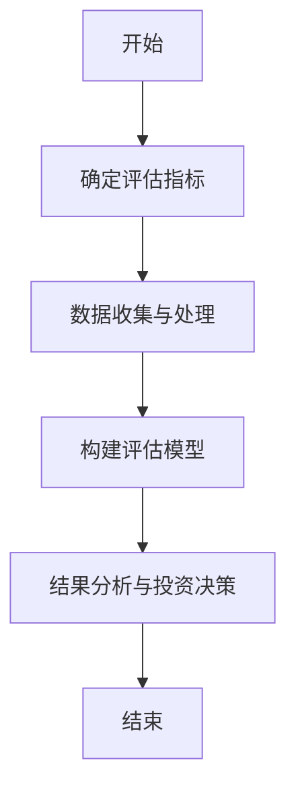
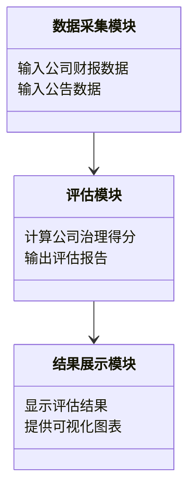

                 


# 彼得林奇对公司治理的要求

## 关键词
- 彼得林奇
- 公司治理
- 投资策略
- 董事会结构
- 股东权益

## 摘要
本文深入分析了彼得·林奇作为著名投资经理人，对公司治理的高度重视及其具体要求。文章从公司治理的基本概念出发，探讨了其在彼得林奇投资策略中的核心地位，详细阐述了他对董事会结构、管理层激励机制和股东权益保护等方面的要求，并通过系统架构和实际案例，展示了如何将这些治理要求融入投资决策中，以实现长期稳健的投资回报。

---

# 第一部分：公司治理与彼得林奇投资理念的背景

## 第1章：公司治理的基本概念

### 1.1 公司治理的定义与核心要素

#### 1.1.1 公司治理的定义
公司治理是指公司内部权力结构和责任分配的制度安排，涉及董事会、管理层、股东和其他利益相关者之间的关系。其核心目标是确保公司高效运作、透明决策，并最大化股东价值。

#### 1.1.2 公司治理的核心要素
公司治理的核心要素包括：
- **董事会结构**：董事会的组成、职责和运作方式。
- **管理层责任**：高管的职责、权限和激励机制。
- **股东权益**：股东的投票权、分红权和监督权。
- **内部控制**：公司内部的审计、合规和风险管理机制。
- **外部监管**：行业监管机构和法律法规对公司运作的监督。

#### 1.1.3 公司治理的边界与外延
公司治理的边界主要集中在公司内部管理，而其外延则涉及公司与外部利益相关者（如供应商、客户、债权人等）的关系，以及公司对社会和环境的责任。

---

## 第2章：彼得林奇与公司治理的联系

### 2.1 彼得林奇的投资者身份与公司治理

#### 2.1.1 彼得林奇的投资者身份
彼得·林奇是美国著名的职业经理人，以其在富达投资集团的卓越表现闻名。他在投资过程中，对公司治理问题给予了特别关注，认为良好的公司治理是公司长期稳定发展的基石。

#### 2.1.2 彼得林奇对公司治理的关注点
- **董事会结构**：林奇认为，董事会应由具备专业能力和独立判断的成员组成，以确保公司战略的有效性和管理的透明度。
- **管理层素质**：他强调管理层的诚信和专业能力，认为管理层的决策对公司价值的影响至关重要。
- **股东权益保护**：林奇主张股东权益应得到充分保护，尤其是中小股东的权益，防止大股东操纵和利益输送。

#### 2.1.3 公司治理在彼得林奇投资策略中的地位
在彼得林奇的投资策略中，公司治理是评估公司价值的重要因素。他倾向于投资那些治理结构完善、管理层透明且有责任感的公司，因为这些公司更有可能实现长期稳定的业绩增长。

---

## 第3章：彼得林奇对公司治理的具体要求

### 3.1 彼得林奇对公司治理的核心要素

#### 3.1.1 董事会的构成与职责
- **董事会构成**：林奇认为董事会应包含一定比例的独立董事，以确保决策的独立性和客观性。
- **董事会职责**：董事会负责制定公司战略、监督管理层执行情况，并确保公司合规经营。

#### 3.1.2 高层管理者的素质与激励机制
- **管理层素质**：林奇强调管理层应具备专业能力和良好的职业道德，避免短视行为。
- **激励机制**：他支持通过股权激励等方式将管理层的利益与股东利益绑定，以激励管理层追求长期价值。

#### 3.1.3 股东权益的保护
- **股东权利**：林奇认为股东应享有知情权、投票权和分红权，并通过股东大会等形式参与公司治理。
- **防止滥用权力**：他反对大股东操纵公司或利益输送，主张通过法律和制度设计保护中小股东权益。

---

## 第4章：彼得林奇公司治理评估的算法原理

### 4.1 公司治理评估的步骤

#### 4.1.1 确定评估指标
评估公司治理的关键指标包括：
- **董事会结构**：独立董事比例、董事会会议频率。
- **管理层素质**：高管的教育背景、行业经验。
- **股东权益保护**：股东分红政策、股东投票权。

#### 4.1.2 数据收集与处理
通过公司财报、公告和新闻报道等渠道收集数据，并进行清洗和整理。

#### 4.1.3 评估模型的构建与验证
采用加权评分法，根据各项指标的重要性赋予不同权重，计算公司治理的综合得分。

#### 4.1.4 结果分析与投资决策
根据评估结果，筛选出治理结构优良的公司，作为投资标的。

### 4.2 算法流程图


---

## 第5章：系统架构与项目实战

### 5.1 系统架构设计

#### 5.1.1 问题场景介绍
设计一个公司治理评估系统，帮助投资者快速评估目标公司的治理结构。

#### 5.1.2 系统功能设计
- **数据采集模块**：收集公司治理相关数据。
- **评估模块**：计算公司治理得分。
- **结果展示模块**：以图表形式展示评估结果。

#### 5.1.3 系统架构图


### 5.2 项目实战

#### 5.2.1 环境安装
安装Python和相关库（如Pandas、Matplotlib）。

#### 5.2.2 核心代码实现

```python
import pandas as pd
import matplotlib.pyplot as plt

def calculate_governance_score(finance_data):
    # 假设finance_data是一个包含公司治理指标的DataFrame
    # 计算独立董事比例
    independent_directors = finance_data['independent_directors'] / finance_data['total_directors']
    # 计算高管激励比例
    incentive_ratio = finance_data['executive_incentives'] / finance_data['revenue']
    # 计算股东权益保护得分
    shareholder_rights = finance_data['shareholder_rights_score']
    # 综合得分
    governance_score = (independent_directors * 0.4 + incentive_ratio * 0.3 + shareholder_rights * 0.3).round(2)
    return governance_score

# 示例数据
data = {
    'company': ['Company A', 'Company B'],
    'independent_directors': [3, 2],
    'total_directors': [5, 5],
    'executive_incentives': [1000000, 500000],
    'revenue': [10000000, 8000000],
    'shareholder_rights_score': [0.8, 0.6]
}
finance_data = pd.DataFrame(data)

# 计算得分
score = calculate_governance_score(finance_data)
print(score)
```

#### 5.2.3 实际案例分析
以两家公司为例，计算其治理得分，分析得分差异并解释原因。

---

## 第6章：最佳实践与小结

### 6.1 小结
彼得·林奇对公司治理的高度重视，使其投资策略更加稳健和可靠。通过合理的公司治理结构和透明的管理机制，投资者可以更好地评估公司的长期价值。

### 6.2 注意事项
- 投资者应结合公司的财务状况和行业环境，全面评估公司价值。
- 公司治理评估应与公司基本面分析相结合，避免单一维度的评估。

### 6.3 拓展阅读
- 彼得·林奇的《投资之道》
- 相关公司治理研究文献

---

## 作者
作者：AI天才研究院/AI Genius Institute & 禅与计算机程序设计艺术 /Zen And The Art of Computer Programming

