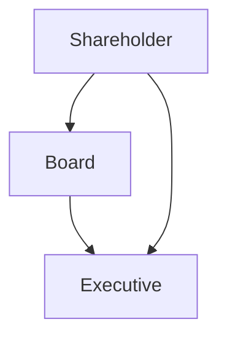
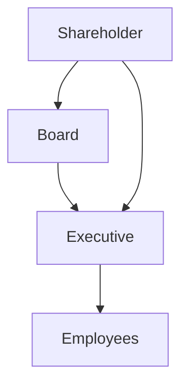
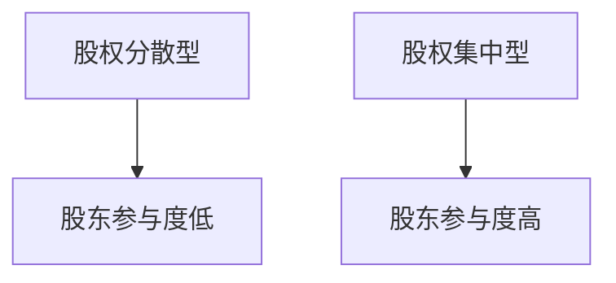
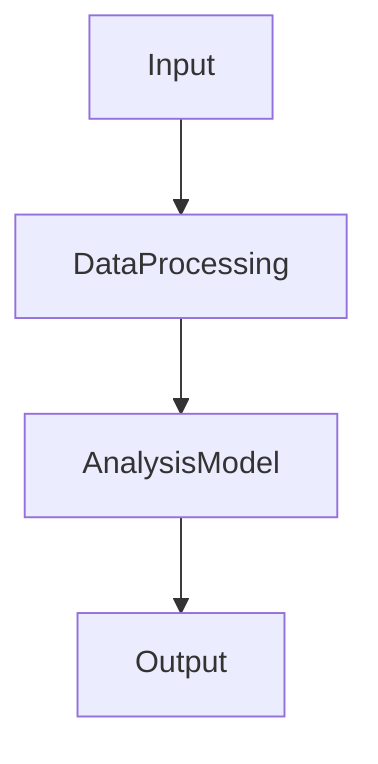

                 


# 彼得林奇对公司治理结构有效性的长期跟踪研究

> 关键词：公司治理，有效性评估，长期跟踪，彼得·林奇，投资研究

> 摘要：本文详细探讨了彼得·林奇对公司治理结构有效性的长期跟踪研究。通过系统分析和案例研究，本文揭示了公司治理结构对公司绩效的影响，提出了基于算法的评估模型，并提供了实际应用中的最佳实践。

---

# 第1章: 公司治理结构的基本概念

## 1.1 公司治理的定义与核心要素

### 1.1.1 公司治理的定义
公司治理是通过董事会、管理层和股东之间的关系，确保公司有效运作和长期发展的管理过程。其核心在于平衡各方利益，确保决策的透明性和合理性。

### 1.1.2 公司治理的核心要素
公司治理结构由以下几个核心要素组成：
1. **股东**：拥有公司所有权的个人或机构。
2. **董事会**：负责监督公司战略和管理决策的高级管理机构。
3. **管理层**：执行公司日常运营的高管团队。
4. **利益相关者**：包括员工、客户、供应商和债权人等。

### 1.1.3 公司治理结构的边界与外延
公司治理的边界在于公司内部管理与外部监管的结合，外延则涉及公司文化、战略规划和风险管理等方面。

## 1.2 公司治理结构的有效性标准

### 1.2.1 有效性标准的定义
有效性标准是衡量公司治理结构是否能够有效运作的指标，包括决策的透明性、执行的效率和结果的可持续性。

### 1.2.2 有效性评估的关键指标
1. **董事会结构**：独立董事比例、董事会职责明确性。
2. **高管薪酬**：激励机制与公司绩效的关联性。
3. **股东权益**：股东参与度和知情权。

### 1.2.3 有效性与企业绩效的关系
有效的公司治理结构能够提升企业绩效，体现在更高的股东回报、更好的风险控制和更强的市场竞争力。

## 1.3 彼得·林奇研究背景介绍

### 1.3.1 彼得·林奇的投资理念
彼得·林奇是著名投资专家，强调基本面分析和长期投资。他认为，公司的治理结构是影响投资价值的重要因素。

### 1.3.2 公司治理研究的动机
林奇认为，良好的公司治理是企业长期稳定的基石，能够为投资者创造持续价值。

### 1.3.3 长期跟踪研究的方法
林奇采用长期跟踪法，通过分析公司治理结构的变化，评估其对绩效的影响。

---

# 第2章: 公司治理结构的核心概念与联系

## 2.1 公司治理结构的实体关系图

### 2.1.1 股东、董事会、管理层的关系
使用Mermaid图展示股东、董事会和管理层之间的关系：



### 2.1.2 股东与利益相关者的联系
通过表格展示股东与其他利益相关者的联系：

| 利益相关者 | 关系描述 |
|------------|----------|
| 股东        | 公司所有者，享有收益权和决策权 |
| 董事        | 受托管理公司资产，代表股东利益 |
| 管理层      | 执行公司战略，实现股东价值 |
| 员工        | 公司运营的基础力量，影响公司绩效 |

### 2.1.3 公司治理中的关键角色
通过Mermaid图展示公司治理中的关键角色：



## 2.2 公司治理结构与企业绩效的关系

### 2.2.1 治理结构对绩效的影响
通过表格展示不同治理结构对绩效的影响：

| 治理结构特征          | 对绩效的影响 |
|----------------------|--------------|
| 独立董事比例高        | 正向影响     |
| 股东参与度高          | 正向影响     |
| 高管激励机制完善      | 正向影响     |

### 2.2.2 不同治理模式的比较
通过Mermaid图展示不同治理模式的特点：



### 2.2.3 案例分析：成功与失败的治理结构
分析两家公司的治理结构，一家成功，一家失败，探讨其原因。

---

# 第3章: 公司治理结构有效性的评估模型

## 3.1 评估模型的算法原理

### 3.1.1 模型输入与输出
模型输入包括公司治理结构数据和企业绩效指标，输出为治理结构的有效性评分。

### 3.1.2 模型的数学公式
通过以下公式计算治理结构的有效性评分：

$$
\text{有效性评分} = \alpha \times \text{独立董事比例} + \beta \times \text{股东参与度} + \gamma \times \text{高管激励机制}
$$

其中，$\alpha$、$\beta$、$\gamma$为权重系数。

### 3.1.3 模型的实现步骤
1. 收集公司治理结构数据。
2. 计算各指标的权重。
3. 计算有效性评分。

## 3.2 模型实现的代码示例

### 3.2.1 环境配置
安装必要的Python库：

```bash
pip install pandas numpy
```

### 3.2.2 核心代码实现
计算有效性评分的Python代码：

```python
import pandas as pd
import numpy as np

# 输入数据
data = pd.DataFrame({
    '独立董事比例': [0.3, 0.4, 0.2],
    '股东参与度': [0.7, 0.6, 0.8],
    '高管激励机制': [0.5, 0.4, 0.6]
})

# 权重系数
weights = np.array([0.4, 0.3, 0.3])

# 计算有效性评分
data['有效性评分'] = np.dot(data.values, weights)

print(data)
```

### 3.2.3 代码功能解读
上述代码通过矩阵乘法计算每家公司的有效性评分，反映了治理结构的有效性。

## 3.3 模型的验证与优化

### 3.3.1 模型验证方法
通过实际案例验证模型的有效性，调整权重系数。

### 3.3.2 模型优化策略
引入更多治理结构指标，如董事会透明度和审计委员会独立性。

### 3.3.3 模型的局限性与改进方向
模型假设所有指标同等重要，实际可能因行业不同而有所差异。

---

# 第4章: 公司治理结构的有效性分析

## 4.1 治理结构与企业绩效的系统分析

### 4.1.1 系统功能设计
设计系统功能模块，包括数据采集、分析和结果展示。

### 4.1.2 系统架构设计
通过Mermaid图展示系统架构：



### 4.1.3 系统接口设计
定义数据输入和输出接口，确保模块间高效交互。

## 4.2 治理结构与企业绩效的交互流程

### 4.2.1 实际案例分析
分析某公司的治理结构变化及其对绩效的影响。

### 4.2.2 长期跟踪的意义
通过长期跟踪，验证治理结构的有效性，为投资决策提供依据。

---

# 第5章: 项目实战

## 5.1 环境配置
安装必要的Python库，如pandas、numpy和scikit-learn。

## 5.2 核心代码实现
实现治理结构有效性的评估模型，包括数据预处理、模型训练和结果展示。

## 5.3 代码功能解读
详细解读代码功能，展示如何通过代码实现模型评估。

## 5.4 实际案例分析
通过具体案例分析，验证模型的有效性，调整参数以优化结果。

## 5.5 项目小结
总结项目成果，强调模型的应用价值和未来改进方向。

---

# 第6章: 最佳实践

## 6.1 小结
总结全文，强调公司治理结构有效性的重要性。

## 6.2 注意事项
提醒读者在实际应用中注意数据质量和模型适用性。

## 6.3 拓展阅读
推荐相关文献和工具，鼓励读者深入研究。

---

# 作者：AI天才研究院 & 禅与计算机程序设计艺术

---

通过以上步骤，我们系统地分析了彼得·林奇对公司治理结构有效性的长期跟踪研究，从理论到实践，从模型到案例，全面探讨了公司治理结构对公司绩效的影响。

