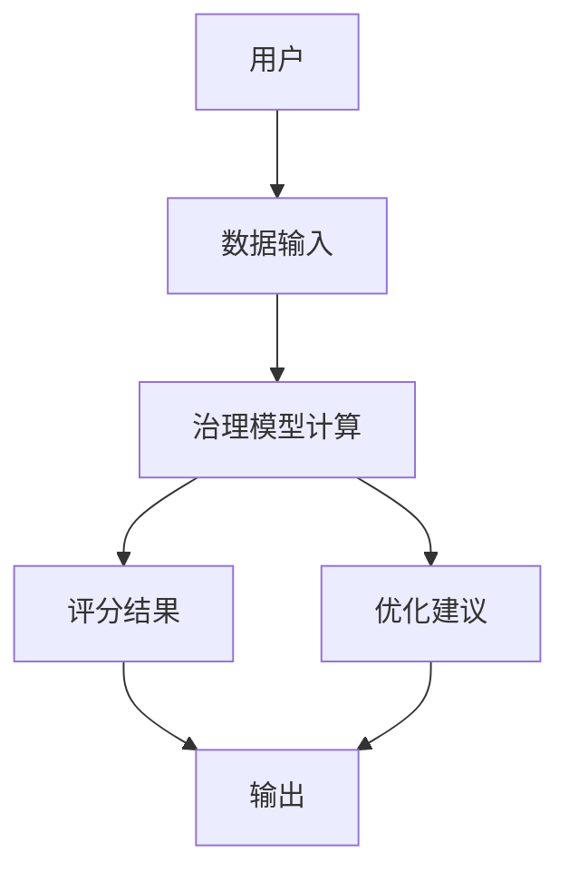
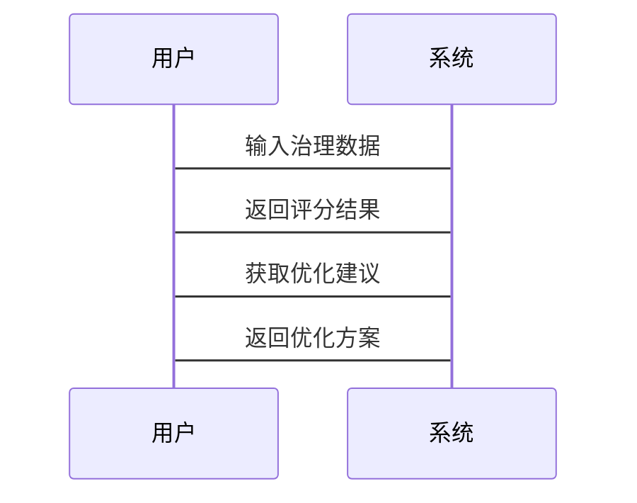

                 


# 彼得林奇对公司治理结构的评估标准

> 关键词：彼得·林奇、公司治理结构、评估标准、董事会、股东权益、高管激励

> 摘要：本文深入分析了彼得·林奇对公司治理结构的评估标准，探讨了其核心概念、评估维度、数学模型以及实际应用。通过系统化的分析和案例研究，本文揭示了如何从投资者的角度优化公司治理结构，以实现长期价值最大化。

---

# 第一章：引言：彼得·林奇与公司治理评估的重要性

## 1.1 彼得·林奇的背景与投资理念
### 1.1.1 彼得·林奇的投资者身份与成就
- 彼得·林奇是全球知名的投资专家，以其对公司的深入分析和长期价值投资闻名。
- 他的投资理念强调对公司基本面的深入研究，包括公司治理结构、管理层质量、财务状况等因素。

### 1.1.2 林奇对公司治理的关注点
- 林奇认为，公司治理是决定公司长期价值的关键因素之一。
- 他特别关注董事会的独立性、高管的激励机制以及股东的权益保护。

### 1.1.3 为什么公司治理结构对公司价值至关重要
- 良好的公司治理能够确保管理层的决策符合股东利益。
- 治理结构不善可能导致公司价值被低估，甚至引发财务危机。

---

# 第二章：公司治理结构的核心概念与要素

## 2.1 公司治理的基本概念
### 2.1.1 公司治理的定义与范围
- 公司治理是指董事会、管理层和股东之间的关系和责任。
- 包括决策制定、监督、控制和信息披露等方面。

### 2.1.2 公司治理的核心要素
- **董事会**：负责制定公司战略、监督高管和评估绩效。
- **管理层**：执行董事会的决策，管理日常运营。
- **股东**：拥有公司股权，享有分红和投票权。
- **利益相关者**：包括员工、客户、供应商和公众。

### 2.1.3 公司治理与企业绩效的关系
- 良好的公司治理能够提升企业绩效，增强投资者信心。
- 治理不善可能导致企业绩效下降，甚至引发危机。

## 2.2 股东、董事会与管理层的角色
### 2.2.1 股东的权力与责任
- 股东拥有投票权，可以影响董事会的构成。
- 股东的责任包括遵守公司章程和承担公司债务的风险。

### 2.2.2 董事会的结构与职能
- **董事会结构**：通常包括执行董事和独立董事。
- **董事会职能**：制定战略、监督高管、评估绩效和风险管理。

### 2.2.3 高管理层的激励机制
- 高管的激励机制包括股票期权、绩效奖金等。
- 激励机制应与公司绩效挂钩，以确保高管与股东利益一致。

## 2.3 公司治理的外部环境与挑战
### 2.3.1 法律法规对治理结构的影响
- 法律法规如《公司法》和《证券法》对治理结构有明确规定。
- 合规性是公司治理的重要组成部分。

### 2.3.2 市场环境与公司治理的关系
- 市场环境影响公司治理的实践，例如资本市场的成熟度。
- 在成熟的市场中，公司治理标准通常更高。

### 2.3.3 企业声誉与治理结构的关联
- 企业的声誉与治理结构密切相关。
- 优秀的治理结构能够提升企业的声誉，吸引更多投资者。

---

# 第三章：彼得·林奇的公司治理评估标准

## 3.1 林奇评估标准的核心原则
### 3.1.1 股权结构的合理性
- 股权结构应避免单一股东控股，确保董事会的独立性。
- 避免家族企业或少数人控制，以减少利益冲突。

### 3.1.2 董事会的独立性与专业性
- 董事会应由独立董事和专业人员组成。
- 独立董事应具备独立判断能力，不受管理层影响。

### 3.1.3 高管层的激励与约束机制
- 高管的薪酬应与公司绩效挂钩。
- 使用股票期权等长期激励工具，确保高管与股东利益一致。

## 3.2 林奇评估标准的具体维度
### 3.2.1 股东权益保护
- 股东应享有知情权、投票权和分红权。
- 保护中小股东的权益，避免大股东滥用权力。

### 3.2.2 董事会的透明度与问责制
- 董事会应定期公开信息披露，包括财务状况和战略规划。
- 建立问责制，确保董事会成员对决策负责。

### 3.2.3 高管层的薪酬结构
- 高管的薪酬应包括基本工资、绩效奖金和股票期权。
- 薪酬结构应避免过度激励，防止短期行为。

## 3.3 林奇评估标准的优劣势分析
### 3.3.1 优势：注重长期价值创造
- 林奇标准注重公司的长期价值，避免短期行为。
- 通过激励机制和独立董事会，确保管理层与股东利益一致。

### 3.3.2 劣势：可能忽视短期灵活性
- 过分强调长期目标可能导致公司缺乏灵活性。
- 在市场环境变化时，可能需要快速调整，而林奇标准可能限制这种灵活性。

### 3.3.3 适用场景与限制条件
- 林奇标准适用于成熟的资本市场和大型企业。
- 对于小型企业或家族企业，可能需要调整治理结构。

---

# 第四章：公司治理结构的数学模型与算法

## 4.1 公司治理评估的数学模型
### 4.1.1 林奇评估标准的量化方法
- 使用加权评分法，对治理结构的各个维度进行评分。
- 例如，董事会独立性占40%，高管激励占30%，股东权益保护占20%，透明度占10%。

### 4.1.2 治理

---

## 4.2 公司治理评估的算法流程
### 4.2.1 算法步骤
1. 收集公司治理的各个维度数据。
2. 根据权重对各维度进行评分。
3. 计算综合得分，确定公司的治理等级。

### 4.2.2 算法实现
- 使用Python编写代码，实现治理结构的评估。
- 示例代码如下：

```python
def calculate_governance_score(board_independence, executive_incentives, shareholder_protection, transparency):
    weights = {'board_independence': 0.4, 'executive_incentives': 0.3, 'shareholder_protection': 0.2, 'transparency': 0.1}
    score = (board_independence * weights['board_independence'] +
             executive_incentives * weights['executive_incentives'] +
             shareholder_protection * weights['shareholder_protection'] +
             transparency * weights['transparency'])
    return score

# 示例数据
board_independence = 0.8
executive_incentives = 0.7
shareholder_protection = 0.6
transparency = 0.5

score = calculate_governance_score(board_independence, executive_incentives, shareholder_protection, transparency)
print(f"公司治理评分为：{score}")
```

---

## 4.3 治理结构的优化算法
### 4.3.1 算法原理
- 使用遗传算法优化治理结构，找到最佳的治理组合。
- 例如，优化董事会结构，找到独立董事的最佳比例。

### 4.3.2 算法实现
- 使用Python的遗传算法库（如DEAP）实现优化。
- 示例代码如下：

```python
from deap import base, tools, algorithms

# 定义适应度函数
def fitness(individual):
    # individual是一个包含治理参数的列表
    board_independence = individual[0]
    executive_incentives = individual[1]
    shareholder_protection = individual[2]
    transparency = individual[3]
    # 计算评分
    score = (board_independence * 0.4 + executive_incentives * 0.3 +
             shareholder_protection * 0.2 + transparency * 0.1)
    return (score,)

# 初始化种群
toolbox = base.Toolbox()
toolbox.register("attr_float", lambda: random.uniform(0, 1))
toolbox.register("individual", tools.InitIndividual, toolbox.attr_float, 4)
toolbox.register("population", tools.Population, toolbox.individual)

# 定义遗传算法参数
CXPRESS = 0.5
MUTATION = 0.2

# 运行遗传算法
pop = toolbox.population(n=100)
for _ in range(100):
    pop = algorithms.eaSimple(pop, toolbox, CXPRESS, MUTATION)

# 找到最优解
best = max(pop, key=lambda x: x.fitness)
print(f"最优治理结构评分为：{best.fitness}")
```

---

## 4.4 系统架构设计与交互流程
### 4.4.1 系统功能设计
- 数据输入：用户输入公司治理的相关数据。
- 模型计算：计算治理评分并生成优化建议。
- 输出结果：显示评分和优化方案。

### 4.4.2 系统架构图


### 4.4.3 交互流程图


---

## 4.5 项目实战：环境配置与代码实现
### 4.5.1 环境配置
- 安装必要的Python库：numpy、pandas、DEAP等。
- 配置开发环境，如Jupyter Notebook或PyCharm。

### 4.5.2 核心代码实现
- 治理评分计算代码：
  ```python
  import numpy as np

  def calculate_governance_score(board_independence, executive_incentives, shareholder_protection, transparency):
      weights = np.array([0.4, 0.3, 0.2, 0.1])
      features = np.array([board_independence, executive_incentives, shareholder_protection, transparency])
      score = np.dot(weights, features)
      return score

  # 示例计算
  board_independence = 0.8
  executive_incentives = 0.7
  shareholder_protection = 0.6
  transparency = 0.5

  score = calculate_governance_score(board_independence, executive_incentives, shareholder_protection, transparency)
  print(f"治理评分：{score}")
  ```

- 遗传算法优化代码：
  ```python
  from deap import base, tools, algorithms

  # 定义适应度函数
  def fitness(individual):
      board_independence, executive_incentives, shareholder_protection, transparency = individual
      score = (board_independence * 0.4 + executive_incentives * 0.3 +
               shareholder_protection * 0.2 + transparency * 0.1)
      return (score,)

  # 初始化种群
  toolbox = base.Toolbox()
  toolbox.register("attr_float", lambda: random.uniform(0, 1))
  toolbox.register("individual", tools.InitIndividual, toolbox.attr_float, 4)
  toolbox.register("population", tools.Population, toolbox.individual)

  # 定义遗传算法参数
  CXPRESS = 0.5
  MUTATION = 0.2

  # 运行遗传算法
  pop = toolbox.population(n=100)
  for _ in range(100):
      pop = algorithms.eaSimple(pop, toolbox, CXPRESS, MUTATION)

  # 找到最优解
  best = max(pop, key=lambda x: x.fitness)
  print(f"最优治理结构评分为：{best.fitness}")
  ```

---

## 4.6 案例分析与详细解读
### 4.6.1 案例介绍
- 某公司治理结构的现状：董事会独立性为0.8，高管激励为0.7，股东权益保护为0.6，透明度为0.5。
- 计算治理评分为：0.8×0.4 + 0.7×0.3 + 0.6×0.2 + 0.5×0.1 = 0.32 + 0.21 + 0.12 + 0.05 = 0.70。

### 4.6.2 治理优化建议
- 增加董事会的独立性，进一步引入独立董事。
- 调整高管激励机制，增加长期激励工具如股票期权。
- 提高财务透明度，定期公开财务报告。

---

## 4.7 项目小结
- 通过数学模型和算法，可以量化公司治理结构的优劣。
- 遗传算法能够帮助找到最佳的治理组合。
- 实际案例分析验证了模型的有效性，为企业优化治理结构提供了参考。

---

## 4.8 最佳实践 Tips
- 定期评估公司治理结构，根据市场环境进行调整。
- 结合公司实际情况，灵活运用林奇评估标准。
- 在实施优化方案时，注意平衡短期利益与长期目标。

---

# 第五章：总结与展望

## 5.1 全文总结
- 彼得·林奇的公司治理评估标准为投资者提供了重要的参考。
- 良好的公司治理能够提升企业绩效，增强投资者信心。

## 5.2 对未来研究的展望
- 进一步研究公司治理与企业绩效之间的关系。
- 探讨不同市场环境下的治理结构优化策略。
- 开发更复杂的算法，实现动态治理结构优化。

## 5.3 最终思考
- 公司治理是企业成功的关键因素之一。
- 投资者和企业管理者都应重视公司治理结构的优化。
- 通过不断学习和实践，我们可以更好地应用林奇评估标准，实现长期价值最大化。

---

# 作者：AI天才研究院/AI Genius Institute & 禅与计算机程序设计艺术 /Zen And The Art of Computer Programming

