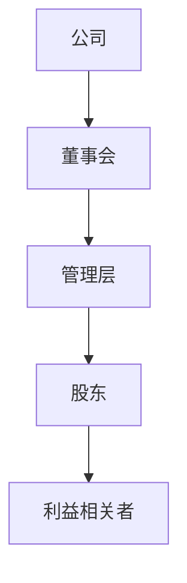
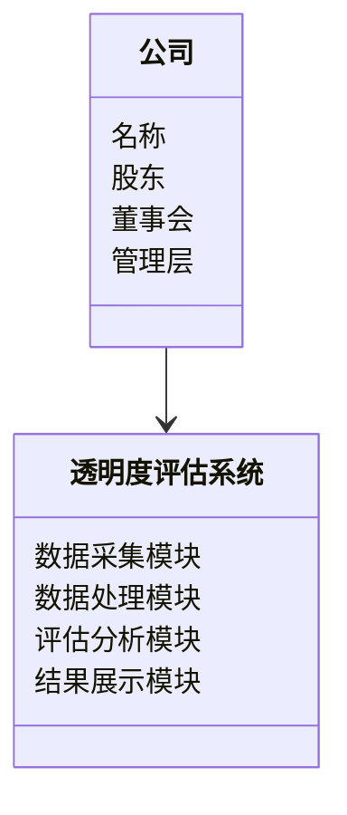
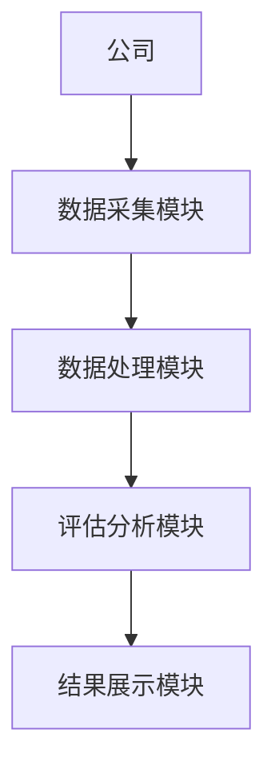
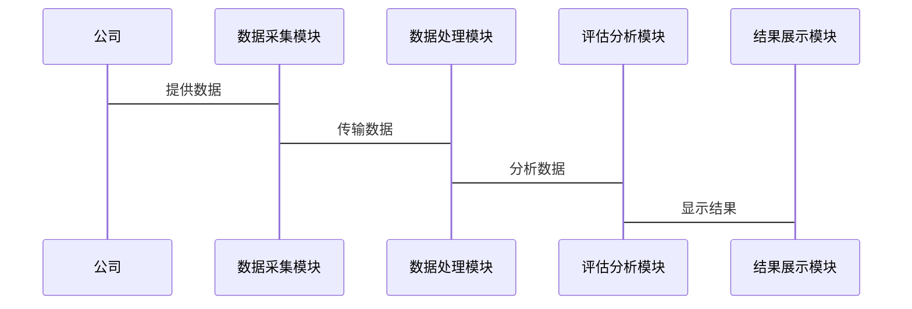

                 


# 彼得林奇对公司治理透明度的量化评估

**关键词**：公司治理、透明度、量化评估、彼得·林奇、投资分析

**摘要**：本文深入探讨了公司治理透明度的量化评估方法，结合彼得·林奇的投资理念，分析了透明度对企业和投资者的重要性。通过构建透明度指数模型，提出了系统的评估框架，为投资者和企业管理者提供了实用的工具和建议。

---

# 第一部分: 公司治理透明度量化评估的背景与意义

## 第1章: 公司治理透明度的定义与重要性

### 1.1 公司治理透明度的定义

#### 1.1.1 透明度的定义与内涵

透明度是指信息的公开程度和可访问性。在公司治理中，透明度意味着企业向利益相关者公开准确、及时的信息，以增强信任和决策能力。

#### 1.1.2 公司治理透明度的核心要素

- **信息披露**：包括财务报表、战略计划、风险管理等。
- **管理层责任**：管理层的行为是否透明，是否符合道德标准。
- **股东权利**：股东是否能够有效行使知情权和决策权。

#### 1.1.3 透明度与企业价值的关系

透明度高的公司更容易吸引投资者，提升企业声誉，降低融资成本，从而提升企业价值。

### 1.2 公司治理透明度的重要性

#### 1.2.1 透明度与投资者信心

透明的信息披露有助于投资者做出明智决策，增强投资信心。

#### 1.2.2 透明度与企业风险管理

透明的治理结构有助于及时发现和处理风险，降低企业危机。

#### 1.2.3 透明度与企业社会责任

透明的公司治理有助于企业履行社会责任，提升品牌形象。

### 1.3 透明度量化评估的意义

#### 1.3.1 透明度量化评估的必要性

通过量化评估，可以将透明度转化为可操作的指标，便于比较和改进。

#### 1.3.2 透明度量化评估的挑战

数据获取困难、指标权重设定、评估标准的统一性等。

#### 1.3.3 透明度量化评估的未来发展趋势

结合大数据和人工智能技术，提升评估的准确性和效率。

---

# 第二部分: 公司治理透明度的量化评估框架

## 第2章: 公司治理透明度的核心概念与联系

### 2.1 透明度的维度分析

#### 2.1.1 信息披露的透明度

包括财务报告、关联交易披露等。

#### 2.1.2 管理层责任的透明度

管理层的行为是否符合道德规范，决策是否透明。

#### 2.1.3 股东权利的透明度

股东是否能够有效行使知情权和决策权。

### 2.2 透明度与企业价值的关系

透明度高的企业更容易获得投资者的信任，降低融资成本，提升企业价值。

### 2.3 公司治理透明度的属性特征对比表格

| 特性 | 描述 |
|------|------|
| 信息对称性 | 企业与利益相关者之间的信息传递效率 |
| 可测量性 | 透明度的可量化程度 |
| 可持续性 | 透明度的长期维持能力 |

### 2.4 ER实体关系图架构



---

# 第三部分: 公司治理透明度的量化评估方法

## 第3章: 透明度量化评估的算法原理

### 3.1 透明度指数的构建

#### 3.1.1 数据收集与预处理

从公司年报、新闻报道等多渠道收集数据，去除异常值。

#### 3.1.2 数据标准化与加权

使用归一化方法，对各指标进行标准化处理，并赋予不同权重。

#### 3.1.3 透明度指数的计算公式

$$ \text{透明度指数} = \sum_{i=1}^{n} w_i \cdot x_i $$

其中，$w_i$ 是第 $i$ 个指标的权重，$x_i$ 是第 $i$ 个指标的评分。

### 3.2 透明度评估的数学模型

#### 3.2.1 线性回归模型

$$ y = \beta_0 + \beta_1 x_1 + \beta_2 x_2 + \ldots + \beta_k x_k + \epsilon $$

---

# 第四部分: 公司治理透明度评估系统架构

## 第4章: 系统分析与架构设计方案

### 4.1 问题场景介绍

介绍公司治理透明度评估的背景和需求。

### 4.2 系统功能设计

#### 4.2.1 领域模型Mermaid类图



### 4.3 系统架构设计

#### 4.3.1 系统架构Mermaid图



### 4.4 系统接口设计

定义数据接口标准，确保各模块之间的数据互通。

### 4.5 系统交互Mermaid序列图



---

# 第五部分: 项目实战与案例分析

## 第5章: 项目实战

### 5.1 环境安装与数据准备

安装必要的工具和库，收集公司数据。

### 5.2 核心实现

编写代码，实现数据处理、评估分析和结果展示。

### 5.3 代码实现与解读

```python
import pandas as pd
from sklearn.preprocessing import StandardScaler

# 数据预处理
data = pd.read_csv('company_data.csv')
scaled_data = StandardScaler().fit_transform(data)

# 透明度指数计算
weights = [0.3, 0.4, 0.3]
transparency_index = sum(w * d for w, d in zip(weights, scaled_data))
```

### 5.4 案例分析

以某公司为例，详细分析其透明度评估结果。

---

# 第六部分: 总结与展望

## 第6章: 总结与展望

### 6.1 本章总结

总结文章的主要内容和结论。

### 6.2 未来研究方向

探讨透明度评估的改进方法和技术应用。

---

**作者：AI天才研究院 & 禅与计算机程序设计艺术**

