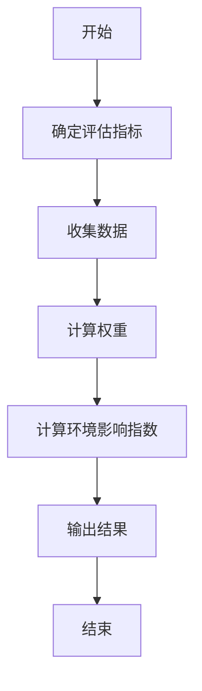
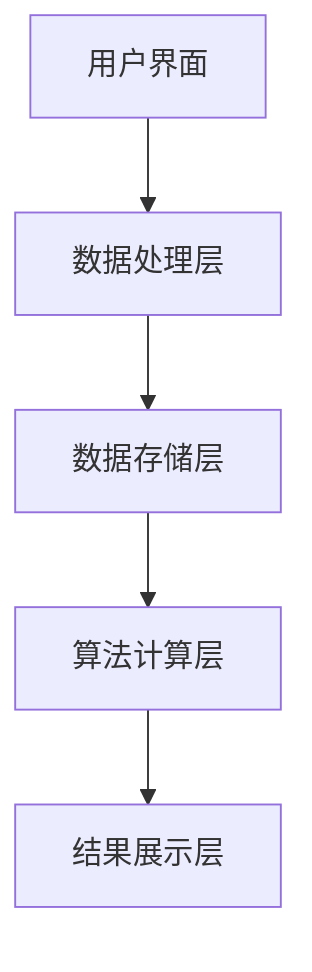
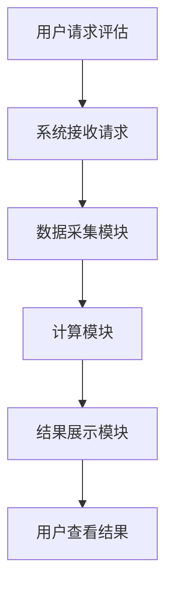

                 


# 彼得·林奇对公司环境责任的看法

## 关键词：
- 彼得·林奇
- 环境责任
- 投资理念
- 企业绩效
- 可持续发展

## 摘要：
彼得·林奇作为一位著名投资专家，从投资角度分析了公司环境责任的重要性。文章探讨了环境责任如何影响企业的财务绩效、声誉和可持续发展，展示了环境责任在投资决策中的关键作用。

---

# 第1章 环境责任的定义与重要性

## 1.1 环境责任的核心概念
### 1.1.1 环境责任的定义
环境责任指企业在经营过程中对环境保护和社会责任的承担，包括减少污染、资源高效利用和合规经营。

### 1.1.2 环境责任的重要性
环境责任不仅提升企业形象，还降低经营风险，促进长期可持续发展。

### 1.1.3 环境责任的边界与外延
环境责任涵盖生产、供应链和产品生命周期，涉及法律法规和社会责任。

## 1.2 彼得·林奇的投资理念
### 1.2.1 投资哲学
林奇注重企业基本面，认为长期投资应考虑企业的社会责任和环境表现。

### 1.2.2 投资与企业社会责任的联系
企业良好的环境责任记录是投资决策的重要考量，直接影响企业声誉和长期绩效。

### 1.2.3 环境责任在投资决策中的作用
环境责任高的企业通常更具竞争力，能在风险管理和资源利用上表现优异。

## 1.3 本章小结
环境责任不仅是道德要求，更是企业核心竞争力的一部分，影响投资价值判断。

---

# 第2章 环境责任与企业绩效的关系

## 2.1 环境责任的核心要素
### 2.1.1 环境管理
企业需制定环保政策，监控和评估环境表现。

### 2.1.2 资源效率
通过优化资源配置，降低能源消耗，提升生产效率。

### 2.1.3 环境合规性
确保企业行为符合环保法规，避免法律风险。

## 2.2 企业绩效的核心维度
### 2.2.1 财务绩效
环境责任高的企业通常运营成本较低，风险较小，财务表现更稳定。

### 2.2.2 企业声誉
良好的环境责任记录提升企业形象，增强品牌价值和客户忠诚度。

### 2.2.3 长期可持续性
企业通过环境责任实践，增强适应能力和创新能力，确保长期发展。

## 2.3 环境责任与企业绩效的关联性
### 2.3.1 正向关联性
环境责任高的企业通常在财务绩效、声誉和可持续性方面表现优异。

### 2.3.2 反向关联性
忽视环境责任可能导致法律风险、成本增加和声誉损失，影响企业绩效。

### 2.3.3 中介变量的影响
环境技术、管理能力和员工参与度等因素中介环境责任与绩效的关系。

## 2.4 本章小结
环境责任与企业绩效密切相关，是投资决策的重要考量因素。

---

# 第3章 环境责任的评估模型

## 3.1 环境责任评估的核心原理
### 3.1.1 环境影响评估
分析企业在生产过程中对环境的具体影响，包括能源消耗、排放和资源利用。

### 3.1.2 社会价值评估
评估企业在社会价值创造方面的贡献，包括员工福利、社区支持和公益活动。

### 3.1.3 经济效益评估
分析环境责任实践对企业经济效益的影响，包括成本节约和市场机会。

## 3.2 环境责任评估的数学模型
综合环境影响指数模型：
$$ CEII = \sum_{i=1}^{n} w_i \cdot E_i $$
其中，$w_i$ 是第i个因素的权重，$E_i$ 是第i个因素的环境影响值。

## 3.3 环境责任评估的算法流程


## 3.4 本章小结
数学模型和算法流程提供了科学的环境责任评估方法，帮助投资者做出明智决策。

---

# 第4章 环境责任与投资决策的系统架构

## 4.1 系统功能模块划分
### 4.1.1 数据采集模块
收集企业的环境数据，包括排放、能源消耗和合规记录。

### 4.1.2 指标计算模块
基于收集的数据，计算环境责任指数，评估企业绩效。

### 4.1.3 结果展示模块
以图表形式展示评估结果，帮助投资者直观理解。

## 4.2 系统架构设计


## 4.3 系统接口设计
### 4.3.1 数据接口
定义数据格式和传输协议，确保数据准确性和一致性。

### 4.3.2 计算接口
提供API供其他系统调用，支持批量处理和实时计算。

### 4.3.3 展示接口
设计友好的用户界面，支持多种数据展示方式，如柱状图和饼图。

## 4.4 系统交互流程


## 4.5 本章小结
系统架构提供了高效的环境责任评估工具，支持投资者做出基于数据的决策。

---

# 第5章 项目实战与案例分析

## 5.1 项目背景介绍
选择制造业作为案例，分析环境责任对投资决策的影响。

## 5.2 核心实现源代码
```python
def calculate_eri(company_data):
    eri = 0
    for data in company_data:
        eri += data['weight'] * data['value']
    return eri

# 示例数据
company_data = [
    {'name': '能源消耗', 'value': 0.8, 'weight': 0.3},
    {'name': '排放物', 'value': 0.6, 'weight': 0.4},
    {'name': '资源利用', 'value': 0.7, 'weight': 0.2}
]
eri = calculate_eri(company_data)
print(f"环境责任指数：{eri}")
```

## 5.3 案例分析
对比两家制造企业，一家环境责任高，另一家低，分析其投资价值和长期绩效。

## 5.4 本章小结
通过实战案例，验证了环境责任评估模型的有效性和实用性。

---

# 第6章 总结与展望

## 6.1 总结
环境责任是投资决策的重要考量因素，直接影响企业的财务绩效和可持续发展。

## 6.2 展望
未来研究可关注动态环境影响评估模型和环境责任与企业创新的关系。

## 6.3 最佳实践 tips
投资者应将环境责任纳入评估体系，选择环境表现优异的企业进行投资。

## 6.4 本章小结
环境责任不仅是道德要求，更是企业核心竞争力的重要组成部分。

---

# 作者信息

作者：AI天才研究院/AI Genius Institute & 禅与计算机程序设计艺术 /Zen And The Art of Computer Programming

---

通过以上结构，文章详细探讨了彼得·林奇对公司环境责任的看法，结合理论分析、数学模型和实际案例，为投资者提供了科学的决策依据。

