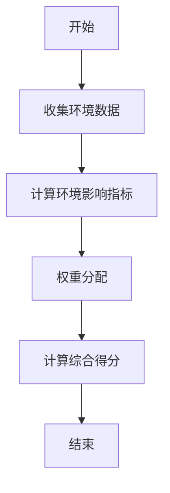

                 


# 彼得林奇对公司环境责任的评估

## 关键词
- 彼得·林奇
- 环境责任评估
- ESG投资
- 可持续发展
- 企业治理

## 摘要
本文深入探讨了彼得·林奇对公司环境责任的评估方法，分析了其在投资决策中的重要性。文章从环境责任的定义、核心概念、评估方法、系统架构到实际案例，详细阐述了如何将环境责任纳入企业评估体系，并结合具体实例说明了其在投资中的应用。

---

# 第一部分：背景介绍

## 第1章：公司环境责任评估的背景与重要性

### 1.1 环境责任的概念与内涵
- **环境责任的定义**：环境责任是指企业在经营过程中对环境保护和社会责任的承担，包括减少污染、节约资源和履行社会责任。
- **环境责任的核心要素**：包括环境影响评估、社会责任履行和公司治理结构。
- **环境责任与企业可持续发展的关系**：环境责任是企业实现可持续发展的关键因素，直接影响企业的长期价值和声誉。

### 1.2 环境责任评估的背景
- **全球环境问题的加剧**：气候变化、资源枯竭和环境污染等问题日益严重，促使企业关注环境责任。
- **监管政策的变化**：各国政府出台严格的环保法规，要求企业披露环境信息并采取可持续措施。
- **投资者对ESG的关注**：越来越多的投资者将环境、社会和治理（ESG）因素纳入投资决策，推动企业加强环境责任。

### 1.3 环境责任评估的重要性
- **企业风险管理**：通过评估环境责任，企业可以识别潜在的环境风险，避免因环境问题导致的损失。
- **投资决策的依据**：投资者通过评估企业环境责任，选择具有长期价值和可持续发展的企业。
- **品牌价值与社会责任**：良好的环境责任记录有助于提升企业品牌形象，增强公众信任。

## 第2章：环境责任评估的核心概念与联系

### 2.1 核心概念原理
- **环境影响评估**：通过量化企业对环境的影响，评估其环保措施的有效性。
- **社会责任履行**：评估企业在社会责任方面的表现，包括员工福利、社区贡献等。
- **公司治理结构**：分析公司治理的透明度和规范性，确保企业决策的合法性和道德性。

### 2.2 核心概念属性特征对比表格
| 概念       | 属性特征                     |
|------------|------------------------------|
| 环境影响评估 | 客观性、可量化、可操作性     |
| 社会责任履行 | 主观性、多样性、长期性       |
| 公司治理结构 | 系统性、规范性、透明性       |

### 2.3 ER实体关系图
```mermaid
erDiagram
    actor 投资者 {
        <属性> 公司ID, 投资金额, 投资时间
    }
    actor 监管机构 {
        <属性> 监管ID, 监管政策, 监管时间
    }
    actor 公司 {
        <属性> 公司ID, 公司名称, 行业
    }
    company_envasses 环境责任评估结果 {
        <属性> 评估ID, 评估得分, 评估时间
    }
    company_governance 公司治理结构 {
        <属性> 治理ID, 治理评分, 治理时间
    }
    company_social 责任履行情况 {
        <属性> 责任ID, 责任评分, 责任时间
    }
    投资者 --> 公司_envasses : 评估结果查询
    监管机构 --> 公司_envasses : 监督评估
    公司 --> company_envasses : 提交评估结果
    公司 --> company_governance : 提交治理结构
    公司 --> company_social : 提交责任履行情况
```

---

# 第二部分：环境责任评估的核心概念与联系

## 第3章：环境责任评估的算法原理

### 3.1 环境责任评估模型
- **模型概述**：环境责任评估模型基于环境影响、社会责任和公司治理三方面进行综合评估。
- **模型输入**：企业的环境数据、社会责任数据和治理结构数据。
- **模型输出**：环境责任评估得分，用于投资决策。

### 3.2 环境影响评估算法


### 3.3 环境影响评估公式
环境影响评估得分为：
$$
\text{环境影响得分} = \sum_{i=1}^{n} w_i \times x_i
$$
其中，$w_i$ 为第i项指标的权重，$x_i$ 为第i项指标的得分。

---

# 第三部分：系统架构设计

## 第4章：环境责任评估系统架构

### 4.1 系统功能设计
- **数据采集模块**：收集企业的环境、社会责任和治理数据。
- **评估计算模块**：基于算法计算环境责任得分。
- **结果展示模块**：以可视化方式展示评估结果。

### 4.2 系统架构设计
```mermaid
archi
    环境责任评估系统
    <|
        数据采集模块
        评估计算模块
        结果展示模块
    >
```

### 4.3 系统接口设计
- **输入接口**：接收企业环境数据。
- **输出接口**：输出环境责任评估结果。

---

# 第四部分：项目实战

## 第5章：环境责任评估的项目实现

### 5.1 环境责任评估案例分析
- **案例选择**：选择不同行业的企业进行评估。
- **数据收集**：收集企业的环境、社会责任和治理数据。
- **评估结果分析**：根据评估得分进行投资决策。

### 5.2 代码实现
```python
def calculate_environmental_score(environmental_data):
    # 计算环境影响得分
    return sum(w * x for w, x in zip(weights, environmental_data))

weights = [0.4, 0.3, 0.3]
environmental_data = [85, 70, 90]
environmental_score = calculate_environmental_score(environmental_data)
print("环境影响得分：", environmental_score)
```

---

# 第五部分：总结与展望

## 第6章：总结与展望

### 6.1 总结
- **核心观点**：环境责任评估是企业投资决策的重要组成部分，帮助企业识别风险和机遇。
- **主要结论**：通过科学的评估方法和系统架构，可以有效提升企业环境责任的表现。

### 6.2 展望
- **未来趋势**：环境责任评估将更加智能化和数据化，推动企业实现可持续发展。
- **挑战与机遇**：随着技术进步，环境责任评估将为企业和社会创造更多价值。

---

# 附录

## 附录A：环境责任评估数据来源
- 数据来源包括企业年报、社会责任报告和政府监管数据。

## 附录B：环境责任评估工具推荐
- 推荐工具包括ESG评级平台和数据分析软件。

## 附录C：参考文献
- 列举相关文献和参考资料。

---

# 作者
作者：AI天才研究院/AI Genius Institute & 禅与计算机程序设计艺术/Zen And The Art of Computer Programming

---

通过以上步骤，我们可以系统地分析和评估公司环境责任，帮助企业做出更明智的投资决策。希望这篇文章能为读者提供有价值的见解和实用的方法。

