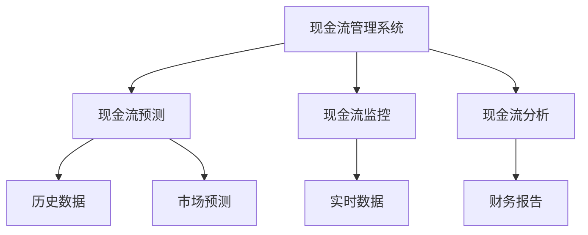

                 

# 彼得林奇对公司现金流管理的看法

> **关键词**：彼得·林奇，现金流管理，投资策略，企业价值，财务分析

> **摘要**：本文深入探讨了彼得·林奇对公司现金流管理的看法，分析了现金流管理的核心概念、策略和实际应用。通过结合彼得·林奇的投资理念，文章详细讲解了现金流在企业价值评估中的重要性，以及如何通过有效的现金流管理来提升企业的财务健康和投资价值。

---

## 引言

现金流管理是企业财务管理的核心内容之一，也是投资分析的重要组成部分。彼得·林奇作为全球著名投资经理和作家，以其独特的价值投资理念闻名。本文将从彼得·林奇的视角出发，分析现金流管理的核心概念、策略以及实际应用。

---

## 第1章 现金流管理的基本概念

### 1.1 现金流的基本概念

现金流是指企业在一定时期内，通过经营或其他活动所获得或支出的现金和现金等价物的流入和流出。现金流可以分为以下几类：

- **经营活动现金流**：企业日常经营活动中产生的现金流，包括销售收入、成本支出等。
- **投资活动现金流**：与企业投资相关的现金流，如购买或出售资产。
- **筹资活动现金流**：与企业融资相关的现金流，如发行债券、偿还贷款等。

### 1.2 彼得·林奇的背景介绍

彼得·林奇是富达投资集团的前主席，也是全球最著名的价值投资者之一。他以深入研究公司基本面和长期投资著称，尤其关注企业的现金流状况。林奇认为，现金流是衡量企业财务健康的重要指标，也是评估企业投资价值的关键因素。

---

## 第2章 现金流管理的核心概念

### 2.1 现金流的流入与流出

现金流的流入和流出直接反映了企业的财务状况。流入主要包括销售收入、投资收益等，流出则包括成本支出、偿还债务等。合理的现金流管理需要平衡流入和流出，确保企业的财务稳定。

### 2.2 现金流健康状况的分析

现金流健康状况可以通过以下指标进行评估：

- **现金流净额**：流入减去流出的结果，反映了企业的净现金流量。
- **现金流比率**：如经营活动现金流与净利润的比率，衡量企业利润的“含金量”。
- **自由现金流**：企业经营活动产生的现金流减去资本支出，反映企业的再投资能力。

---

## 第3章 彼得·林奇的现金流管理策略

### 3.1 投资策略与现金流分析

彼得·林奇在选择投资标的时，非常注重企业的现金流状况。他认为，只有具备稳定且增长的现金流的企业，才能为股东创造长期价值。以下是他的现金流分析方法：

1. **现金流质量分析**：关注经营活动现金流的质量，确保企业利润能够转化为现金流。
2. **现金流增长性分析**：评估企业的现金流是否具备持续增长的潜力。
3. **现金流与企业价值的关系**：通过现金流预测企业的未来价值，评估其投资潜力。

### 3.2 现金流管理的优化策略

彼得·林奇认为，企业可以通过以下方式优化现金流管理：

1. **提高应收账款管理效率**：缩短应收账款周期，加快资金回笼。
2. **控制库存周转**：优化库存管理，减少资金占用。
3. **合理安排资本支出**：在确保企业发展的前提下，控制资本支出规模。

---

## 第4章 现金流管理的系统分析

### 4.1 现金流管理系统架构

为了有效管理现金流，企业需要构建一个完整的现金流管理系统，包括以下几个模块：

- **现金流预测模块**：基于历史数据和市场预测，估算未来的现金流。
- **现金流监控模块**：实时监控现金流的流入和流出情况，及时发现异常。
- **现金流分析模块**：对现金流进行多维度分析，生成财务报告。

### 4.2 现金流管理系统的设计

以下是现金流管理系统的架构图：

### 4.3 现金流管理的数学模型

现金流净额的计算公式为：

$$ \text{现金流净额} = \text{现金流流入} - \text{现金流流出} $$

通过分析现金流净额的变化趋势，可以评估企业的财务健康状况。

---

## 第5章 实战案例分析

### 5.1 彼得·林奇的经典投资案例

彼得·林奇在管理富达麦哲伦基金期间，通过现金流分析成功投资了多家公司。例如，他对可口可乐公司的投资，就是基于对其稳定现金流和增长潜力的分析。

### 5.2 现金流管理的实际应用

通过分析可口可乐的现金流情况，我们可以看到：

1. **经营活动现金流**：可口可乐的经营活动现金流稳定且增长，表明其经营状况良好。
2. **自由现金流**：公司拥有充足的自由现金流，可以用于股息支付或进一步投资。

---

## 第6章 总结与展望

### 6.1 总结

现金流管理是企业财务管理的核心，也是投资分析的关键。彼得·林奇通过其独特的现金流分析方法，成功实现了长期投资收益。企业应注重现金流管理，优化资金使用效率，提升财务健康。

### 6.2 展望

随着全球经济的不断发展，现金流管理的重要性将更加凸显。未来，企业需要结合大数据和人工智能技术，进一步提升现金流管理的效率和精准度。

---

## 作者

作者：AI天才研究院/AI Genius Institute & 禅与计算机程序设计艺术 /Zen And The Art of Computer Programming

---

以上是文章的完整目录和内容概要，您可以根据需要进一步扩展每个部分的具体内容，添加更多的细节和案例分析。

