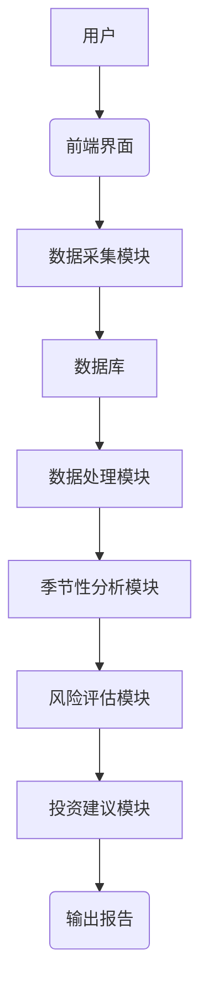
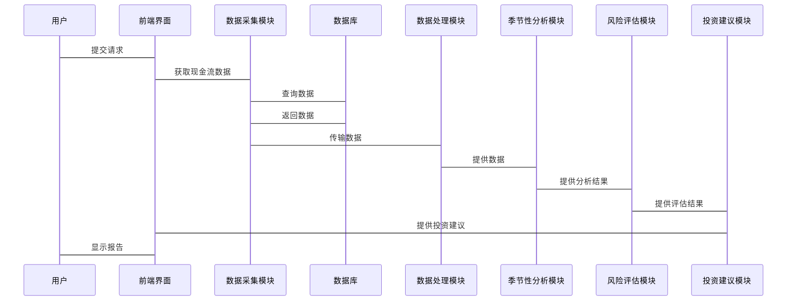

                 


# 彼得·林奇对公司现金流质量的季节性分析

> 关键词：现金流质量、季节性分析、彼得·林奇、投资策略、时间序列分析

> 摘要：本文深入探讨了现金流质量的重要性及其在投资决策中的作用，结合彼得·林奇的投资理念，系统地分析了现金流质量的季节性特征，并通过数学模型和实际案例展示了如何利用季节性分析优化现金流管理。文章内容涵盖现金流质量的核心概念、季节性分析方法、彼得·林奇的分析策略、系统设计与实现，以及实战案例分析，为投资者和程序员提供了深刻的理论与实践指导。

---

## 第1章: 现金流质量的核心概念

### 1.1 现金流的基本定义与分类

现金流是企业在一定时期内所有现金流入和流出的总和，通常分为三类：

1. **经营活动现金流**：企业日常运营活动中产生的现金流，包括销售商品、提供服务等。
2. **投资活动现金流**：与长期资产购置、出售或投资相关的现金流。
3. **筹资活动现金流**：与企业融资活动相关的现金流，如发行股票、偿还债务等。

现金流质量指的是企业在一定时期内产生的现金流的健康程度，包括现金流的稳定性、可持续性和增长性。

---

### 1.2 现金流质量的重要性

现金流质量是企业财务健康的重要指标，直接影响企业的偿债能力、运营能力和投资能力。高质量的现金流意味着企业能够稳定运营并实现长期增长。

- **企业财务健康的核心指标**：现金流质量直接反映企业的盈利能力和财务安全性。
- **投资决策的关键依据**：投资者通常通过现金流质量评估企业的盈利能力和成长潜力。
- **企业价值的重要组成部分**：现金流质量高的企业通常具有更高的市场价值。

---

### 1.3 季节性分析的必要性

现金流往往受到季节性因素的影响，例如销售周期、行业特性或经济周期。季节性分析能够帮助投资者更好地理解现金流波动的原因，并据此优化投资策略。

- **现金流波动的季节性特征**：某些行业在特定季度的现金流会显著增加或减少，例如零售业在节假日前的销售高峰。
- **季节性分析在财务评估中的作用**：通过识别季节性波动，可以更准确地评估企业的财务表现。
- **季节性分析对投资决策的意义**：季节性分析能够帮助投资者避免因短期波动导致的误判。

---

## 第2章: 现金流质量的评估指标与方法

### 2.1 现金流质量的评估指标

现金流质量的评估需要结合定量和定性指标，以下是一些常用指标：

- **自由现金流（Free Cash Flow, FCF）**：企业扣除所有支出后的剩余现金流，是评估企业盈利能力和投资能力的重要指标。
- **现金流收益率（Cash Flow Return on Investment, CFROI）**：衡量企业现金流与投入资本的比率，用于评估投资回报率。
- **现金流周期（Cash Flow Cycle）**：从收到现金到支付现金的时间长度，反映了企业的运营效率。

---

### 2.2 现金流质量的评估方法

现金流质量的评估方法通常包括以下步骤：

1. **数据收集与整理**：收集企业的财务报表，提取现金流数据。
2. **季节性分解**：将现金流数据分解为趋势、季节性和随机成分。
3. **定量分析**：使用数学模型评估现金流的质量，例如时间序列分析。
4. **定性分析**：结合行业背景和企业经营状况，分析现金流波动的原因。

---

### 2.3 季节性分析的具体步骤

季节性分析是现金流质量评估的重要环节，具体步骤如下：

1. **识别季节性模式**：通过观察历史数据，识别现金流波动的季节性规律。
2. **计算季节性指数**：将历史数据与平均值进行对比，计算季节性指数。
3. **预测未来现金流**：基于季节性模式，预测未来现金流的变化趋势。

---

## 第3章: 彼得·林奇的现金流分析方法

### 3.1 彼得·林奇的投资理念

彼得·林奇是美国著名的投资专家，他强调通过基本面分析选择优质企业进行长期投资。他认为，现金流是衡量企业财务健康的重要指标，高质量的现金流意味着企业具备持续盈利的能力。

---

### 3.2 彼得·林奇的现金流分析策略

林奇在分析现金流时，通常关注以下几个方面：

1. **现金流的稳定性**：企业是否能够持续产生稳定的现金流。
2. **现金流的增长性**：现金流是否呈现出稳定的增长趋势。
3. **现金流的来源**：现金流是否来源于企业的核心业务。

---

### 3.3 彼得·林奇的成功案例

林奇通过分析现金流质量成功投资了多家企业，例如：

- **可口可乐公司**：林奇认为可口可乐的现金流稳定且增长性强，是长期投资的理想标的。
- **强生公司**：林奇通过分析强生公司的现金流，发现其具备稳定的盈利能力和良好的财务状况。

---

## 第4章: 现金流质量的季节性分析模型

### 4.1 时间序列分析的数学模型

时间序列分析是季节性分析的重要工具，常用模型包括：

1. **加法模型**：$Y_t = T_t + S_t + R_t$
   - $Y_t$：观测值
   - $T_t$：趋势成分
   - $S_t$：季节性成分
   - $R_t$：随机成分
2. **乘法模型**：$Y_t = T_t \times S_t \times R_t$

---

### 4.2 季节性分解的Python实现

以下是使用Python进行季节性分解的示例代码：

```python
import pandas as pd
import matplotlib.pyplot as plt
from statsmodels.tsa.seasonal import seasonal_decompose

# 假设data是一个包含现金流数据的DataFrame
# data.columns = ['date', 'cash_flow']

# 将日期列设置为索引
data.set_index('date', inplace=True)

# 进行季节性分解
decompose_result = seasonal_decompose(data['cash_flow'], model='additive')

# 绘制分解结果
decompose_result.plot()
plt.show()
```

---

### 4.3 季节性预测模型的建立与验证

通过季节性分解，我们可以提取季节性成分并建立预测模型。例如，使用指数平滑法进行预测：

```python
from statsmodels.tsa.holtwinters import ExponentialSmoothing

# 假设data是一个包含现金流数据的DataFrame
model = ExponentialSmoothing(data['cash_flow'], seasonal='add', trend='add', 
                              seasonal_periods=4).fit()

# 预测未来现金流
 forecast = model.forecast(4)
```

---

## 第5章: 系统设计与实现

### 5.1 系统功能设计

一个现金流监控系统通常包括以下功能：

1. **数据采集**：从财务系统中采集现金流数据。
2. **季节性分析**：对现金流数据进行季节性分解和预测。
3. **风险评估**：基于现金流质量评估企业的财务风险。
4. **投资建议**：根据分析结果提出投资建议。

---

### 5.2 系统架构设计

以下是现金流监控系统的架构图：



---

### 5.3 系统接口设计

以下是系统接口设计的示意图：



---

## 第6章: 实战案例分析

### 6.1 案例背景

假设我们分析一家零售企业的现金流数据，以下是该企业的季度现金流数据（单位：百万美元）：

| 季度 | Q1 | Q2 | Q3 | Q4 |
|------|----|----|----|----|
| 现金流 | 10 | 15 | 20 | 12 |

---

### 6.2 数据分析

通过季节性分解，我们发现该企业的现金流在第三季度显著增加，这可能与其销售旺季有关。

---

### 6.3 投资建议

基于分析结果，我们建议投资者关注该企业在第三季度的销售表现，并考虑其现金流的稳定性。

---

## 第7章: 总结与展望

### 7.1 总结

现金流质量是企业财务健康的重要指标，季节性分析能够帮助投资者更好地理解现金流波动的原因，并据此优化投资策略。彼得·林奇的现金流分析方法为我们提供了宝贵的借鉴。

### 7.2 展望

随着大数据和人工智能技术的发展，现金流分析将更加精准和高效。未来，我们可以利用机器学习算法进一步优化现金流预测模型，为投资者提供更好的决策支持。

---

## 作者

作者：AI天才研究院/AI Genius Institute & 禅与计算机程序设计艺术 /Zen And The Art of Computer Programming

