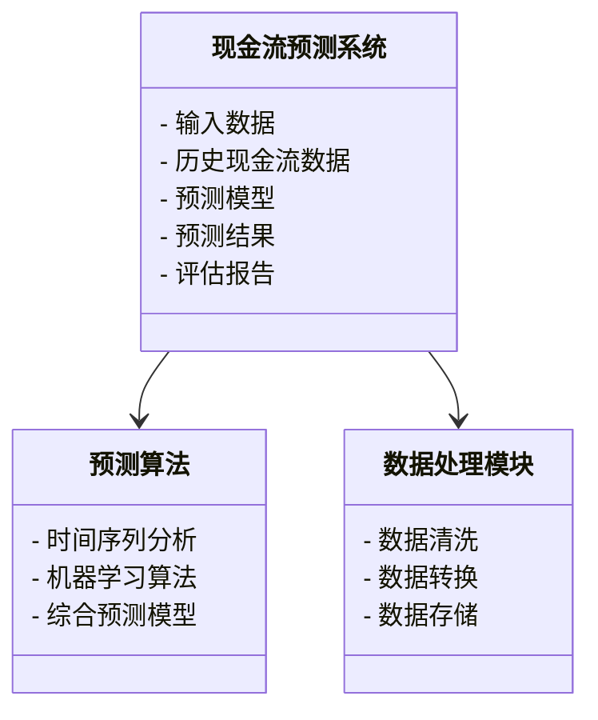
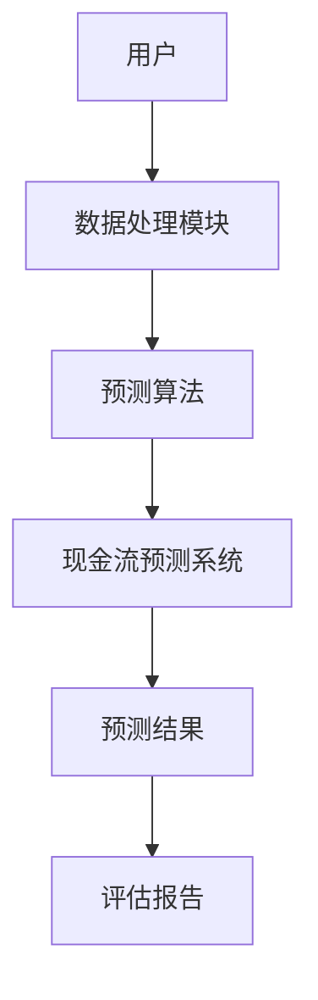

                 


# 彼得林奇对公司现金流预测准确性与股价表现关系的研究

## 关键词：现金流预测，现金流准确性，股价表现，彼得·林奇，投资分析，财务预测

## 摘要：现金流预测的准确性对股价表现有着重要的影响。本文通过分析彼得·林奇的投资策略，探讨现金流预测的准确性如何影响股价表现。文章从现金流预测的定义、方法及其准确性分析入手，结合股价表现的核心驱动因素，构建了现金流预测与股价表现之间的关系模型。通过对实际案例的分析，验证了现金流预测准确性对股价预测的积极作用，并提出了提高现金流预测准确性的策略建议。最后，文章总结了现金流预测准确性与股价表现之间的关系，并展望了未来的研究方向。

---

## 第一章：背景介绍

### 1.1 问题背景

#### 1.1.1 现金流预测的定义与重要性
现金流预测是指通过分析历史数据和未来可能的变化，对公司的现金流进行估算和预测。现金流是企业财务健康的重要指标，直接影响企业的偿债能力、投资能力和利润分配能力。现金流预测的准确性直接影响企业决策的科学性和可行性。

#### 1.1.2 股价表现的核心影响因素
股价表现受多种因素影响，包括企业的盈利能力、成长潜力、市场地位、行业竞争环境等。其中，现金流是影响股价的重要因素，因为现金流直接反映了企业的财务健康状况和未来的盈利潜力。

#### 1.1.3 现金流预测准确性与股价表现的关系
现金流预测的准确性直接影响市场对企业的信心和估值。准确的现金流预测能够帮助投资者更好地评估企业的价值，从而影响股价的表现。

### 1.2 问题描述

#### 1.2.1 现金流预测的常见方法
现金流预测的方法包括定量分析和定性分析。定量分析主要基于历史数据和统计模型，如时间序列分析、机器学习算法等；定性分析则依赖于行业专家的判断和市场环境的分析。

#### 1.2.2 股价波动的内在驱动因素
股价波动受多种因素驱动，包括宏观经济环境、行业趋势、公司基本面、市场情绪等。其中，现金流是公司基本面的重要组成部分，直接影响股价的波动。

#### 1.2.3 现金流预测准确性对股价的影响机制
现金流预测的准确性影响市场对企业的估值和预期，从而影响股价的表现。准确的现金流预测能够帮助投资者更好地把握企业的价值，降低投资风险。

### 1.3 问题解决

#### 1.3.1 现金流预测的改进策略
通过优化预测模型、引入更多的数据源和提高预测方法的科学性，可以提高现金流预测的准确性。

#### 1.3.2 股价预测的优化方法
结合现金流预测和其他财务指标，建立综合的股价预测模型，能够提高股价预测的准确性。

#### 1.3.3 提高现金流预测准确性的实践路径
包括加强数据收集和处理能力、引入先进的预测算法、结合行业专家的判断等。

### 1.4 边界与外延

#### 1.4.1 现金流预测的适用范围
现金流预测适用于所有类型的企业，但在不同行业和市场环境下，预测的难度和准确性有所不同。

#### 1.4.2 股价表现的复杂性
股价表现受多种因素影响，现金流预测仅是其中之一，因此需要结合其他因素进行综合分析。

#### 1.4.3 现金流预测与股价表现的关联性
现金流预测的准确性与股价表现密切相关，但这种关系受到市场环境、行业特点和企业自身状况的影响。

### 1.5 概念结构与核心要素

#### 1.5.1 现金流预测的核心要素
包括历史数据、预测模型、数据处理方法、预测结果等。

#### 1.5.2 股价表现的关键影响因素
包括企业盈利状况、财务状况、行业地位、市场环境等。

#### 1.5.3 两者关系的数学模型
建立现金流预测与股价表现之间的数学模型，可以更好地理解它们之间的关系。

---

## 第二章：现金流预测准确性与股价表现的核心概念

### 2.1 现金流预测准确性

#### 2.1.1 现金流预测的定义与分类
现金流预测可以分为短期预测和长期预测，也可以分为定性预测和定量预测。

#### 2.1.2 现金流预测的准确性衡量指标
常用的指标包括预测误差、均方误差（MSE）、平均绝对误差（MAE）等。

#### 2.1.3 影响现金流预测准确性的因素
包括数据质量、模型选择、预测时间窗口、市场环境等。

### 2.2 股价表现

#### 2.2.1 股价表现的定义与影响因素
股价表现是指股票价格在一定时间内的波动情况，受企业基本面、市场情绪、宏观经济环境等多种因素影响。

#### 2.2.2 股价波动的内在机制
股价波动是市场参与者对信息反应的结果，反映了市场对企业的估值变化。

#### 2.2.3 股价预测的常见方法
包括技术分析、基本面分析、统计预测等。

### 2.3 核心概念的联系

#### 2.3.1 现金流预测准确性对股价表现的影响
准确的现金流预测能够帮助投资者更好地评估企业的价值，从而影响股价的表现。

#### 2.3.2 股价表现对现金流预测的反馈作用
股价表现反过来影响市场对企业的预期，进而影响现金流预测的准确性。

#### 2.3.3 两者关系的数学模型与实证分析
通过建立数学模型，可以量化现金流预测准确性对股价表现的影响程度。

---

## 第三章：现金流预测的算法原理

### 3.1 现金流预测的常用算法

#### 3.1.1 时间序列分析
时间序列分析是一种基于历史数据预测未来趋势的方法，常用的模型包括ARIMA（自回归积分滑动平均模型）。

#### 3.1.2 机器学习算法
机器学习算法，如随机森林和神经网络，可以通过学习历史数据中的模式来预测未来现金流。

#### 3.1.3 综合预测模型
综合预测模型结合了时间序列分析和机器学习算法的优势，能够提高预测的准确性。

### 3.2 算法原理的数学模型

#### 3.2.1 时间序列模型（ARIMA）
ARIMA模型是一种常用的时间序列预测模型，其数学表达式为：
$$ ARIMA(p, d, q) $$
其中，p为自回归阶数，d为差分阶数，q为移动平均阶数。

#### 3.2.2 机器学习模型（以随机森林为例）
随机森林是一种基于决策树的集成学习算法，其数学表达式为：
$$ y = \sum_{i=1}^{n} \text{决策树预测值} $$

---

## 第四章：系统分析与架构设计方案

### 4.1 问题场景介绍
现金流预测系统需要处理大量的历史数据，预测未来现金流，并分析其对股价表现的影响。

### 4.2 项目介绍
现金流预测系统是一个基于历史数据和机器学习算法的预测系统，旨在提高现金流预测的准确性。

### 4.3 系统功能设计

#### 4.3.1 领域模型
领域模型类图如下：



### 4.4 系统架构设计

#### 4.4.1 系统架构图
系统架构图如下：



---

## 第五章：项目实战

### 5.1 环境安装
需要安装Python、机器学习库（如scikit-learn、xgboost）和数据处理库（如pandas、numpy）。

### 5.2 系统核心实现源代码

```python
import pandas as pd
from sklearn.ensemble import RandomForestRegressor
from sklearn.metrics import mean_squared_error

# 数据处理
data = pd.read_csv('cash_flow.csv')
X = data[['收入', '成本', '利润']]
y = data['现金流']

# 模型训练
model = RandomForestRegressor(n_estimators=100)
model.fit(X, y)

# 模型预测
y_pred = model.predict(X)
print('预测现金流:', y_pred)
print('均方误差:', mean_squared_error(y, y_pred))
```

### 5.3 代码应用解读与分析
上述代码实现了基于随机森林算法的现金流预测模型，通过训练数据预测未来现金流，并计算预测误差。

### 5.4 实际案例分析
以某公司为例，利用上述模型预测其未来现金流，并分析其对股价表现的影响。

### 5.5 最佳实践

#### 5.5.1 小结
现金流预测的准确性对股价表现有重要影响，提高预测准确性可以降低投资风险。

#### 5.5.2 注意事项
在实际应用中，需要注意数据的质量和模型的适用性，避免过拟合和欠拟合问题。

#### 5.5.3 拓展阅读
推荐阅读《彼得·林奇的投资策略》和《机器学习在金融中的应用》。

---

## 第六章：总结与展望

### 6.1 总结
现金流预测的准确性对股价表现有重要影响，通过优化预测模型和方法，可以提高预测准确性，从而更好地指导投资决策。

### 6.2 未来研究方向
未来可以进一步研究现金流预测与其他财务指标的交互作用，探索更高效的预测算法。

---

## 作者：AI天才研究院/AI Genius Institute & 禅与计算机程序设计艺术 /Zen And The Art of Computer Programming

