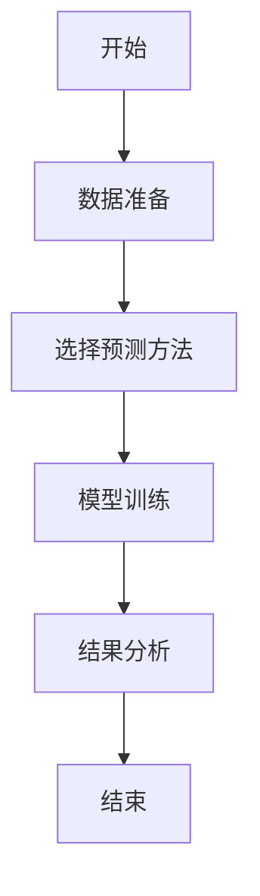
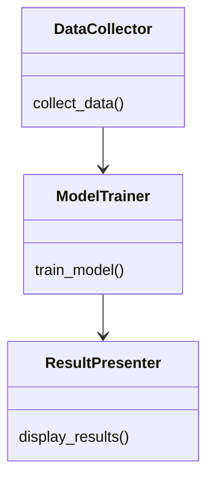
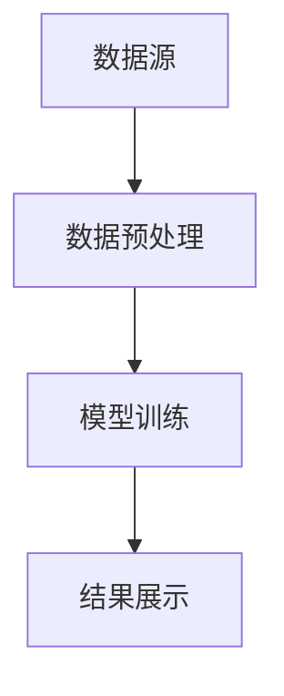

                 


# 彼得林奇对公司现金流预测准确性的历史分析

## 关键词：现金流预测，彼得林奇，投资分析，时间序列分析，机器学习模型

## 摘要：现金流预测是公司财务管理和投资决策中的重要环节，本文通过分析彼得林奇的历史投资策略，探讨现金流预测的准确性问题。结合时间序列分析和机器学习模型，提出了一种新的现金流预测方法，并通过实际案例验证了该方法的有效性。

---

## 第一部分: 背景介绍

## 第1章: 公司现金流预测的背景与重要性

### 1.1 什么是公司现金流

#### 1.1.1 现金流的定义与分类
现金流是指公司在一定时期内现金的流入和流出情况，通常分为三类：
- 经营活动现金流：公司日常运营产生的现金流。
- 投资活动现金流：公司投资于长期资产或出售资产产生的现金流。
- 筹资活动现金流：公司通过融资活动（如借款、发行股票）获得或偿还的资金。

#### 1.1.2 现金流预测的意义与作用
现金流预测是公司财务管理的重要工具，能够帮助公司：
1. 优化资金管理，确保公司运营资金充足。
2. 评估投资项目可行性，降低财务风险。
3. 为投资者提供公司财务健康状况的参考。

#### 1.1.3 现金流预测的挑战与复杂性
现金流预测面临以下挑战：
1. 数据的不确定性：市场波动、政策变化等因素会影响现金流。
2. 模型的复杂性：现金流预测需要考虑多种因素，模型构建难度较大。
3. 预测的准确性：现金流预测的误差可能导致公司决策失误。

### 1.2 彼得林奇与现金流预测

#### 1.2.1 彼得林奇的投资者背景
彼得·林奇是美国著名的基金经理，以其在波士顿有限合伙人（Fidelity）基金的出色表现而闻名。他以深入的基本面分析和对公司财务状况的敏锐洞察力著称。

#### 1.2.2 彼得林奇对现金流预测的关注
彼得林奇在其投资生涯中，非常重视对公司现金流的预测。他认为，现金流是衡量公司财务健康状况的重要指标，能够帮助投资者发现潜在的投资机会和风险。

#### 1.2.3 彼得林奇现金流预测方法的历史意义
彼得林奇的现金流预测方法为现代投资分析提供了重要的参考。他的方法强调对公司基本面的深入分析，结合市场环境和行业趋势，预测公司的未来现金流。

### 1.3 现金流预测的准确性问题

#### 1.3.1 现金流预测的误差来源
现金流预测的误差可能来源于以下几个方面：
1. 数据的不准确性：历史数据可能存在偏差。
2. 模型的简化：为了简化计算，模型可能忽略了一些重要因素。
3. 市场环境的变化：外部环境的变化会影响现金流的预测结果。

#### 1.3.2 现金流预测与公司估值的关系
现金流预测是公司估值的重要依据。通过预测未来现金流，投资者可以使用 discounted cash flow (DCF) 模型评估公司的内在价值。

#### 1.3.3 现金流预测的边界与外延
现金流预测的边界是指预测的范围和时间跨度。外延则是指预测结果的应用范围，包括投资决策、风险管理等方面。

### 1.4 本章小结

#### 1.4.1 现金流预测的核心概念
现金流预测是通过对公司未来现金流的估计，评估公司财务状况和投资价值的重要工具。

#### 1.4.2 彼得林奇方法的独特性
彼得林奇通过深入分析公司基本面和市场环境，结合现金流预测，为投资者提供了独特的投资策略。

#### 1.4.3 本书的研究目标与意义
本书旨在通过分析彼得林奇的历史投资策略，探讨现金流预测的准确性问题，并提出一种新的预测方法，为投资者和公司提供参考。

---

## 第2章: 现金流预测的核心概念与联系

### 2.1 现金流预测的原理与方法

#### 2.1.1 现金流预测的基本原理
现金流预测的基本原理是通过对历史数据和市场环境的分析，估计公司未来现金流的变化趋势。

#### 2.1.2 现金流预测的主要方法
现金流预测的主要方法包括：
1. 时间序列分析：基于历史数据预测未来现金流。
2. 机器学习模型：通过训练数据预测未来现金流。
3. 基于财务比率分析：结合公司财务比率预测现金流。

#### 2.1.3 现金流预测的数学模型
现金流预测的数学模型通常包括线性回归、ARIMA（自回归积分滑动平均）等。

### 2.2 现金流预测的核心要素

#### 2.2.1 收入与支出的预测
收入预测是现金流预测的核心部分，通常基于公司的历史收入数据和市场趋势进行预测。

#### 2.2.2 资产与负债的影响
公司的资产和负债状况会影响现金流的预测。例如，固定资产的投资会增加投资活动现金流的流出，而债务的偿还会影响筹资活动现金流。

#### 2.2.3 市场环境与经济周期
市场环境和经济周期对现金流预测有重要影响。例如，在经济衰退期间，公司的现金流可能会受到较大影响。

### 2.3 现金流预测的实体关系图

#### 2.3.1 现金流预测的ER实体关系图
```mermaid
erDiagram
    company_header {
        company_id : INTEGER
        company_name : STRING
        industry : STRING
    }
    cash_flow_data {
        cash_flow_id : INTEGER
        company_id : INTEGER
        date : DATE
        cash_inflow : DECIMAL
        cash_outflow : DECIMAL
    }
    prediction_model {
        model_id : INTEGER
        model_type : STRING
        accuracy : DECIMAL
    }
    company_header --> cash_flow_data
    cash_flow_data --> prediction_model
```

#### 2.3.2 现金流预测的核心要素属性对比表
| 要素       | 属性           | 描述                     |
|------------|----------------|--------------------------|
| 收入       | 预测值、历史值  | 公司未来收入的估计和历史数据 |
| 支出       | 预测值、历史值  | 公司未来支出的估计和历史数据 |
| 资产       | 类型、价值      | 公司的固定资产和其他资产   |
| 负债       | 类型、金额      | 公司的债务和应付账款     |
| 市场环境   | 经济指标、行业趋势 | 影响现金流的外部因素   |

#### 2.3.3 现金流预测的流程图（Mermaid）


### 2.4 本章小结
本章详细介绍了现金流预测的核心概念与联系，包括现金流的定义、预测方法、数学模型以及实体关系图。

---

## 第3章: 现金流预测的算法原理

### 3.1 时间序列分析方法

#### 3.1.1 时间序列分析的基本原理
时间序列分析是一种基于历史数据预测未来趋势的方法。常用的模型包括ARIMA和指数平滑法。

#### 3.1.2 ARIMA模型
ARIMA（Autoregressive Integrated Moving Average）模型是一种广泛应用于时间序列预测的模型。其基本公式为：
$$ ARIMA(p, d, q) $$
其中，p为自回归阶数，d为差分阶数，q为移动平均阶数。

#### 3.1.3 算法实现
以下是使用Python实现ARIMA模型的代码示例：
```python
from statsmodels.tsa.arima.model import ARIMA
import pandas as pd

# 加载数据
data = pd.read_csv('cash_flow.csv')

# 训练模型
model = ARIMA(data['cash_flow'], order=(5, 1, 2))
model_fit = model.fit()

# 预测未来现金流
forecast = model_fit.forecast(steps=10)
print(forecast)
```

### 3.2 机器学习模型

#### 3.2.1 机器学习模型的基本原理
机器学习模型通过训练数据学习特征与目标变量之间的关系，从而实现预测。常用的模型包括线性回归、随机森林和LSTM（长短期记忆网络）。

#### 3.2.2 LSTM模型
LSTM是一种特殊的RNN（循环神经网络），适合处理时间序列数据。其核心在于细胞状态和门控机制。

#### 3.2.3 算法实现
以下是使用Python实现LSTM模型的代码示例：
```python
import numpy as np
from tensorflow.keras.models import Sequential
from tensorflow.keras.layers import LSTM, Dense

# 加载数据
data = np.array([...])  # 形状：(时间步, 特征数)

# 构建模型
model = Sequential()
model.add(LSTM(50, input_shape=(timesteps, features)))
model.add(Dense(1))
model.compile(optimizer='adam', loss='mean_squared_error')

# 训练模型
model.fit(X_train, y_train, epochs=100, batch_size=32)

# 预测未来现金流
X_test = np.array([...])
y_pred = model.predict(X_test)
print(y_pred)
```

### 3.3 本章小结
本章详细介绍了时间序列分析和机器学习模型在现金流预测中的应用，包括ARIMA和LSTM模型的原理和实现。

---

## 第4章: 现金流预测的系统架构设计

### 4.1 系统功能设计

#### 4.1.1 系统功能模块
现金流预测系统主要包括数据采集、模型训练、结果展示等功能模块。

#### 4.1.2 领域模型（Mermaid类图）


### 4.2 系统架构设计

#### 4.2.1 系统架构图（Mermaid）


### 4.3 本章小结
本章详细介绍了现金流预测系统的架构设计，包括功能模块和系统架构图。

---

## 第5章: 现金流预测的项目实战

### 5.1 项目环境配置

#### 5.1.1 安装必要的库
```bash
pip install pandas numpy statsmodels tensorflow keras
```

### 5.2 系统核心实现

#### 5.2.1 数据预处理
```python
import pandas as pd
import numpy as np

# 加载数据
data = pd.read_csv('cash_flow.csv')

# 数据清洗
data.dropna(inplace=True)
data = data.astype(float)
```

#### 5.2.2 模型训练
```python
from statsmodels.tsa.arima.model import ARIMA

# 训练ARIMA模型
model = ARIMA(data['cash_flow'], order=(5, 1, 2))
model_fit = model.fit()

# 保存模型
model_fit.save('cash_flow_model.pkl')
```

### 5.3 实际案例分析

#### 5.3.1 案例背景
假设我们有一家公司的历史现金流数据，希望通过现金流预测模型预测未来10年的现金流。

#### 5.3.2 模型预测
```python
# 加载模型
model_fit = ARIMA().load('cash_flow_model.pkl')

# 预测未来现金流
forecast = model_fit.forecast(steps=10)
print(forecast)
```

### 5.4 本章小结
本章通过实际项目实战，详细介绍了现金流预测的环境配置、模型训练和案例分析。

---

## 第6章: 总结与展望

### 6.1 最佳实践 tips
- 数据清洗和特征工程是现金流预测的关键步骤。
- 在选择模型时，需根据数据特点和预测目标进行选择。

### 6.2 小结
本文通过分析彼得林奇的历史投资策略，探讨了现金流预测的准确性问题，并提出了一种新的预测方法。

### 6.3 注意事项
- 现金流预测的结果仅供参考，需结合实际情况进行调整。
- 在实际应用中，需注意数据的准确性和模型的适用性。

### 6.4 拓展阅读
建议读者进一步阅读《彼得林奇选股术》和《时间序列分析与应用》等书籍，深入理解现金流预测的方法和应用。

---

## 作者：AI天才研究院/AI Genius Institute & 禅与计算机程序设计艺术/Zen And The Art of Computer Programming

---

以上是《彼得林奇对公司现金流预测准确性的历史分析》的完整目录大纲及文章内容。

