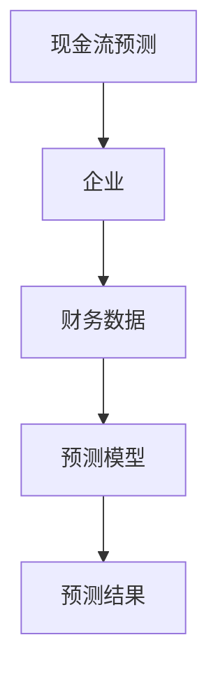
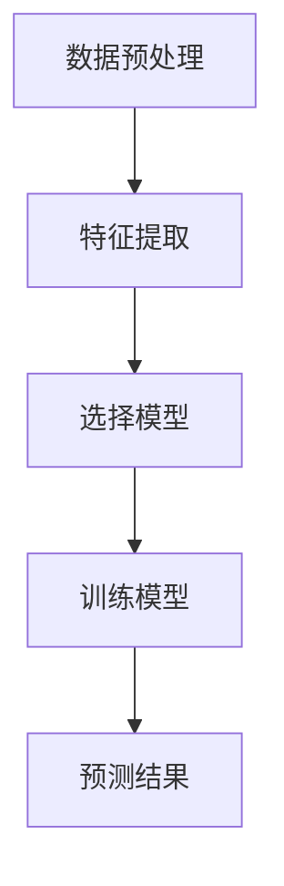
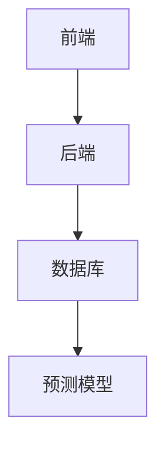

                 


# 彼得林奇对公司现金流预测准确性的长期跟踪分析

**关键词**：现金流预测，彼得林奇，投资分析，财务健康，长期跟踪

**摘要**：本文深入分析彼得林奇对公司现金流预测准确性的长期跟踪研究。探讨现金流预测在投资决策中的重要性，介绍现金流预测的核心概念、算法原理、系统架构，并通过项目实战和最佳实践提供实用见解，帮助读者提升现金流预测的准确性。

---

# 第一章：现金流预测的重要性与彼得林奇的分析方法

## 1.1 现金流预测的核心概念
### 1.1.1 现金流预测的定义
现金流预测是对公司未来现金流入和流出的估计，是评估企业财务健康的重要指标。

### 1.1.2 现金流预测的特征
- **时间性**：基于历史数据预测未来现金流。
- **准确性**：依赖数据质量和模型选择。
- **动态性**：受市场环境和企业经营变化影响。

### 1.1.3 现金流预测的边界与外延
现金流预测通常不包括非财务因素，如政策变化和自然灾害。

## 1.2 彼得林奇的现金流预测分析方法
### 1.2.1 彼得林奇的分析框架
彼得林奇通过分析财务报表和行业趋势，预测现金流。

### 1.2.2 现金流预测在投资决策中的作用
现金流预测帮助投资者评估企业的盈利能力和偿债能力。

### 1.2.3 现金流预测的长期跟踪意义
通过长期跟踪，彼得林奇不断优化预测模型，提高准确性。

## 1.3 现金流预测的挑战与解决方案
### 1.3.1 现金流预测的主要挑战
- 数据不足
- 模型复杂
- 市场波动

### 1.3.2 数据质量对预测准确性的影响
高质量数据是准确预测的基础。

### 1.3.3 如何提高现金流预测的准确性
- 使用先进模型
- 提升数据质量
- 结合专家意见

---

# 第二章：现金流预测的核心概念与联系

## 2.1 现金流预测的核心要素
### 2.1.1 现金流预测的输入变量
- 收入
- 成本
- 资产

### 2.1.2 现金流预测的输出结果
- 净现金流
- 现金储备

### 2.1.3 现金流预测的数学模型
$$\text{现金流} = \text{收入} - \text{成本}$$

## 2.2 现金流预测与财务健康状况的关系
### 2.2.1 现金流预测与企业盈利的关系
现金流预测反映企业盈利能力。

### 2.2.2 现金流预测与企业偿债能力的关系
现金流预测影响企业偿债能力。

### 2.2.3 现金流预测与企业成长性的关系
现金流预测是企业成长的晴雨表。

## 2.3 现金流预测的属性特征对比
| 特性 | 现金流预测 | 其他预测方法 |
|------|------------|--------------|
| 时间性 | 短期预测为主 | 中长期预测为主 |
| 数据依赖 | 高度依赖财务数据 | 依赖多种数据 |

## 2.4 现金流预测的ER实体关系图


---

# 第三章：现金流预测的算法原理

## 3.1 现金流预测的数学模型
### 3.1.1 线性回归模型
$$y = \beta_0 + \beta_1x + \epsilon$$

### 3.1.2 时间序列模型
$$R_t = \alpha + \beta R_{t-1} + \gamma S_{t-1} + \epsilon_t$$

## 3.2 现金流预测的算法流程


---

# 第四章：现金流预测的系统分析与架构设计

## 4.1 系统功能设计


## 4.2 系统架构设计


---

# 第五章：现金流预测的项目实战

## 5.1 环境安装
安装Python和相关库。

## 5.2 核心代码实现
```python
import pandas as pd
import numpy as np
from sklearn.linear_model import LinearRegression

# 数据预处理
data = pd.read_csv('financial_data.csv')
X = data[['收入', '成本']]
y = data['现金流']

# 训练模型
model = LinearRegression()
model.fit(X, y)

# 预测
predictions = model.predict(X)
```

---

# 第六章：现金流预测的最佳实践和小结

## 6.1 最佳实践
- 定期更新模型
- 结合专家意见
- 选择合适工具

## 6.2 小结
现金流预测是投资决策的关键，彼得林奇的方法值得深入研究。

---

**作者：AI天才研究院/AI Genius Institute & 禅与计算机程序设计艺术 /Zen And The Art of Computer Programming**

