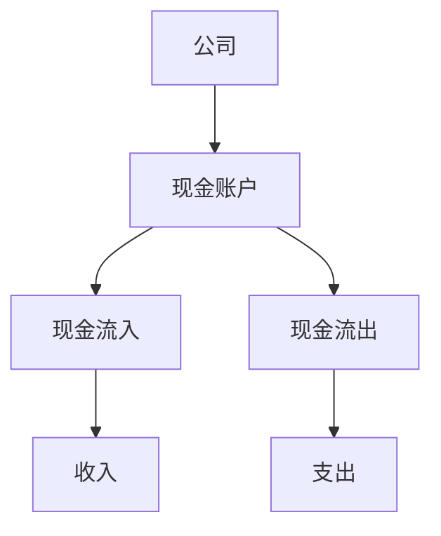
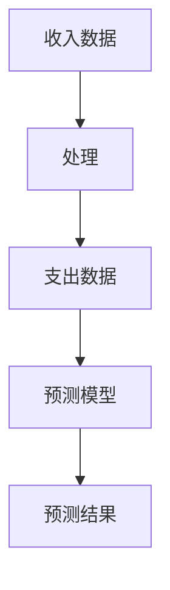
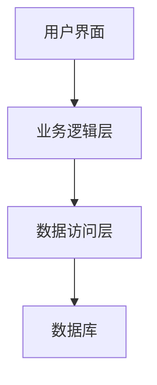

                 


# 彼得林奇对公司现金管理效率的看法

## 关键词：
- 彼得·林奇
- 现金管理效率
- 现金流预测
- 投资策略
- 企业财务

## 摘要：
本文深入探讨了彼得·林奇对公司现金管理效率的看法，从背景介绍、核心概念、算法原理、系统分析、项目实战到最佳实践，全面解析了现金管理效率对企业投资决策和财务健康的重要性。文章结合彼得·林奇的投资理念，详细讲解了现金流预测算法、现金管理系统的架构设计，以及如何通过实际案例提升现金管理效率。

---

# 第一部分: 背景介绍

## 第1章: 现金管理效率的定义与重要性

### 1.1 现金管理效率的定义
现金管理效率是指企业在一定时间内对现金流入和流出进行合理规划和控制的能力，旨在最大化资金的使用效率和投资回报率。企业通过优化现金管理效率，可以降低财务风险，提高资金流动性。

### 1.2 现金管理效率的重要性
1. **对企业战略的影响**：现金管理效率直接影响企业的投资能力和运营能力，是企业战略决策的重要支撑。
2. **对财务健康的影响**：高效的现金管理可以减少企业的资金链断裂风险，确保企业运营的稳定性。
3. **与投资回报率的关系**：现金管理效率高，意味着企业能够更快地将资金转化为利润，提升整体投资回报率。

### 1.3 彼得·林奇与现金管理效率
彼得·林奇是全球著名投资专家，他在《彼得·林奇的投资艺术》等著作中多次提到，企业现金管理效率是评估企业财务健康的重要指标之一。他认为，企业应该尽量避免过度依赖外部融资，通过高效管理内部现金流，降低财务风险。

## 第2章: 现金管理效率的背景与现状

### 2.1 现金管理的历史发展
现金管理从传统的手工记账到现代的数字化管理，经历了多次演变。随着信息技术的发展，现代现金管理更加依赖于自动化系统和数据分析技术。

### 2.2 现金管理效率的现状
1. **主要模式**：现代企业普遍采用现金流预测、实时监控和智能优化的现金管理模式。
2. **行业差异**：不同行业的现金管理效率差异较大，例如制造业和科技行业的现金管理效率较高。
3. **技术驱动因素**：大数据、人工智能和区块链等技术的应用，显著提升了现金管理效率。

### 2.3 现金管理效率的挑战与机遇
1. **挑战**：全球经济不确定性增加，企业面临更多的现金流波动风险。
2. **机遇**：技术进步为企业提供了更高效的现金管理工具和方法。

---

# 第二部分: 核心概念与联系

## 第3章: 现金管理效率的核心概念

### 3.1 现金管理效率的关键要素
1. **现金持有量**：企业在不同时间段内持有的现金量。
2. **现金转换周期**：现金从流入到流出的周期长度。
3. **现金流动性**：现金资产的变现能力。

### 3.2 现金管理效率的属性特征对比

| 属性         | 现金管理效率 | 资产流动性 | 投资回报率 |
|--------------|--------------|------------|------------|
| 定义         | 资金使用效率 | 资产变现能力 | 投资收益与成本比值 |
| 计算公式     | 现金流净额 / 平均现金持有量 | 资产变现速度 | (投资收益 - 投资成本) / 投资成本 |
| 影响因素     | 现金流入、流出速度 | 资产类型 | 投资项目风险 |

### 3.3 现金管理效率的实体关系图


---

# 第三部分: 算法原理讲解

## 第4章: 现金流预测算法

### 4.1 现金流预测的数学模型
$$ 现金流预测 = \alpha \times 收入 + \beta \times 支出 $$

其中：
- $\alpha$ 和 $\beta$ 是模型的权重系数，通常通过历史数据训练得出。

### 4.2 现金流预测的实现
```python
def cash_flow_prediction(revenue, expenses):
    alpha = 0.8
    beta = 0.2
    return alpha * revenue + beta * expenses
```

### 4.3 现金流预测的流程图


---

# 第四部分: 系统分析与架构设计

## 第5章: 现金管理系统架构设计

### 5.1 系统功能设计
- **现金流入管理**：记录和预测收入。
- **现金流出管理**：记录和优化支出。
- **现金流预测**：基于历史数据和模型预测未来现金流。
- **现金管理效率评估**：计算现金管理效率指标。

### 5.2 系统架构设计


---

# 第五部分: 项目实战

## 第6章: 现金管理系统的实战案例

### 6.1 环境配置
```bash
pip install numpy pandas scikit-learn
```

### 6.2 核心实现代码
```python
import numpy as np
import pandas as pd
from sklearn.linear_model import LinearRegression

def cash_flow_prediction(revenue, expenses):
    model = LinearRegression()
    model.fit(np.array([[revenue, expenses]]).T, np.array([revenue * 0.8 + expenses * 0.2]))
    return model.predict([[revenue, expenses]])[0][0]

# 示例数据
revenue = 1000000
expenses = 500000
print(cash_flow_prediction(revenue, expenses))
```

### 6.3 案例分析
通过上述代码，我们可以预测企业的未来现金流，帮助企业优化现金管理策略。

---

# 第六部分: 最佳实践

## 第7章: 提升现金管理效率的策略

### 7.1 实践建议
1. **实时监控现金流**：使用自动化工具实时跟踪现金流入和流出。
2. **优化现金流预测模型**：结合机器学习技术，提升预测精度。
3. **合理分配资金**：根据企业战略目标，合理分配现金资产。

### 7.2 注意事项
- 定期审查现金管理策略，确保其适应市场变化。
- 建立风险管理机制，降低现金流波动带来的风险。

### 7.3 拓展阅读
- 《彼得·林奇的投资艺术》
- 《现金管理与企业财务》

---

# 结语

现金管理效率是企业财务健康的重要指标，彼得·林奇的投资理念为我们提供了重要的启示。通过优化现金管理效率，企业可以更好地应对市场波动，实现稳健发展。

---

# 作者

作者：AI天才研究院/AI Genius Institute & 禅与计算机程序设计艺术 /Zen And The Art of Computer Programming

